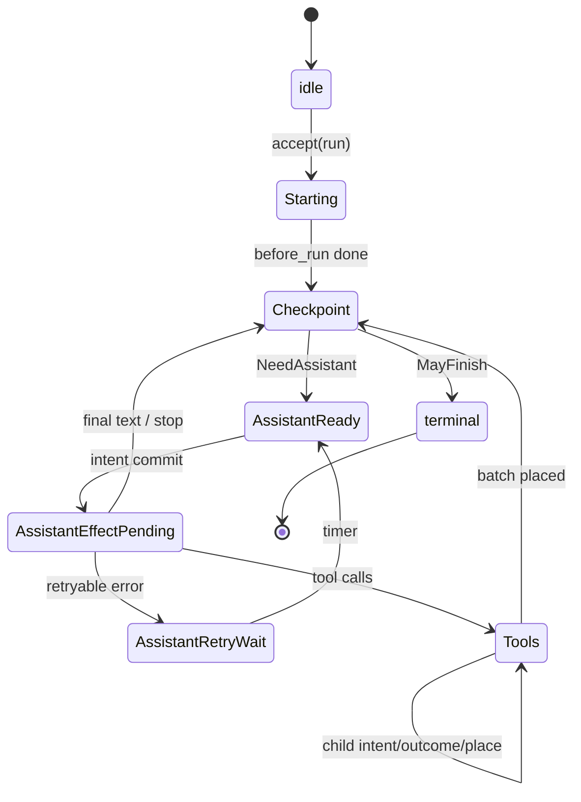

# Phase 0 — Agent Harness Design (kim)

> Copied & adapted from internal Phase 0 design for PR implementation.  
> Crate names use `kim-agent-*` to avoid clashing with IM `kim-session`.  
> **Locked:** SQLite only (no JSONL); Responses API first; AGENTS.md + `.agents` discovery on by default.


> Status: draft for implementation  
> Aligns to: earendil-works/pi (`pi-agent-core` / AgentHarness) — **inspired by**, not a line-by-line port  
> Language: Rust (tokio)  
> **Phase 0 first milestone: Response protocol** (provider Responses stream → internal events → settled assistant message)  
> Out of scope: kim-agent-team, kim-agent-graph (Phase 1+)

---

## 0. Goals & non-goals

### Goals (v1 bar)

- **First: Response protocol** — parse OpenAI **Responses API** SSE, normalize to internal stream events, settle into `AssistantMessage`
- Single agent, single lane (`main`)
- Unified LLM client (Responses-first; Chat Completions adapter optional/later)
- Tool contract + parallel/sequential batches
- Atomic three-store persistence (**SQLite only**) + crash recovery via total `op.state`
- Default discovery of **`AGENTS.md`** and **`.agents/`** instruction ecosystem
- `accept` / `drive` / `abort` / `resume`
- Event stream for UI/CLI
- Minimal tools: `read`, `write`, `edit`, `bash`
- Hooks: `before_tool`, `after_tool`
- Simple steer / follow-up inbox

### Non-goals (Phase 0)

- Exactly-once external effects
- Multi-writer sessions
- Built-in MCP / todo-plan mode / TUI
- Compaction, fork/clone, multi-lane, multi-provider polish
- Team / graph orchestration inside the loop
- Billing-grade token accounting
- Soft permission popups as a security boundary

---

## 1. Crate layout

```text
kim (crates/)
  crates/
    kim-agent-types/      # Message, ToolCall, ToolResult, Role, StopReason, Usage, ids
    kim-agent-llm/        # Responses protocol + LlmClient; Completions adapter later
    kim-agent-storage/    # Storage trait, Write, Memory (+ JSONL or SQLite one backend)
    kim-agent-session/    # Entry tree, Branch tip, context projection
    kim-agent-tools/      # Tool trait, registry, read/write/edit/bash
    kim-agent-hooks/      # before_tool / after_tool
    kim-agent-harness/    # accept / drive / abort / resume, op state machine, events
    kim-agent-cli/        # thin binary: interactive + --print JSON
  # later
    kim-agent-team/
    kim-agent-graph/
```

**Dependency direction:** `types` ← everyone; `storage` ← `session` ← `harness`; `llm`/`tools`/`hooks` ← `harness`; `cli` depends on `harness` only.

---

## 2. Identity & Context

- All durable ids: **UUIDv7** (time-sortable). Kinds: `entry`, `usage`, `operation`.
- Every async public method takes an invocation `Context` (cancellation + trace parent). Context is **process-local**, never durable. Aborting Context ≠ durable `request_abort`.

```rust
pub struct Context {
    pub abort: tokio_util::sync::CancellationToken,
    pub trace_id: Option<String>,
}
```

---

## 3. Storage model

Storage knows nothing about agents. One session ↔ one `Storage` instance. **Single writer**; commits serialized.

### 3.1 Three stores

| Store | Mutability | Role |
|---|---|---|
| **entries** | write-once, never update/delete (Phase 0) | conversation tree rows |
| **values / lists** | replaceable values; append-only lists (whole-list delete ok) | tips, lane state, `op.meta` / `op.state`, pending |
| **usage ledger** | append-only | best-effort cost rows |

Invariant: every durable payload lives in exactly one of these. No hidden fourth store.

### 3.2 Write type

```rust
#[derive(Debug, Clone, Serialize, Deserialize)]
pub enum Write {
    InsertEntry(Entry),
    InsertUsage(UsageRow),
    SetValue { address: ValueAddr, value: JsonValue },
    DeleteValue { address: ValueAddr },
    AppendList { address: ListAddr, element: JsonValue },
    DeleteList { address: ListAddr },
}

#[derive(Debug, Clone, Hash, Eq, PartialEq, Serialize, Deserialize)]
pub struct ValueAddr {
    pub namespace: String, // e.g. "pi.op.state"
    pub key: String,      // e.g. operation_id
}

pub type ListAddr = ValueAddr;

pub struct CommitResult {
    pub first_seq: u64,
    pub seqs: Vec<u64>,
    pub timestamp_ms: u64,
}
```

### 3.3 Commit rules

1. `commit(writes)` is **all-or-none**. No visible partial transaction.
2. Writes get strictly increasing session-wide `seq` in given order (gaps allowed).
3. An entry may reference a parent created earlier **in the same** transaction.
4. Reusing an entry/usage id = corruption (not an update).
5. `SetValue` replaces; `DeleteValue` removes; no value history.
6. List elements immutable after append; `DeleteList` removes whole key.
7. Failed admitted commit **faults** the harness (stop effects; require process restart).

### 3.4 Built-in addresses (Phase 0 subset)

| Constructor | Namespace / key | Meaning |
|---|---|---|
| `branch_tip(lane)` | `pi.branch.tip` / `{lane}` | next append tip (`EntryId` or null) |
| `lane_config(lane)` | `pi.lane.config` / `{lane}` | model + tools + thinking |
| `lane_state(lane)` | `pi.lane.state` / `{lane}` | current/last op + inbox |
| `op_meta(op)` | `pi.op.meta` / `{op}` | immutable acceptance (write once) |
| `op_state(op)` | `pi.op.state` / `{op}` | **total** restart point (replace each transition) |
| `op_tool_args(op, step, i)` | `pi.op.tool_args` / `{op}:{step}:{i}` | cleared args at intent |
| `pending_entry(id)` | `pi.pending.entry` / `{id}` | content waiting for tree placement |
| `pending_tool_output(op, inv)` | `pi.pending.tool_output` / `{op}:{inv}` | optional progress checkpoint |
| `op_result(op)` | `pi.result` / `{op}` | immutable terminal observation |

Reserved: namespaces `pi` and `pi.*`. Apps use other namespaces later.

### 3.5 Backends (Phase 0)

1. **Memory** — maps in RAM; conformance reference.
2. **One durable backend** — prefer **SQLite** (atomic tx) *or* **JSONL** (simple). Pick one for v1; the other can wait.

JSONL note: process-crash durability without fsync promise is acceptable for Phase 0 (same stance as Pi).

---

## 4. Session & conversation tree

### 4.1 Entry

```rust
pub struct EntryBase {
    pub id: EntryId,
    pub parent_id: Option<EntryId>,
    pub seq: u64,          // assigned at commit
    pub timestamp_ms: u64, // assigned at commit
}

pub enum Entry {
    Message { base: EntryBase, message: AgentMessage },
    // Phase 0.5+: Compaction, BranchSummary, Custom
}
```

Placement rule: an entry is created **complete** in one transaction. Content that must exist before placement sits in `pending_entry(id)` and is deleted in the same tx that inserts the entry.

### 4.2 Branch / Lane

- **Branch**: named tip only (`pi.branch.tip/{name}`).
- **AgentLane**: Branch + `lane_config` + `lane_state` + at most one current operation.

Phase 0: only create lane `main` on first `accept`/`prompt`.

```rust
pub struct LaneState {
    pub current_operation_id: Option<OperationId>,
    pub last_operation_id: Option<OperationId>,
    pub inbox: Vec<InboxItem>, // steer | follow_up | next_run | write
}
```

### 4.3 Context projection (provider messages)

Phase 0 algorithm (no compaction yet):

1. Walk from tip → root via `parent_id` (bounded by a hard max token/char budget).
2. Oldest-first order.
3. Drop assistant messages with stop reason `error` / `aborted`.
4. Map to provider messages via `kim-agent-llm`.

When compaction lands later: stop at newest compaction entry; use `summary + retained_tail + after`.

---

## 5. Operation state machine

### 5.1 Operation meta (immutable, write once)

```rust
pub struct OperationMeta {
    pub operation_id: OperationId,
    pub lane: String,
    pub source_tip_id: Option<EntryId>,
    pub started_at_ms: u64,
    pub intent: OperationIntent,
}

pub enum OperationIntent {
    Run { prompt_entry_ids: Vec<EntryId> },
    // later: Compaction, Navigation
}
```

### 5.2 Operation state — total restart point

Every transition **replaces** the entire `op_state(op)` value. Recovery never depends on the previous value or a journal.

```rust
pub enum Control {
    Running,
    CancelRequested { requested_at_ms: u64 },
}

pub struct OperationScope {
    pub control: Control,
    pub settings: RunSettings, // steering_mode, tool_execution, retry
    pub latest_assistant_entry_id: Option<EntryId>,
}

pub enum OperationState {
    Starting { scope: OperationScope },
    Checkpoint {
        scope: OperationScope,
        continuation: Continuation, // NeedAssistant | MayFinish
        trigger_entry_id: EntryId,
    },
    AssistantReady { scope: OperationScope, /* captured model/tools snapshot ids */ },
    AssistantEffectPending {
        scope: OperationScope,
        response_entry_id: EntryId, // reserved
        usage_id: UsageId,          // reserved
        attempt: u32,
    },
    AssistantRetryWait { scope: OperationScope, not_before_ms: u64, attempt: u32 },
    Tools {
        scope: OperationScope,
        step_id: String,
        calls: Vec<ToolCallState>,
    },
    // Phase 0 omit: Deferred*, Summary*, Navigation*
}

pub enum ToolCallState {
    Planned { source_index: usize, result_entry_id: EntryId },
    EffectPending {
        source_index: usize,
        result_entry_id: EntryId,
        replay: ReplayPolicy, // Never | Safe
    },
    OutcomeReady {
        source_index: usize,
        result_entry_id: EntryId,
        terminate: bool,
    },
    Completed {
        source_index: usize,
        result_entry_id: EntryId,
        terminate: bool,
    },
}

pub enum ReplayPolicy {
    Never, // side-effecting: do not re-exec on crash
    Safe,  // read-only: may re-exec with persisted args
}
```

### 5.3 Phase graph (Phase 0)



`terminal` is not a stored leaf: the terminal transaction **deletes** `op.meta` / `op.state` / op-owned keys and writes `pi.result/{op}`.

### 5.4 Public harness API

```rust
impl Harness {
    /// Durably create an operation. No provider/tool calls.
    pub async fn accept(&self, req: AcceptRequest, cx: &Context) -> Result<OperationAdmission>;

    /// Advance one expected operation until park / terminal / fault.
    pub async fn drive(&self, op: OperationId, cx: &Context) -> Result<DriveStatus>;

    /// Durably set cancel_requested on current op (and optionally drain inbox tags).
    pub async fn request_abort(&self, lane: &str, cx: &Context) -> Result<()>;

    /// Convenience: accept + drive until terminal (process-local wait policy).
    pub async fn prompt(&self, text: impl Into<String>, cx: &Context) -> Result<OperationResult>;

    /// After process start: attach from storage, resume open ops.
    pub async fn resume(&self, cx: &Context) -> Result<ResumeReport>;
}

pub enum DriveStatus {
    Parked { reason: ParkReason }, // waiting provider/tool/timer — caller may drive again
    Completed { result: OperationResult },
    Aborted { result: OperationResult },
    Fault { error: HarnessFault },
}
```

**Acceptance vs execution ownership are separate:** `accept` installs durable state only; a later `drive` (same or new process) owns effects.

---

## 6. Intent → effect → settle

All uncertain external work crosses an injected `Effects` boundary:

```rust
#[async_trait]
pub trait Effects: Send + Sync {
    async fn complete_llm(&self, req: LlmRequest) -> Result<LlmStream>;
    async fn call_tool(&self, name: &str, args: JsonValue) -> Result<ToolResult>;
    async fn sleep_until(&self, not_before_ms: u64) -> Result<()>;
}
```

### 6.1 Assistant turn

| Step | Durable? | Action |
|---|---|---|
| A | yes | Enter `AssistantReady` (config snapshot) |
| B | yes | **Intent:** `AssistantEffectPending` + reserve response/usage ids |
| C | no | Stream provider (uncertain window) |
| D | yes | **Settle:** insert assistant entry + usage; transition to `Tools` or `Checkpoint` (from §10 reducer output) |

Phase 0: no durable stream frames (D2); on crash mid-stream, treat as unknown outcome (see §7.3). Response protocol details in §10.

### 6.2 Tool call

| From | Trigger | Transaction highlights |
|---|---|---|
| `Planned` | clearance + validation | set `op_tool_args`; → `EffectPending{replay}` |
| `EffectPending` | tool `checkpoint:true` update | replace `pending_tool_output` (optional) |
| `EffectPending` | tool finished + `after_tool` | stage `pending_entry(result)`; → `OutcomeReady` |
| prefix `OutcomeReady` | source-order ready | insert result entries; tip move; → `Completed` / next `Checkpoint` |

**Parallel mode:** effects may finish out of order; **tree materialization stays assistant source order.**

**Blocked / unknown tool:** skip effect; stage synthetic error `OutcomeReady`.

---

## 7. Crash recovery rules

### 7.1 Core rule

> After every durable transition, `op_state(op)` holds the **complete** current state.  
> On restart: read `lane_state` → if `current_operation_id = O`, read `op_meta(O)` + `op_state(O)` → enter the procedure for that leaf. **Never replay a journal. Never infer position from absence.**

### 7.2 Attachment projection (bounded)

On `resume` / harness attach, read only:

- `branch_tip(main)`, `lane_config(main)`, `lane_state(main)`
- if current op set: `op_meta`, `op_state`

Do **not** scan full history to decide recovery.

### 7.3 Leaf policies

| Restored leaf | Action |
|---|---|
| `Starting` | re-run process-local `before_run` (hooks may replay); then commit → `Checkpoint` |
| `Checkpoint{NeedAssistant}` | → `AssistantReady` |
| `Checkpoint{MayFinish}` | terminal success (or include final assistant per flag) |
| `AssistantReady` | proceed to intent |
| `AssistantEffectPending` | **unknown provider outcome** — do not reattach stream; synthesize interrupted/error settlement under reserved ids **or** retry per policy; never double-bill blindly (document best-effort) |
| `AssistantRetryWait` | if `now >= not_before` → `AssistantReady`; else park |
| `Tools` / call `Planned` | continue clearance |
| `Tools` / `EffectPending{Never}` | **do not re-exec**; synthetic interrupted result from latest `pending_tool_output` if any |
| `Tools` / `EffectPending{Safe}` | delete checkpoint; re-exec with persisted `op_tool_args` |
| `Tools` / `OutcomeReady` | materialize in source order (never re-exec) |
| `Tools` / `Completed` | advance batch / checkpoint |

### 7.4 Cancellation

- `request_abort` only flips `control` to `CancelRequested` (and may drain selected inbox tags).
- Drive checks control before starting a new effect; in-flight effects should observe `Context` abort.
- Terminal aborted result still writes `pi.result` and clears op-owned state.

### 7.5 What recovery must not do

- Replay committed tool effects with `ReplayPolicy::Never`
- Mutate or delete historical entries
- Require reading the usage ledger to choose the next step
- Assume frames/checkpoints prove completion (they are auxiliary only)

---

## 8. Events & hooks

### 8.1 Events (passive, post-commit where durable)

Emit at least:

- `agent_start` / `agent_end`
- `turn_start` / `turn_end`
- `message_start` / `message_delta` / `message_end`
- `tool_execution_start` / `tool_execution_update` / `tool_execution_end`
- `op_accepted` / `op_terminal`

CLI/`--print` consumes this stream as JSON lines.

### 8.2 Hooks (Phase 0)

```rust
#[async_trait]
pub trait Hooks: Send + Sync {
    async fn before_tool(&self, inv: &ToolInvocation) -> Result<BeforeToolDecision>;
    async fn after_tool(&self, inv: &ToolInvocation, result: &ToolResult) -> Result<ToolResult>;
}

pub enum BeforeToolDecision {
    Allow(JsonValue), // maybe rewritten args
    Block { message: String },
}
```

Hook replay contract: if crash before the transaction that **consumes** the hook result, the hook may run again → hooks with side effects must be idempotent / keyed by `operation_id` + `invocation_id`.

---

## 9. Tools (v1)

| Tool | Replay default | Notes |
|---|---|---|
| `read` | Safe | |
| `write` | Never | |
| `edit` | Never | patch/apply |
| `bash` | Never | sandbox later; Phase 0 document risk |

Registry: name → `Arc<dyn Tool>`. Model only sees active names from `lane_config`.

---

## 10. Response protocol (Phase 0 first milestone)

> **This is the first thing to implement and lock.** Storage/session/harness loop depend on a stable, settled assistant message shape. Do not start tools/harness crash tests until §10.3–§10.6 have unit tests.

Phase 0 speaks **OpenAI Responses API** over HTTP + SSE as the primary provider wire format (same direction as modern Pi / Cloudflare agent stacks). Chat Completions is explicitly deferred (D5).

### 10.1 Layers

```text
Provider SSE (Responses events)
        │  kim-agent-llm::responses::parse
        ▼
Internal StreamEvent  (provider-agnostic)
        │  kim-agent-llm::reduce
        ▼
SettledAssistantMessage + Usage + StopReason
        │  harness emits HarnessEvent (message_*, tool prep)
        ▼
Session entry (write-once) on settle TX
```

Rules:

1. **Harness never parses raw SSE.** Only `kim-agent-llm` understands Responses event type strings.
2. **Harness never stores partial provider payloads** in Phase 0 (D2). Reduction is process-local until settle.
3. **Settlement is one atomic Storage commit** (assistant entry + usage + `op_state` successor) — see §6.1.
4. Abort cancels the HTTP body / `Context`; reducer may yield a partial → classified as `aborted` or `error` per §10.6.

### 10.2 Request (outbound)

```rust
pub struct ResponseRequest {
    pub model: ModelRef,
    pub input: Vec<ResponseInputItem>, // mapped from session context
    pub tools: Vec<ToolSchema>,        // type: function
    pub tool_choice: ToolChoice,       // auto | none | required | specific
    pub parallel_tool_calls: bool,     // default true
    pub stream: bool,                  // always true in Phase 0 drive path
    pub previous_response_id: Option<String>, // optional; Phase 0 may omit
    // temperature / max_output_tokens optional
}
```

Context mapping (session → `input`):

| Session message | Responses input item |
|---|---|
| user text | `{ role: "user", content: [{type:"input_text", text}] }` |
| assistant text | `{ role: "assistant", content: [{type:"output_text", text}] }` or output items replay |
| assistant tool calls | `function_call` items (`call_id`, `name`, `arguments`) |
| tool results | `function_call_output` (`call_id`, `output`) |

Phase 0 may flatten history into a linear `input` array (no server-side `previous_response_id` chaining required).

### 10.3 Wire events (inbound SSE) — must handle

Transport: `Content-Type: text/event-stream`. Each event has `type` + monotonically increasing `sequence_number` within one response.

**Lifecycle (required):**

| Event `type` | Handler |
|---|---|
| `response.created` | bind provider `response.id`; emit internal `ResponseStarted` |
| `response.in_progress` | ignore or metrics |
| `response.completed` | finalize reduce; must pair with settled message |
| `response.failed` | settle as `StopReason::Error` |
| `error` | settle as `StopReason::Error` (transport/API) |

**Text output (required):**

| Event `type` | Handler |
|---|---|
| `response.output_item.added` (`message`) | open text item buffer by `output_index` / `item.id` |
| `response.content_part.added` | ignore or open part |
| `response.output_text.delta` | append delta → internal `TextDelta` |
| `response.output_text.done` / `response.content_part.done` | close part |
| `response.output_item.done` (`message`) | freeze text item |

**Function / tool calls (required):**

| Event `type` | Handler |
|---|---|
| `response.output_item.added` (`function_call`) | open `ToolCallBuilder` keyed by `output_index` (and `call_id` / `item.id`) |
| `response.function_call_arguments.delta` | append **raw string** args; do **not** JSON-parse until done |
| `response.function_call_arguments.done` | parse JSON args; validate against tool schema later in harness |
| `response.output_item.done` (`function_call`) | mark call issued (name + call_id + arguments complete) |

**Ordering guarantees we rely on:**

- `response.created` first; terminal `response.completed` **or** `response.failed` / `error` last.
- Within one item: `output_item.added` → deltas → `output_item.done`.
- Parallel tool calls may **interleave** by `sequence_number`; demux with `output_index` (and `item_id`).

**Explicitly deferred wire events:** file_search_*, code_interpreter_*, refusal_*, annotations — parse-ignore unknown `type` strings (forward-compatible), do not fail the stream unless terminal error.

### 10.4 Internal stream events (provider-agnostic)

```rust
pub enum StreamEvent {
    ResponseStarted { provider_response_id: String },
    TextDelta { output_index: u32, delta: String },
    ToolCallStarted {
        output_index: u32,
        call_id: String,
        name: String,
    },
    ToolCallArgsDelta { output_index: u32, call_id: String, delta: String },
    ToolCallFinished {
        output_index: u32,
        call_id: String,
        name: String,
        arguments: String, // raw JSON object string
    },
    UsageHint(Usage), // optional mid/final
    Completed,        // provider reported success terminal
    Failed { message: String },
}
```

`LlmClient::stream` yields `Stream<Item = Result<StreamEvent>>` after translating Responses SSE. A **FakeLlm** can emit the same `StreamEvent` sequence for harness tests without HTTP.

### 10.5 Reducer → SettledAssistantMessage

```rust
pub struct SettledAssistantMessage {
    pub content: Vec<AssistantContent>, // Text | ToolCall, source order
    pub stop_reason: StopReason,        // never Pending after settle
    pub provider_response_id: Option<String>,
}

pub enum AssistantContent {
    Text(String),
    ToolCall {
        call_id: String,
        name: String,
        arguments: serde_json::Value,
        source_index: usize, // position in content[]
    },
}

pub enum StopReason {
    Stop,           // final text, no tools
    ToolUse,        // one or more tool calls
    Length,         // hit token limit (genuine truncation)
    Aborted,        // local cancel
    Error,          // provider/transport/parse failure
}
```

Reducer rules:

1. Keep per-`output_index` buffers; build `content` in ascending `output_index` order at finish (stable source order for tool materialization).
2. Args stay string until `ToolCallFinished` / `function_call_arguments.done`; invalid JSON → still emit ToolCall with parse error flagged for harness to synthesize tool error (do not panic the stream loop).
3. If any completed tool calls exist and stop is success → `StopReason::ToolUse`.
4. `Completed` with only text → `StopReason::Stop`.
5. Phase 0: **no durable frame list**; reducer state is RAM-only. Crash mid-stream → §7.3 `AssistantEffectPending` unknown-outcome policy.

### 10.6 Classification order (at settle)

First match wins (aligns with harness §6.1 / §7):

1. Durable `CancelRequested` or Context abort → `Aborted`
2. Provider `failed` / transport `error` / reduce failure → `Error`
3. Truncation / length signaled by provider → `Length` (if tool args look truncated, harness must **not** execute tools; synthesize error tool results)
4. One or more valid tool calls → `ToolUse` → op_state `Tools`
5. Else → `Stop` → `Checkpoint{MayFinish}`

### 10.7 Mapping to harness events

| Internal `StreamEvent` | HarnessEvent (CLI/`--print`) |
|---|---|
| `ResponseStarted` | `turn_start` / `message_start` |
| `TextDelta` | `message_delta` |
| `ToolCallStarted` | (optional early signal) |
| `ToolCallFinished` | prepare tool batch (after full settle) |
| settle success | `message_end` + usage |
| `Failed` / abort | `message_end` with error/aborted |

Tool **execution** events (`tool_execution_*`) fire only after settle + tool clearance — not during argument deltas.

### 10.8 `LlmClient` trait (Responses-first)

```rust
#[async_trait]
pub trait LlmClient: Send + Sync {
    async fn stream(
        &self,
        req: ResponseRequest,
        cx: &Context,
    ) -> Result<Pin<Box<dyn Stream<Item = Result<StreamEvent>> + Send>>>;
}
```

Phase 0 implementation: `OpenAiResponsesClient` (HTTP POST `/v1/responses` + SSE).  
Test doubles: `ScriptedLlm` emitting canned `StreamEvent` lists (text-only; parallel tools; abort mid-delta; bad JSON args).

### 10.9 Acceptance tests for Response protocol (block harness until green)

1. Text-only stream → single `Text` content, `Stop`
2. One tool call with chunked argument deltas → one `ToolCall`, `ToolUse`
3. Parallel tool calls with interleaved deltas → content order by `output_index`
4. Unknown event `type` ignored; stream still completes
5. Mid-stream cancel → `Aborted`, no panic
6. `response.failed` → `Error`
7. Invalid tool JSON args → surfaced to harness without dropping sibling calls
8. Golden SSE fixtures checked into `kim-agent-llm/tests/fixtures/responses/*.sse`

### 10.10 Non-goals for this milestone

- Chat Completions chunk protocol
- Persisting `AssistantMessageFrame` lists
- `previous_response_id` multi-turn server state as source of truth (session tree remains SoT)
- Provider-specific built-in tools (file_search, code_interpreter)
- Exactly-once billing reconciliation on unknown outcome

---

## 11. Testing strategy (Phase 0)

0. **Response protocol (§10.9):** SSE fixtures → `StreamEvent` → `SettledAssistantMessage` (must be green before harness integration).
1. **Storage conformance:** Memory backend passes commit/get/scan invariants.
2. **Effect gate / manual drive:** in test `Effects`, park before each external call; assert zero storage writes while parked (mirror Pi’s manual drive idea lightly).
3. **Crash table:** for each leaf in §7.3, simulate kill after commit N, reopen Memory/SQLite, `resume`, assert no double tool exec for `Never`.
4. **Golden loop:** `ScriptedLlm` emits Response-protocol events → call `read` then final text; JSONL/`--print` events stable.

---

## 12. Implementation sequence

1. **`kim-agent-types`**: `StreamEvent`, `SettledAssistantMessage`, `StopReason`, ids  
2. **`kim-agent-llm` Response protocol**: SSE parser + reducer + fixtures (§10.9) + `ScriptedLlm`  
3. `kim-agent-storage` (Memory) + conformance tests  
4. `kim-agent-session` (append message, tip, context walk)  
5. `kim-agent-tools` + `kim-agent-hooks` stubs  
6. `kim-agent-harness` state machine driven by `ScriptedLlm` (no network)  
7. Durable backend + `resume` crash tests  
8. `OpenAiResponsesClient` against real/mock HTTP  
9. Real `bash`/`fs` tools + `kim-agent-cli`  

---

## 13. Open decisions (resolve before coding)

| # | Question | Default if undecided |
|---|---|---|
| D0 | Provider wire protocol first? | **OpenAI Responses API** (not Chat Completions) |
| D1 | Durable backend: SQLite vs JSONL first? | **LOCKED: SQLite only** (no JSONL/file session store) |
| D2 | Persist assistant stream frames in Phase 0? | **No** (process-local reduce only; see §10.5) |
| D3 | Workspace path / crate names final? | as in §1 |
| D4 | Hook `before_run` in Phase 0? | **Optional skip**; tools hooks only |
| D5 | Ship Chat Completions adapter in Phase 0? | **No** — Responses only; Completions behind feature later |

---

## 13.5 Ecosystem defaults: `.agents` and `AGENTS.md`

Phase 0 must **discover and load** project agent instructions by default (no opt-in flag required for basic discovery):

### Discovery order (first wins per layer; merge lower → higher priority)

1. **`AGENTS.md`** at repo / cwd root (and walk parents up to git root) — universal agents instruction file.
2. **`.agents/` directory** (agents ecosystem):
   - `.agents/AGENTS.md` or `.agents/agents.md`
   - `.agents/**/*.md` skill/instruction fragments (stable sort by path)
   - Optional manifest `.agents/config.json` / `.agents/agent.json` if present (do not require)
3. Lane/session overrides later (out of Phase 0 scope)

### Behavior

- Loaded text becomes **system / developer context** injected at context projection time (before provider `input` mapping in §10.2).
- Missing files = no-op, not an error.
- Cap total injected chars (e.g. 32–64 KiB) with clear truncation marker.
- Do **not** invent a parallel proprietary instruction format; prefer AGENTS.md + `.agents/` conventions.
- Document the resolution in CLI help / README snippet when wiring `kim-agent-cli`.

### Non-goals here

- Full MCP skill marketplace
- Hot-reload watchers (nice-to-have later)
- Writing back into AGENTS.md automatically

---

## 14. References

- Pi AgentHarness spec: https://github.com/earendil-works/pi/blob/main/packages/agent/docs/harness.md  
- Mario Zechner on Pi: https://mariozechner.at/posts/2025-11-30-pi-coding-agent/  
- OpenAI Responses streaming: https://platform.openai.com/docs/guides/streaming-responses  
- Internal checklist: must / defer / don’t (2026-09-06)  
- Response protocol added as Phase 0 first milestone (2026-09-06)

---

## Appendix A — Example write traces

### A.1 Accept + first assistant intent

```text
TX[
  InsertEntry(user_msg),
  SetValue(branch_tip/main = user_msg),
  SetValue(op_meta/O = { intent: Run, ... }),
  SetValue(op_state/O = Starting{...}),
  SetValue(lane_state/main = { current: O, inbox: [] })
]
# drive: Starting → Checkpoint → AssistantReady
TX[ SetValue(op_state/O = AssistantReady{...}) ]
TX[ SetValue(op_state/O = AssistantEffectPending{ response: n2, usage: u1 }) ]
# ... provider stream (not durable) ...
TX[
  InsertEntry(assistant n2),
  InsertUsage(u1),
  SetValue(branch_tip/main = n2),
  SetValue(op_state/O = Checkpoint{ MayFinish } | Tools{...})
]
```

### A.2 Tool Never + crash mid-effect

```text
TX[ ... assistant with 1 tool call ..., op_state = Tools{ call0: Planned } ]
TX[ SetValue(op_tool_args/...), op_state.call0 = EffectPending{ Never } ]
# tool runs; crash before outcome staging
# resume: synthetic OutcomeReady interrupted; never re-exec
TX[
  SetValue(pending_entry/n3 = interrupted result),
  op_state.call0 = OutcomeReady
]
TX[
  InsertEntry(n3), DeleteValue(pending_entry/n3), tip = n3,
  op_state → Checkpoint{ NeedAssistant }
]
```
