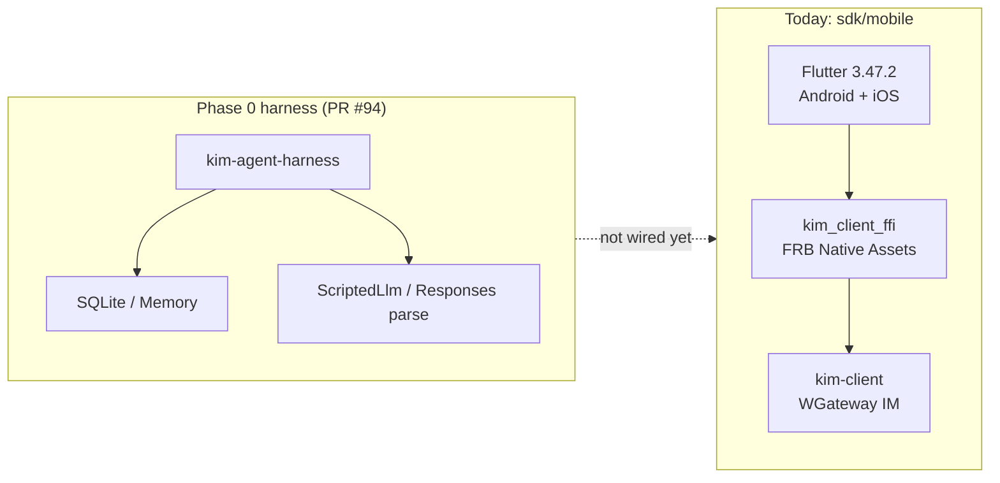
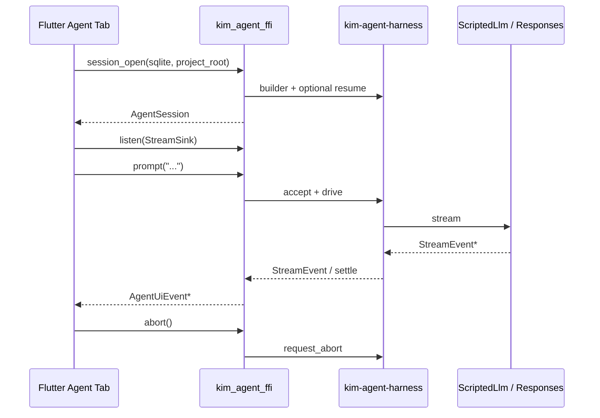
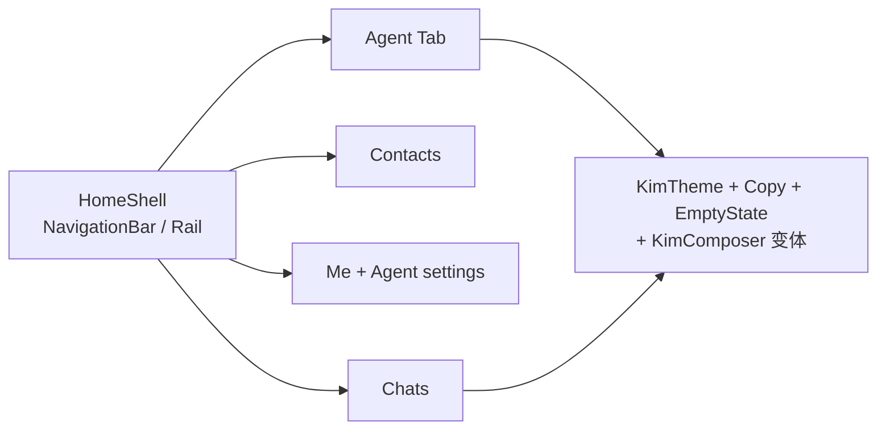
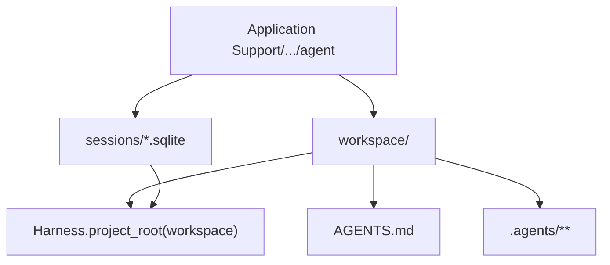

# macOS Desktop Agent Experience — Design（kim）

> Status: **docs only** — no implementation in this PR  
> Depends on: Phase 0 harness (`kim-agent-*`, see PR #94 / `docs/agent-harness-phase0.md` once merged)  
> Flutter: **3.47.2**（Dart 3.13.2；钉在 `sdk/mobile/.fvmrc`）  
> Language: Rust (tokio) + Flutter shell（FRB 2.13 Native Assets）  
> Out of scope here: shipping code, App Store notarization polish, Windows/Linux desktop, team/graph

---

## 0. Goals & non-goals

### Goals

- 在现有 `sdk/mobile` Flutter 壳上 **启用 macOS desktop**，提供完整的本地 Agent 体验（输入 → 流式回复 → 工具调用展示 → 中止 / 恢复）。
- 新增独立 FFI crate **`kim_agent_ffi`**（或等价命名），把 Phase 0 `kim-agent-harness` 接到 Flutter；**不**与 IM `kim_client_ffi` / `kim-client` 混编。
- 会话持久化：**SQLite only**，落在 macOS Application Support 目录；默认开启 **`AGENTS.md` + `.agents/**`** discovery。
- 首版用 **`ScriptedLlm`** 打通 UI ↔ harness 全链路；**v1 设计含可配置 Provider**（Scripted vs Live Responses；实现见 Phase A/B）。
- Agent UI **复用现有 App shell**（`HomeShell` destinations + `KimTheme` / `KimComposer`），IA 对齐主流 agent 产品。
- 文档化启用步骤、签名注意事项、CI macOS runner 检查项，以及分阶段 PR 切片。

### Non-goals（本设计 / 首批落地）

- 改写 IM 路径（`kim-tcp` / `kim-ws` / `kim-session` / chat / gateway / `kim-client`）。
- 把 Agent 塞进现有 `kim_client_ffi` crate，或共享同一 FRB 入口。
- Windows / Linux desktop、iPad multitasking、App Store 上架 checklist。
- MCP 全家桶、compaction / fork、multi-lane、team/graph。
- 把 JWT / WGateway 鉴权绑进 Agent session（Agent 是本地工具循环，不是 IM 会话）。

---

## 1. Status quo — mobile-only platforms

今天 `sdk/mobile` 是 **Android + iOS only**：

| 项 | 现状 |
|---|---|
| 平台目录 | `android/`、`ios/`；**无** `macos/` |
| Flutter | 3.47.2；`environment.sdk: ^3.13.2` |
| FFI | `sdk/mobile/rust` → crate **`kim_client_ffi`**；FRB 2.13 Native Assets（`hook/build.dart`） |
| 业务 | `kim-client`：WGateway WSS login / talk / ack / friend；Flutter 只是壳 |
| 本地库 | `path_provider` → documents / support / cache；IM 消息 SQLite 在 Dart（`package:sqlite3`），**未**把 data-dir 传进 FFI |
| CI | `.github/workflows/ci.yml` job `sdk-mobile`：`ubuntu-latest`；format / analyze / `flutter test` / `cargo fmt`（host Rust 1.95.0） |
| Agent harness | Phase 0 在独立 PR #94：`kim-agent-{types,llm,storage,session,tools,hooks,harness}`；尚无 Flutter / desktop 接线 |



**结论：** macOS Agent 不是「另开一个桌面 App」，而是给同一 Flutter 工程加 `macos` 平台，并 **平行** 引入 Agent FFI；IM 与 Agent 在进程内共存、边界硬隔离。

---

## 2. Enabling macOS

### 2.1 生成平台骨架

在已有 `sdk/mobile` 上追加平台（不要新建第二套 Flutter 工程）：

```bash
export PATH=/workspace/flutter-3.47.2/bin:$PATH   # 或 fvm
cd sdk/mobile
flutter create --platforms=macos .
```

预期新增：

```text
sdk/mobile/macos/
  Runner.xcodeproj / Runner.xcworkspace
  Runner/Configs/*.xcconfig
  Runner/AppDelegate.swift / MainFlutterWindow.swift
  Podfile（若插件需要；与 iOS 一样避免无必要的 use_frameworks!）
```

验证：

```bash
flutter config --enable-macos-desktop
flutter doctor -v          # 确认 Xcode / CocoaPods
flutter devices            # 应出现 macOS
flutter run -d macos
```

### 2.2 Xcode / 工程注意

| 项 | 建议 |
|---|---|
| 打开方式 | 打开 `macos/Runner.xcworkspace`（有 Pods 时），不要只开 `.xcodeproj` |
| Native Assets | 与 iOS 相同：Run Script 需能找到 `rustup` / `cargo`（GUI Xcode 常缺 `~/.cargo/bin`）。可复用 / 仿造 `ios/Scripts/run_xcode_backend.sh` 思路，给 macOS 加 PATH 注入脚本 |
| Flutter 钉版本 | 继续用 `.fvmrc` = `3.47.2`；CI / 本机一致 |
| 最低系统 | 跟随 Flutter 3.47 macOS embedding 默认（文档落地时写死具体 `MACOSX_DEPLOYMENT_TARGET`） |
| 窗口 | 首版可用默认 `NSWindow`；Agent Tab 用 Flutter 导航，不强制 SwiftUI sidebar |

### 2.3 Signing / entitlements（notes only）

本地 `flutter run -d macos` 可用自动签名 / ad-hoc。正式分发以后再谈；设计阶段锁定这些注意点：

| 能力 | Entitlement / 说明 |
|---|---|
| 出网（真实 Responses client） | App Sandbox 下需 `com.apple.security.network.client` |
| 读用户选中的项目目录 | 优先用书签 / 用户选择的 folder access；避免一上来 `user-selected.read-write` 全家桶 |
| `bash` / 写文件工具 | **Sandbox 与 Agent 工具权限冲突**——Phase A（ScriptedLlm + 无真实 FS 工具）可在 sandbox 内跑；**Phase C** 真实 `read/write/edit/bash` 需明确：开发态关闭 sandbox，或把工具 cwd 限制在 App Group / 用户授权目录 |
| Hardened Runtime / Notarize | 不在本设计首批；独立发布 PR 再做 |
| Team ID / Bundle ID | 沿用或新建 `com.ainexc.kim`（或仓库现有 iOS bundle 前缀）；文档实现 PR 里写死，避免每人本地改 xcconfig |

**推荐落地顺序：** Phase A 开发构建 **关闭 App Sandbox**（或仅 network.client），保证 harness + ScriptedLlm 可测；Sandbox 收紧放到 **Phase C**（真实工具 + 分发）。

---

## 3. `kim_agent_ffi` API

平行于 `kim_client_ffi`，新建 crate（建议路径 `sdk/mobile/rust_agent/` 或 `sdk/mobile/agent_ffi/`），**单独** `Cargo.toml` / FRB 配置，**不**加入会触发 `unsafe_code = deny` 的 workspace 成员策略冲突时与 IM 同处理：生成代码留在 FFI crate 外、不进主 workspace deny 集。

### 3.1 设计原则

1. **薄封装**：Dart 只看到 session 句柄 + 事件流；状态机、SQLite、tool 调度全在 Rust harness。
2. **同步外观 / 异步内核**：与 `KimApi` 一样，FRB 方法内部 `block_on` 或专用 runtime；事件用 `StreamSink`。
3. **错误**：`Result<T, String>`（首版）或结构化 `AgentFfiError`；不要把 `HarnessError` 枚举泄漏成 20 个 Dart 类型。
4. **硬边界**：本 crate **只**依赖 `kim-agent-*`；**禁止** `kim-client` / `kim-ws` / `kim-protocol`。

### 3.2 建议 API 面

```rust
/// 打开或创建本地 Agent session（一对一 SQLite 文件）。
/// `sqlite_path`: 绝对路径；目录须已存在。
/// `project_root`: AGENTS.md / .agents 搜索起点（可为 app support 下的 workspace）。
fn session_open(sqlite_path: String, project_root: String, opts: SessionOpenOpts) -> Result<AgentSession, String>;

struct SessionOpenOpts {
    model: String,                    // 默认 "scripted" | 真实 model id
    llm_backend: LlmBackendKind,      // Scripted | ResponsesHttp
    resume_on_open: bool,             // true → 内部调用 harness.resume
}

struct AgentSession { /* opaque handle; Drop → graceful shutdown */ }

impl AgentSession {
    /// 等价 harness.prompt：accept(prompt) + drive
    fn prompt(&self, text: String) -> Result<String /* operation_id */, String>;

    /// 订阅 harness / UI 事件（见下节 Event）
    fn listen(&self, sink: StreamSink<AgentUiEvent>) -> Result<(), String>;

    /// 请求中止当前 lane 操作（durable request_abort + 取消 Context）
    fn abort(&self) -> Result<(), String>;

    /// 显式 resume（通常 session_open 已做；暴露给「崩溃恢复」按钮）
    fn resume(&self) -> Result<ResumeReportDto, String>;

    /// 只读：最近 settled 消息摘要（可选；首版可从事件重建）
    fn snapshot(&self) -> Result<SessionSnapshotDto, String>;
}
```

映射到 harness：

| FFI | `kim-agent-harness` |
|---|---|
| `session_open` | `SqliteStorage::open` + `Harness::builder(...).project_root(...).build`；可选 `resume` |
| `prompt` | `Harness::prompt`（内部 `accept` + `drive`） |
| `listen` | 将 `StreamEvent` + harness 生命周期事件桥成 `AgentUiEvent` |
| `abort` | `Harness::request_abort("main", …)` + cancel token |
| `resume` | `Harness::resume` |

### 3.3 UI 事件模型

Harness / LLM 侧已有 `StreamEvent`（`ResponseStarted` / `TextDelta` / `ToolCall*` / `UsageHint` / `Completed` / `Failed`）。FFI 再包一层 UI 友好事件，避免 Dart 直接依赖 SSE 细节：

```rust
enum AgentUiEvent {
    SessionReady { resumed_ops: Vec<String> },
    OperationStarted { operation_id: String },
    AssistantTextDelta { operation_id: String, delta: String },
    ToolCallStarted { operation_id: String, call_id: String, name: String },
    ToolCallArgsDelta { operation_id: String, call_id: String, delta: String },
    ToolCallFinished { operation_id: String, call_id: String, name: String, arguments_json: String },
    ToolResult { operation_id: String, call_id: String, ok: bool, output_preview: String },
    OperationCompleted { operation_id: String, stop_reason: String },
    OperationAborted { operation_id: String },
    OperationFailed { operation_id: String, message: String },
    Usage { operation_id: String, input_tokens: u64, output_tokens: u64 },
}
```



### 3.4 与 IM FFI 的对照（禁止合并）

| | `kim_client_ffi` | `kim_agent_ffi` |
|---|---|---|
| 依赖 | `kim-client` | `kim-agent-harness` (+ types/llm/storage/…) |
| 网络 | WGateway / Royal HTTP | 可选 Responses HTTPS；Scripted 零网 |
| 持久化 | Dart SQLite（IM 缓存） | Rust `kim-agent-storage` SQLite |
| 流 | `StreamSink<KimPush>` | `StreamSink<AgentUiEvent>` |
| 生命周期 | connect / login / disconnect | session_open / abort / resume |

同一 Flutter 进程可加载两个 native lib，但 **两套 FRB codegen 目录**（例如 `lib/src/rust/` vs `lib/src/rust_agent/`），Riverpod provider 也分开。

---

## 4. App shell visual alignment（同一 App，不是新视觉系统）

Agent 是现有 KIM Flutter 壳里的 **一个 Tab / destination**，**不是**另起一套桌面视觉语言。macOS 可以加宽布局 / 可选 sidebar，但 **同一套 design tokens 与组件模式**。

### 4.1 真实代码锚点（实现时对照，勿另起炉灶）

| 现有表面 | 路径 | Agent 应复用什么 |
|---|---|---|
| 主导航壳 | `sdk/mobile/lib/screens/home/home_shell.dart` | `StatefulNavigationShell` + `NavigationBar`；今日 destinations：`Copy.conversations`（消息）/ `Copy.contacts`（通讯录）/ `Copy.me`（我）。Agent = **第 4 destination**（或 macOS 宽屏下 NavigationRail / sidebar 同源 destination），同一 `Scaffold` / `KimTheme.canvasOf` |
| 会话列表密度 | `sdk/mobile/lib/screens/home/chats_page.dart` | `SliverAppBar` + 列表行高 / 搜索 / `EmptyState`；Agent session list 对齐同一 list density 与 chrome |
| 会话 transcript + composer | `sdk/mobile/lib/screens/chat/chat_page.dart` | 气泡流、`KimComposer` 底部 chrome、空态；Agent transcript / composer **同结构**，内容换成 agent 气泡与 tool cards |
| 文案 | `sdk/mobile/lib/copy.dart` | 新增 `Copy.agent*` 常量；不硬编码散落字符串 |
| 主题 / 字阶 / 间距 | `sdk/mobile/lib/theme/kim_theme.dart` | `fontTitle` / `fontBody` / `fontMeta`、`spaceUnit`、`radius*`、`canvasOf` / `raisedOf` / `hairlineOf`；禁止 Agent 专用色板 |
| Composer chrome | `sdk/mobile/lib/widgets/kim_composer.dart` | 多行输入、圆形 Send；Agent 在 busy 时 **把 Send 换成 Stop/Abort**（见 §5） |
| 空态 / 错误态 | `sdk/mobile/lib/widgets/empty_state.dart`、toast / `StatusChip` 模式 | Agent 空 session、连接失败、Key 缺失沿用同一 empty / error 语言 |
| 设置页模式 | `sdk/mobile/lib/screens/home/me_page.dart`（`KimGroup` / `KimSliverHeader` / raised cards） | Provider / Agent 设置做成 Me 下入口或同构 settings 页，**不是**独立 settings app |

路由：`sdk/mobile/lib/router/app_router.dart` 的 `StatefulShellRoute.indexedStack` 增一支；手机布局可把 Agent 藏进 Me 的实验开关，桌面默认露出。

### 4.2 复用清单（硬约束）

- **导航结构**：同一 App shell；不新建 window / 不另起 MaterialApp。
- **Type scale / spacing / radius**：只走 `KimTheme` tokens。
- **List density**：session 列表视觉对齐 `ChatsPage` conversation tiles（可用 `ConversationTile` 变体或同 padding）。
- **Composer chrome**：基于 `KimComposer` 扩展（Stop 态、无 IM 附件面板亦可），不要重画一套输入条。
- **Empty / error**：`EmptyState` + 现有 toast / status 文案风格。
- **Settings**：对齐 `MePage` 分组卡片（`KimGroup`）模式。
- **macOS**：可选 `NavigationRail` / 左栏 session list + 更宽 transcript；**tokens 与 mobile 相同**，仅 breakpoint / 布局不同。



---

## 5. Agent interaction IA — 主流 Agent 产品约定

对齐 **Cursor / ChatGPT / Claude / Pi** 的常见信息架构；**文档化约定，不发明怪异 UX**。

### 5.1 布局

```text
┌─────────────────────────────────────────────────────────┐
│  KIM     [消息] [通讯录] [Agent] [我]                    │
├──────────┬──────────────────────────────────────────────┤
│ Sessions │  Transcript (+ optional status/thinking)     │
│ · New    │  ┌ user ─────────────────────────┐           │
│ · …      │  └───────────────────────────────┘           │
│          │  ┌ assistant (streaming, updatable) ──┐      │
│          │  │ text deltas                         │      │
│          │  │ ┌ tool card: name  running|ok|fail ┐│      │
│          │  │ │ ▸ args / result (collapsible)    ││      │
│          │  │ └──────────────────────────────────┘│      │
│          │  └─────────────────────────────────────┘      │
│          │                                               │
│          │  ┌ multiline composer ─────────────┐ [Stop]   │
│          │  │                                 │ or Send  │
└──────────┴──────────────────────────────────────────────┘
```

| 区域 | 约定 |
|---|---|
| **Session list**（左 / 顶） | 多 session；**New session**；点选 resume 已有；一 session ↔ 一 SQLite 文件 |
| **Transcript** | 主栏；user 立刻上屏；assistant **可更新气泡**（streaming tokens 追加同一 bubble） |
| **Composer** | **多行**；**Send**；运行中见下条；**附件以后再做**（v1 不承诺） |
| **Stop / Abort** | 显式中止当前 operation（映射 FFI `abort`） |
| **Tool call cards** | 展示 **name** + 状态 **running / success / fail**；args / result **可折叠** |
| **Thinking / status**（可选） | 若 harness 有 thinking / status 类事件再显示细条；无事件则不画空壳 |

### 5.2 运行中 Send 策略（选定）

**选定：运行中用 Stop/Abort 替换 Send（不成双 Send）。**

- `agentBusy == true` → composer 主按钮变为 **Stop**；禁用第二次 `prompt`。
- Abort 完成（`OperationAborted` / Failed / Completed）→ 恢复 **Send**。
- 理由：与 Cursor / ChatGPT 一致，避免「排队第二条」在 v1 制造未定义 harness 行为。

### 5.3 Session 生命周期（用户动作）

| 动作 | 行为 |
|---|---|
| New session | 新 `session_id` + 新 SQLite 文件 + `session_open`；旧 session 句柄关闭但不删文件 |
| Resume | 打开已有 sqlite → `session_open(..., resume_on_open: true)` 或显式 `resume()` |
| Abort | `abort()`；UI 标 aborted；可立即再 Send 下一轮 |
| 切 session | 断开听流 / 关句柄；再 open 目标文件（树仍在磁盘） |

### 5.4 组件职责（实现备忘）

| 区域 | 行为 |
|---|---|
| Session list | 列表 + New；打开 = `session_open` |
| Transcript | fold `AgentUiEvent`；完成后可用 `snapshot` 校正 |
| Tool cards | `ToolCallStarted` → running；`ToolResult.ok` → success/fail；默认折叠长 args/result |
| Empty state | Scripted vs Live、指向 `AGENTS.md`；复用 `EmptyState` |
| Riverpod | `agentSessionProvider` / `agentEventsProvider`（挂 app 根，勿被 IndexedStack pause）/ `agentTranscriptProvider` / `agentBusyProvider` |

---

## 6. Provider 可配置（v1 设计必须写清；实现可分期）

v1 **设计**即包含可配置 LLM Provider；**实现**可先 Scripted、后 Live（见 §11 Phase A/B）。设置入口：`Me` → Agent 设置，或 Agent Tab 内齿轮 —— 视觉对齐 `me_page.dart`。

### 6.1 设置项

| 字段 | v1 | 说明 |
|---|---|---|
| **Mode** | 必有 | **Scripted（local demo）** vs **Live（real Responses）** |
| **base_url** | 必有 | Responses endpoint；默认官方；允许覆盖以对接兼容网关 |
| **api_key** | 必有（Live） | **Keychain / `flutter_secure_storage` only**；**永不**明文进 git / 普通 prefs / 日志 |
| **model** | 必有 | 如 `scripted` 或真实 model id |
| headers | **延期** | 自定义 HTTP headers |
| timeout | **延期** | 请求超时调参 |
| proxy | **延期** | 显式代理 |

### 6.2 注入与会话树稳定性

- Dart 组装 `LlmProviderConfig`（mode / base_url / model / 从 secure storage 读出的 key）→ FFI → harness / **`LlmClient` factory**（ScriptedLlm vs OpenAiResponsesClient）。
- **更换 Provider 配置不得销毁 SQLite session 树**：磁盘上 `sessions/*.sqlite` 与 session 列表保留；仅重建 in-memory `Harness` / `LlmClient` 并重新 `session_open` 当前文件。
- **需要新 session 的情况**（须在 UI 文案说清）：用户显式 New session；或 sqlite schema 不兼容迁移失败。单纯改 base_url / model / key / mode → **不**自动删库。
- Mode 切到 Scripted 时可不读 key；切 Live 且 key 缺失 → 设置页 / empty error，不静默失败。

```text
Me / Agent settings
  Mode: (o) Scripted  ( ) Live
  base_url: [ https://api.openai.com/... ]
  model:    [ ... ]
  api_key:  [ •••••• ]  (secure storage)
  — deferred: headers / timeout / proxy —

        │ FFI
        ▼
  LlmClient factory ──► ScriptedLlm | OpenAiResponsesClient
  Harness(storage = same SQLite files)
```

---

## 7. Wire to `kim-agent-harness`

### 7.1 Phase A — ScriptedLlm（默认）

```text
Flutter → kim_agent_ffi → Harness::builder(storage)
                            .effects(ScriptedLlm::…)
                            .tools(ToolRegistry::… optional / empty)
                            .project_root(…)
                            .build()
```

- 用固定脚本验证：纯文本流、tool_call 轮次、abort 中途、resume 后继续。
- UI 不关心后端是 scripted；事件形状与真 LLM 一致。

### 7.2 Phase B — 真实 Responses client（设置见 §6）

- 在 `kim-agent-llm`（或 ffi 层薄包装）实现 `OpenAiResponsesClient`：`LlmClient` + HTTP + SSE → 已有 `parse_sse_*` / `reduce_*`。
- 配置来自 §6：`base_url` / `api_key` / `model` / Mode=Live；经 FFI 注入 factory。
- 失败路径：`OperationFailed` + 可重试；不要把 IM 的 `KimAuth` 复用到这里。

### 7.3 工具

| 阶段 | 工具 |
|---|---|
| A | 无工具，或仅 `ScriptedTool` 回放 |
| B | `read` / `write` / `edit` / `bash`（cwd = `project_root`）；hooks `before_tool` / `after_tool` 可先 Noop |
| C（见 §11） | 真实 FS/bash + 权限 / sandbox（对齐风险表） |
| 以后 | MCP、细粒度权限弹窗——非本设计首批 |

---

## 8. SQLite 路径与 AGENTS discovery

### 8.1 路径

使用 `path_provider` 的 **Application Support**（macOS: `~/Library/Application Support/<bundle>/`）：

```text
{support}/agent/
  sessions/
    {session_id}.sqlite          # kim-agent-storage
  workspace/                     # 默认 project_root（可改）
    AGENTS.md                    # 首次创建时写入最小模板
    .agents/
      skills/                    # 可选；discovery 已支持
```

- `session_open(sqlite_path, project_root)` 由 Dart 拼好绝对路径再传入（与「IM 不把 data-dir 传进 FFI」不同——Agent **必须**显式路径，因 Rust 持有 SQLite）。
- 一 session ↔ 一 SQLite 文件 ↔ 一 `Harness` 实例；禁止多 writer。

### 8.2 Discovery（默认开）

沿用 `kim_agent_session::discover_agents_context`：

1. 从 `project_root` 向父目录走到 git root，收集 `AGENTS.md`
2. 收集 `.agents/**/*.md`（含 `.agents/skills/`）
3. 字符上限 `DEFAULT_AGENTS_CHAR_CAP`（64 KiB）

App 负责：首次启动写一份短模板 `AGENTS.md`（说明这是本地 Agent workspace）；用户可改；也可在设置里重定点到外部目录（书签权限另议）。



---

## 9. Hard FFI boundary vs IM `kim-client`

**铁律：Agent 与 IM 不共享 crate、不共享 FRB 入口、不共享 SQLite、不共享 Riverpod 流。**

| 规则 | 说明 |
|---|---|
| Cargo | `kim_agent_ffi` 不得依赖 `kim-client` / `kim-ws` / `kim-protocol` / `kim-session` |
| FRB | 两套 `flutter_rust_bridge.yaml`（或等价双 crate codegen）；生成 Dart 分目录 |
| 类型 | 禁止「IM Push 里塞 Agent 事件」或反向 |
| 存储 | IM：`support/kim-cache.db`（Dart）；Agent：`support/agent/sessions/*.sqlite`（Rust） |
| Auth | IM JWT ≠ Responses API key |
| CI | Agent 测试失败不得用跳过 IM job 来「变绿」；可并行独立 job |

允许的唯一「软共享」：Flutter UI 组件库、主题、`path_provider`、secure storage 插件——与业务协议无关的壳层。

若未来要「在聊天里 @agent」，也是 **应用层编排**（Dart 调两个 FFI），不是合并 Rust 客户端。

---

## 10. CI：macOS runner / 检查项

当前 `sdk-mobile` 在 `ubuntu-latest`，**无法**编译 / 跑 macOS desktop。建议增量：

### 10.1 保留现有 Linux job

- `dart format` / `flutter analyze` / `flutter test`（多数 widget 测不依赖 macOS embedding）
- `cargo fmt`（`kim_client_ffi` + 未来 `kim_agent_ffi`）
- 纯 Rust：`cargo test -p kim-agent-*`（随 Phase 0 进 main 后已有）

### 10.2 新增 `sdk-mobile-macos`（`runs-on: macos-latest`）

| 步骤 | 目的 |
|---|---|
| Flutter 3.47.2（读 `.fvmrc`） | 与 Linux 钉死同一版本 |
| Rust toolchain（host aarch64/x86_64-apple-darwin） | Native Assets |
| `flutter create --platforms=macos .` **幂等** 或要求目录已提交 | 保证工程完整 |
| `flutter build macos --debug` | 链上 `kim_client_ffi` + `kim_agent_ffi` |
| （可选）`flutter test -d macos` 烟雾 | 仅少量集成测；成本高可先 build-only |
| `cargo test` agent crates | 若尚未在 Linux 全跑，可双跑 |

### 10.3 不做（首批）

- 真机签名 / notarize
- App Store upload
- 每个 PR 跑 Scripted 长 e2e（放 nightly）

### 10.4 门禁策略

- macOS job：**required** 在「启用 macos 平台」的 PR 之后；在此之前文档 PR 不强制。
- Linux `sdk-mobile` 继续 required（防回归 Android/iOS 壳）。

---

## 11. Phased PR delivery + risks

> 本 PR **只含** `docs/agent-macos-desktop.md`，独立合入 `main`，**不**并进 PR #94。
>
> **用户已确认（本修订写入）：** (1) UI 对齐现有 App shell；(2) Agent IA 对齐主流 agent 产品；(3) Provider 可配置写入 v1 设计（实现可分期）。

### 11.1 交付阶段（A / B / C）

| Phase | 内容 | 依赖 |
|---|---|---|
| **D0**（本 PR） | 本设计文档 | 无 |
| **H0** | Phase 0 harness 合入 main（PR #94） | — |
| **Phase A** | **macOS** 平台入仓 + **Agent Tab UI**（§4 视觉对齐 shell）+ **ScriptedLlm** 全链路 + **SQLite**（Application Support）+ 默认 `AGENTS.md` / `.agents`；含 `kim_agent_ffi` 的 open/prompt/listen/abort/resume | H0 |
| **Phase B** | **Provider 设置 UI**（§6）+ **`OpenAiResponsesClient`**（Live mode）；Keychain；改配置不毁 session 树 | Phase A |
| **Phase C** | **真实工具权限 / sandbox**（read/write/edit/bash + entitlement 策略）；对齐下方风险表与 §2.3 | Phase B |

Phase A 内可再拆工程 PR（macos 骨架 → FFI → Tab UI → SQLite 路径），但验收以「Scripted 可演示」为准，不把 Live client 塞进 A。

可选并行：CI `macos-latest` build job（可挂在 A 末或紧随 macos 骨架）。

### 11.2 细切片（可选对照）

| Slice | 归入 | PR 内容 |
|---|---|---|
| M1 | A | `flutter create --platforms=macos` + 工程入仓 + `flutter run -d macos` 冒烟 |
| M2 | A | `kim_agent_ffi` + ScriptedLlm API 面 |
| M3 | A | Agent Tab UI（session list + transcript + tool cards + Stop 替 Send） |
| M4 | A | SQLite under Application Support + `AGENTS.md` scaffolding |
| M5 | A/并行 | CI `macos-latest` build |
| M6 | B | Provider settings + OpenAiResponsesClient |
| M7 | C | 真实 FS/bash 工具 + sandbox / 权限 |

每个切片可回滚；M2 起不得改 IM FFI 行为。

### 11.3 Risks

| 风险 | 缓解 |
|---|---|
| App Sandbox vs `bash`/写盘 | Phase A 关 sandbox；Phase C 再收紧；工具 cwd 限制；分发前安全评审 |
| 双 FRB / 双 native lib 体积与链接 | 分 crate、按需启用 macos feature；监控 `flutter build macos` 产物 |
| Xcode GUI 找不到 cargo | macOS Run Script PATH 注入（对齐 iOS 教训） |
| PR #94 未合入就实现 FFI | FFI PR 明确 `Depends-On: #94`；或先只合文档（本 PR） |
| 事件流在 IndexedStack 被 pause | Agent listen 挂在 app 根（对齐 IM `liveEventsProvider`） |
| SQLite 多实例损坏 | 一 session 一文件；Dart 侧互斥 open |
| 改 Provider 误删 session | §6：重建 Harness/client only；UI 禁止「保存设置 = 清库」 |
| 视觉漂移成「第二套 App」 | §4 对照 `home_shell` / `KimTheme` / `KimComposer` 做 CR checklist |
| 把 Agent 误接入 `kim-session` 命名 | 坚持 `kim-agent-*` / `kim_agent_ffi`；CR checklist |
| macOS CI 分钟成本 | 先 build-only；e2e 放 nightly |
| 真实 API key 泄漏 | Keychain only；日志 redact；CI 用 Scripted |

### 11.4 验收标准

**Phase A（首个可演示里程碑）**

1. `flutter run -d macos`；Agent 为 shell 内 destination；视觉 tokens 与消息 Tab 一致。
2. Scripted：New session → 输入 → 流式 assistant bubble → tool cards（running/success/fail）→ Completed；busy 时 Send 变为 Stop。
3. Abort 中途停止；重启 → resume 恢复或干净 settled。
4. `~/Library/Application Support/.../agent/sessions/*.sqlite` 可见；`AGENTS.md` 注入可断言。
5. IM 路径无回归；`kim_client_ffi` 无业务 diff。

**Phase B**

6. 设置可改 Mode / base_url / model / api_key；Live 能打通真实 Responses；改配置后 session 列表与 sqlite 文件仍在。

**Phase C**

7. 真实工具在约定 cwd / 权限策略下可跑；sandbox / entitlement 决策有文档与开关。

---

## 12. 仓库落点（实现时，非本 PR）

```text
docs/agent-macos-desktop.md          # 本文件
docs/agent-harness-phase0.md         # harness（#94）
sdk/mobile/macos/                    # flutter create --platforms=macos
sdk/mobile/rust/                     # kim_client_ffi（不动边界）
sdk/mobile/rust_agent/               # kim_agent_ffi（新建）
sdk/mobile/lib/src/rust_agent/       # FRB codegen
sdk/mobile/lib/.../agent/            # Agent Tab UI
.github/workflows/ci.yml             # + sdk-mobile-macos
crates/kim-agent-*                   # harness（#94）
```

---

## 13. 参考

- `docs/mobile-client.md` — Flutter 壳与 `kim_client_ffi`
- `docs/agent-harness-phase0.md` / PR #94 — accept / drive / abort / resume、SQLite、Responses、AGENTS discovery
- `sdk/mobile/lib/screens/home/home_shell.dart`、`chats_page.dart`、`me_page.dart`；`screens/chat/chat_page.dart`
- `sdk/mobile/lib/theme/kim_theme.dart`、`widgets/kim_composer.dart`、`widgets/empty_state.dart`、`copy.dart`
- Flutter 3.47 macOS desktop embedding
- FRB 2.13 Native Assets（现有 `sdk/mobile/hook`）

---

## Changelog

| Date | Note |
|---|---|
| 2026-09-06 | 初稿：macOS desktop Agent 体验设计（docs only） |
| 2026-09-06 | 加强：App shell 视觉对齐锚点；主流 Agent IA；Provider 可配置；Phase A/B/C |
