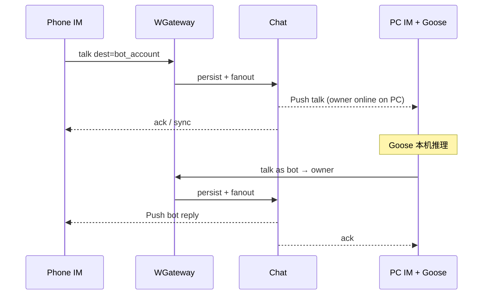

# 云端 Bot 身份与 IM 整合（实现方案）

> 状态：设计定稿（待实现）  
> 日期：2026-09-11  
> 基线：main @ `UserProfile.kind` / `users.kind`+`owner_account`（#110）、桌面 Goose（#111）、手机禁用 Goose FFI（#112）

---

## 0. 一句话

**Agent 永远在 PC 本机执行（Goose）；云端只提供 bot 用户身份 + owner 自动好友 + 走现有 IM 消息管道，使手机能同步看到同一会话。不做云端 worker，不做第三方加 bot。**

---

## 1. 目标与非目标

### 1.1 目标

1. 每个「助手」persona 对应一个**真实服务端账号**：`users.kind = bot`，`owner_account = 创建者`。
2. 创建成功后 **仅 owner 与 bot 自动成好友**（写入 `friendships`），无需申请流。
3. owner ↔ bot 的收发走现有 `chat.user.talk` / inbox / history / 推送 / 已读（与真人私聊同路径）。
4. **PC**：Goose 仍本机推理；对外表现为以 **bot 账号** 在 IM 里收消息、回消息。
5. **手机**：不跑 Goose；把 bot 当普通好友会话展示与收发；回复依赖 PC 在线时本机 Goose 代 bot 发出。
6. 复用已有 `kind` / `owner_account` / `PROFILE_KIND_BOT`，不新开身份体系。

### 1.2 非目标

- 云端运行 Goose / LLM worker / 排队推理服务
- 陌生人搜索/添加他人的 bot（搜索继续排除 bot）
- 群内 bot（可后置）
- 用本地假 dest `goose` / `agent:*` 继续冒充云身份（迁移后废弃）
- 手机端编译或初始化 `kim_agent_ffi`

### 1.3 与现有能力对照

| 能力 | 状态 |
|---|---|
| `users.kind` / `owner_account` | ✅ 已有，create-bot **未接线** |
| `UserProfile.kind` 1/2 | ✅ |
| 搜索排除 bot | ✅ |
| 好友 / talk / inbox / history | ✅ 对人账号通用 |
| 桌面 Goose + 本地 dest | ✅ 本机会话，**不上云** |
| 手机 `agentHostSupported=false` | ✅ |

---

## 2. 角色与数据模型

### 2.1 账号

```text
users
  account         -- bot 的全局账号，如 bot_a1b2c3d4 或用户选定 slug（见命名）
  kind            -- 'bot'
  owner_account   -- 创建者人类账号
  nickname/avatar/bio
  password_hash   -- bot 可无登录密码；若需 bot 独立连网关再议（见 §5.2）
```

约束：

- `kind=bot` ⇒ `owner_account` 非空且对应存在的 `kind=user`。
- 一个 owner 可有多个 bot（多 persona）。
- **禁止** 把人类账号改成 bot；禁止非 owner 改 bot 资料（除非后续授权模型）。

### 2.2 关系

创建 bot 的同一事务内：

1. `INSERT users (... kind=bot, owner_account=...)`
2. `INSERT friendships`（规范化 `account_a < account_b`）owner↔bot
3. 清理双方可能存在的 pending friend_requests（一般无）

**不做**：bot 出现在全局搜索；他人 `friend.request` 到 bot（应 `NotFound` / `Unauthorized` / 明确拒绝）。

### 2.3 命名（建议）

| 方案 | 说明 |
|---|---|
| **推荐 A** | 服务端分配 `bot_<ulid>`，昵称用展示名「助手」；稳定、无抢注 |
| B | owner 选 slug，加前缀 `b_`，需唯一校验 |

本地旧 dest：

- `goose` / `agent:goose` → 迁移映射到云 bot account（见 §7）
- 新 persona：`agent:<profile_id>` 仅作本地配置 id；**IM dest 一律用云 account**

### 2.4 Profile 展示

- `chat.user.profile` / `friend.list` 已带 `kind`；客户端对 `kind=bot` 显示助手徽章即可。
- inbox `title` 用 bot nickname；头像用 bot avatar。

---

## 3. 协议与 API

### 3.1 创建 Bot（新）

**推荐挂在 Chat 控制面（需登录 session）**，与资料/好友一致；Royal HTTP 可选镜像给管理端。

```text
Command: chat.bot.create
Flag: Request
Body: BotCreateReq {
  nickname: string,     // 1–32，默认「助手」
  avatar: string,       // 可选
  client_persona_id: string,  // 可选，桌面 profile id，便于映射
}
Response: BotCreateResp {
  profile: UserProfile, // kind=2, account=分配的 bot 账号
}
```

行为：

1. 鉴权：session.account 必须是人类 user。
2. 限额：每 owner 最多 N 个 bot（建议先 N=5，可配置）。
3. 分配 account、写库、自动好友。
4. 成功后可对 owner 推一条可选系统提示（非必须）；friend list 刷新即可。

**幂等（建议）**：同一 `client_persona_id` 已绑定则返回已有 bot profile，不新建。需表或 value：

```text
bot_persona_bindings(owner_account, client_persona_id) UNIQUE → bot_account
```

或把 `client_persona_id` 存进 bot 的 `bio`/扩展字段（不推荐）；应用小表更干净。

### 3.2 列出我的 Bot（可选 P0）

```text
chat.bot.list → UserListResp（仅 owner 的 bot）
```

也可用 `friend.list` 过滤 `kind=bot`（P0 可先这样，少一个命令）。

### 3.3 删除 / 停用（P1）

- `chat.bot.delete`：仅 owner；拆好友；软删或硬删 bot 用户（硬删需处理历史消息引用，建议软删 `revoked`）。

### 3.4 不加新 talk 命令

对 bot 发消息：**现有** `chat.user.talk`，dest=bot_account。  
校验：已是好友（自动好友后满足）；`NotFriends` / `Blocked` 逻辑不变。  
Bot 作为 sender 回消息：同样 `chat.user.talk`，需要 **bot 侧有可发消息的会话身份**（见 §5）。

---

## 4. 端到端消息流



要点：

- 所有气泡都是 **真实 IM 消息**（有 messageId、进 history/inbox）。
- 手机发、PC 回；或 PC 本地也发（同一线程）。
- PC 离线：消息仍入库，owner 各端能看到「已发送」；**无自动回复**直到 PC Goose 上线处理（产品文案说明即可）。

---

## 5. PC 侧：Goose 如何「以 bot 身份」发 IM

这是本方案唯一需要仔细选的实现分叉。

### 5.1 推荐：单登录（owner）+ 服务端「代发」

Owner 只维持 **自己的** 网关登录。PC Goose 生成回复后，客户端调新控制命令：

```text
chat.bot.speak
Body: BotSpeakReq {
  bot_account: string,
  dest: string,          // 通常=owner，或将来群
  text: string,
  client_id: string,
}
```

服务端校验：`session.account == bot.owner_account`，然后 **以 bot 为 sender** 写入消息并推送（复用 talk 落库路径，sender 字段强制为 bot）。

优点：手机/PC 都只登 owner；无 bot 密码；无双连接。  
缺点：多一个命令；需仔细复用 talk 的幂等/clientId。

### 5.2 备选：Bot 独立登录

为 bot 发设备 JWT，PC 再开一条 `kim_client` 连接以 bot 身份 `talk`。

优点：完全复用 talk。  
缺点：双连接、密钥保管、互踢策略复杂；手机也要避免误登 bot。

**Phase 0 采用 5.1。**

### 5.3 收消息触发 Goose

PC 上 `link` 收到 `talk` 且 `dest==owner && sender==bot_account` 的对向：即 owner 视角下「bot 会话」的入站消息（sender 为己、或 sender 为 bot 的回执流按现网约定）。

更直观：在 **thread id == bot_account** 的会话里：

- 出站（owner→bot）：照常 `talk`；同时喂给本机 Goose prompt（桌面）。
- 入站（展示 bot→owner）：来自 Push；若是本机刚 `bot.speak` 发出的，去重。

Goose 完成 → `bot.speak`。

本地工具（bash/fs）仍只在 PC；**不要**把工具结果冒充云能力。

### 5.4 与 `kim_agent_ffi` 边界

保持双 FFI：

```text
Flutter (desktop)
  ├─ kim_client_ffi  -- IM（owner 登录）
  └─ kim_agent_ffi   -- Goose 推理 only
Dart ChatAgent：
  on owner→bot talk local echo / push
    → agent.prompt(...)
    → client.botSpeak(bot, text)
```

手机只有 `kim_client_ffi`。

---

## 6. 客户端行为

### 6.1 桌面

1. 首次启用助手：调 `chat.bot.create`（persona=`goose`）→ 存 `bot_account` 到本地 profile。
2. 消息列表：会话 id = `bot_account`（不再用本地 `goose` dest 发网关）。
3. 输入发送：`talk(dest=bot_account)` + 触发 Goose；回复经 `bot.speak`。
4. Agent 设置：仍配 API key / 模型；与云 identity 解耦。

### 6.2 手机

1. `friend.list` / inbox 出现 bot（kind=2）。
2. 普通 ChatPage；无 Goose、无 Agent 设置入口（或设置里提示「请在电脑端配置」）。
3. 发送走 talk；等待 PC 回复；可显示「电脑端助手未在线」类弱提示（可选，检测 bot 无 location——bot 若无独立登录则改为检测 owner 的桌面在线或「最近 bot.speak」启发式；P0 可省略）。

### 6.3 Web

与手机类似（IM only），除非将来 Web 也嵌 host（非目标）。

---

## 7. 迁移（本地 Goose → 云身份）

1. 桌面升级后：若本地仅有 `goose` 会话、无绑定 bot_account → 自动 `bot.create`。
2. **历史消息**：本地 SQLite/conversation 记录 **不自动上传**（P0）；新消息走云。可选 P2：导出本地历史为 bot 线程补写（需服务端导入 API，慎做）。
3. 废弃：`isAgentDest` 对网关发送的短路；保留短时间兼容读本地旧线程只读展示。

---

## 8. 权限与安全

- 仅 owner 可 `bot.create` / `bot.speak` / 改 bot 资料。
- `bot.speak` 必须校验 owner；防止冒充任意 bot。
- Bot 不进搜索；他人 friend.request(bot) → 拒绝。
- Bot 无（或禁用）密码登录（若走 5.1）。
- 限流：每 owner bot 数量；`bot.speak` QPS。
- 审计：创建/删除打日志。

---

## 9. 服务端实现要点

### 9.1 UserDirectory

新增：

```rust
async fn create_bot(
  &self, app, owner, account, nickname, avatar
) -> Result<UserProfile, UserError>;
```

Memory + Postgres 实现写入 `kind='bot'`, `owner_account`。  
人类 `create` 保持 `kind='user'`。

### 9.2 SocialDirectory

`ensure_friends(app, a, b)` 供创建事务调用（已有好友则 Ok）。

### 9.3 Talk 复用

`bot.speak` 内部调用与 `do_user_talk` 相同的 persist/push，但：

- `sender = bot_account`
- `dest = req.dest`（通常 owner）
- 会话线程键与私聊一致（按现网 user talk 惯例）

### 9.4 配置

- `KIM_BOT_MAX_PER_OWNER`（默认 5）

---

## 10. 测试计划

1. `create_bot` → profile.kind=bot，owner_account 正确；friend.list 双方可见。
2. 搜索 bot 账号 / 昵称 → 无结果。
3. 非 owner `bot.speak` → Unauthorized。
4. owner `talk`→bot，bot.speak 回来 → 两端 history 各一条；messageId 递增。
5. 第二设备（手机模拟）inbox 能拉到 bot 会话与未读。
6. 重复 create 同 `client_persona_id` → 幂等返回同一 account。
7. 回归：人类注册/好友/talk 不受影响；桌面 Goose 单测仍绿。

---

## 11. 分期交付

### P0 — 身份 + 管道（本方案最小闭环）

1. `create_bot` + 自动好友 +（可选）persona 绑定表  
2. `bot.speak` 代发  
3. 桌面：绑定云 bot account，talk + Goose + bot.speak  
4. 手机：当 bot 好友展示（无 host）  
5. 文档：更新 `agent-goose.md` / `user-social-inbox.md` 交叉链接

### P1

- `bot.list` / 删 bot / 改 bot 资料  
- 本地历史只读兼容；设置文案「回复需电脑在线」  
- 多 persona 多个云 bot

### P2

- 历史迁移、群 bot、更细在线提示  
- （仍不要）云端 worker

---

## 12. 决策摘要

| 项 | 决策 |
|---|---|
| 推理位置 | 仅 PC Goose |
| 云端 worker | 不做 |
| 身份 | 复用 `kind=bot` + `owner_account` |
| 他人加 bot | 不做 |
| 好友 | 仅 owner 自动好友 |
| 消息 | 现有 IM talk/inbox/history |
| Bot 发送 | P0：`chat.bot.speak` 由 owner 会话代发 |
| 本地 dest `goose` | 迁移到云 account 后废弃上网关 |

---

## 13. 文档维护

落地后：

1. 本文件标「已落地」并链到命令与表。  
2. `docs/agent-goose.md` 改为「桌面执行 + 云身份 IM」。  
3. `docs/user-social-inbox.md` 补 bot 创建与 speak 小节。
