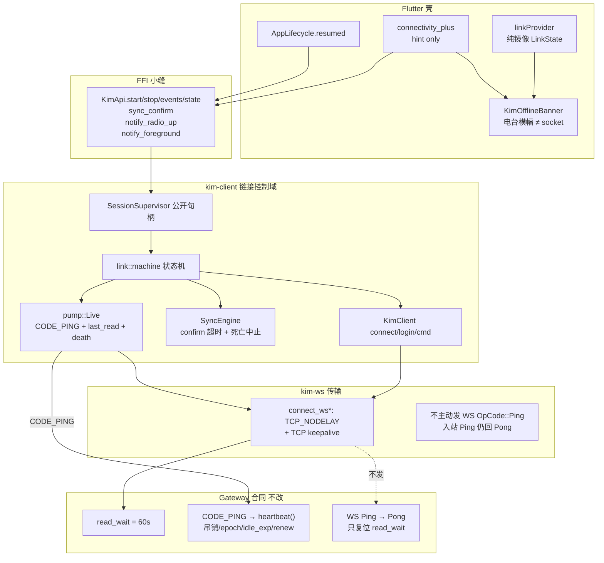
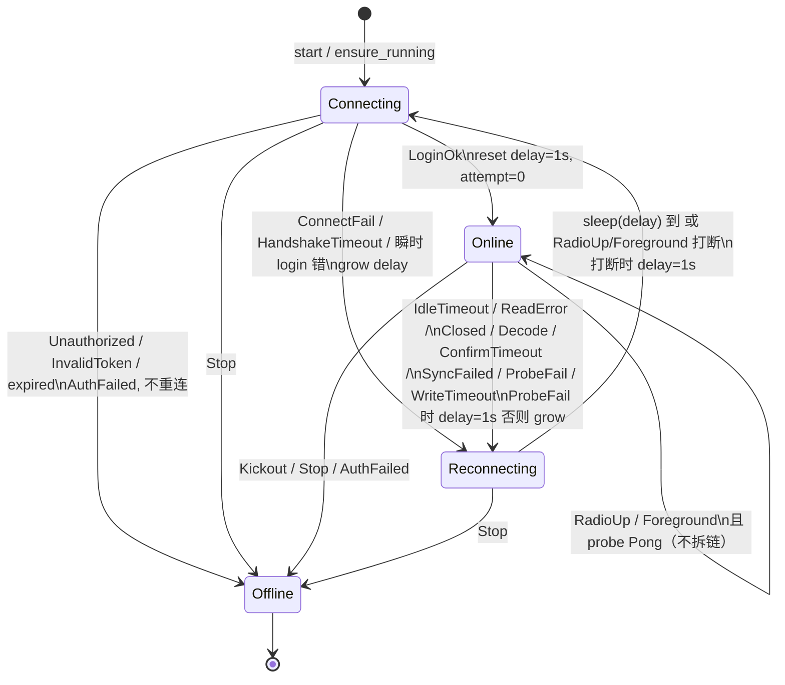
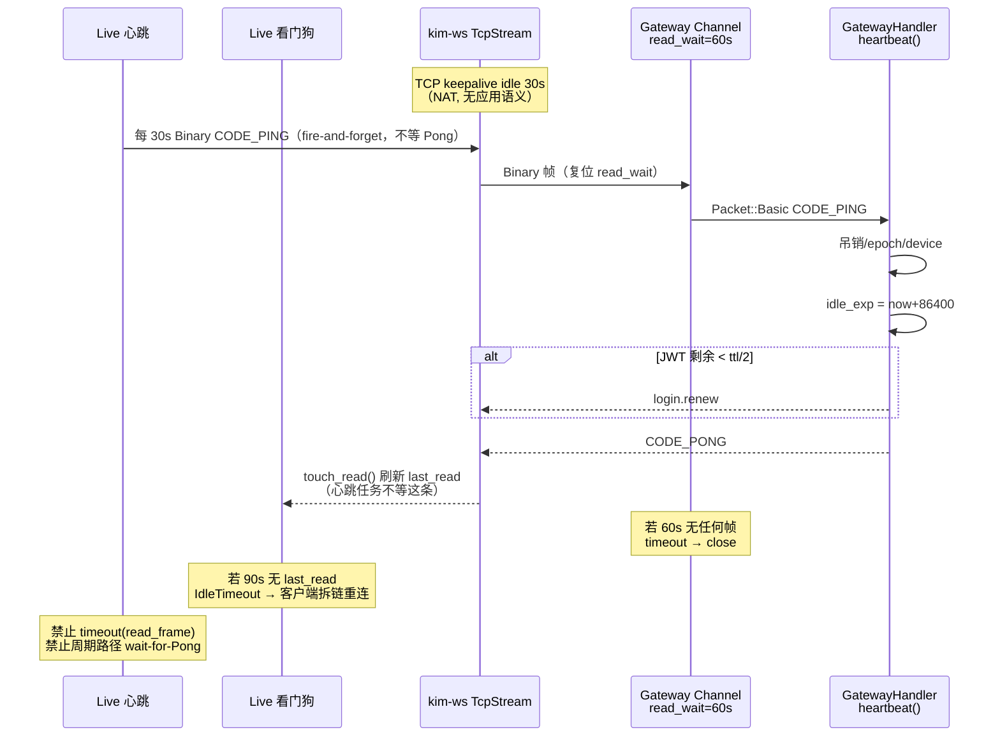

# 移动端链接控制域（Link Control）

| 字段 | 值 |
|---|---|
| 状态 | Draft |
| 作者 | — |
| 日期 | 2026-09-05 |
| 对照代码 | HEAD `0468ee2`。行号以标识符为准。 |
| 父规格 | [mobile-client.md](../mobile-client.md)、[06-mobile-client-maturity.md](./06-mobile-client-maturity.md)、[communication-layer.md](../communication-layer.md)、[link-layer-login.md](../link-layer-login.md)、[next-stage.md](./next-stage.md) |
| 已拍板方向 | 链接控制是 **一个域模块、一个小缝**；keepalive / CODE_PING / 读空闲看门狗 / 退避复位 / 生命周期探测 / Kickout 停环，同一次架构落地，而不是在 `SessionSupervisor` 上叠补丁。Flutter 仍是壳。不改 gateway `read_wait`、CODE_PING 处理、Chat/Royal ACK。 |

---

## Breaking Change Notice（仓库内部）

不涉外部 crate / 服务端 ACK / Web SDK 行为。以下内部契约一次性变更，**按 PR 切片合入**，不允许只加 ping 却不复位 delay：

1. `kim-ws` `connect_ws` / `connect_ws_with_user_agent` / `connect_ws_with_tls` 在 `TcpStream::connect` 之后、TLS/Upgrade 之前设置 `TCP_NODELAY` + TCP keepalive（与 `kim-tcp::Keepalive::default` 同值）。这是移动传输路径，**在客户端轨范围内**。
2. `crates/kim-client` 公开句柄仍叫 `SessionSupervisor`（避免 FFI 大改名），内部状态机抽到 `src/link/`。`ClientConfig` 增加心跳 / 看门狗 / confirm 超时字段，默认见下文常数表。
3. FFI 加法：`KimApi.notify_foreground()`。`DropReason` **只**走现有 `SessionEvent::Link(Reconnecting { attempt })`：FFI `kind=link`、`error` 填稳定字符串（`idle-timeout` / `probe-fail` / …）。**禁止**新增 `SessionEvent::Dropped` / FFI `kind=dropped`（PR 3 若发出新 kind，PR 5 之前会被 Dart `_ => closed` 打成假重连）。未知 `kind` **不再**映射成 `KimEventKind.closed`（PR 5）。
4. Dart `linkProvider` **停止**用 `radioOnlineProvider` 覆盖 `LinkState`。`radio down shows offline` 测试改写：电台掉线只驱动横幅，不把 Online 涂成 Offline。`outbox` 仍只看真实 `LinkState::Online`。
5. 通用 `SessionEnd::Drop` **不再** `events.send(SyncFailed)`。`SyncFailed` 只留给 `SyncEngine::run` 的非连接死亡错误。
6. `KimApi::session_events` 对 `RecvError::Lagged` **不再**映射 `sync_failed`（改 ignore + tracing）。

不改：`services/gateway`、`services/chat`、`services/royal` 热路径，`DEFAULT_READ_WAIT=60s`，`target_id`，pending receipt。

---

## Feasibility Assessment

服务端合同已齐，且**不是缺口**：

- `kim_core::DEFAULT_READ_WAIT = 60s`：网关 `ChannelReadLoop` `timeout(read_wait, read_frame)`，无帧则关。注释写明必须大于客户端心跳。
- Gateway `MessageListener` 见 Basic `CODE_PING` 走 `heartbeat()`（吊销 / epoch / device / 滑 `idle_exp` / JWT 剩余 < ttl/2 时 `login.renew`），再回 `CODE_PONG`。WS `OpCode::Ping` 由 Channel 回 `Pong`，**复位 `read_wait`，不进 `heartbeat()`**。
- Caddy `deploy/host.Caddyfile` 对 WS `read_timeout 0` / `write_timeout 0`，反向代理不是空闲杀手。
- `token_ttl_secs = 86400`：`idle_exp` 初值与滑动窗口都是 24h，**今日前台 60s 断线的直接原因是 `read_wait`，不是 idle_exp**。长期在线仍依赖 `CODE_PING` 做吊销检查与 JWT 续期。

客户端缺口也已定位（见 Current Surface）。`KimClient::ping()` / `Live::ping` / `encode_ping()` 已存在，supervisor **从未调用**。Web SDK 已按 50s `CODE_PING` + 3 倍读空闲看门狗实现，可作对照，不必改 Web。

**Fully feasible。** 不需要服务端协议或 ACK 模型变更。

---

## Overview

移动端长连接栈缺的不是「再发一个 ping」，而是 **链接控制域**：传输层 TCP keepalive、链路层 `CODE_PING`、读空闲看门狗、退避（成功必须归零）、生命周期探测、Kickout 停环、SyncEngine 不得楔死会话。这些能力今天散落成「未设置 / 未调用 / 覆盖真相 / 无限等待」，UI 看起来像「重连 #1 却卡一分钟」。

本切片在 `kim-client` 内建一个有深度的 `link` 模块，对外缝很小：`SessionSupervisor` + 两个 hint（`notify_radio_up` / `notify_foreground`）。Dart 只投递信号、镜像 `LinkState`。`kim-ws` 的客户端插座补齐与 `kim-tcp` 相同的 OS 保活；应用心跳留在 `kim-client`，以兑现网关 `heartbeat()` 合同。

---

## Background & Motivation

### 服务端已经假定的合同

| 常量 | 值 | 源 |
|---|---|---|
| `DEFAULT_LOGIN_WAIT` | 10s | `crates/kim-core/src/lib.rs` |
| `DEFAULT_READ_WAIT` | 60s | 同上；「应大于客户端心跳间隔」 |
| `DEFAULT_WRITE_WAIT` | 10s | 同上 |
| `DEFAULT_HEARTBEAT` | 30s | 同上；`TcpClient` / `WsClient` 默认发 **WS/TCP `OpCode::Ping`** |
| Web `heartbeatMs` | 50_000 | `sdk/web/src/client.ts`；发 **Basic `CODE_PING`**；`now - lastRead > 3 × heartbeatMs` 当死 |
| TCP keepalive | idle 30s / interval 10s / retries 3 | `kim-tcp::Keepalive::default` |
| JWT / idle 窗口 | 86400s | `services/gateway/config.toml` `token_ttl_secs` |

通信层文档（`docs/communication-layer.md`）：客户端按间隔发 Ping；服务端靠 `read_wait` 判死。链路层文档（`docs/link-layer-login.md`）：**WS Ping 是传输；`CODE_PING` 是链路心跳，两者都要，且 `CODE_PING` 才跑吊销 / epoch / `idle_exp` / `login.renew`。**

### 今日实现（已对代码核对）

**`KimClient::connect`**（`crates/kim-client/src/client.rs`）走 `connect_ws_with_user_agent`。`crates/kim-ws/src/client.rs` `connect_ws_inner`：`TcpStream::connect` 之后**不** `set_nodelay`、**不** TCP keepalive、**不**起 ping 循环。`upgrade_http` 设 `set_auto_pong(false)`，应用必须自己回 WS Pong（`pump.rs` 已回空 Pong）。对比：同文件 `WsClient::connect` 会按 `ClientOptions.heartbeat`（默认 30s）发 **WS `OpCode::Ping`**——但 `KimClient` **不用** `WsClient`。

**`SessionSupervisor::run_loop`**（`supervisor.rs`）：

- 循环 connect → login → `SyncEngine::run` → `recv`。无心跳任务，从不调用 `KimClient::ping()`。
- `delay` 是 `run_loop` 局部变量；login 成功只 `attempt.store(0)`，**不复位 `delay`**。
- Drop 后 `attempt.fetch_add(1)`，UI 显示 attempt=1，但 delay 已是 2/4/…/60s。
- `notify_radio_up` 清 attempt 并 `radio.notify`；已 Online 的 `recv` 分支是 `{}`，**不探测**。
- `Event::Kickout` 只 `events.send`，supervisor **不结束会话**。
- `SessionEnd::Drop` **总是** `events.send(SessionEvent::SyncFailed)` 再进 Reconnecting（`run_loop` 215–218 行）。空闲超时也会被 Dart 画成同步失败。

**`pump.rs`**：`events.send(event).await` 可阻塞 reader。`EVENT_CAP = 64`。`SyncEngine::run` 期间无人 `recv()`，push 填满 channel 后 reader 堵死，**响应 oneshot 也派不出来**（这是通道死锁，不是物理写超时）。任意 `decode_event` Err 关整段会话。`write_one` 无超时；`Live::write_wait` 的 pending oneshot 也无超时（两件不同的事）。

**`sync.rs` `wait_confirm`**：只 select confirm vs `stop`，**无超时、无连接死亡**。`SyncPage` 走 cap=64 的 `broadcast`；FFI 侧 `RecvError::Lagged` 变成 `sync_failed`，闸门永远等不到 → Online 挂死。

**Dart `link.dart`**：`build()` watch `radioOnlineProvider`，电台 false 时把 UI 涂成 Offline，即使 Rust 是 Online。`_start` / `retry` / `_radioUp` 无互斥；重叠 `startSession` 会停旧 `KimApi` 再 login，`device=mobile` 互斥 = **自己踢自己**。`kim_bridge.dart` 未知 FFI `kind` → `KimEventKind.closed` → UI「重连中」。

**Dart `connectivity.dart`**：`resumed` 只 `recheck()` 电台。电台若后台期间一直为 true，**从不** `notify_radio_up`。`onError` / `checkConnectivity` catch → `online=false`，进一步触发 overlay。

### 用户可见因果链（已由代码解释）

前台、网络正常、仍周期性重连，且越来越慢：

1. 无业务帧、无 `CODE_PING`、无 TCP keepalive → 网关 60s `read_wait` 关连接。
2. supervisor 当 Drop，sleep `delay`（1s, 2s, 4s, …, 60s）。
3. 重连 login **成功**，`attempt` 归零，**`delay` 保留**。
4. 再空闲 60s，再次被踢。约 8 分钟后 delay 封顶 60s。UI 显示「重连 #1」却干等一分钟。

这不是单点 bug，是域缺失。

---

## Goals & Non-Goals

### Goals

1. 链接控制作为 `kim-client` 内一个深模块（`src/link/`），对外缝：`start` / `stop` / `events` / `state` / `sync_confirm` / `notify_radio_up` / `notify_foreground` / `client()`。调用方不区分 keepalive vs ping vs backoff。
2. **两层保活都落地，且不可互换**：OS TCP keepalive + `TCP_NODELAY` 在 `kim-ws` 客户端插座；应用 `CODE_PING`/`CODE_PONG` 由 `kim-client` Live 拥有。
3. 客户端读空闲看门狗（3 个心跳周期）。周期 CODE_PING fire-and-forget；`recv()` 不是唯一死亡信号。
4. 成功 login **必须**复位 backoff delay 与 attempt。连续失败才增长。
5. 电台 / 前台是 **探测**，不是第二真相。活套接字禁止因 hint 拆掉。
6. Kickout / 不可用 token / Unauthorized login → 停环，不重连。Dart 仍 `signOut` 做 UX。
7. SyncEngine 是会话的一部分：confirm 超时、连接死亡中止；pump 在 sync 期间不得死锁。
8. 可观测：每次重连都能从 tracing 读出 `DropReason`、attempt、delay、last-frame age。
9. 测试点名今日每个漏洞（见 Tests）。

### Non-Goals

- TGateway TCP / QUIC / 自定义 TLS 端口（以后 `Conn` 对换）。
- FCM / APNs 当保活（另一域）。
- SQLite 搬进 Rust。
- 改 Web SDK 行为；仅文档对齐心跳合同。允许 `docs/web-sdk.md` / `communication-layer.md` 补一句「移动端 30s CODE_PING」。
- 改 gateway `read_wait`、`heartbeat()`、Chat/Royal ACK、`target_id`、pending receipt。
- 后台长驻 / VoIP socket / iOS `beginBackgroundTask` 保活。进程冻结后靠 `notify_foreground` 探测。
- 新 crate、新框架、把 Dart 做成连接状态机。
- **RPC oneshot 超时**（`Live::write_wait` 等响应）：本切片只给**物理写**加 `DEFAULT_WRITE_WAIT`。`inbox_list` / `offline_index` 在对端静默、看门狗仍因 Pong 刷新 `last_read` 时，仍可能一直挂在 oneshot 上。解开它是后续切片（给 sync 命令加 `write_wait` 超时），**不要**以为包了 `write_one` 就等于 `offline_index` 不会挂。

---

## Current Surface Inventory

### Rust

| 路径 | 现状 |
|---|---|
| `crates/kim-core/src/lib.rs` | `DEFAULT_*` 齐；无 socket 选项 |
| `crates/kim-core/src/channel.rs` | 服务端 `timeout(read_wait, read_frame)`；超时 **drop 整条连接**（`read_frame` 非 cancel-safe） |
| `crates/kim-tcp/src/opts.rs` | `SocketOpts` / `Keepalive` idle 30 / interval 10 / retries 3 |
| `crates/kim-tcp/src/conn.rs` | `TcpConn::new` `set_nodelay(true)` |
| `crates/kim-tcp/src/client.rs` | `TcpClient` 心跳循环发 `OpCode::Ping` |
| `crates/kim-ws/src/client.rs` | `connect_ws*` 无 nodelay/keepalive/心跳；`WsClient` 有 WS Ping 循环（`KimClient` 不用） |
| `crates/kim-ws/src/conn.rs` | 文件头：`read_frame` 非 cancel-safe |
| `crates/kim-client/src/client.rs` | `connect` → `connect_ws_with_user_agent`；`ping()` 有、supervisor 不用；live `write_wait` 无超时 |
| `crates/kim-client/src/config.rs` | 仅 url/token/handshake_timeout/user_agent |
| `crates/kim-client/src/supervisor.rs` | 重连循环；delay 不复位；Kickout 不停；Online 不探测 |
| `crates/kim-client/src/pump.rs` | 读写分离；`send().await` 可堵 reader；单 ping oneshot |
| `crates/kim-client/src/sync.rs` | persist-then-ack；`wait_confirm` 无超时 / 无死亡 |
| `crates/kim-client/src/tests.rs` | 重连、radio 打断退避、过期 token、Unauthorized；**无**心跳、delay 复位、Kickout 停环、confirm 超时 |
| `sdk/mobile/rust/src/api/client.rs` | `KimApi` 包 supervisor；有 `notify_radio_up`；无 `notify_foreground` |
| `services/gateway/src/lib.rs` | `CODE_PING` → `heartbeat()` + Pong；WS Ping 不在此 |

### Dart（`sdk/mobile/lib`）

| 路径 | 现状 |
|---|---|
| `state/link.dart` | 镜像 + 电台 overlay Offline；start 无串行 |
| `state/providers.dart` | `radioOnlineProvider` 独立于 socket |
| `state/session.dart` | `auth + link` 给 chrome；overlay 会污染 outbox / 通讯录门闩 |
| `state/outbox.dart` | `linkProvider.status == online` 才 replay |
| `core/connectivity.dart` | `resumed` 只 recheck 电台 |
| `kim_bridge.dart` | 未知 kind → `closed`；`startSession` 先 stop 再 new `KimApi` |
| `widgets/kim_offline_banner.dart` | 已区分 `noRadio` vs `noSocket`，overlay 多余 |
| `test/state/gateway_test.dart` | **锁死了错误 overlay**（`radio down shows offline`） |

### 不改

- `services/gateway` / `chat` / `royal` 热路径。
- `sdk/web` 运行时（50s 心跳保持）。
- Dart 侧 WebSocket。
- `flutter_chat_*`（已在成熟化切片去掉）。

---

## Proposed Design

### 1. 模块缝（Module / Interface / Seam）

链接控制是 **一个域**。传输保活、链路心跳、会话监督、Dart 信号分属三层，但政策只在 `kim-client::link` 一处。禁止把 keepalive 丢在 `kim-ws`、ping 丢在 supervisor、overlay 丢在 Dart 当三个无关补丁。



词汇（对照仓库模块纪律）：

| 词 | 本域落点 |
|---|---|
| Module | `crates/kim-client/src/link/` + `pump.rs` 的 Live 保活；`kim-ws` 只履行 OS 插座 |
| Interface | `SessionSupervisor` / `KimApi`（现有名字保留） |
| Seam | 两个 hint + `LinkState` 快照 + `SessionEvent` 流 |
| Adapter | FFI `KimApi`、Dart `KimBridge` |
| Depth | 退避、探测、心跳串行、confirm 闸门、DropReason 全在 Rust |

### 2. 两层保活（不可互换）

| 层 | 机制 | 谁拥有 | 复位 `read_wait` | 跑 `gateway.heartbeat()` | NAT 半开 |
|---|---|---|---|---|---|
| OS / 传输 | TCP keepalive + `TCP_NODELAY` | `kim-ws` `connect_ws*` | 否（无应用帧） | 否 | 是 |
| 链路 | Basic `CODE_PING` / `CODE_PONG` | `kim-client` `Live` 心跳任务 | 是（Binary 帧） | **是** | 间接 |
| WS 控制帧 | `OpCode::Ping` / `Pong` | **移动端不主动发**；入站由 pump 回空 Pong | 是 | **否** | 弱 |

**明确决定：移动端不主动发 WS `OpCode::Ping`。**

理由：

1. 网关 Channel 对 WS Ping 回 Pong，**只**刷新 `read_wait`，**不**走 `GatewayHandler::heartbeat`（`services/gateway/src/lib.rs` 只有 `Packet::Basic(CODE_PING)` 才 `heartbeat()`）。
2. 只靠 WS Ping 会让 24h JWT 不续、吊销/epoch 不查、`idle_exp` 不滑——看起来「连着」，链路会话已过期。
3. `WsClient` 已有 WS Ping 循环，但 `KimClient` 走 `connect_ws_with_user_agent`。把移动端切到 `WsClient` 会混两套客户端栈，且仍缺 `CODE_PING`。
4. 双钟（WS Ping + CODE_PING）会让后人关掉「多余的」CODE_PING。只留 CODE_PING。
5. `set_auto_pong(false)` 保持；pump 继续回答入站 WS Ping，避免对端（或中间件）的 Ping 饿死。

TCP keepalive 参数与 `kim-tcp::Keepalive::default` **同值**：idle 30s / interval 10s / retries 3。从第一次空闲到内核放弃约 30+3×10 = 60s，覆盖 CGNAT 常见空闲回收，且不替代应用心跳。

`TCP_NODELAY`：与 `TcpConn::new` 一致，小帧（8 字节 ping）立即发出，不被 Nagle 与延迟 ACK 合成 200ms 尾巴。

### 3. 时间常数（可实施，禁止现场拍脑袋）

| 名 | 值 | 理由 |
|---|---|---|
| `heartbeat` | **30s** `DEFAULT_HEARTBEAT` | 对齐 kim-core / TcpClient / WsClient。相对 60s `read_wait` 有 30s 余量（2×）。蜂窝 CGNAT 常在 30–60s 回收空闲 TCP；Web 用 50s 是因为浏览器不能设 TCP keepalive、桌面 NAT 更松。移动端选 30s，不跟 Web 50s。 |
| 周期 CODE_PING | **fire-and-forget** | 只写 Binary ping，**不等** Pong。死亡只由 `last_read_age > read_idle`（或探测超时）。对齐 Web `startHeartbeat`。周期路径 **不会** 产生 `PingTimeout`。 |
| `read_idle` | **90s** = 3 × heartbeat | 对齐 Web「3 次未读」。通常网关 60s 先关；看门狗是半开 / 丢 RST 时的客户端底线。这是周期心跳的**唯一**死亡信号。 |
| TCP keepalive | 30 / 10 / 3 | 与 kim-tcp **客户端** `Keepalive::default` 相同。`TcpServer` 默认仍是 `SocketOpts { keepalive: None }`，Phase 1 **不得**改服务端默认。 |
| `probe_timeout` | **5s** | **仅** `request_probe()` / `notify_foreground` / `notify_radio_up`（Online）走 wait-for-Pong。超时 = `ProbeFail`。周期心跳不用这个值。 |
| 物理写超时 | **10s** `DEFAULT_WRITE_WAIT` | 只包 `write_one`（内核写出）。不是 RPC oneshot 超时，也不是等 Pong。 |
| `confirm_timeout` | **15s** | 一页 ≤200 条落 SQLite 应是毫秒～数秒；超时视为 Dart 没拿到页（broadcast lag 或 isolate 卡死） |
| `confirm_retry` | 同页再 emit **一次** | 仍无 confirm → `ConfirmTimeout` Drop |
| backoff | 1s ×2，封顶 60s | 保持 `next_backoff`；**LoginOk 与 Radio/Foreground 打断必须 delay=1s** |
| ProbeFail 后首次 delay | **1s** | 防御性：Online 时 delay 本应已是 1s（LoginOk 已复位）。若实现漏了复位，ProbeFail 仍从 1s 起，不继承 60s 封顶。 |
| `handshake_timeout` | 10s | 不变 |

`ClientConfig` 带上这些字段，测试可缩到毫秒，生产用默认。

首跳心跳：`interval_at(Instant::now() + heartbeat)`，**跳过** tokio `interval` 的立即 tick，避免与 login 后的 `inbox.list` 抢写。sync 流量本身会刷新网关 `read_wait`。心跳与看门狗的 `interval` **必须** `set_missed_tick_behavior(MissedTickBehavior::Delay)`（与 `WsClient` 相同）。默认 Burst 会在进程从后台醒来时把积压的 30s tick 一次性打成 CODE_PING 洪水，并与 `request_probe` 抢写。Delay = 醒来最多一跳。

### 4. 状态机（完整）

`LinkState` 对外保持四态，避免 Dart `statusFromLabel` 大翻：

```rust
pub enum LinkState {
    Connecting,
    Online,
    Reconnecting { attempt: u32 },
    Offline,
}
```

内部再加 `DropReason`（不进 `LinkState`）。**PR 2** 把枚举 + `as_str` 放进 `link/mod.rs`（pump `death` 载荷需要它）。**PR 3** 只加 `is_fatal` 与机器映射。PR 5 `map_link` 与 kim-client 测试都走 `SessionSupervisor::last_drop_reason()`（普通 `pub fn`）：

```rust
#[derive(Clone, Copy, Debug, PartialEq, Eq)]
pub enum DropReason {
    ConnectFail,
    HandshakeTimeout,
    ReadError,
    WriteTimeout,
    Closed,
    Decode,
    IdleTimeout,  // 周期路径：last_read_age > read_idle
    ProbeFail,    // Online 探测 wait-for-Pong 超时或写出失败（周期心跳不走这条）
    ConfirmTimeout,
    SyncFailed,
    Kickout,      // fatal
    AuthFailed,   // fatal
    Stop,         // fatal, 用户
}

impl DropReason {
    pub fn as_str(self) -> &'static str { /* idle-timeout, probe-fail, ... 无 ping-timeout */ }
    pub fn is_fatal(self) -> bool {
        matches!(self, Self::Kickout | Self::AuthFailed | Self::Stop)
    }
}
```

`SessionEnd` 与今日对齐并带原因：

```rust
enum SessionEnd {
    Stop,
    AuthFailed(ClientError),
    Kicked { channel_id: String },
    Drop { err: ClientError, reason: DropReason },
}
```



**谁复位 backoff：**

| 事件 | `attempt` | `delay` |
|---|---|---|
| `LoginOk`（进入 Online，在 sync 之前） | 0 | **1s** |
| `SessionEnd::Drop`（非 ProbeFail） | +1 | sleep 当前值，醒后 `next_backoff` |
| Drop `ProbeFail` | +1 | **强制 1s**，再 grow 规则从 1s 起 |
| Reconnecting 时 RadioUp / Foreground | 0 | **1s**，立刻 Connecting |
| Connecting 时 RadioUp / Foreground | 不变 | **不中止握手**（已有测试 `radio_up_during_connect_does_not_abort_handshake`） |
| Online 时 RadioUp / Foreground 且 probe 成功 | 0 | 保持 1s；**不拆链** |
| Fatal | — | 循环退出 |

**Fatal（停环 → Offline，Dart 负责 UX）：**

- `Kickout`：另一台 mobile 登录或服务端踢。重连会互踢。supervisor **必须** `SessionEnd::Kicked`，不再 `recv`。
- `token_unusable` / login `Unauthorized` / `InvalidToken`：已有测试，保持。
- `stop()` / Drop 句柄。

**非 Fatal（重连）：** ConnectFail、读/写错误、IdleTimeout、WriteTimeout、Decode、ConfirmTimeout、SyncFailed、对端 Close、ProbeFail。通用 Drop **不**发 `SyncFailed` 事件。

**Online 的含义：** login 成功即 Online（含随后的 SyncEngine）。与今日一致，避免 sync 期间 UI 闪 Recconnecting。sync 失败按 Drop 重连，不是 AuthFailed。

### 5. Live：一条连接的活性（pump 深化）

`start_split_pump` 升级为链接域的连接对象，而不是「两个 task + mpsc」。

```rust
use std::sync::Mutex as StdMutex;
use tokio::sync::Mutex; // 仅 events / pending / ping；禁止用在 last_read / grace_until

pub(crate) struct Live {
    writes: mpsc::Sender<WriteCmd>,
    events: Mutex<mpsc::Receiver<Event>>,
    pending: Arc<Mutex<HashMap<u32, oneshot::Sender<Event>>>>,
    ping: Arc<Mutex<Option<oneshot::Sender<()>>>>, // 仅探测 wait-for-Pong
    reader_abort: AbortHandle,
    writer_abort: AbortHandle,
    last_read: StdMutex<tokio::time::Instant>, // 禁止 unix ms / SystemTime；禁止 tokio Mutex
    death: watch::Sender<Option<DropReason>>,
    token: watch::Sender<Option<(String, i64)>>, // TokenRenew 控制面，latest-wins
    ping_now: Notify,
    grace_until: StdMutex<Option<tokio::time::Instant>>, // None = 无宽限
    heartbeat_abort: AbortHandle,
    watchdog_abort: AbortHandle,
}

impl Live {
    pub fn last_read_age(&self) -> Duration {
        let t = *self.last_read.lock().unwrap_or_else(|e| e.into_inner());
        tokio::time::Instant::now().saturating_duration_since(t)
    }
    /// 先 `borrow()`：若已是 `Some`，立刻返回。然后再 `changed()`。
    /// 禁止裸 `death.changed()`（错过已经发出的死亡 → confirm 仍挂）。
    pub async fn wait_dead(&self) -> DropReason { ... }
    pub fn request_probe(&self); // ping_now + grace_until = Instant::now() + probe_timeout
    /// 仅探测路径：写出 CODE_PING 并等 Pong。周期心跳不要走这里。
    pub async fn ping(&self, payload: Bytes) -> Result<(), ClientError>;
}

impl Live {
    pub fn shutdown(&self) {
        let _ = self.writes.try_send(WriteCmd::Shutdown);
        self.reader_abort.abort();
        self.writer_abort.abort();
        self.heartbeat_abort.abort(); // 今日 shutdown 只 abort 读写，必须补上
        self.watchdog_abort.abort();
    }
}

/// wait_dead 必写实现（machine 与 wait_confirm 共用，禁止复制错）：
async fn wait_dead(rx: &mut watch::Receiver<Option<DropReason>>) -> DropReason {
    loop {
        if let Some(reason) = *rx.borrow() {
            return reason;
        }
        if rx.changed().await.is_err() {
            return DropReason::Closed;
        }
    }
}
```

**Cancel-safety（硬约束）：** `kim-ws` `read_frame` **不是** cancel-safe（`crates/kim-ws/src/conn.rs` 文件头、`channel.rs` 注释）。客户端 **禁止** 对 `read_frame` 套 `timeout` / `select!` 后继续读。网关 Channel 超时即拆连接，那是服务端模型。客户端：

- 专用 reader 任务独占读半边，直到会话结束。
- 看门狗是 **`tokio::time::Instant` 单调钟**（`last_read.elapsed()`），**不是** `timeout(read_frame)`，**也不是** unix ms / `SystemTime`。
- 心跳只走写半边。

**last_read / `touch_read()`：** 必须在 `read_data_pumped` 循环里、`read_frame` **成功返回之后、opcode `match` 之前**调一次。入站 WS Ping / Pong 今日在 `read_data_pumped` 内消化，**不会**到达 `dispatch`；若只在 `dispatch` 里 stamp Binary，看门狗看不到控制帧，与「Ping/Pong 也算活」矛盾。Close 帧同样 `touch_read` 再返回错误。

**心跳任务（Live 拥有，login 后 `start_split_pump` 拉起）：**

周期 CODE_PING 是 **fire-and-forget**（对齐 Web `BasicPkt.ping()` + 3× `lastRead`）。**不等** Pong。无 Pong / 半开由看门狗 90s `IdleTimeout` 判死。蜂窝切换常 >10s，若周期路径 `timeout(10s, Live::ping())` 会重连风暴，且 `watchdog_drops_after_three_missed_heartbeats` 永远不触发。

```text
let mut tick = interval_at(now + heartbeat, heartbeat)
tick.set_missed_tick_behavior(MissedTickBehavior::Delay)
loop {
  select {
    _ = tick.tick() => {
        // fire-and-forget：write_one(CODE_PING)，不注册 ping oneshot
        // 物理写出失败 → die(WriteTimeout)
        // 成功则什么都不等；Pong 来时 touch_read 已刷新 last_read
    }
    _ = ping_now.notified() => {
        // 探测路径：write CODE_PING + 注册 oneshot
        // timeout(probe_timeout, wait Pong) —— 这里才用 5s
        // 超时或写失败 → die(ProbeFail)
        // 成功 → 清 grace（或让 deadline 自然过期）
    }
    _ = wait_dead() => break
  }
}
```

探测与周期心跳 **必须** 经同一任务串行。禁止 supervisor 再调 `client.ping()`。周期 tick 与探测偶合时：先做探测（wait-for-Pong），跳过这一拍 fire-and-forget。

**看门狗任务：** `interval` 同样 `MissedTickBehavior::Delay`。每拍：`let now = tokio::time::Instant::now()`；若 `grace_until` 为 `Some(t)` 且 `now < t` 则 skip；否则 `last_read_age() > read_idle` → `die(IdleTimeout)`。

**时钟（硬约束）：** `last_read` 与 `grace_until` **必须** 是 `tokio::time::Instant`，放在 **`std::sync::Mutex`（StdMutex）** 里。`pump.rs` 今日对 events/pending/ping 用的是 `tokio::sync::Mutex`；`tokio::sync::Mutex::lock()` 是 async，`last_read_age()` 这种同步 getter 编不过。StdMutex **禁止**跨 `.await` 持有（`touch_read` / `last_read_age` / 看门狗比较都是同步短临界区）。禁止 `AtomicU64` unix ms、禁止 `SystemTime::now()`。`tokio::time::pause` **只**推进 tokio `Instant` / `interval` / `sleep` / `timeout`，**不**推进墙上 unix 时间；unix-ms 看门狗会让 `watchdog_drops_after_three_missed_heartbeats` 永远绿不了（age 恒 ≈0），而 `supervisor_stays_online_across_idle_read_wait` 仍可能绿（网关 `timeout(read_wait)` 走 tokio 钟）——把坏看门狗藏起来。

`touch_read()` = `*last_read = Instant::now()`。`request_probe` 设 `grace_until = Some(Instant::now() + probe_timeout)`（可加 1s 余量）。看门狗只在 `now < grace_until` 时跳过。心跳任务若已死，grace 过期后看门狗仍能 `IdleTimeout`——粘性 bool 会在心跳死后永远缴械。

进程冻结：生产环境下单调钟在任务挂起期间仍可能跳一大段；resume 时 age 会很大。`notify_foreground` 必须用 **`Instant::now() + probe_timeout`** 设 grace（同一套 tokio Instant），再 probe。测试 freeze 用 `pause` 推进 Instant，不要注入 `TimeSource`，除非有人改用 `SystemTime`（本切片禁止）。

**控制面不得与 Talk 共用 best-effort 缓冲：**

| 事件 | 通道 | 丢失后果 |
|---|---|---|
| Talk / 其它 push | events mpsc（`EVENT_CAP=64`） | 可丢，warn `events_dropped` |
| Closed / Kickout / IdleTimeout / … | `death` watch（`die(reason)`） | 禁止只靠 mpsc |
| TokenRenew | `token` watch（latest-wins）**并且** `store_token` 在 pump 内通过 `TokenSink` 完成 | 事件 mpsc 丢掉也不丢 JWT |

`start_split_pump` 接收 `TokenSink: Fn(String, i64) + Send + Sync`（写入 `KimClient` 的 session token）。`dispatch` 见 `Event::TokenRenew` 先调 sink 再 `try_send` 给 Dart。`Event::Kickout` → `die(Kickout)`，再尽力 `try_send` 给 Dart UX。

**`try_send` 不是死锁修复。** 死锁修复是 **login 后立刻并发 drain `recv()`**（§6，PR 2 就必须有消费者）。`try_send` 只是消费者存在之后的溢出阀：永不 `send().await` 堵 reader。PR 2 **禁止**在没有 drain 的情况下把 `send().await` 改成 `try_send` 就合进 App 包——sync 期间 Kickout/TokenRenew/Talk 会进黑洞。Chat 在客户端 Online 后可以把新消息只当 Push、不进 `offline.index`，**不能**假设「sync 后再拉一次能补上」。

**写超时 vs RPC 超时（两件事）：**

- 物理写：`write_one` 包 `timeout(DEFAULT_WRITE_WAIT)`。超时 → `die(WriteTimeout)`。本切片范围。
- RPC oneshot：`Live::write_wait` 仍等 pending 直到响应或 `die`。对端若只回 Pong、不回 `offline_index`，看门狗因 last_read 刷新而活着，RPC 会一直挂。**本切片不修**（Non-Goals）。confirm 超时只管 Dart 闸门。

**Decode：** 单帧 `decode_event` Err → `die(Decode)` 重连。不静默吞。

### 6. 监督循环：login 后并发，而不是 sync 再 recv

今日 `run_session`：login → **同步跑完** `SyncEngine::run` → 才 `recv` 循环。`dispatch_event(..., engine: &mut SyncEngine)` 与 `engine.observe` 都要 `&mut self`。字面「两个 task 共用 `&mut engine`」**编不过**。

**分享模型（拍板，禁止第三条路）：** 把去重从 `SyncEngine` 拆成 `SeenSet`，`Arc<Mutex<SeenSet>>` 给 sync 与 dispatch 共用。

```rust
pub(crate) struct SeenSet { /* 今日 SyncEngine.seen + seen_order + SEEN_CAP */ }
impl SeenSet {
    pub fn observe(&mut self, message_id: i64) -> bool { /* 原逻辑 */ }
}

pub(crate) struct SyncEngine {
    seen: Arc<Mutex<SeenSet>>,
}
impl SyncEngine {
    pub fn seen(&self) -> Arc<Mutex<SeenSet>> { self.seen.clone() }
    // run() 内 merge_offline / observe 都 lock 同一把
}
```

`std::sync::Mutex` 即可（`observe` 同步、短临界区）。live Talk 在 sync 期间也必须 `observe`，catch-up 与 push 的同一 `message_id` 只 emit 一次。测试 `live_talk_during_sync_is_deduped_not_racy`。

**不要** cooperative 单任务状态机（sync 命令 `write_wait` 与 `recv` 在同一 select 里手写），除非分享模型落地后仍有死锁。默认双任务 + `SeenSet`。

```text
connect + login
LoginOk → Online, reset backoff
start_split_pump（心跳 fire-and-forget + 看门狗 + TokenSink）
let seen = engine.seen()
spawn dispatch: loop select {
    ev = client.recv() => dispatch_event(seen, ev)  // Talk 走 observe
    reason = live.wait_dead() => SessionEnd::Drop / Kicked
    _ = stop.notified() => SessionEnd::Stop
    _ = hints.notified() => Live.request_probe()    // Online；Connecting 忽略
}
SyncEngine::run 与 dispatch 并发（同一 SeenSet）
直到 wait_dead / kick / stop / sync 非死亡 Err
```

`hints: Notify` **统一** radio-up 与 foreground（再加 `AtomicU8` `ProbeSource` 仅 tracing）。`run_loop` 退避 sleep **也** select `hints.notified()`——今日只有 `inner.radio`。漏掉 foreground 时，Reconnecting 睡眠中 `notify_foreground` 会变成空操作。

| 状态 | `hints` |
|---|---|
| Connecting | 忽略（不中止握手；已有测试） |
| Reconnecting | 打断 sleep，`delay=1s`，立刻 Connecting |
| Online | `request_probe()`，不拆链 |

`dispatch_event` 见 `Kickout`：若 pump 已 `die(Kickout)`，`wait_dead` 返回即可。仍 emit `SessionEvent::Kickout` 给 Dart。机器侧 `SessionEnd::Kicked` 停环（PR 3；PR 2 的 pump 已 `die`，若机器尚未认 fatal，合 main 但不打移动包）。

`TokenRenew`：pump 内 `TokenSink` 已 `store_token`。机器再转发给 Dart。event mpsc 丢掉不影响 JWT。

**`SessionEnd::Drop` 禁止 `send(SyncFailed)`。** 只 `warn` + `Link(Reconnecting { attempt })` 且 FFI `error = reason.as_str()`。`SyncFailed` 仅当 `SyncEngine::run` 返回的错误 **不是** 连接死亡（例如 inbox 业务 Status）。连接死亡（含 confirm 超时、IdleTimeout）一律 `DropReason`，测试 `idle_or_io_drop_does_not_emit_sync_failed`。

Online 探测失败 → `die(ProbeFail)` → Drop，`delay=1s`（防御漏复位）。

### 7. SyncEngine 不再能楔死链接

`wait_confirm` 必须用 `wait_dead()`，并且测试要在**进入 wait_confirm 之前**就把 death 置位（模拟 `offline_content` 期间 reader 已 Closed）：

```rust
pub(crate) async fn wait_confirm(
    rx: &mut watch::Receiver<i64>,
    needed: i64,
    stop: &Notify,
    death: &mut watch::Receiver<Option<DropReason>>,
    confirm_timeout: Duration,
) -> Result<(), ClientError> {
    if needed <= 0 { return Ok(()); }
    if let Some(reason) = *death.borrow() {
        return Err(ClientError::other(reason.as_str()));
    }
    tokio::select! {
        result = rx.wait_for(|v| *v >= needed) => { ... }
        _ = stop.notified() => Err(ClientError::other("stopped")),
        reason = wait_dead(death) => Err(ClientError::other(reason.as_str())),
        _ = sleep(confirm_timeout) => {
            // 同页再 events.send(SyncPage) 一次，再 select 一轮
            // 仍无 → ConfirmTimeout
        }
    }
}
```

裸 `_ = death.changed()` **禁止**。`changed()` 只等*下一次* send；pump 若已 `die`，会一直等到 15s 或永久挂。

`SyncPage` 仍走 `broadcast`。Dart lag：重发一次 → 超时 → Drop。未 ACK 页下次 login 重拉。

`events.send(SyncPage)` 失败（无订阅者）保持今日：`offline page not delivered` → Drop。

Sync 命令走 `write_wait`；并发 drain 后 reader 不被 event mpsc 堵住，响应进 `pending` oneshot。

### 8. 心跳 vs 网关 `read_wait` 时序



空闲前台稳态：30s 一跳 CODE_PING，网关永远看不到 60s 静默，`delay` 不会增长。

### 9. Dart 壳：信号，不是真相

原则（`docs/mobile-client.md`）：session/login/talk/ack 在 Rust；Flutter 是壳。`connectivity_plus` 是 **hint**。

| 信号 | Dart | Rust |
|---|---|---|
| 电台 up | `notifyRadioUp()` | Online → probe；Reconnecting → 打断 sleep、delay=1s；Connecting → 忽略（不中止握手） |
| `AppLifecycle.resumed` | `notifyForeground()` + 现有 `recheck()` 电台（只给横幅） | 同 probe 政策；看门狗 grace |
| 电台 down | **不**改 `LinkState`；横幅用 `radioOnlineProvider` | 不拆链。插座自己失败则 Drop |
| 镜像 | `linkProvider` = 最近一次 `SessionEvent::Link` | 唯一真相 |

`LinkNotifier.build()` **删除**「`if (!radio) return Offline`」和 `_set` 里的 overlay。`KimOfflineBanner` 已有 `noRadio` vs `noSocket`，足够。

**start 串行（幂等键是 account，不是最新 JWT）：**

- `LinkNotifier` 用 generation（已有 `_sessionGen`）+「已有 `_events` 且同 **account** 则禁止再 `startSession`」。`_radioUp` / `retry` 在会话已跑时只 `notifyRadioUp`。
- `KimBridge.startSession` 幂等键 = **account**（`unverified_claims(token).account`，或调用方传入的当前账号）。已有 supervisor 在跑同一 account → no-op + `notifyRadioUp`。**禁止**用「url+最新 JWT 字符串」：`TokenRenew` 之后 `runtime.settings.token` 已是新串，retry `_start` 会看成不同 token → stop+start → `device=mobile` 自踢。换账号 / 换 url 才 stop 再 start。测试 `token_renew_does_not_restart_session`。

**未知 FFI kind：** `_event` 的 `_ => KimEventKind.closed` 改为忽略（debug log）。`closed` 只留给明确需要的情况。Rust 不再发未知 kind。

**生命周期：** `KimConnectivity.didChangeAppLifecycleState(resumed)` 除 `recheck()` 外，由 `LinkNotifier` `WidgetsBindingObserver` 或现有 connectivity 回调链调用 `notifyForeground()`。不要只靠电台边沿：后台期间 `online` 一直 true 时今日 **永不** probe。

### 10. 文件形状（`kim-client`，不新 crate）

```
crates/kim-client/src/link/
  mod.rs        // PR 2 即落地 DropReason + as_str；PR 3 再加 is_fatal / LinkPolicy / ProbeSource
  backoff.rs    // PR 3：next_backoff
  machine.rs    // PR 3：run_loop / hints / Drop 不发 SyncFailed
crates/kim-client/src/supervisor.rs   // 薄句柄；PR 2 起 Inner.last_drop_reason + pub last_drop_reason()（非 cfg(test)）
crates/kim-client/src/pump.rs         // Live：tokio Instant last_read/grace_until、wait_dead、TokenSink
crates/kim-client/src/sync.rs         // SeenSet + Arc<Mutex<>>；wait_confirm + wait_dead
crates/kim-client/src/config.rs       // heartbeat / read_idle / probe_timeout / confirm_timeout（无周期 ping_timeout）
crates/kim-ws/src/client.rs           // nodelay + keepalive（调同一 apply_socket_opts）
crates/kim-core/src/socket.rs         // SocketOpts / Keepalive / apply_socket_opts 上收
crates/kim-tcp/src/server.rs          // apply_socket_opts 一仍一线包装；FrontendState 默认 keepalive=None 不变
```

`SessionSupervisor` 名字保留，FFI 不改类型名。

---

## API / Interface Changes

### `ClientConfig`（`config.rs`）

```rust
pub struct ClientConfig {
    pub url: String,
    pub token: String,
    pub handshake_timeout: Duration, // 10s
    pub user_agent: String,
    pub heartbeat: Duration,         // 30s；周期 CODE_PING fire-and-forget
    pub read_idle: Duration,         // 90s；周期路径唯一死亡
    pub probe_timeout: Duration,     // 5s；仅 request_probe wait-for-Pong
    pub confirm_timeout: Duration,   // 15s
}
```

**没有**周期用的 `ping_timeout`。物理写超时用 `DEFAULT_WRITE_WAIT`，不另开配置。测试缩 `heartbeat` / `read_idle` / `probe_timeout` / `confirm_timeout`。探测臂必须写 `timeout(cfg.probe_timeout, live.ping(encode_ping()))`，禁止复用写超时 10s。

### `SessionSupervisor`（公开，加法）

```rust
impl SessionSupervisor {
    pub fn start(config: ClientConfig) -> Self;      // 不变
    pub fn stop(&self);                              // 不变
    pub fn events(&self) -> broadcast::Receiver<SessionEvent>;
    pub fn state(&self) -> LinkState;
    pub fn sync_confirm(&self, cursor: i64);
    pub fn notify_radio_up(&self);                   // ProbeSource::Radio
    pub fn notify_foreground(&self);                 // ProbeSource::Foreground；政策同探测
    pub fn client(&self) -> Arc<KimClient>;
    /// 最近一次 DropReason。正常 `pub fn`（非 `#[cfg(test)]`）：
    /// kim-client 测试与 `sdk/mobile/rust` `map_link` 都调它。
    /// **不**加到 `KimApi` / frb。
    pub fn last_drop_reason(&self) -> Option<DropReason>;
}
```

不增加 `notify_radio_down`（会变成第二真相）。

`LinkState::Reconnecting { attempt }` 不变。**不新增** `SessionEvent::Dropped`。

```rust
struct Inner {
    // ...
    last_drop_reason: StdMutex<Option<DropReason>>,
}

// 进入 Reconnecting 时：先写 Inner，再发事件（顺序硬约束）
*inner.last_drop_reason.lock() = Some(reason);
events.send(SessionEvent::Link(Reconnecting { attempt }));
// tracing::info!(reason = reason.as_str(), attempt, delay_ms, last_frame_age_ms, "link drop")
// last_frame_age_ms = last_read_age().as_millis()（tokio Instant，不是 unix）
```

kim-client 测试用 `sup.last_drop_reason() == Some(DropReason::IdleTimeout)`，**不要**去解析不存在的 `LinkState` reason 字段。PR 5 `map_link` 调 **同一** `pub fn last_drop_reason()`（`sdk/mobile/rust` 是另一 crate，`#[cfg(test)]` 方法它看不见）。**不**把该方法导出到 `KimApi` / frb。Dart 不需要新 kind。

### FFI（`sdk/mobile/rust/src/api/client.rs`）

```rust
impl KimApi {
    pub fn notify_foreground(&self) -> Result<(), String>;
    // notify_radio_up 已有
}
```

`map_link`：Reconnecting 时 `error = supervisor.last_drop_reason().map(|r| r.as_str()).unwrap_or("").into()`。`map_event` **不**增加 variant。`session_events` 对 `RecvError::Lagged`：`tracing::warn`，**不** `sink.add(sync_failed)`；页丢失由 confirm 超时恢复。

`flutter_rust_bridge_codegen generate` 仅当 `notify_foreground` 加法时（PR 5）。

### Dart

```dart
abstract class KimClientPort {
  Future<void> notifyRadioUp();
  Future<void> notifyForeground(); // 新增
  // startSession 幂等：同一 account 不重建（不是最新 JWT 字符串）
}
```

`KimLinkState` 可加可选 `reason`；不是必须。横幅继续用 `radioOnlineProvider`。

### `kim-ws`

```rust
async fn connect_ws_inner(...) {
    let stream = TcpStream::connect(&parsed.connect).await?;
    let _ = stream.set_nodelay(true);
    let _ = kim_core::apply_socket_opts(&stream, &kim_core::SocketOpts::default());
    // TLS / upgrade_http
}
```

`connect_ws` / `connect_ws_with_user_agent` / `connect_ws_with_tls` 共用。不改 `WsClient` 的 WS Ping 循环。

### `kim-core` additive

新建 `crates/kim-core/src/socket.rs`：从 `kim-tcp/src/opts.rs` **搬** `SocketOpts` / `Keepalive` / `apply`（行为不变），并放 **同一个** `apply_socket_opts(&TcpStream, &SocketOpts)`。

```rust
pub fn apply_socket_opts(stream: &TcpStream, opts: &SocketOpts) -> io::Result<()> {
    opts.apply(&SockRef::from(stream))
}
```

`kim-tcp` `pub use kim_core::{Keepalive, SocketOpts, apply_socket_opts}`；`kim-tcp/src/server.rs` 的 `apply_socket_opts` 改为一行转发（`kim-tcp/tests/tls.rs`、TGateway 调用点不改语义）。

**禁止**再写一个行为不同的 `SocketOpts::apply_tcp`。

**`TcpServer` / `FrontendState::new` 默认仍是 `SocketOpts { keepalive: None }`。Phase 1 不得改成 `Some(Keepalive::default())`。** 客户端 `SocketOpts::default()` 才是 idle 30 / interval 10 / retries 3。服务端与客户端默认本来就不同。

---

## Data Model Changes

无服务端表、无 proto、无 Redis 键。

客户端内存：

- `Live.last_read` / `grace_until`：`StdMutex<tokio::time::Instant>`，**不是** unix ms，**不是** tokio Mutex。
- `death: watch<Option<DropReason>>`。`DropReason` 在 PR 2 的 `link/mod.rs` 落地。
- `Inner.last_drop_reason: StdMutex<Option<DropReason>>`；`SessionSupervisor::last_drop_reason()` 为普通 `pub fn`。
- `run_loop` 的 `delay` 与 `attempt` 政策见状态机（delay 不再「跨成功存活」）。
- `ClientConfig` 新字段，不持久化。

迁移：无。旧 App 升级即新政策。

---

## Phased Implementation

每阶段可编译、可测、文件清单齐。阶段 = PR（见文末 PR Plan）。

### Phase 1 — 传输层插座（kim-ws + kim-core SocketOpts）

- **File: `crates/kim-core/src/socket.rs`** — 迁入 `SocketOpts` / `Keepalive` / `apply_socket_opts`；`lib.rs` export。
- **File: `crates/kim-core/Cargo.toml`** — `socket2`。
- **File: `crates/kim-tcp/src/opts.rs`** — 删除或改为 `pub use kim_core::{Keepalive, SocketOpts}`。
- **File: `crates/kim-tcp/src/lib.rs` / `server.rs`** — `apply_socket_opts` 一行转 `kim_core::apply_socket_opts`。**`FrontendState::new` 保持 `SocketOpts { keepalive: None }`。**
- **File: `crates/kim-ws/src/client.rs`** — `connect_ws_inner`：`set_nodelay(true)` + `apply_socket_opts(&stream, &SocketOpts::default())`，TLS 之前。ws 调 kim-core 辅助，不复制一份 apply。
- **File: `crates/kim-ws/tests/**` 或 kim-core 单测** — `apply_socket_opts` 在 loopback 上不 panic。
- 验证：`cargo test -p kim-core -p kim-tcp -p kim-ws`。不改 supervisor。**60s `read_wait` 仍会杀空闲前台**——预期。

### Phase 2 — Live 活性 + 并发 drain（合 main，不打移动包）

这是死锁修复与 CODE_PING 的 PR，**不是**「先 try_send 再等 PR 3 drain」。

- **File: `crates/kim-client/src/link/mod.rs`** — **本 PR 落地** `DropReason` + `as_str()`（pump 的 `death` watch 载荷）。**不要**等 PR 3 / `machine.rs`。本 PR 不写 `is_fatal` / 状态机政策。
- **File: `crates/kim-client/src/pump.rs`** — `touch_read` 写 `tokio::time::Instant`；`last_read` / `grace_until` 用 **StdMutex**（events/pending/ping 仍 tokio Mutex）；`death: watch<Option<DropReason>>` + `wait_dead`；`TokenSink`；Kickout → `die(Kickout)`；周期心跳 fire-and-forget + `MissedTickBehavior::Delay`；`request_probe` 用 `probe_timeout` wait-for-Pong；`write_one` 物理写超时；`shutdown` abort 心跳/看门狗；消费者存在之后 Talk 才 `try_send`。
- **File: `crates/kim-client/src/sync.rs`** — 抽出 `SeenSet`；`SyncEngine { seen: Arc<Mutex<SeenSet>> }`。
- **File: `crates/kim-client/src/supervisor.rs`** — login 后 **立刻** spawn dispatch 与 `SyncEngine::run` 并发（同一 `SeenSet`）。`Inner.last_drop_reason` + **普通** `pub fn last_drop_reason()`（测试与 FFI `map_link` 共用；**不** `#[cfg(test)]`，**不**进 `KimApi`）。没有并发 drain，禁止把 `send().await` 改成 `try_send`。
- **File: `crates/kim-client/src/client.rs`** — `start_split_pump(..., policy, token_sink)`；`#[cfg(test)] with_live(read, write)` 走 pump，**禁止**用 `with_conn` 测 Live ping。
- **File: `crates/kim-client/src/config.rs`** — `heartbeat` / `read_idle` / `probe_timeout` / `confirm_timeout`。
- **File: `crates/kim-client/src/lib.rs`** — `mod link;`；测试可见 `DropReason`。
- **File: `crates/kim-client/src/tests.rs`** — 见 Tests 表 Phase 2 行（含 `watchdog_drops_after_three_missed_heartbeats`，依赖 tokio Instant + `pause`）。
- 验证：`cargo test -p kim-client`。demo 空闲可不再被 60s 踢。delay 复位 / Kickout 停环 / probe 政策仍是 Phase 3。**禁止用本 PR 切 TestFlight。**

### Phase 3 — `link/` 状态机（退避、Kickout fatal、探测）

- **File: `crates/kim-client/src/link/mod.rs`** — 在已有 `DropReason` 上加 `is_fatal`、`LinkPolicy`、`ProbeSource`。**不**再定义第二套死亡枚举。
- **File: `crates/kim-client/src/link/backoff.rs`** — `next_backoff`；纯函数测封顶。
- **File: `crates/kim-client/src/link/machine.rs`** — delay 在 LoginOk 复位为 1s；Kickout → `SessionEnd::Kicked` 停环；`hints` 统一 radio/foreground；`Drop` **不**发 `SyncFailed`；写 `last_drop_reason` 再发 `Link(Reconnecting)`。
- **File: `crates/kim-client/src/supervisor.rs`** — 薄封装；`notify_foreground` 与 `notify_radio_up` 都 `hints.notify`。
- **File: `crates/kim-client/src/tests.rs`** — 见 Tests 表；delay 测 **tokio Instant elapsed**（`pause`），不是 `SystemTime`。
- 验证：`cargo test -p kim-client`。

### Phase 4 — SyncEngine confirm 超时

- **File: `crates/kim-client/src/sync.rs`** — `wait_confirm(..., death, confirm_timeout)` 用 `wait_dead`；超时重发一页。
- **File: `crates/kim-client/src/tests.rs`** — `wait_confirm_aborts_on_connection_death`：**先** `die` 再进 `wait_confirm`；`wait_confirm_times_out`；`sync_page_lag_does_not_hang_online`。
- 验证：`cargo test -p kim-client`。

### Phase 5 — Dart 壳 + FFI

- **File: `sdk/mobile/rust/src/api/client.rs`** — `notify_foreground`；`map_link` 填 reason；`Lagged` 不映射 `sync_failed`。
- **File: `sdk/mobile/lib/src/rust/**`** — frb 生成。
- **File: `sdk/mobile/lib/kim_bridge.dart`** — 端口加法；按 **account** 幂等 start；未知 kind 忽略。
- **File: `sdk/mobile/lib/state/link.dart`** — 去掉 radio overlay；串行 start；resumed → `notifyForeground`。
- **File: `sdk/mobile/lib/core/connectivity.dart`** — 仍只管电台横幅。
- **File: `sdk/mobile/test/support/fake_kim.dart`** — `notifyForeground`。
- **File: `sdk/mobile/test/state/gateway_test.dart`** — 改写 `radio down shows offline`；`token_renew_does_not_restart_session`；未知 event 不打成 reconnecting。
- 验证：`cd sdk/mobile && dart format ... && flutter analyze && flutter test`。

### Phase 6 — 文档回写与手工

- **File: `docs/mobile-client.md`** — supervisor/心跳/探测/Dart 壳。
- **File: `docs/communication-layer.md`** — 客户端 CODE_PING vs WS Ping；移动端走前者。
- **File: `docs/impl/README.md`** — 切片记录。
- 手工：前台空闲 3 分钟不得重连；杀网再恢复 <1s 级探测；第二台 mobile 登录本机立刻停环并 signOut；后台 2 分钟回前台不误拆活连接。

---

## Tests（必须写出名字：这些测试今日会失败）

弱单测（只 assert `attempt==0`、只跑 `next_backoff`、用 `with_conn` 冒充 Live）**不算**过关。`KimClient::with_conn` 走 `Io::Conn`，**从不** `start_split_pump`。Live 测试用 `#[cfg(test)] KimClient::with_live` 或真 `WsServer`。时间类一律 `ClientConfig` 缩间隔 + `tokio::time::pause`（推进 **tokio Instant**，与 `last_read` / `grace_until` / `sleep(delay)` 同一时钟。禁止看门狗读 `SystemTime`）。

| 测试 | 精确断言（今日 HEAD 必须失败） | 层 |
|---|---|---|
| `supervisor_resets_delay_after_successful_login` | **集成**：LoginOk → Drop → 下一拍 sleep **tokio Instant elapsed ≈ 1s**；再 LoginOk → Drop → 下一拍 sleep **仍 ≈ 1s，不是 2s**。用 `pause` 测 elapsed，**禁止**只 assert `attempt==0`（HEAD 已在 login 清 attempt，测了也绿），**禁止** `SystemTime`。 | machine |
| `supervisor_stays_online_across_idle_read_wait` | `WsServer.set_read_wait(30ms)`，client `heartbeat=10ms`，`pause` 推进 **> 3× read_wait**，`state()==Online`，且服务端至少收到 1 次 `CODE_PING`。`FakeGw` 已对 `CODE_PING` 回 Pong。这是用户「前台空闲被 60s 踢」链。 | live+machine |
| `live_sends_code_ping_on_interval` | `with_live` 假 Conn 记录写出的 Binary；推进 1 个 heartbeat，payload 是 `encode_ping()`。**不用** `with_conn`。 | pump |
| `watchdog_drops_after_three_missed_heartbeats` | 假 Conn **吞** CODE_PING、不回任何帧；`read_idle=3*heartbeat`；`pause` 推进 ≥ read_idle 后 `wait_dead()==IdleTimeout`。`last_read` 必须是 tokio Instant，否则 pause 下 age 恒 ≈0、本测试假绿。周期 fire-and-forget，故能触发。 | pump |
| `probe_times_out_as_probe_fail` | Online `request_probe`，无 Pong，`probe_timeout` 后 `ProbeFail`。不是 10s 写超时。 | pump |
| `pump_full_event_channel_does_not_deadlock_write_wait` | 并发 drain 已在跑；塞满 EVENT_CAP 后 `write_wait` 仍返回（try_send 溢出，reader 不停）。 | pump |
| `live_talk_during_sync_is_deduped_not_racy` | sync 翻页同时 push 同一 `message_id`；`SessionEvent::Talk` 只出现一次；无 data race / 双重 emit。 | machine+sync |
| `kickout_stops_supervisor_loop` | 登录后推 Kickout；状态 Offline；`accepts` 不再增加。 | machine |
| `idle_or_io_drop_does_not_emit_sync_failed` | IdleTimeout / 读错误重连：**零** `SessionEvent::SyncFailed`；有 `Link(Reconnecting)`；`sup.last_drop_reason() == Some(IdleTimeout)`。**不要**从 `LinkState` 解析 reason（没有该字段）。FFI `error` 字符串是 PR 5。 | machine |
| `notify_foreground_probes_without_tearing_live_socket` | Online + 活连接；`notify_foreground` 后仍 Online，无 reconnect accept。 | machine |
| `radio_up_while_online_probes_without_reconnect` | 同上，源=radio。 | machine |
| `notify_foreground_interrupts_reconnect_sleep` | Reconnecting 睡眠中 `notify_foreground` 在 delay 结束前进入 Connecting（hints 必须进 backoff select）。 | machine |
| `radio_up_during_connect_does_not_abort_handshake` | 已有，保持。 | machine |
| `wait_confirm_times_out` | 不调用 `confirm`；`confirm_timeout` 内返回 Err。 | sync |
| `wait_confirm_aborts_on_connection_death` | **先** `death.send(Some(Closed))`，**再**进 `wait_confirm`；必须立刻返回，不得等到 15s。 | sync |
| `sync_page_lag_does_not_hang_online` | 不 confirm；监督循环在 `confirm_timeout`（×2 重发）内离开 Online。 | sync |
| `connect_ws_sets_nodelay_and_keepalive` | 客户端 apply 走同一 `apply_socket_opts`；TcpServer 默认 keepalive 仍 None。 | kim-ws |
| Dart `link_status_stays_online_when_radio_down` | socket Online + radio false → `linkProvider.status==online`。 | Dart |
| Dart `unknown_ffi_kind_does_not_mark_reconnecting` | 未知 kind 不改 status。 | Dart |
| Dart `token_renew_does_not_restart_session` | 已有 session；settings.token 换成续期 JWT；`startSession` / retry 不得 `stop`+新 `KimApi`。 | Dart |
| Dart `overlapping_start_does_not_call_startSession_twice` | 同 account。 | Dart |
| 保持现有 | `supervisor_reconnects_after_drop`、`supervisor_radio_up_retries_immediately`、`supervisor_stops_on_expired_token`、`supervisor_stops_on_unauthorized_login`、`backoff_caps_at_60s` | |

---

## Alternatives Considered

### A. 原地给 `SessionSupervisor` 加 ping 并复位 delay vs 抽出 `link/` 模块

| | 原地补丁 | 抽出 `link/`（推荐） |
|---|---|---|
| 速度 | 一个 PR 就能消 60s 症状 | 略多文件 |
| 内聚 | supervisor 已是重连+sync+事件大筐，再塞心跳/探测/DropReason 会更难测 | 政策在 `link/`，句柄仍叫 Supervisor |
| 风险 | 必漏：Kickout、confirm、pump 死锁、Dart overlay——正是「用户拒绝只加 ping」的原因 | 分 PR 仍覆盖同一域 |
| 新框架 | 无 | 无新 crate |

**选抽出。** 深度留在 `kim-client`，不发明 ConnectionAgent 框架，不新 crate。

### B. 心跳放在 pump / supervisor / kim-ws `WsClient`

| | pump `Live`（推荐） | supervisor 任务 | 改用 `WsClient` |
|---|---|---|---|
| 谁必须有心跳 | 任何 Live 会话（demo/测试/supervisor） | 忘记 start 就漏 | `KimClient` 今日不用 WsClient |
| 帧类型 | CODE_PING（链路合同） | 同上 | 默认 WS OpCode::Ping，**不跑 heartbeat()** |
| ping oneshot | 仅探测 wait-for-Pong；周期 fire-and-forget 不注册 | 与探测抢槽 | 另一套读写 |
| cancel-safe | 心跳只写，reader 独占 | 容易对 recv 套 timeout | 仍要 split pump |

**选 Live 拥有 CODE_PING 循环 + 看门狗。** 周期 fire-and-forget；supervisor 只拥有重连政策与 probe 信号。不切 `WsClient`。

### C. Dart `connectivity_plus` 当真相 vs Rust 活性

| | Dart 真相（今日） | Rust 活性（推荐） |
|---|---|---|
| 电台闪断 | 把 Online 涂成 Offline，outbox 停 replay | 横幅提示；socket 仍 Online |
| 后台 radio 一直 true | 永不 probe | resumed → `notify_foreground` |
| 与 TDLib 形 | 违反「壳」 | 符合 |

**选 Rust。** 电台只作 hint + 横幅。

### D. SocketOpts 上收 kim-core vs kim-ws 复制 vs kim-ws 依赖 kim-tcp

| | kim-core（推荐） | ws 复制 15 行 | ws 依赖 kim-tcp |
|---|---|---|---|
| 单一来源 | 是 | 会漂 | 是，但分层反了（WS 不该靠 TCP 分帧 crate） |
| 客户端轨 | additive re-export，不改 TcpServer 热路径 | 完全不碰 kim-tcp | 把 tcp crate 拉进移动传输 |

**选 kim-core `socket.rs`。** `apply_socket_opts` 只有一份；kim-ws 与 kim-tcp 都调它。`TcpServer` 默认 `keepalive: None` 不变。

### E. 周期 CODE_PING：fire-and-forget vs wait-for-Pong

| | fire-and-forget（推荐、拍板） | 周期也 `Live::ping` 等 Pong |
|---|---|---|
| 死亡信号 | `last_read_age > 90s` = `IdleTimeout` | 10s 无 Pong = 实质 `PingTimeout` |
| 与 Web | 同构（`send(ping)` + 3× lastRead） | 更激进 |
| 蜂窝切换 >10s | 活着，看门狗仍有余量 | 重连风暴，正是本域要停的 |
| `watchdog_drops_after_three_missed_heartbeats` | 能红能绿 | 除非关掉心跳任务，否则测不到 |
| 探测 | 仍 wait-for-Pong（`probe_timeout=5s`） | 与周期混在同一 10s 桶 |

**选 fire-and-forget。** 周期路径禁止 `timeout(ping_timeout, Live::ping())`。

### 拒绝的捷径

- 「心跳 50s 对齐 Web」：移动 NAT 更狠，用 30s。
- 「有 TCP keepalive 就不用 CODE_PING」：keepalive 不进 `heartbeat()`。
- 「Kickout 等 Dart signOut」：Dart 卡死则双会话互踢。
- 「confirm 无限等，可靠」：broadcast lag 会永久 Online。
- 「PR 2 先 try_send 顶住死锁」：没有 drain 时丢掉 Kickout/TokenRenew/Talk；Chat 在线后新消息可以只走 Push。
- 新 crate `kim-link`：调用方更碎，违反「一个 crate 能放下就放下」。
- 新增 `SessionEvent::Dropped`：PR 3 合、PR 5 未合时 Dart `_ => closed` 假重连。

---

## Security & Privacy Considerations

| 项 | 处理 |
|---|---|
| Token | 仍不进 Upgrade URL；`CODE_PING` 触发的 `login.renew` 仍走现网关路径，client `store_token` + Dart Keychain |
| 吊销 / epoch / device | 必须发 `CODE_PING`，否则长会话躲过心跳检查。本设计强制 Live 心跳 |
| Kickout | 停环，避免被踢后立刻 login 把新设备踢回去 |
| Probe 放大 | 前台/电台边沿最多一次 ping；与 30s 周期串行。不在 radio flap 时 reconnect storm（Online 不拆） |
| 日志 | DropReason、attempt、delay、last_frame_age；**禁止**打 JWT / token |
| 威胁：伪造电台 hint | hint 不能把 Offline 涂成 Online，也不能跳过 login。最坏是多余一次 ping 或提前重连 |

不新开端口，不新鉴权面。

---

## Observability

移动端无 Prometheus。用 `tracing`，字段稳定，便于 `adb logcat` / Xcode：

```
INFO link drop     reason=idle-timeout attempt=3 delay_ms=8000 last_frame_age_ms=91200
INFO link reconnect attempt=4 delay_ms=16000
INFO link probe    source=foreground age_ms=120000 result=pong|timeout
DEBUG link ping    rtt_ms=42   // 仅探测路径有 RTT
WARN  pump events_dropped n=3
WARN  session_events lagged skipped=4  // 不再发 sync_failed
```

`DropReason::as_str()` 稳定集合：`connect-fail` / `handshake-timeout` / `read-error` / `write-timeout` / `closed` / `decode` / `idle-timeout` / `probe-fail` / `confirm-timeout` / `sync-failed` / `kickout` / `auth-failed` / `stop`。周期心跳不产生 `ping-timeout`。

FFI `KimSessionEvent.error` 在 Reconnecting 时带同一字符串，Dart 调试页可显示。不强制做 Me 页 UI（非目标）。

告警：无服务端新指标。回归靠 kim-client 单测 + 手工空闲 3 分钟。

---

## Rollout Plan

这是客户端正确性，**无 feature flag**（半开「有 ping 无 delay 复位」比现状更难诊断）。

1. 按 PR Plan 合入；每 PR 绿 `cargo test -p kim-client`（涉及 ws/core 的加对应包）与 `flutter test`。
2. **PR 2 只合 main，不切移动包 / TestFlight。** 有心跳无 delay 复位，其它 Drop 仍会「重连 #1 等 60s」；Kickout fatal 还在 PR 3。
3. 对外修复门槛 = **PR 2 + PR 3** 进同一 App 列车（CODE_PING + delay 复位 + Kickout 停环 + probe）。PR 4/5 紧随；缺 5 则 overlay / 自踢仍在。
4. 内部 TestFlight：前台空闲 5 分钟、切后台 2 分钟回前台、开关飞行模式、第二台设备顶号。
5. 回滚 = 上一版 App。服务端无变更。
6. 若生产仍见 60s 踢：先看 `reason=`。周期路径没有 ping RTT。若 `idle-timeout` 且对端声称收到 CODE_PING，再开「是否加 WS Ping」（默认仍否）。

---

## Architectural Notes

- **Semver：** `kim-client` 内部 crate。`DropReason` / `notify_foreground` 加法。
- **客户端轨：** 允许改 `kim-ws` 客户端插座与 `kim-client` supervisor。`SocketOpts` 上收是 additive re-export，不改 `TcpServer` accept/apply 语义。禁止改 gateway `read_wait` 或 `heartbeat()`。
- **Cancel-safety：** 客户端永不 `timeout(read_frame)` 后继续用同一 reader。看门狗读 `tokio::time::Instant`，禁止 unix ms。心跳 `MissedTickBehavior::Delay`。
- **`wait_dead`：** 凡 select 死亡必须先 `borrow()`。`changed()` 会错过已发出的 Closed。
- **物理写超时 ≠ RPC 超时。** 后者本切片不修。
- **Login 前：** `login_on_conn` 仍独占 handshake conn，已有 `handshake_timeout`。split 之后才 Live 心跳。
- **`idle_exp`：** 24h 窗口，不是 60s 杀手；CODE_PING 仍要滑它并做 JWT 续期。不要用「idle_exp 很长」当省略心跳的理由。
- **Riverpod：** `linkProvider` 仍须根 watch（IndexedStack pause）。去掉 overlay 后 `outbox` 才能在电台闪断时继续认为 Online（若 socket 仍活）。
- **自踢：** `LoginReq.device = mobile` 互斥。Dart 重叠 `startSession` 等于自己 login 两次。幂等 start 是链接域的一部分。
- **明确不做：** 后台保活进程、FCM 唤醒当 ping、把 SQLite 确认搬进 Rust、改 Web 50s。

---

## Risks

| 风险 | 严重度 | 缓解 |
|---|---|---|
| 只合传输 keepalive、应用 ping 未合，以为修好 | 高 | PR 切片说明；对外修复门槛 = PR 2+3 同一列车 |
| PR 2 单独打移动包 | 高 | 明确「合 main、不切 TestFlight」 |
| 周期 wait-for-Pong 10s 重连风暴 | 高 | 已拍板 fire-and-forget；看门狗 90s |
| 心跳与 probe 抢 oneshot | 高 | 单心跳任务串行；supervisor 禁止 `client.ping()` |
| 前台唤醒 last_read 过旧 | 中 | `grace_until` deadline，不是粘性 bool |
| 无 drain 时 `try_send` 丢 Kickout/TokenRenew/Talk | 高 | PR 2 必须并发 drain；控制面走 `death`/`TokenSink`。**不**假设 sync 后再拉能补 Push |
| `death.changed()` 错过已死 | 高 | 强制 `wait_dead()` |
| `&mut SyncEngine` 双任务编不过 / 重复 Talk | 高 | `Arc<Mutex<SeenSet>>` |
| confirm 15s 在极慢盘上误杀 | 低 | 可配；重连重拉幂等 |
| kim-core 加 socket2 | 低 | 只搬 opts；`apply_socket_opts` 一份 |
| 测试时间真实 sleep 30s | 中 | 缩 `ClientConfig` + `pause` |

---

## Open Questions

实施不需要产品拍板。下列仅在现场数据打脸时重开，**不挡本切片**：

1. 若某运营商或中间盒丢掉 WS Binary 却放行 WS 控制帧，才考虑 **额外** 发 WS Ping（仍不能替代 CODE_PING）。默认不做。
2. Me 页是否展示 `DropReason`：先靠 tracing；要 UI 另开壳切片。

心跳 30s vs Web 50s、是否主动 WS Ping、是否抽出 `link/`、fire-and-forget vs wait-for-Pong、Dropped variant、SeenSet 分享：已在 Key Decisions 拍板。

---

## Key Decisions

1. **一个域模块，小缝。** `kim-client/src/link/` 拥有状态机与政策；`SessionSupervisor` 当公开句柄。不新 crate。不把 keepalive / ping / overlay 当三个补丁。
2. **两层保活都要。** `kim-ws` 客户端：`TCP_NODELAY` + keepalive 30/10/3。`Live`：CODE_PING 30s。移动端 **不主动** WS `OpCode::Ping`（入站仍回 Pong）。
3. **心跳间隔 30s，不是 Web 的 50s。** 对齐 `DEFAULT_HEARTBEAT`，给 60s `read_wait` 留 30s 余量，照顾蜂窝 NAT。不改服务端 `read_wait`。
4. **看门狗 90s（3 个心跳），永不 `timeout(read_frame)`。** 周期 CODE_PING **fire-and-forget**；90s 是周期路径唯一死亡。探测才 wait-for-Pong（`probe_timeout=5s` → `ProbeFail`）。
5. **LoginOk 复位 `delay=1s` 与 `attempt=0`。** 连续失败才 ×2 封顶 60s。ProbeFail / hints 打断从 1s 起。测 delay 用墙钟，不用 `attempt==0`。
6. **电台与 `resumed` 是同一 `hints` Notify。** Connecting 忽略、Reconnecting 打断、Online probe。Dart 不得覆盖 `LinkState`。`grace_until` / `last_read` 是 **`tokio::time::Instant`**，禁止 unix ms（否则 `pause` 测看门狗假绿）。
7. **Kickout / 坏 token / Unauthorized 停环。** Dart 仍 signOut。
8. **Live 拥有 fire-and-forget 心跳与 last_read；监督循环与 SyncEngine 并发，共用 `Arc<Mutex<SeenSet>>`。** 控制面走 `death` / `TokenSink`。`try_send` 只是 drain 之后的溢出阀。
9. **confirm 15s 超时 + `wait_dead()` 中止，同页重发一次。** 裸 `changed()` 禁止。
10. **`SocketOpts` 上收 kim-core；`apply_socket_opts` 只有一份。** `TcpServer` 默认 `keepalive: None` 不变。
11. **无 feature flag。** 对外修复 = PR 2+3 同一 App 列车。PR 2 合 main 但不切 TestFlight。
12. **未知 FFI kind 忽略，不映射 `closed`。** `startSession` 幂等键是 **account**，不是最新 JWT。`Lagged` 不映射 `sync_failed`。
13. **周期 CODE_PING 不等 Pong**（Issue 1 / Alternative E）。
14. **`SeenSet` 用 `Arc<Mutex<>>` 分享**；live Talk 在 sync 期间也 `observe`（Issue 2）。
15. **不新增 `SessionEvent::Dropped`。** `DropReason` 在 **PR 2** 的 `link/mod.rs` 落地（pump `death` 载荷）。PR 3 只加 `is_fatal` 与机器映射。`SessionSupervisor::last_drop_reason()` 是普通 `pub fn`（测试 + `map_link`）；**不**加 `KimApi` / frb。
16. **通用 Drop 不发 `SyncFailed`。** `SyncFailed` 仅 `SyncEngine::run` 的非连接死亡错误。心跳 `MissedTickBehavior::Delay`；`shutdown` abort 心跳与看门狗。

---

## File Change Summary

- `crates/kim-core/src/socket.rs` — 新建：`SocketOpts` / `Keepalive` / `apply_socket_opts`
- `crates/kim-core/src/lib.rs` — export；`Cargo.toml` + socket2
- `crates/kim-tcp/src/opts.rs` / `lib.rs` / `server.rs` — re-export；`FrontendState` 默认 `keepalive: None` 不变
- `crates/kim-ws/src/client.rs` — `connect_ws_inner` nodelay + 同一 `apply_socket_opts`
- `crates/kim-ws/tests/**` — 插座选项
- `crates/kim-client/src/link/mod.rs` — PR 2：`DropReason` + `as_str`；PR 3：`is_fatal` / `LinkPolicy` / `ProbeSource`
- `crates/kim-client/src/link/backoff.rs` — 退避（PR 3）
- `crates/kim-client/src/link/machine.rs` — 状态机；Drop 不发 SyncFailed；hints（PR 3）
- `crates/kim-client/src/supervisor.rs` — 薄句柄 + `last_drop_reason`（PR 2）+ `notify_foreground`（PR 3）
- `crates/kim-client/src/pump.rs` — fire-and-forget 心跳、StdMutex + tokio Instant `last_read`/`grace_until`、`wait_dead`、TokenSink
- `crates/kim-client/src/sync.rs` — `SeenSet` + `wait_confirm`/`wait_dead`
- `crates/kim-client/src/config.rs` — heartbeat / read_idle / probe_timeout / confirm_timeout
- `crates/kim-client/src/client.rs` — policy + `with_live` 测试辅助
- `crates/kim-client/src/lib.rs` — 模块与 export
- `crates/kim-client/src/tests.rs` — 上表测试（含墙钟 delay、scaled `read_wait`）
- `sdk/mobile/rust/src/api/client.rs` — FFI；Lagged 不映射 sync_failed
- `sdk/mobile/lib/src/rust/**` — frb
- `sdk/mobile/lib/kim_bridge.dart` — account 幂等、未知 kind、`notifyForeground`
- `sdk/mobile/lib/state/link.dart` — 去 overlay、串行、foreground
- `sdk/mobile/lib/core/connectivity.dart` — 注释 / 不改真相
- `sdk/mobile/test/state/gateway_test.dart` / `support/fake_kim.dart` — 改写与新测
- `docs/mobile-client.md` / `docs/communication-layer.md` / `docs/impl/README.md` — 回写

不改：`services/gateway/**`、`services/chat/**`、`services/royal/**`、ACK / `target_id`、`sdk/web/src/client.ts` 运行时。

---

## References

- `crates/kim-client/src/supervisor.rs` `run_loop` / `run_session` / `notify_radio_up` / Kickout 分支
- `crates/kim-client/src/pump.rs` `start_split_pump` / `dispatch` / `Live::ping`
- `crates/kim-client/src/sync.rs` `wait_confirm` / `next_backoff`
- `crates/kim-client/src/client.rs` `connect` / `ping`
- `crates/kim-ws/src/client.rs` `connect_ws_inner` / `WsClient::connect`
- `crates/kim-ws/src/conn.rs` cancel-safety
- `crates/kim-tcp/src/opts.rs` `Keepalive::default`
- `crates/kim-core/src/lib.rs` `DEFAULT_READ_WAIT` / `DEFAULT_HEARTBEAT`
- `crates/kim-core/src/channel.rs` `read_until_err`
- `services/gateway/src/lib.rs` `heartbeat` / `CODE_PING` 匹配臂
- `sdk/web/src/client.ts` `startHeartbeat`（50s，3× 看门狗）
- `sdk/mobile/lib/state/link.dart` overlay 与 start 竞态
- `sdk/mobile/lib/core/connectivity.dart` resumed 只 recheck
- `sdk/mobile/lib/kim_bridge.dart` 未知 kind → closed
- [communication-layer.md](../communication-layer.md)、[link-layer-login.md](../link-layer-login.md)、[mobile-client.md](../mobile-client.md)
- [06-mobile-client-maturity.md](./06-mobile-client-maturity.md)、[next-stage.md](./next-stage.md)

---

## PR Plan

每个 PR 独立可审、可合进 **main**、有测试。禁止 mega PR，禁止「只加 ping」。不改 gateway/chat/royal ACK。顺序仍是 **1 → 2 → 3 → 4，5 在 3 之后**。

**发布门闩（不是合 main 的门闩）：** 移动包 / TestFlight 至少带 PR 2+3。PR 2 **单独合 main 可以**（有测试、有并发 drain，不是 Talk 黑洞），**单独切 App 不行**。

### PR 1 — Transport keepalive on `connect_ws*`

- **标题：** `kim-ws: TCP_NODELAY + keepalive on client connect_ws`
- **文件 / 组件：** `kim-core` `socket.rs`（`SocketOpts` + **同一** `apply_socket_opts`）、`kim-tcp` 一行包装、`FrontendState` 默认 `keepalive: None` 不变、`kim-ws` `connect_ws_inner`
- **依赖：** 无
- **描述：** OS 层保活与 Nagle 关闭。不启动应用心跳。不宣称修好 60s 断线。

### PR 2 — Live CODE_PING + concurrent drain（合 main，不切移动包）

- **标题：** `kim-client: Live fire-and-forget CODE_PING, wait_dead, concurrent sync drain`
- **文件 / 组件：** `link/mod.rs`（仅 `DropReason` + `as_str`）、`pump.rs`、`sync.rs` `SeenSet`、`client.rs` `with_live`、`config.rs`、`supervisor.rs`（并发 drain + `last_drop_reason`）、kim-client 测试
- **依赖：** PR 1 建议先合，非硬依赖
- **描述：** 周期 CODE_PING fire-and-forget + `MissedTickBehavior::Delay`；`last_read`/`grace_until` = `StdMutex<tokio::time::Instant>`；`touch_read`；`wait_dead`；**`link/mod.rs` 落地 `DropReason`**；Kickout/`Closed` → `die`；`TokenSink`；`Inner.last_drop_reason` + **普通** `pub fn last_drop_reason()`；物理写超时；login 后立刻 drain `recv()`（与 SyncEngine 共用 `Arc<Mutex<SeenSet>>`）。**有消费者之后** Talk 才 `try_send`。此 PR 后空闲 demo 不再被 60s `read_wait` 踢。delay 复位、Kickout **停环**、probe 政策仍未做——故 **不切 TestFlight**。

### PR 3 — Link state machine（backoff reset, kickout fatal, probe）

- **标题：** `kim-client: link machine resets backoff, stops on kickout, probes on hint`
- **文件 / 组件：** `link/mod.rs`（`is_fatal` / `LinkPolicy` / `ProbeSource`，**不**重定义枚举）、`backoff.rs`、`machine.rs`、`supervisor.rs` 薄化、`hints` Notify、`notify_foreground`、machine 测试
- **依赖：** PR 2（`death` / `request_probe` / drain）
- **描述：** `LoginOk` 复位 delay（测试测 tokio Instant elapsed）；Kickout → 停环；Drop 不发 `SyncFailed`；写 `last_drop_reason` 再发 `Link(Reconnecting)`。**不**重定义 `DropReason`。Online probe；backoff sleep 也听 `hints`。与 PR 2 一起构成对外修复。

### PR 4 — SyncEngine cannot wedge the link

- **标题：** `kim-client: confirm timeout and death abort for SyncEngine`
- **文件 / 组件：** `sync.rs` `wait_confirm` + `wait_dead`、测试（含 **先 die 再 wait_confirm**）
- **依赖：** PR 3（机器 + death；drain 已在 PR 2）
- **描述：** confirm 15s + 重发一页；连接死亡中止闸门。不改 ACK 模型。

### PR 5 — Dart shell: hints, no overlay, idempotent start

- **标题：** `mobile: linkProvider mirrors Rust; radio is a banner; notifyForeground`
- **文件 / 组件：** FFI `notify_foreground`、frb、`kim_bridge.dart`（account 幂等）、`link.dart`、`Lagged` 不映射 `sync_failed`、测试
- **依赖：** PR 3。可与 PR 4 并行（FFI 无 sync 新 variant）。
- **描述：** 去掉电台 overlay；未知 kind 不进 `closed`；resumed → `notifyForeground`；`token_renew_does_not_restart_session`。

合入顺序：1 → 2 → 3 → 4；5 after 3。App 列车：至少 2+3。
