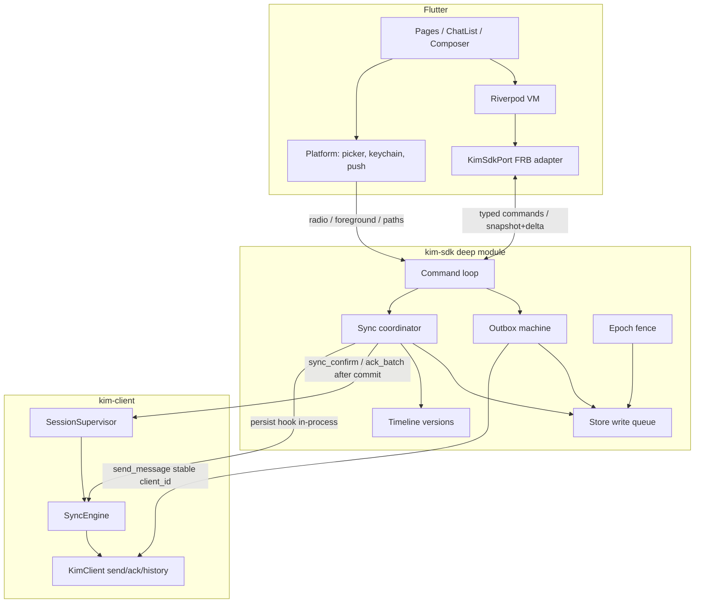
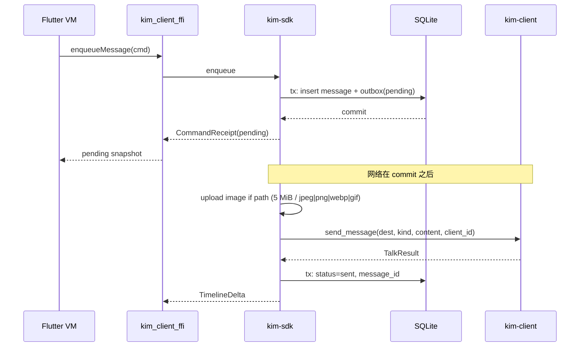
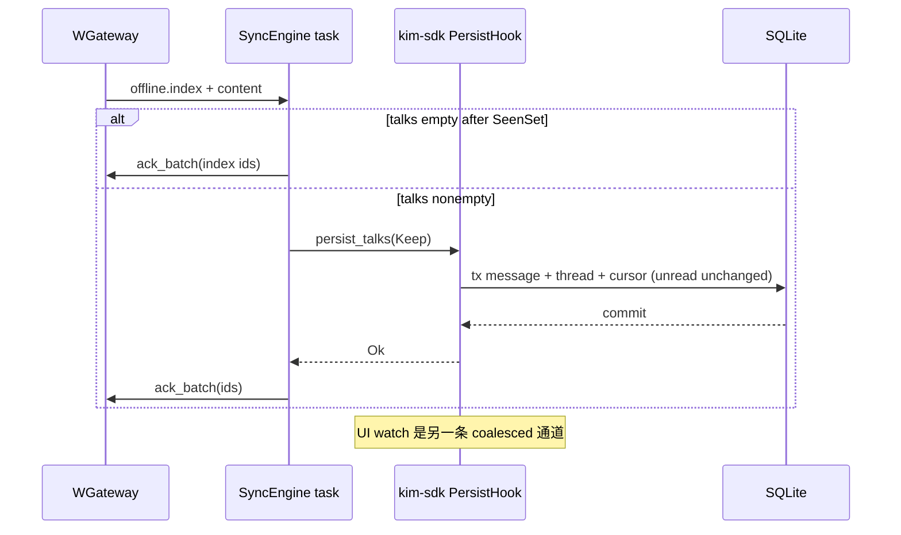
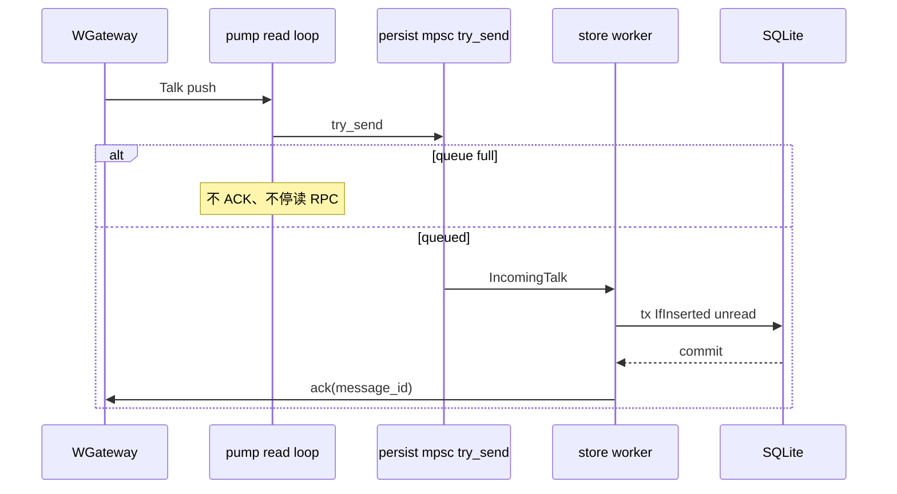

# kim-sdk 所有权下沉：消息生命周期从 Dart 迁入 Rust

| 字段 | 值 |
|---|---|
| 状态 | Draft |
| 作者 | — |
| 日期 | 2026-09-12 |
| 对照代码 | HEAD。行号以标识符为准；下文引用均已对当前树核验。 |
| 父规格 | [docs/impl/06-mobile-client-maturity.md](docs/impl/06-mobile-client-maturity.md)（本文件**推翻**其中若干已拍板决策）；[docs/mobile-client.md](docs/mobile-client.md)（已落地形状）；[docs/impl/next-stage.md](docs/impl/next-stage.md)（客户端轨边界） |
| 已拍板方向 | 在 `kim-client` 之上新增 workspace crate **`kim-sdk`**（名称锁定，不是 `kim-mobile-core`）。单 crate、模块化。SQLite 默认 sqlx 0.8 sqlite-only。本切片不加 drafts 表。Flutter 退回展示壳 + 平台适配。Rust 是本地业务状态的唯一写入者。 |

---

## Overview

`docs/mobile-client.md` 写「`kim-client` 是 TDLib 形，Flutter 只是壳」。HEAD 的事实不是这样：消息身份、去重、未读、outbox、sync confirm、错误分类仍散落在 Dart。`ConversationStore`（`sdk/mobile/lib/data/conversation_store.dart`，1410 行）把 SQL、去重、未读、内存缓存、isolate 缠在一起；`OutboxNotifier`（`sdk/mobile/lib/state/outbox.dart`）把上传、发送、重试、落盘和 haptics / Agent 缠在一起；`LinkNotifier._listen`（`link.dart:173`）里对每个事件 `unawaited(_onEvent)`（`link.dart:177`），到达顺序不保证完成顺序；FFI `session_events` 在 `broadcast::RecvError::Lagged` 时只打日志（`sdk/mobile/rust/src/api/client.rs:153`）。消息生命周期跨的 Dart 模块太多，Rust 无法独立保证一致性。

本切片在现有 `kim-client`（协议、连接、重连、`SyncEngine`）之上加一个 **deep module** `crates/kim-sdk`：小接口（命令 + 可展示状态），大实现（store、outbox 状态机、persist-then-ack、未读水位、账号 epoch）。`sdk/mobile/rust`（`kim_client_ffi`）继续做 FRB 薄 adapter，仍不进 workspace。Dart `MessageRepository` 是迁移缝，不是长期业务仓库。验收：不启动 Flutter，只跑 `cargo test -p kim-sdk`，能完成离线发送、断线补拉、重试去重、已读水位推进、进程重启恢复。

客户端轨约束不变：不改 `services/gateway` / `chat` / `royal` / `crates/kim-tcp` 热路径，不改服务端 ACK 模型与开关语义。G-03 漏 Push 补偿是服务端 rollout，本设计不假装关上它。

---

## Background & Motivation

### 文档声称 vs HEAD 事实

| 文档 | 声称 | HEAD |
|---|---|---|
| `docs/mobile-client.md` | `kim-client` TDLib 形；Flutter 是壳 | Dart 仍拥有 `support/kim-cache.db`（`package:sqlite3`）、outbox、ConversationStore |
| `06-mobile-client-maturity.md` Decision 2 | persist-then-ACK：Rust emit 页 → Dart 写 SQLite → Dart `sync_confirm` → Rust ACK | 仍如此。`SyncEngine::run`（`crates/kim-client/src/sync.rs:148`）emit `SessionEvent::SyncPage` 后 `wait_confirm`；Dart `_onSyncPage`（`link.dart:323`）`applySync` 后再 `syncConfirm`。Live `Talk` 由 Dart `_onTalk` 落盘后再 `ack()`（`link.dart:371`） |
| `06` Decision 4 | **明确拒绝** outbox 进 Rust：「SQLite 已在 Dart；UI 状态与 Rust 队列对账更复杂」 | Dart `OutboxNotifier.enqueue` 落盘后 `_pump`；`client_id` = 消息 `key`（UUID） |
| `06` Architectural Notes | 「本地库留 Dart」；`conversation_store` 接口是未来迁移面 | `MessageRepository`（`message_repository.dart:1`，「Single write seam」）已经是可搬的缝，但写入实现仍在 Dart |

### 已核验的一致性缺口

这些是代码事实。它们是否已经在生产打出故障，仍要用故障注入测试证明，不在本文件里断言「线上已丢消息」。

1. **业务规则、存储、运行时耦合。** `ConversationStore` 1410 行：schema 迁移、`applyMessages` 事务、未读策略、isolate 消息循环、内存 `_msgCache`。Rust 无法在无 Flutter 的情况下保证「去重 + 未读 + 游标」同事务。

2. **发送路径依赖页面与平台。** `OutboxNotifier._sendOne`（`outbox.dart:195`）在同一函数里：读本地文件字节、走 `KimMediaPort.uploadImage`、`sendMessage`、`_persist`、`KimHaptics`、条件触发 `chatAgentProvider.enqueueTurn`。发送能否完成取决于 Riverpod `ref.mounted` 和当前账号。

3. **事件到达顺序 ≠ 异步完成顺序。** `LinkNotifier._listen`（`link.dart:173`）在 listen 回调里 `unawaited(_onEvent)`（`link.dart:177`）：

```dart
_events = client.sessionEvents().listen(
  (event) => unawaited(_onEvent(event, gen)),
  ...
);
```

`_onEvent` 对 `syncPage` / `talk` 会 `await` 落盘。两个事件可以交错完成。`_onSyncPage` 在 `await applySync` 之后只检查 `ref.mounted`，**不再核对 `gen == _sessionGen`**。

4. **账号切换后重读当前账号。** `OutboxNotifier._persist`（`outbox.dart:335`）每次 `ref.read(sessionProvider).account`。`_sendOne` 在 `await _upload` / `await sendMessage` 之后若账号已切，失败/成功行可能写入新账号。`_sessionGen` 只围栏了 link 事件的入口，没有围栏 outbox。

5. **`broadcast` + Lagged 不是可靠投递。** `SessionSupervisor` 事件通道容量 `EVENTS_CAP = 64`（`supervisor.rs:15`）。FFI（`client.rs:153`）`Lagged(skipped)` 只 `tracing::warn`，该点没有补偿、没有 rebuild。慢消费者会丢 `SyncPage` / `Talk`。`SyncEngine` 在 `events.send(SyncPage)` 失败时会 `return Err`（`sync.rs:183`），但 **Lagged 是接收端错误，send 仍然成功**——引擎会以为页已交付，等 `sync_confirm`，而 Dart 从未见过这一页。

6. **历史 prune 会删未完成发送。** `_pruneThread`（`conversation_store.dart:880`）每个会话保留 `maxMessages = 400`，按 `at DESC, key DESC`，**删除条件不排除 `status IN ('sending','failed')`**。旧的未完成发送行会被缓存清理吃掉，重启无法恢复。`loadPending` 本身按 status 过滤（`conversation_store.dart:971`），所以「能 load 到 pending」并不等于「prune 不会删」。现有 `conversation_store_test.dart` 覆盖 upsert / pending 过滤 / message_id 折叠，**没有 prune 保 pending 的用例**。

7. **错误靠字符串包含。** `isPermanentClientError` / `mapTalkError`（`sdk/mobile/lib/core/errors.dart:6`）匹配 `'401'`、`'timeout'`、`'status 109'`、中文文案。FFI 几乎全部 `map_err(|e| e.to_string())`。文案或 `Display` 一变，重试/门禁行为就变。`kim-client::ClientError` 已是 typed enum（`NotConnected`、`Status(i32)`、`Unauthorized`…），到 FFI 被压扁成 `String`。

8. **`KimSessionEvent` 是胖通用结构。** `client.rs:51`：`kind: String` + 一堆字段；`SyncPage` 的 talks 塞进 `body` 的 JSON（`map_event` 432–438 行），`TypingUpdated.active` 复用 `page_pending`，`ProfileUpdated.avatar` 复用 `extra`。类型谎言，跨语言契约不稳定。

### 为什么 06 Decision 4 的理由不再成立

当时拒绝 outbox 进 Rust 的两条理由：

- 「SQLite 已在 Dart」——这是阶段选择，不是物理约束。把库留在 Dart，就被迫把去重、未读、prune、outbox 生命周期写成 Dart 事实；Rust 只能 emit 再等 confirm，confirm 又依赖 UI isolate 活着。
- 「UI 状态（failed/retry 按钮）与 Rust 队列对账更复杂」——对账复杂，是因为 **Dart 和 Rust 各持一份发送状态**。唯一写入者之后，Flutter 只渲染 snapshot，没有第二份发送状态可对。

消息生命周期已经证明：跨语言往返比「UI 按钮和 Rust 队列」更贵。prune 误删、Lagged 丢页、账号重读，都是这条缝上的税。

---

## Goals & Non-Goals

### Goals

1. Rust 成为本地业务状态的**唯一写入者**：消息、Outbox、会话摘要、未读水位、sync 游标。
2. `enqueueMessage` 成功 ⇒ 消息与发送任务已在**同一事务**落盘；随后 UI 显示 pending；网络 ACK 后变为 sent；重试保持同一 `client_id`，依赖服务端 `(app, sender, client_id)` 幂等（见 `docs/control-layer-chat.md`）。
3. 收消息：Rust 在事务内更新消息 / 会话摘要 / 适用的 sync 进度；**commit 之后**才协议 ACK。UI 是否订阅不影响这条路径。Live 重放不得二次增加未读；SyncPage **Keep**，不以 insert 计数。
4. 可靠处理与 UI 通知分离。消息先走可靠路径；UI 通知可合并；丢通知后 UI 可从 snapshot rebuild。
5. 账号有独立运行时寿命。命令、异步任务、事件绑定 `account_id + session_epoch`。切换账号取消旧任务；旧结果不得写入新账号。
6. 持久保留策略与内存窗口分离。UI 可只持几百条；pending 发送任务独立持久化直到完成、取消、或用户明确处理。清历史缓存不得删 Outbox。
7. 验收：无 Flutter，`cargo test -p kim-sdk` 覆盖离线发送、断线补拉、重试去重、已读水位、进程重启恢复。
8. FFI 暴露业务操作与可展示状态，typed 命令 / 回执 / 时间线 snapshot+delta / 错误。继续用 FRB 2.13。

### Non-Goals

- **不改服务端 ACK 模型**、不改 `KIM_PENDING_RECEIPT` 开关语义、不改 gateway / chat / royal / kim-tcp 热路径。
- **不关 G-03。** 漏 Push 补偿是服务端 pending-receipt rollout。客户端 persist-then-ack 只保证「本机已落盘才 ACK」；对端没推到仍靠服务端 index/content。
- **不吞 G-13。** 设备凭证客户端持久化是客户端轨另一项，本切片只声明关系：sync/ack 不假设 `target_id` 从 jti 迁走。
- **不重写 Web SDK。**
- **不把 `kim-sdk` 拆成一堆 crate**（store/outbox/sync 各自独立包）。
- **不重写 ChatList / 会话列表视觉。** ChatPage 可按测量拆订阅；列表组件本身不动。
- **不宣称未测量的加速倍数。** 60Hz 16.7ms / 120Hz 8.3ms 是预算，首屏查询、发送受理、sync 吞吐、内存峰值是**要建立的基线**。
- **不在本切片把 Agent 的权限 UI、卡片、设置页搬进 Rust。** 编排（队列、去重、session、catch-up）后置到 Phase 5；PR 1 不依赖 `kim-agent-host` / goose。
- **不把 JWT 放进 Upgrade URL，不改 Conn 实现。**
- **本切片不落地撤回协议、复合消息 type=5、Telegram album。** 已读回执与 typing 的 **wire 已在 HEAD 存在**（`SessionEvent::ReceiptRead` / `TypingUpdated`），本切片保留，不回退到 06「协议未定」的 Non-Goal。

---

## Key Decisions

每一条都写清：保留 06 的哪条、推翻 06 的哪条、为什么现在能翻。

### D1. 新增 `crates/kim-sdk`，坐在 `kim-client` 之上（保留 06 的协议层切分）

`kim-client` 继续拥有：WSS Conn、login、`send_message(dest, kind, content, client_id)`、`SessionSupervisor` 重连退避、`SyncEngine` 的 index/content 循环、`ack_batch`。**不把 SQLite 塞进 `kim-client`。** `kim-sdk` 拥有：store、outbox 状态机、未读、游标、persist-then-ack 的**本地**半边、typed 命令。

理由：`kim-client` 已被 CLI demo 与测试当协议客户端用。把 DB 塞进去会让无 UI 的协议测试背负 schema。deep module 的边界是「业务一致性」，不是「所有 Rust 都进一个 crate」。

### D2. 推翻 06 Decision 2 的跨语言 persist-then-ACK；ACK 模型本身不改

06 Decision 2：**Rust emit 页 → Dart 写 SQLite → Dart `sync_confirm` → Rust ACK**。拒绝「Rust 拿到即 ACK」。

本文件：

- **保留**「落盘成功才 ACK」和「崩溃窗口靠未 ACK 重拉 + `message_id` 去重」。
- **推翻**「落盘在 Dart、confirm 闸门跨 FFI」。新路径：`SessionSupervisor::with_persist` 安装 hook；commit 之后 SyncEngine `ack_batch`、live 由 store worker `ack`。无 hook 时仍 ConfirmGate。UI 订阅与否无关。
- **不改**服务端 ACK：仍是 `message_ids` 集合（`ack_batch`，`sync.rs:204`），不是 Snowflake 高水位。G-03 仍开。

06 同期拒绝「全量本地库搬 Rust——本阶段不做」。该拒绝被本文件明确终止。迁移面就是当时预留的 store 接口，落地标识符是 `MessageRepository`，不是再发明一层。

### D3. 推翻 06 Decision 4：Outbox 进入 Rust

06 Decision 4 原文：「拒绝项：outbox 放 Rust——本地 UI 状态（failed/retry 按钮）与 Rust 队列对账复杂度更高；SQLite 已在 Dart。」

**反转。** 理由见上节。Flutter 的 retry 按钮发 `cancelSend` / `enqueueMessage`（同一 `client_id`）命令，不持发送状态机。`client_id` 稳定从「Dart outbox 持有」改为「`kim-sdk` outbox 持有」；与服务端 identical `clientId` 重放对齐（`docs/control-layer-chat.md`、G-14）不变。

06 Architectural Notes「G-14 收口：`client_id` 稳定由 Dart outbox 持有」同步作废，改为由 `kim-sdk` 持有。

### D4. 推翻 06「Dart 读写本地库」：Rust 是唯一 writer

06 分层图把 `ConversationStore(SQLite)` 画在 Dart。本文件：Dart 可以保留**不可变**展示快照（当前页消息、会话 tile），但不得再独立推导发送状态和未读。删除测试：若删掉 Dart `ConversationStore` / `OutboxNotifier` 的业务逻辑，那份复杂度必须在 `kim-sdk` 内重现，而不是散进 ChatPage。

### D5. 可靠日志 + 带版本的 UI watch，取代把 `broadcast` 当可靠投递

`tokio::sync::broadcast`（容量 64）保留给 kim-client 内部 / 诊断，**不再作为 Dart 的可靠 inbox**。同步路径：SyncEngine 在自己的 task 上 await PersistHook。Live Talk：`try_send` 到 store worker，满则不 ACK、**不停 Conn 读循环**。UI timeline：热窗口 snapshot + versioned delta（watch 可落后后 Resync）。UI session：**有界 mpsc，每条 Kickout/token/friend 都交付**，不是 `watch`。

### D6. 账号 `session_epoch` 围栏所有写入

每个 `KimSdk` 运行时持有 `account_id + AtomicU64 epoch + CancellationToken`。spawn 点先拷贝 `epoch` 与 `cancel.child_token()`。`switch_account` 复用 url/ua。写库前比对 epoch。禁止「await 回来再 `read` 当前账号」。

### D7. Outbox 独立表；历史 prune 不得碰它

短期（PR 1，尚无 `kim-sdk`）：Dart `_pruneThread` 排除 `status IN ('sending','failed')`。长期：`outbox` 表与 `messages` 表分离。UI 窗口 / 历史缓存删除只打 `messages`。这是约束 6 的数据模型表达。

### D8. 单 crate、内部模块；FFI crate 仍在 workspace 外；名称锁定 `kim-sdk`

crate 名 **已拍板：`kim-sdk`**，不是 `kim-mobile-core`。`crates/kim-sdk` 进 workspace → `cargo test -p kim-sdk`、clippy 与 `unsafe_code = deny` 覆盖到业务核心。`sdk/mobile/rust`（`kim_client_ffi`）仍在 workspace 外（FRB 生成代码含 `unsafe`）。`kim-sdk` **不依赖** `flutter_rust_bridge`。

不拆 `kim-sdk-store` / `kim-sdk-outbox` / `kim-sdk-sync`：它们共享写队列、epoch、同一 SQLite 连接。拆 crate 会把内部不变式变成公共 API，leverage 为负。现在这个仓库的客户端轨需要的是一个能测的 deep module，不是一张 crate 图。

### D9. Typed FFI 错误；Rust 决定是否重试

推翻 `errors.dart` 的 `toString().contains`。`SdkError` 在 `kim-sdk` 定义，FFI 原样（或 1:1 DTO）抛到 Dart。Flutter 只做文案映射。`ClientError::Status(109)` 在 sdk 边界变成 `SdkError::NotFriends { dest }`，而不是 `"status 109"`。

### D10. 媒体：仅图片走路径/句柄过 FFI

HEAD：`_upload` 只对 `KimImageContent` `readAsBytes`（5 MiB，jpeg/png/webp/gif）。新路径：Dart 交 `MediaRef.path`；Rust `reqwest` 流式上传同一 Worker。视频保持 HEAD 行为（不经 Worker）。无 `Voice` FFI 变体。图片上传并发与会话发送队列分开。

### D11. Agent 分两拍；PR 1 不依赖 goose；中间不得断 bot 回复

`kim-agent-host` 已存在。default features 不依赖它。编排迁 Phase 5 / PR 12。PR 8–11 Dart 必须继续在 Sent-to-owned-bot 时调 `ChatAgent.enqueueTurn`。

### D12. 先修一致性，再迁库；PR 1 不需要 `kim-sdk` 存在

落地顺序见 PR Plan。Phase 1 单独上架 prune + 串行事件 + 围栏测试。

### D13. 未读按路径分策，禁止 SyncPage IfInserted

Live = IfInserted；Sync/Own = Keep；会话未读权威来自 `inbox.list` + `_mergedUnread` 的规则 2–3（本地已读赢，否则用服务端 unread）。**不**搬 viewing→0。正在看只通过随后的 `ReadMarker`。PersistHook 必须带 `UnreadPolicy`。详见 Data Model。

### D14. FFI 与 `kim-sdk` 分型；一个 handle，协议与 store 可分离

`kim-sdk` 零 FRB 类型。`KimSdkHandle` 是唯一 opaque FFI 对象，**始终**为协议而构造（对齐今日 `KimApi`）。`attach_store(db)` 仅 runtime flag 开时调用；flag 关不得打开 `kim-cache.db`。`SdkErrorDto` 只作 Result 错误。`subscribe_session` 是有界 mpsc（每条离散事件都交付），不是 `watch`。

### D15. SQLite 绑定默认 sqlx 0.8 sqlite-only

**已拍板。** `crates/kim-sdk/Cargo.toml`：

```toml
sqlx = { version = "0.8", default-features = false, features = ["runtime-tokio", "sqlite"] }
```

禁止 `sqlx.workspace = true`（根 workspace 会把 postgres+macros+tls 打进 App SO）。禁止 `macros` / `migrate` / `postgres`。手写 `migrate.rs`。PR 3 CI：`cargo tree -p kim-sdk -e features` 不得出现 postgres。若 iOS/Android 双链 `libsqlite3`，PR 3 **可以**改 rusqlite（同一 schema / 写队列）——这是文档化逃生口，不是默认。默认是 sqlx sqlite-only。

### D16. 草稿不在本切片

**已拍板。** PR 8 **不加** `drafts` 表。HEAD composer 草稿只在内存。跨进程恢复草稿是后续产品 PR，不挡本切片。

### 相对 06 的保留项（不推翻）

| 06 决策 | 本文件 |
|---|---|
| Decision 1 同步走长连接，不走 Royal HTTP | 保留 |
| Decision 3 重连监督在 Rust | 保留；`notify_radio_up` / `notify_foreground` 仍由 Platform → SDK |
| 混合内容 = N 条独立消息，不改协议 | 保留 |
| 自研 reverse ChatList | 保留，本切片不重写 |
| 对账以 `message_id` 为准；本地 UUID 作 pending `client_id` | 保留；`incomingMessageKey` / `preferKey`（`message_identity.dart`）逻辑迁入 `kim-sdk` |
| 启动即 `runApp`，bootstrap 异步 | 保留 |
| `send_message(dest, kind, content, client_id)` 不改签名 | 保留 |

---

## Proposed Design

### 分层与所有权

```
UI (Flutter pages: layout, animation, keyboard, scroll, a11y)
  -> VM (Riverpod presentation state + interaction controllers)
  -> API (Dart SDK interface + FRB adapter)     ← 薄 adapter
  <-> SDK (Rust kim-sdk: 业务规则, Outbox, sync, conversation)
        -> DB (Rust storage: SQLite, tx, migrations, queries)
        -> CLIENT (现有 kim-client: 协议, 连接, 重连)
        -> AGENT (现有 kim-agent-host, Phase 5 才接线)
UI -> PLATFORM (相册, 权限, Keychain, push, 生命周期)
PLATFORM -> SDK (lifecycle + capability results)
```



**所有权表**

| 层 | 拥有 | 不拥有 |
|---|---|---|
| Flutter | 布局、动画、主题、i18n；IME composing / cursor / focus；滚动锚、选择、对话框；页面 loading/error 展示；表单即时校验提示；「哪些气泡进入了可见区域」从而提交 `markRead` | 发送状态机、未读水位、去重、DB、ACK 时序 |
| `kim-sdk` | 消息身份、去重、排序规则；发送状态机、重试、取消；数据库、sync 游标、未读；鉴权会话在端上的寿命；媒体上传调度；权威客户端校验；Agent 编排（Phase 5） | 像素、键盘、滚动 |
| Platform | 相册/相机/文件权限；Keychain/Keystore；push 与后台任务入口；系统生命周期与网络变化；系统编解码 | 业务状态 |
| `kim-client` | 协议、连接、重连、编码、`write_wait` | SQLite、未读 |

例：Flutter 决定哪些消息真正进入可见区并提交 `markRead`；Rust 决定水位如何前进、如何落盘、是否发回执。

按键与逐帧滚动留在 Flutter。发消息、mark-read、删会话过缝。草稿表不在本切片（D16）。

### `kim-sdk` 模块（一个 crate）

```
crates/kim-sdk/
  Cargo.toml
  src/
    lib.rs           // KimSdk, 小的公开 API
    error.rs         // SdkError
    ids.rs           // AccountId, ClientMessageId, SessionEpoch, DestId
    command.rs       // enqueue / cancel / mark_read / load_older
    session.rs       // start/stop/switch, epoch, CancellationToken
    store/
      mod.rs         // 写队列、短事务、读并发上限
      schema.rs
      migrate.rs
      messages.rs
      threads.rs
      outbox.rs      // outbox 表
      cursors.rs
      watermarks.rs
    outbox/
      mod.rs         // 状态机：Accepted → Uploading → Sending → Sent | Failed
      pump.rs
    sync/
      mod.rs         // PersistHook: Talk/SyncPage → tx → ack
    timeline.rs      // snapshot / delta / version
    media.rs         // 路径上传调度
    agent.rs         // trait AgentPort + Noop
    proto.rs         // trait ProtocolClient（定义+KimClient impl 都在 kim-sdk，不改 kim-client）
```

公开 API 控制在 `KimSdk` 十来个方法 + 一组 DTO。内部模块互相 `pub(crate)`。这就是深度：调用方看不到写队列和状态机。

### 运行时与写队列

SQLx 是访问手段，原子性仍由我们设计。

- **单一写任务**：所有写经 `mpsc` 进 store worker。避免 SQLite writer 锁上的重试风暴。
- **短事务**：`BEGIN IMMEDIATE` → 变更消息 + outbox + thread + watermark + cursor → `COMMIT`。**禁止**事务跨网络等待（上传、`send_message`、`ack_batch` 都在 commit 之后）。
- **读并发有限**：WAL；读走独立连接或 `SqlitePool` 读侧。UI 分页读不得堵写。
- **会话串行、跨会话有限并发**：同一 `dest` 的 merge / 发送排队；不同 `dest` 上限（建议 4，可配）。图片上传池独立（建议 2）。图片上传不得堵住其他会话的文本发送。
- **CPU**：编解码、JSON 合并进 `spawn_blocking` 有界池，不上 Tokio worker 忙等。
- **后台**：Rust 线程仍受 iOS/Android 后台配额限制。后台可靠投递 = push + 系统允许的 background task + 回前台 catch-up。本切片不发明常驻后台 sync。



### persist-then-ack（收路径，全部在 Rust）

HEAD 两条收路径（未读策略**不同**，见 Data Model「未读」）：

| 路径 | 今日 | 目标 |
|---|---|---|
| 离线页 | `SyncEngine` emit `SyncPage` → Dart `applySync`（`UnreadPolicy.keep`）→ `syncConfirm(page_id)` → `ack_batch(ids)`。未读来自随后的 `inbox.list` + `_mergedUnread`，**不**因 sync 插入 +1 | `kim-sdk` PersistHook，`policy = Keep`。commit 后 `ack_batch`。空 talks 仍 `ack_batch(index ids)`（HEAD `sync.rs:182–204`：`new_count == 0` 也 ack，避免 offline.index 死循环） |
| 在线 Push | `dispatch_event` emit `Talk`（`machine.rs:295`）→ Dart `applyLive`（`ifInserted`）→ `ack(message_id)`（`link.dart:371–426`） | store worker `policy = IfInserted`，commit 后再 `ProtocolClient::ack`。UI 没订阅也 ACK |

DB commit 与网络 ACK **不是**一个本地原子事务。崩溃窗口：已 commit 未 ACK → 服务端重放；upsert 按 `message_id`；Keep 路径未读不变；IfInserted 仅 **inserted** 时 +1。已存在行重放：`unreadDelta = 0`。

**一个 PersistHook，两个调用点，都不在 Conn 读循环上。**

```rust
// crates/kim-client — 不依赖 kim-sdk。默认仍是 ConfirmGate。
#[derive(Clone, Copy, Debug)]
pub enum UnreadPolicy {
    Keep,        // applySync / applyOwn
    IfInserted,  // applyLive only
}

pub enum PersistError {
    Busy,
    StorageFull,
    Disk { message: String },
    StaleEpoch,
}

#[async_trait]
pub trait PersistHook: Send + Sync {
    async fn persist_talks(
        &self,
        talks: &[IncomingTalk],
        policy: UnreadPolicy,
    ) -> Result<(), PersistError>;
    /// 无 viewing dest。未读规则见 Data Model（仅 2–3）。
    async fn persist_inbox(&self, items: &[InboxItem]) -> Result<(), PersistError>;
}

impl SessionSupervisor {
    pub fn new(config: ClientConfig) -> Self; // 默认 ConfirmGate = 今日 emit SyncPage + wait_confirm
    pub fn with_persist(self, hook: Arc<dyn PersistHook>) -> Self;
}
```

- 无 hook（CLI demo、`cargo test -p kim-client`）：行为与 HEAD 相同。`ConfirmGate` 保持 `pub(crate)`。**禁止**默认「拿到即 ACK」（06 Decision 2 已拒绝）。
- 有 hook（`kim-sdk` 安装）：SyncEngine **不再**等 Dart `sync_confirm`。`kim-client` **不**依赖 `kim-sdk`。
- Hook 返回 `PersistError`，**不是** `ClientError`。`SQLITE_FULL` → `StorageFull`：该页不 ACK、不把 supervisor 打进重连风暴（`is_fatal_auth` 与 `ClientError::Other` 无关，但仍会 `SessionEnd::Drop` 若从 `run()` 冒 `ClientError`——因此 hook 失败必须在 SyncEngine 内转成 `SyncFailed` 事件 + 停翻页，而不是 `ClientError::other`）。

**调用点 1 — SyncEngine（已在独立 task，`serve` 里与 dispatch_loop 并行）：**

1. `offline_index` / `offline_content` 如今日。
2. `persist_talks(talks, Keep)`。Keep = 不改 `threads.unread`。
3. Ok → `ack_batch(&ids)`。`talks` 为空（SeenSet 滤光）时 **跳过 persist，仍 `ack_batch(&ids)`**。
4. `persist_inbox` 在 `inbox_list` 之后，按「未读」节规则 2–3 合并（无 viewing 参数）。

**调用点 2 — Live Talk（禁止反压 pump）：**

`dispatch_event`（`machine.rs:293`）跑在 serve/read 循环上，与 `write_wait`（`send_message` / `history` / `inbox_list`）共用同一 reader。**满队列时不得停读。** 停读会拖死 RPC，再触发 `read_idle`（heartbeat × 3）/ 写超时，用链路死亡替换 Lagged——更差。

规定：

1. `dispatch_event` 对 `Event::Talk`：`persist_tx.try_send(talk)`。
2. 成功：不在此处 ACK、不在此处 `SeenSet.observe`（persist 成功后再记 seen，避免 try_send 失败却被当成已见，同会话 offline 补拉也被跳过）。
3. 失败（满）：**不 ACK、不 persist、不阻塞**。该条等下次 sync / 服务端重推。继续读控制帧与 RPC 响应。
4. store worker 从队列取 talk → `persist_talks(&[talk], IfInserted)` → commit → `ProtocolClient::ack(message_id)`。

ACK 语义只有一条：persist commit 之后。调用者按路径分开：SyncEngine 调 `ack_batch`；live 由 store worker 调 `ack`。没有第三条。





### 事件可靠性（替换 Lagged 点）

今日故障点：`client.rs:153` Lagged 只打日志。

目标模式：

1. **命令入口**：`mpsc`（有界，满则 `SdkError::Busy`，Flutter 可重试命令，命令是幂等的）。
2. **可靠入站**：见上节。SyncEngine 在自己的 task 上 await persist；live Talk `try_send`，满则不 ACK、**不停读循环**。
3. **UI timeline**：`tokio::sync::watch`（或带版本的 mpsc）。订阅时先 Snapshot（热窗口），之后 Delta；版本不连续则 `Resync`。落后可以重建。
4. **UI session 离散事件**：有界 `mpsc`（或 broadcast 且容量足够、**不允许**只保留最新值）。`Kickout` / `AuthExpired` / `TokenRenew` / `FriendRequest` / `FriendAccepted` 没有 snapshot 可重建，漏一条就是漏一条。FFI `StreamSink` 读这条 mpsc，不是 `watch`。Link/inbox 最新快照可另用 `subscribe_session_snapshot`（watch）。`broadcast` 不再越过 FFI。测试：在消费者 poll 之前依次 enqueue Kickout 再 Inbox，Kickout 必须仍到达。

慢消费者：UI 合并通知（16ms 或一帧预算内 batch）。FRB/Dart 侧 pending 也要有界：`StreamSink` 失败 → Dart 端标记 dirty → 下次 `watchTimeline` 重拉 snapshot。**丢失的是通知，不是消息。**

### 账号 epoch

`KimSdk` 持有 `Arc<Inner>`。`switch_account` 不需要 `&mut self` 换 token。

规范（不要按旧 snippet 拷 `self.cancel = CancellationToken::new()`）：

1. `Inner` 里 `epoch: AtomicU64`、`cancel: Mutex<CancellationToken>`、`session: Mutex<StartSession>`（`url` / `user_agent` / `account`）。
2. 每个 spawn 点：**先** `let epoch = current; let child = cancel.child_token();` 再启动任务。任务只认这对拷贝。
3. `switch_account`：`old.cancel(); epoch.fetch_add(1);` 放入新 `CancellationToken`；复用已存的 `url` / `user_agent`，只换 `account` + JWT。若要换网关 URL，走 `stop_session` + `start_session(StartSession { url, token, user_agent, account })`。
4. Store worker 每条写带 `epoch`。不匹配 → 丢弃，不写。

HEAD 对标：`LinkNotifier._sessionGen`（`link.dart:34`）只围栏了事件入口；本设计把围栏下沉到唯一 writer。

### 媒体

HEAD：`_upload` 只对 `KimImageContent` 跑（`outbox.dart:199–215`），上限 5 MiB，MIME jpeg/png/webp/gif（`KimMediaClient` / `docs/media.md`）。`KimMsgKind` 是 `text | image | video | agentCard`，**没有 voice**（`models.dart:293`）。视频走本地 path 当 body 直发，不经 Worker。

本切片 **只把图片上传**迁到 Rust 路径流式 POST，规则与今日 Worker 相同。不把 video/voice 送进 `upload.kim.ainexc.com`（会 415 / `PayloadTooLarge`，且改 Worker 超出客户端轨）。

```rust
pub struct MediaRef {
    pub path: String,
    pub mime: String,
    pub width: i32,
    pub height: i32,
    pub byte_size: i64,
}
```

Dart picker 继续只选文件。`OutgoingPayload::Image` 带 `MediaRef`，不带 `Vec<u8>`。`kim-sdk::media` 用 `reqwest`（`rustls-tls`，**不要** `sqlx.workspace` 那套 postgres feature）流式 POST。失败：`PayloadTooLarge` / `UnsupportedMedia` 不重试。头像上传留 Dart `KimMediaPort`。

### Agent（现在 vs 以后）

```rust
#[async_trait]
pub trait AgentPort: Send + Sync {
    async fn enqueue_turn(&self, dest: &str, text: &str, in_reply_to: i64, epoch: SessionEpoch);
    async fn catch_up(&self, dests: &[String], epoch: SessionEpoch);
}
pub struct NoopAgent;
```

`KimSdk::builder().agent(Arc<dyn AgentPort>)`。PR 1–11 不传、default features 不依赖 `kim-agent-host`。

**PR 8（outbox 迁 Rust）到 PR 12（Agent 编排）之间不得让 bot 回复静默消失。** Dart 保留适配器：timeline 上出现发往 owned registered bot 的 `SendStatus::Sent`（或 live echo，对齐 `_sendOne` `outbox.dart:235–243` 与 `_onTalk` `onIncomingEcho` `link.dart:402–419`）时，仍调现有 `ChatAgent.enqueueTurn`。PR 12 删除该适配器。

### 与 `kim-client` 的接口：几乎不改热路径

继续调用：

```rust
client.send_message(dest, kind, content, client_id) // client.rs:174
client.ack_batch(ids)                               // client.rs:657
client.history(dest, kind, before_id, limit)
client.inbox_list(limit)
client.mark_read(dest, kind, message_id)
supervisor.notify_radio_up / notify_foreground
```

`SessionSupervisor::with_persist(hook)` 见上。无 hook 时 `sync_confirm` 仍给测试/demo。有 hook 时 Dart 不再调用 `sync_confirm` / `ack`。不改 `encode_ack_batch`，不改 wire。`trait ProtocolClient` 定义与 `KimClient` impl **都在 `kim-sdk/src/proto.rs`**（orphan rule），`crates/kim-client/src/client.rs` 本切片不为此改签名。

---

## API / Interface Changes

两 crate 冻死，禁止把 FRB 类型写进 `kim-sdk`：

| Crate | 角色 | 禁止 |
|---|---|---|
| `crates/kim-sdk` | 业务 deep module。timeline 用 `watch::Receiver`；session 离散事件用有界 mpsc。`protocol_only()` 不打开 DB。错误是 `SdkError` | `flutter_rust_bridge`、`StreamSink`、FRB opaque 属性 |
| `sdk/mobile/rust`（`kim_client_ffi`） | 唯一 FRB 缝。`KimSdkHandle` 持 `Arc<kim_sdk::KimSdk>`。`StreamSink` 只出现在这里。`SdkErrorDto` **只**作 Result 错误 | 第二份 `SessionSupervisor`；flag 关时打开 `kim-cache.db` |

FRB 2.13：tagged enum、struct、`String`、`i64`、`Vec`、`Option`、`bool`。不用 `HashMap` 当主类型、不用 `PathBuf`、不用 `dyn Trait` 过 FFI。普通方法 `pub async fn`，新增路径禁止 `rt().block_on`。`attach_store` 是 `async`：迁移/导入在 `spawn_blocking`。

**一个 opaque FFI handle，协议与 store 分离。**

- `KimSdkHandle` **始终**构造，职责对齐今日 `KimApi`：拥有 `SessionSupervisor`，提供 `start_session` / `send_message` / `ack` / `history` / 社交。生产默认 `rustStore=off` 时必须仍能连上——否则 PR 5 删掉 `KimApi.start` 后零 supervisor。
- `attach_store(db_path)` **仅** flag 开时调用。flag 关：不打开 `kim-cache.db`，Dart isolate 仍拥有该文件直到 PR 6 切 store。
- `KimApi.start` 在 PR 5 删除，由 `KimSdkHandle.start_session` 取代。不得同时活着两个 supervisor。
- friend/profile/search/room/typing/bot_* 是同一 handle 上的方法（第一轮仍 `Result<String, String>`）。`KimClientPort` / FakeKim 始终一个 port。

### 命令与回执（`kim-sdk`；FFI DTO 1:1 改名 `*Dto`）

```rust
pub struct StartSession {
    pub url: String,
    pub token: String,
    pub user_agent: String,
    pub account: String,
}

pub enum OutgoingPayload {
    Text { body: String },
    Image { media: MediaRef },
    // 视频：与 HEAD 一样不经图片 Worker；body 已是可发送的 URL 或本地 path。
    // 无 Voice：KimMsgKind 无此变体。
    Video { url: String, extra: String },
}

pub struct SendMessageCommand {
    pub dest: String,
    pub kind: i32,                 // INBOX_KIND_USER / GROUP；pump 必须用此值，禁止写死 user
    pub payload: OutgoingPayload,
    pub client_id: Option<String>, // None → sdk 生成；retry 必须 Some(同一 id)
    pub batch_id: Option<String>,
}

pub struct CommandReceipt {
    pub request_id: String,        // Rust 生成 UUID；tracing span 同源
    pub client_id: String,
    pub dest: String,
    pub accepted_at: i64,
    pub send_status: SendStatus,   // 受理成功时一定是 Pending
}

pub enum SendStatus { Pending, Uploading, Sending, Sent, Failed, Cancelled }

pub struct ReadMarker {
    pub dest: String,
    pub kind: i32,
    pub visible_message_id: i64,   // 0 = 只清本地未读
}

pub struct TimelineQuery {
    pub dest: String,
    pub limit: i32,                // 热窗口，默认 50
}

pub struct PageCursor {
    pub dest: String,
    pub before_at: i64,            // 与 HEAD loadMessagesPage 对齐
    pub before_key: String,
    pub limit: i32,
    pub before_id: i64,            // 可选/调试；分页权威是 (at, key)
}

pub struct MessagePage {
    pub dest: String,
    pub messages: Vec<MessageView>,
    pub has_more: bool,
}
```

`kim-sdk`（无 FRB）：

```rust
impl KimSdk {
    /// 协议客户端，不打开 SQLite。测试与 flag 关路径都走它。
    pub fn protocol_only() -> Arc<Self>;
    /// 仅 flag 开 / `cargo test -p kim-sdk` 夹具。内部 = protocol_only + attach_store。
    pub async fn open(db_path: String) -> Result<Arc<Self>, SdkError>;
    pub async fn attach_store(&self, db_path: String) -> Result<(), SdkError>; // spawn_blocking 迁移

    pub async fn start_session(&self, s: StartSession) -> Result<(), SdkError>;
    pub async fn stop_session(&self) -> Result<(), SdkError>;
    pub async fn switch_account(&self, account: String, token: String) -> Result<(), SdkError>;

    pub async fn enqueue_message(&self, cmd: SendMessageCommand) -> Result<CommandReceipt, SdkError>;
    pub async fn cancel_send(&self, id: String) -> Result<(), SdkError>;
    pub async fn retry_send(&self, id: String) -> Result<CommandReceipt, SdkError>;
    pub async fn delete_thread(&self, dest: String) -> Result<(), SdkError>;

    pub async fn mark_read(&self, marker: ReadMarker) -> Result<(), SdkError>;
    pub async fn load_older(&self, cursor: PageCursor) -> Result<MessagePage, SdkError>;

    pub fn subscribe_timeline(&self, query: TimelineQuery)
        -> tokio::sync::watch::Receiver<TimelineUpdate>;
    /// 离散事件：有界 mpsc，**每条都交付**（Kickout / TokenRenew / Friend* 不可被 watch 合并掉）。
    pub fn subscribe_session(&self) -> tokio::sync::mpsc::Receiver<SessionUpdate>;
    /// 可选：最新 Link + inbox 快照，允许落后。
    pub fn subscribe_session_snapshot(&self) -> tokio::sync::watch::Receiver<SessionSnapshot>;

    pub fn notify_radio_up(&self) -> Result<(), SdkError>;
    pub fn notify_foreground(&self) -> Result<(), SdkError>;
}
```

`kim_client_ffi`：

```rust
pub struct KimSdkHandle { inner: Arc<kim_sdk::KimSdk> }

impl KimSdkHandle {
    /// 始终可调用。不打开 DB。取代 `KimApi.start`。
    pub fn create() -> Self;
    pub async fn attach_store(&self, db_path: String) -> Result<(), SdkErrorDto>;
    pub async fn start_session(&self, s: StartSessionDto) -> Result<(), SdkErrorDto>;
    pub fn watch_timeline(&self, query: TimelineQueryDto, sink: StreamSink<TimelineUpdateDto>)
        -> Result<(), SdkErrorDto>;
    /// FFI 读 mpsc，不是 watch。
    pub fn watch_session(&self, sink: StreamSink<SessionUpdateDto>) -> Result<(), SdkErrorDto>;
    // 下列方法全部从今日 KimApi 搬到本 handle，见下表
}
```

`enqueue_message` / `load_older` / `delete_thread` 在未 `attach_store` 时返回 `SdkError::InvalidArgument { message: "store not attached" }`。协议方法（`start_session`、`send_message`、`ack`、`history`…）不依赖 store。

`enqueue_message`：**返回 Ok 之前事务已 commit**。`cancel_send`：同一事务把 `outbox` 标 `cancelled`（或删行）并删除对应 `messages` 行；UI 气泡消失。`delete_thread`：同一事务取消该 dest 的 in-flight 上传/发送、删 `outbox` + `messages` + `threads` + watermarks + cursors + timeline_meta。重启后不得再发。不是 ChatList 视觉工作。

### 时间线：热窗口 snapshot + versioned delta

`MessageView` **不**含 `extra` 字段（HEAD `messages` 表无此列；入站 image extra 解析进 width/height 后丢弃，`message_repository.dart:26–41`）。出站 extra 只活在 `outbox.extra`。

```rust
pub struct MessageView {
    pub key: String,
    pub dest: String,
    pub sender: String,
    pub body: String,
    pub local_path: Option<String>,
    pub at: i64,
    pub sys: bool,
    pub kind: i32,                 // 1 text / 2 image / 4 video / agent card 另计；无 3 voice
    pub width: i32,
    pub height: i32,
    pub message_id: i64,
    pub batch_id: Option<String>,
    pub send_status: SendStatus,
}

pub struct TimelineSnapshot {
    pub dest: String,
    pub version: u64,
    pub messages: Vec<MessageView>, // 热窗口：最新 N 条，默认 50，不含已 load_older 的更早页
    pub pending: Vec<MessageView>,  // 该 dest 全部未完成 outbox（可与 messages 重叠 key）
    pub unread: i32,
    pub last_read_message_id: i64,
    pub has_more: bool,
}

pub struct TimelineDelta {
    pub dest: String,
    pub from_version: u64,
    pub to_version: u64,
    pub upserts: Vec<MessageView>,
    pub deleted_keys: Vec<String>,
    pub unread: Option<i32>,
    pub last_read_message_id: Option<i64>,
}

pub enum TimelineUpdate {
    Snapshot { snapshot: TimelineSnapshot },
    Delta { delta: TimelineDelta },
    Resync { dest: String, reason: String },
}
```

规则：

- Snapshot = **热窗口**（最新 N + 该 dest 全部 pending），不是全线程。
- `load_older` 是一次性 RPC，**不**重置 watch、**不**把热窗口扩成全量。
- Resync 只替换热窗口。VM 已用 `load_older` 拿到的更早页必须保留，除非 `deleted_keys` 点名，或 `delete_thread`。
- 分页游标与 HEAD 相同：`(before_at, before_key)`。`before_id` 可选。

Flutter 一次拿一页或一批变更，不要每个气泡一次 FFI。`subscribe_timeline` 每会话一条（Open Questions）。

### 会话级更新

`SdkError` / `SdkErrorDto` 不当 `SessionUpdate` 的字段（FRB 错误类型与值类型不可互换）。

```rust
pub enum LinkStateView {
    Connecting,
    Online,
    Reconnecting { attempt: u32 },
    Offline,
}

pub enum SessionUpdate {
    Link {
        state: LinkStateView,
        last_error: Option<String>, // DropReason / 短码，不是 SdkError
    },
    Inbox { threads: Vec<ThreadView> },
    ThreadUpsert { thread: ThreadView },
    SyncProgress { pulled: u64, catching_up: bool },
    Kickout { channel_id: String },
    AuthExpired { reason: String },
    TokenRenew { token: String, exp: i64 },
    FriendRequest { from: String, nickname: String },
    FriendAccepted { from: String, nickname: String },
    ProfileUpdated { account: String, nickname: String, avatar: String },
    Presence { account: String, status: i32, last_seen: i64 },
    Typing { typer: String, dest: String, kind: i32, active: bool },
    ReceiptRead { reader: String, dest: String, kind: i32, message_id: i64 },
    GroupCreate { group_id: String, members: Vec<String> },
}

pub struct ThreadView {
    pub id: String,
    pub kind: i32,
    pub title: String,
    pub avatar: String,
    pub last_body: String,
    pub last_at: i64,
    pub unread: i32,
}
```

`SyncPage` 不进入 UI 流。`ThreadView.unread` 是权威快照，Flutter 不得 `+1`。胖 `KimSessionEvent` 在 PR 10 生成 typed 流之后仍可并存；**直到 watch 成为 Dart 唯一 inbox 才删除**（PR 11）。

```rust
pub struct SessionSnapshot {
    pub link: LinkStateView,
    pub last_error: Option<String>,
    pub threads: Vec<ThreadView>,
}
```

`subscribe_session` 是 mpsc：漏 Kickout 无法从 snapshot 重建。`subscribe_session_snapshot` 只给 Link/inbox 的最新值。

### 错误

`kim-sdk::SdkError` 给 Rust。FFI 映射为 `SdkErrorDto`（字段同形），**只**用于 `Result<_, SdkErrorDto>`。Dart `switch (SdkErrorDto)` + l10n。删除 `contains('status 109')`。

```rust
pub enum SdkError {
    NotFriends { dest: String },          // 109
    Blocked { dest: String },             // 110
    UserNotFound { dest: String },        // 108
    CannotChatSelf,
    AuthExpired,
    Unauthorized,                         // 105 / HTTP 401
    NotConnected,
    StorageFull,                          // SQLITE_FULL
    SqliteBusy,                           // SQLITE_BUSY / locked；可重试
    Disk { message: String },             // 损坏等；不可当发送重试
    RateLimited { retry_after_ms: i64 },
    PayloadTooLarge { bytes: i64, max: i64 },
    UnsupportedMedia { mime: String },
    Busy { queue: String },
    StaleEpoch { expected: u64, actual: u64 },
    NotFound { what: String },
    InvalidArgument { message: String },
    Protocol { status: i32 },
    Internal { message: String },
}

impl SdkError {
    /// 传输/拥塞。不含磁盘满、协议业务码。
    pub fn retryable(&self) -> bool {
        matches!(
            self,
            Self::NotConnected
                | Self::Busy { .. }
                | Self::SqliteBusy
                | Self::RateLimited { .. }
        )
    }
    /// 发送重试。对齐 Web `isRetryable`：`ServiceUnavailable=3` 或 3xx；永不 99 / 1xx / 111。
    pub fn retryable_send(&self) -> bool {
        if self.retryable() {
            return true;
        }
        match self {
            Self::Protocol { status: 3 } => true,
            Self::Protocol { status } if (300..400).contains(status) => true,
            _ => false,
        }
    }
}
```

`Status(111)`：Failed，不换 `client_id`。`StorageFull` / `Disk`：该页不 ACK，不重试发送。`SqliteBusy`：写队列重试，不算 `Disk`。

### 从今日 `KimApi` 迁出的方法

| 今日 `KimApi`（HEAD `client.rs`） | PR 5 搬到 `KimSdkHandle` | 后续 |
|---|---|---|
| `start` | `create` + `start_session`（**不** open DB） | `KimApi.start` 本 PR 删除 |
| `stop` / `link_state` / `notify_radio_up` / `notify_foreground` | 同名 | |
| `session_events` | 仍在 handle 上（胖结构过渡） | PR 10 并行 `watch_*`；PR 11 删除胖流 |
| `sync_confirm` | 仍在 handle 上（Dart outbox/link 在 PR 7 前需要） | PR 7 后删除 |
| `ack` | 仍在 handle 上 | PR 7 后 live/sync ACK 改 sdk 内部；Dart 不再调 |
| `send_message` | 仍在 handle 上（Dart outbox 用到 PR 8） | PR 8 后业务走 `enqueue_message` |
| `history` / `inbox` / `mark_read` | 仍在 handle 上 | 权威读改 `load_older` / Inbox 更新（flag 开时 store） |
| `friend_request` / `friend_accept` / `friend_reject` / `friend_list` / `friend_incoming` | 同名，第一轮 `Result<String,String>` | |
| `profile` / `update_profile` / `search_users` | 同上 | |
| `room_enter` / `room_leave` / `send_typing` | 同上 | |
| `bot_create` / `bot_delete` / `bot_update` / `bot_reply` / `bot_pending` | 同上 | |

---

## Data Model Changes

### 今日 schema（Dart `ConversationStore._openAndMigrate`，`conversation_store.dart:109`）

无 `user_version` / `schema_version`。迁移手段是 `CREATE TABLE IF NOT EXISTS` + `_ensureColumn`。

```
meta(key TEXT PK, value TEXT)
threads(
  account TEXT, id TEXT, kind TEXT, title TEXT,
  last_body TEXT, last_at INT, unread INT, avatar TEXT,
  PRIMARY KEY (account, id)
)
messages(
  account TEXT, dest TEXT, key TEXT, sender TEXT, body TEXT,
  at INT, sys INT, failed INT, kind TEXT, width INT, height INT,
  message_id INT, batch_id TEXT, status TEXT, local_path TEXT,
  PRIMARY KEY (account, dest, key)
)
UNIQUE INDEX messages_mid_unique ON messages(account, dest, message_id) WHERE message_id != 0
INDEX messages_by_thread_key (account, dest, at DESC, key DESC)
INDEX messages_pending (account, status, at, key)
```

身份规则（迁入 Rust，行为必须一致）：

- 入站 key = `m{messageId}`，否则 `talk-{sendTime}-{sender}`（`incomingMessageKey`）。
- 出站 key = UUID v4 = `client_id`（`isClientKey`）。
- 同一 `message_id` 折叠时 **prefer 本地 UUID 行**（`preferKey`）。

### 目标 schema（Rust 迁移，additive）

`meta` 增加 `schema_version`（整数，从 1 起）。保留现有 `messages` / `threads` 列，便于读旧库。v1 **additive**：

- `messages.thread_kind INTEGER NOT NULL DEFAULT 0`（修 HEAD：`_sendOne` / `loadOlder` 写死 `ThreadKind.user`，`outbox.dart:216–218`、`messages.dart:162–164`；`KimChatMsg` 无 kind。pump 必须读 `thread_kind` / `threads.kind` / 命令 `kind`，禁止再写死 user）
- **不加** `messages.extra`。入站 extra 仍只解析 width/height；出站 extra 只在 `outbox.extra`

```
-- v1（Rust 接管时）
ALTER TABLE messages ADD COLUMN thread_kind INTEGER NOT NULL DEFAULT 0;

outbox(
  account TEXT NOT NULL,
  client_id TEXT NOT NULL,          -- = messages.key for that send
  dest TEXT NOT NULL,
  kind INTEGER NOT NULL,            -- INBOX_KIND_USER/GROUP，从 threads.kind 回填，禁止写死 0
  payload_type INTEGER NOT NULL,    -- 1 text / 2 image / ...
  body TEXT NOT NULL,
  extra TEXT NOT NULL DEFAULT '',
  local_path TEXT NOT NULL DEFAULT '',
  mime TEXT NOT NULL DEFAULT '',
  width INTEGER NOT NULL DEFAULT 0,
  height INTEGER NOT NULL DEFAULT 0,
  byte_size INTEGER NOT NULL DEFAULT 0,
  batch_id TEXT NOT NULL DEFAULT '',
  status TEXT NOT NULL,             -- pending/uploading/sending/sent/failed/cancelled
  attempt INTEGER NOT NULL DEFAULT 0,
  next_attempt_at INTEGER NOT NULL DEFAULT 0,
  message_id INTEGER NOT NULL DEFAULT 0,
  last_error TEXT NOT NULL DEFAULT '',
  created_at INTEGER NOT NULL,
  updated_at INTEGER NOT NULL,
  PRIMARY KEY (account, client_id)
)
INDEX outbox_due ON outbox(account, status, next_attempt_at)

sync_cursors(
  account TEXT NOT NULL,
  name TEXT NOT NULL,               -- 'offline' | 'inbox'
  cursor INTEGER NOT NULL DEFAULT 0,
  updated_at INTEGER NOT NULL,
  PRIMARY KEY (account, name)
)

read_watermarks(
  account TEXT NOT NULL,
  dest TEXT NOT NULL,
  last_read_message_id INTEGER NOT NULL DEFAULT 0,
  last_read_at INTEGER NOT NULL DEFAULT 0,
  PRIMARY KEY (account, dest)
)

timeline_meta(
  account TEXT NOT NULL,
  dest TEXT NOT NULL,
  version INTEGER NOT NULL DEFAULT 0,
  PRIMARY KEY (account, dest)
)
```

Cutover 数据：

```sql
INSERT INTO outbox (account, client_id, dest, kind, payload_type, body, extra,
                    local_path, width, height, batch_id, status, message_id,
                    created_at, updated_at)
SELECT m.account, m.key, m.dest,
       CASE t.kind WHEN 'group' THEN 1 ELSE 0 END,
       CASE m.kind WHEN 'image' THEN 2 WHEN 'video' THEN 4 ELSE 1 END,
       m.body, '', IFNULL(m.local_path,''), m.width, m.height, IFNULL(m.batch_id,''),
       CASE m.status WHEN 'failed' THEN 'failed' ELSE 'pending' END,
       m.message_id, m.at, m.at
FROM messages m
LEFT JOIN threads t ON t.account = m.account AND t.id = m.dest
WHERE m.status IN ('sending', 'failed');

UPDATE messages SET thread_kind = CASE t.kind WHEN 'group' THEN 1 ELSE 0 END
FROM threads t
WHERE t.account = messages.account AND t.id = messages.dest;
```

（SQLite 无 `UPDATE ... FROM` 时用相关子查询。）无 thread 行则 kind=0，并在测试里覆盖「群发送 + 重启仍用 group CMD」。

之后 **权威在 `outbox`**，但直到 PR 11 删除 Dart writer 之前，每次 outbox 状态变化必须镜像 `messages.status`（`sending` / `failed` / `sent`）。flag 关掉后 Dart `loadPending` 才能看到 in-flight。prune 只删 `messages` 且 `key NOT IN (SELECT client_id FROM outbox WHERE status NOT IN ('sent','cancelled'))`。

### 所有权转移与双开禁令

**禁止** Dart `package:sqlite3` 与 Rust sqlx 同时打开 `kim-cache.db`（含 WAL 双 writer）。SQLite 跨进程锁在 isolate + Rust 原生库组合下不值得赌。

Cutover 步骤（单进程、单 writer）：

1. 冷启动。**运行时** flag（`SettingsStore` / prefs `kim.rustStore`，bootstrap **读一次**）。不是 `bool.fromEnvironment`：关 flag 热修 = 写 prefs + **重启进程**，不必出新二进制。compile-time define 只给 CI 两个 shard 用（见 PR 6）。
2. Flag 开：**不** spawn `ConversationStore` isolate。Flag 关：不 `KimSdk.open`。
3. Flag 开：`KimSdkHandle.attach_store`（async，`spawn_blocking`）：WAL、`busy_timeout`、手写 SQL 迁移、pending → `outbox`。Flag 关：不 attach、不打开该文件。协议 `start_session` 两条路径都走。
4. 旧库无 `schema_version` 视为 v0。迁移可重入。
5. 打开失败 → 不写 dirty、不半迁移；本进程可拒绝启动 rust 路径并记错误，**下次**启动若 flag 已关则走 Dart。

Rollback：prefs 关 + 重启。要求：Rust 迁移只加表/列，不删 `messages.status`。destructive 迁移一旦合入，rollback 窗口关闭。

`package:sqlite3`：源码留到 PR 11，运行时永不双开。测试：flag 开时断言没有第二份 sqlite 连接（isolate 未 spawn）。

`delete_thread`：HEAD `_deleteThreadDb`（`conversation_store.dart:431–446`）删该 dest **全部** messages，无 status 过滤；`ChatsPage` `onDelete`（`chats_page.dart:231`）。迁 Rust 后必须在同一事务里取消 in-flight、删 outbox+messages+threads+watermarks+cursors。测试：enqueue → delete_thread → 重启 → 不发送。

### 未读

HEAD **不是**「所有入站 inserted 都 +1」。三条路径：

| 路径 | HEAD | `kim-sdk` |
|---|---|---|
| Live Talk | `applyLive` → `UnreadPolicy.ifInserted`（`message_repository.dart:83–94`，`_applyOne` `conversation_store.dart:728`） | `persist_talks(..., IfInserted)` |
| SyncPage / history | `applySync` → `UnreadPolicy.keep`（`message_repository.dart:96–107`） | `persist_talks(..., Keep)`。**禁止** IfInserted |
| 自己发送 | `applyOwn` → `keep` | `keep` |
| inbox.list | `ThreadsNotifier.mergeInbox` → `_mergedUnread`（`inbox.dart:118–141, 259–268`） | `persist_inbox` 只搬规则 2–3 |

HEAD `_mergedUnread` 三条：

1. `viewing == incoming.id` → 0。**不搬进 Rust。** `persist_inbox` 没有 viewing dest；正在看只通过之后的 `ReadMarker`。
2. 本地 `prev.unread == 0` 且 `prev.lastAt >= incoming.lastAt` → **0**（本地已读赢）。
3. 否则用 `incoming.unread`（服务端 inbox 计数）。

因此：先 `persist_inbox` 再 persist sync talks（Keep）不会把离线页再 +1。若丢掉 inbox.unread 只靠 insert 计数，会丢失服务端未读并破坏「本地已读赢」。

Live +1 与 inbox 快照的关系：inbox.list 是会话列表的权威未读；live IfInserted 在两次 inbox 之间累加。重放同一 `message_id` 不 +1。

**产品变更（changelog，不是「对齐今日」）：** HEAD `_onSyncPage` 在 `viewing == dest` 时 `unawaited(markRead())`（`link.dart:354–357`），`_touchThread` `viewing ? 0`（`conversation_store.dart:836`），`_mergedUnread` 规则 1 同样 viewing→0。迁 Rust 后 **任何 catch-up / inbox.list 都不得因 ChatPage 打开而清未读**。只在 Flutter 提交 `ReadMarker` 时前进水位。测试：ChatPage 打开时 foreground catch-up，inbox unread 必须还在，直到可见区 `markRead`。

**第二写入者：** flag 开时 Dart 不得再从 `mergeInbox` / `ingestAll` / `applyLive` / `applySync` persist（HEAD `mergeInbox` 仍 `_persist()` 写 threads，`inbox.dart:141`）。这些变成对 `SessionUpdate` / timeline 的 UI 适配，或直到 PR 11 的 no-op。PR 7 Description 写死这一句。

`markRead`：Rust 清 `threads.unread`、watermark 只前不后，再 `KimClient::mark_read`。协议失败不回滚本地水位。

---

## Alternatives Considered

### A. 库留 Dart，只修 prune + 串行化事件处理

做法：`_pruneThread` 排除 pending；`_onEvent` 串行 await；Lagged 时拉 history 补偿。

- 优点：改动面小，PR 1 就能减痛。
- 缺点：唯一 writer 仍是 Dart；Rust 仍无法在无 Flutter 时证明一致性；`sync_confirm` 仍依赖 UI isolate；账号重读、媒体字节过 Dart、string 错误都还在。是 Phase 1，不是终点。

**不选作终态。** Phase 1 会做 prune，并且 PR 2 **会**把 `_onEvent` 串行化（Alternative A 的事件半边），再加 gen/account 围栏。

### B. Store 进 Rust，Outbox 留 Dart

做法：查询/去重/未读在 Rust，发送队列仍在 Dart。

- 优点：迁库与发送状态机解耦。
- 缺点：发送受理=落盘 这条约束仍跨缝；prune/outbox 寿命又要两边协调；Dart 仍写 `messages.status`。约束 2 和 6 会重新裂开。06 Decision 4 的一半尸体。

**不选。**

### C. 多 crate（`kim-sdk-store` / `kim-outbox` / `kim-sync`）

- 优点：看起来干净。
- 缺点：共享写队列和 epoch 会变成 crate 间公共 API；workspace 成员膨胀；mobile FFI 的 Cargo 图更难 trim。没有第二个实现需要替换 store。

**不选。** 选 **C 的模块形态**：一个 `kim-sdk` crate，内部 `store` / `outbox` / `sync` 模块。

### D. TDLib 风格 JSON API，而不是 typed FRB

做法：一个 `send({ "@type": "enqueueMessage", ... })`，结果也是 JSON。

- 优点：跨语言加字段快；Web 将来可共用。
- 缺点：本仓库刚把 FFI 从格式化 `String` 迁到结构体（06 Breaking Change 4）；再退回 JSON 是把 `KimSessionEvent.body` 塞 SyncPage 的错误做成平台。错误分类会再次变成 string contains。FRB 2.13 已经能生成 enum/struct/Stream。

**不选。** typed FRB + `kim-sdk` 模块。

### 附：sqlx sqlite-only（D15 已拍板；rusqlite 仅逃生口）

根 workspace sqlx 是 `features = ["runtime-tokio", "tls-rustls", "postgres", "sqlite", "macros", "migrate"]`（`Cargo.toml:60`）。`kim-sdk` **禁止** `sqlx.workspace = true`：那会经根 workspace 继承把 postgres+macros+tls 打进 `kim_client_ffi` 的 SO。

`sqlx::migrate!` 需要 `macros` + `DATABASE_URL`。本设计用手写 `migrate.rs` SQL，因此 **也不** 开 `migrate` / `macros` feature。

Native Assets 已经从 `package:sqlite3` 带一份 `libsqlite3.dylib`。sqlx `sqlite` 会再拉 `libsqlite3-sys`——这是真实的双库风险，不是假想。

规定：

```toml
# crates/kim-sdk/Cargo.toml — 不要 workspace = true
sqlx = { version = "0.8", default-features = false, features = ["runtime-tokio", "sqlite"] }
```

PR 3 默认按上表链 sqlx sqlite-only。CI：`cargo tree -p kim-sdk -e features` 不得含 `postgres`。若 Native Assets 已带的 `libsqlite3.dylib` 与 `libsqlite3-sys` 双链，PR 3 允许改 rusqlite（逃生口，D15）；schema / 写队列不变。

---

## Security & Privacy Considerations

| 威胁 | 缓解 |
|---|---|
| 本地 DB 含消息明文 | 与今日相同：`support/kim-cache.db`，无 SQLCipher。本切片不加加密。iOS 靠 Data Protection；Android `allowBackup=false` 已在 `mobile-client.md`。不把 DB 路径打进 info 日志。 |
| JWT 过 FFI | token 仍只在 start/switch 时传入 Rust 内存；不写 `kim-cache.db`。Keychain 仍由 Flutter `flutter_secure_storage` 管（Platform 所有权）。G-13 设备凭证不在本切片持久化。 |
| 媒体路径遍历 | `MediaRef.path` 必须是 picker / cache 目录下的绝对路径；sdk 拒绝 `..` 与非允许前缀。不接受 content URI 字节盲拷。 |
| 账号切换串数据 | epoch 围栏；旧 supervisor `stop` + abort；旧 outbox pump cancel。测试：切账号后旧 `TalkResult` 不得 insert。 |
| Agent 密钥 | 仍在 Platform 安全存储。PR 12 才把 key 读入 `kim-agent-host`；PR 1–11 不碰。 |
| 错误信息 | `SdkError::Disk { message }` / `Internal` 不要把 SQL 或绝对路径推到 UI。l10n 映射在 Dart。 |

Auth 过期：`SessionEvent::AuthFailed` 已存在。sdk 将其变为 `SessionUpdate::AuthExpired`，Flutter 只负责 `signOut`。sdk 不自己清 Keychain。

---

## Observability

### 今日

- 服务端：`kim-metrics`（send→ack、Royal RPC）。与本切片无关。
- 客户端：`tracing::warn!(skipped, "session event lag")`；`DropReason` 字符串进 link error；无 request id 跨 FFI；无发送受理延迟直方图。Dart 错误进 toast 文案。

### 需要

| 信号 | 形状 |
|---|---|
| `request_id` | 命令入口生成 UUID（Rust 生成，回执带回）。`tracing` span `request_id` + `account` + `epoch` + `client_id`。Dart 用同一 id 打 log。Sentry 面包屑带此 id。 |
| `kim_sdk_enqueue_ms` | enqueue 到 commit 的延迟（发送受理） |
| `kim_sdk_persist_talk_ms` | PersistHook 事务 |
| `kim_sdk_sync_page_msgs` | 每页条数 |
| `kim_sdk_outbox_depth` | gauge，按 status |
| `kim_sdk_epoch_drop_total` | 因 stale epoch 丢弃的写 |
| `kim_sdk_timeline_resync_total` | UI 版本不连续 |
| `kim_sdk_upload_ms` / `upload_inflight` | 媒体 |
| 首屏 | Dart 记 `watchTimeline` 首 Snapshot 到达时间；Rust 记 `attach_store()`（含 `spawn_blocking` 迁移）+ 首查询。第一帧包含 attach 成本（仅 flag 开） |

实现：`tracing` + 计数器 trait（测试可注入）。不要在 App 里拉 `prometheus` 导出器。Phase 5 之前用 debug log / 开发页。`sentry_flutter` 在 **launch 前**加（PR 13）：Dart 侧；Rust panic hook 写同一 `release`；符号表走 NDK/dSYM，本切片只留接口位置，不做完整符号化流水线承诺。

告警（开发期）：`epoch_drop` 异常高、`outbox` pending 年龄 > 1h、`timeline_resync` 风暴。生产告警等有基线再定阈值——不编造。

---

## Rollout Plan

### Feature flags

运行时（prefs），bootstrap 读一次，切换必须重启进程：

```dart
class KimFlags {
  static const rustStorePref = 'kim.rustStore';
}
```

CI 可用 `--dart-define=KIM_RUST_STORE=true|false` 打两个 `flutter test` shard（每个 shard 自己的 store 生命周期，测试内禁止中途双开）。App 热修不靠 define。

| 阶段 | flag | 行为 |
|---|---|---|
| PR 1–2 | 无关 | Dart store；prune + 串行事件 |
| PR 3–4 | 无 Flutter | `cargo test -p kim-sdk` |
| PR 5 | 默认关 attach_store；测试可开 | `KimSdkHandle` 始终 `create`+`start_session`。Flag 开才 `attach_store` + Repository 走 Rust。**main 不默认 attach** |
| PR 6 | 运行时 flag | 开：不 spawn isolate + `attach_store`。关：isolate 拥有 DB，handle 仍 start_session |
| PR 7 | 随 rustStore | persist-then-ack |
| PR 8–9 | 随 rustStore | outbox / 图片上传 |
| PR 11 后 | 默认开 | 下一版删 Dart writer |

没有 dual-read。flag 是二选一 writer。

### 灰度

1. 内测 prefs 开，跑杀进程矩阵。
2. 外测：新装 + 旧库升级。pending 条数前后一致。
3. Rust store 损坏：写 prefs 关 + **重启**。靠 `messages.status` 镜像恢复 in-flight。镜像在 PR 11 去掉。

### 性能预算（建立，不宣称加速）

目标机（尚未钉型号，Open Question）记录：

- 帧预算：60Hz 16.7ms / 120Hz 8.3ms（Flutter 侧 jank）。
- `enqueue` 受理延迟。
- 首屏 `watchTimeline` Snapshot。
- sync 页吞吐（msgs/s）。
- 内存峰值（Dart VM + rss）。

ChatPage（`chat_page.dart:75` 一带）今日 `watch` 了 session / contacts / profile / threadMessages / typing / receipts。Phase 4 按测量拆成标题栏、消息列表、composer、连接横幅的独立订阅，用 `select`。不在未测量前改 ChatList 实现。

### 后台

Rust 线程不能对抗系统挂起。回前台走现有 `notify_foreground` → supervisor 探测 + sdk catch-up（outbox pump + sync）。Push 补偿仍是 G-03，本切片不关。

---

## Open Questions

已拍板、不再讨论（见 Key Decisions）：crate 名 **`kim-sdk`**（D8）；sqlx 0.8 sqlite-only 默认、rusqlite 仅逃生口（D15）；本切片不加 drafts 表（D16）；session 离散事件用 mpsc 不是 watch（D14）；`package:sqlite3` 源码留到 PR 11、运行时不双开。

仍开放：

1. **性能基线机型。** 未钉。建议一台中档 Android、一台近几年 iPhone。数字进 Phase 1 测试记录，不写进本文件当 SLA。
2. **`ConfirmTimeout` 阈值。** hook 化后等于 persist 慢。是否沿用 `ClientConfig.confirm_timeout`，PR 7 用实测定，不在此写死毫秒。
3. **视频上传。** HEAD 不经图片 Worker。另开媒体轨；本切片不把 video 送进 5 MiB 图片口。
4. **Agent FFI 是否与 `sdk/mobile/rust_agent` 合并。** 编排在 PR 12；权限卡片留 Flutter。PR 8–11 保留 Dart `enqueueTurn` 适配器（已拍板）。是否把 Goose FFI 收进同一 crate，留 Phase 5。

---

## Risks

| 风险 | 严重度 | 缓解 |
|---|---|---|
| 迁库损坏旧 `kim-cache.db` | 高 | additive 迁移；flag 回退；cutover 测试用真实 fixture（含 pending） |
| persist 慢 | 中 | 短事务；live `try_send` 不满则不停读；满则不 ACK 等 sync。监控 `persist_talk_ms` |
| 未读：sync 不再因 ChatPage 打开而 markRead | 中 | changelog；测试 inbox unread 在 catch-up 时仍在 |
| FRB 生成失败 | 中 | PR 10 先在 throwaway 分支 `flutter_rust_bridge_codegen generate` 通过，再删胖结构（PR 11） |
| 双 libsqlite3 | 中 | PR 3 选定一份；CI 禁 postgres feature |
| `KimApi.start` 残留第二 supervisor | 高 | PR 5 删除 `KimApi.start`；协议走 `KimSdkHandle.create`+`start_session`，不 open DB |
| flag 关时零 supervisor | 高 | handle 始终构造；`attach_store` 才打开 `kim-cache.db` |
| 后台被杀，Rust 线程无魔法 | 低（已知） | 不承诺后台发完；靠重启 recovery + G-03 |
| Agent 提前耦合 goose | 低 | default 不依赖 `kim-agent-host` |
| 误关 G-03 | 低 | Non-Goal 写死；客户端 ACK 仍是 id 集合 |

---

## References

- [docs/impl/06-mobile-client-maturity.md](docs/impl/06-mobile-client-maturity.md) — 被本文件部分推翻的前序切片
- [docs/mobile-client.md](docs/mobile-client.md) — 已落地形状（文档超前于所有权现实）
- [docs/impl/next-stage.md](docs/impl/next-stage.md) — 客户端轨不改 gateway/chat/royal/kim-tcp，不改 ACK
- [docs/impl/README.md](docs/impl/README.md) — 一份一切片；合入后形状写回专题文档
- [docs/production-gaps.md](docs/production-gaps.md) — G-03 仍开；G-13 客户端持久化另项
- [docs/reliable-delivery.md](docs/reliable-delivery.md) — 服务端 persist-first + receipt rollout
- [docs/control-layer-chat.md](docs/control-layer-chat.md) — identical `clientId` 从落库重放
- [docs/impl/07-mobile-link-control.md](docs/impl/07-mobile-link-control.md) — 链接控制域，本切片不重做
- 代码：`ConversationStore._pruneThread` 880；`_deleteThreadDb` 431；`OutboxNotifier._sendOne` 195；`LinkNotifier._listen` 173 / `unawaited` 177；`KimSessionEvent` / Lagged `client.rs` 51 / 153；`SyncEngine::run` `sync.rs` 148（空页仍 `ack_batch` 204）；`MessageRepository.applySync` keep vs `applyLive` ifInserted；`_mergedUnread` `inbox.dart:259`；`ChatAgent.enqueueTurn` `chat_agent.dart` 121

合入后：把已落地形状写回 `docs/mobile-client.md`，在 `docs/impl/README.md` 登记切片；**本实施稿按仓库纪律不长期当专题文档**。在落地完成前，本文件是客户端轨的实施设计。

---

## 验收标准（六条约束 → 可测断言）

Rust 断言活在 `crates/kim-sdk/tests/`。FFI / Riverpod / StreamSink 行活在 `sdk/mobile/test`。

1. **唯一 writer。** `SendStatus` 与 `outbox` 一致。
2. **受理即落盘。** enqueue Ok → kill → 同 `client_id` 仍 pending。
3. **先 persist 再 ack。** commit 前无 `ack_batch`。Keep 路径重放未读不双加；IfInserted 仅 insert +1。空 SyncPage 仍 ack index ids。
4. **可靠路径 vs UI。** 不订阅仍 ack。版本跳跃 → Resync 热窗口，已 load_older 的页不丢。
5. **epoch。** 切账号后旧 TalkResult 不写入新账号。
6. **prune ≠ outbox；delete_thread 取消发送。**

故障注入矩阵：

| 注入 | 期望 | 测试位置 |
|---|---|---|
| Talk/SyncPage 完成交错（PR 2 已串行 `_onEvent`） | upsert 幂等；sync 未读 keep | `sdk/mobile/test/state/link_ordering_test.dart`（PR 2）；`crates/kim-sdk/tests/unread_replay.rs`（PR 4） |
| 重复 `message_id` live | 一行，unread +1 一次 | `unread_replay.rs` |
| 重复 `message_id` sync | 一行，unread 不因 sync +1 | `unread_replay.rs` |
| inbox 本地已读赢 | `_mergedUnread` 规则 2–3（无 viewing→0） | `unread_replay.rs` |
| Kickout 后 Inbox 在 poll 前入队 | Kickout 仍到达 | `crates/kim-sdk/tests/session_events.rs`（PR 4）；FFI 在 PR 10 |
| ChatPage 打开时 catch-up | inbox unread 仍在直到 `markRead` | `sdk/mobile/test/state/link_ordering_test.dart`（PR 7 后） |
| 账号切换 | 约束 5 | `outbox_account_test.dart`（PR 2 Dart）；`crates/kim-sdk/tests/epoch.rs`（PR 8） |
| skip timeline version | Resync 热窗口 | `sdk/mobile/test` FFI（PR 10）；`kim-sdk` watch 单元（PR 4） |
| `SQLITE_FULL` | `StorageFull`；不 ACK；不重连风暴 | `crates/kim-sdk/tests/disk.rs`（PR 7） |
| `SQLITE_BUSY` | `SqliteBusy`；写队列重试 | `disk.rs` |
| 发送中 kill | 同 client_id 再发 | `outbox_kill.rs`（PR 8） |
| commit 后 ack 前 kill | 重拉 upsert；sync 未读不双加 | `persist_ack.rs`（PR 7） |
| 空 SyncPage | 仍 `ack_batch(ids)` | `crates/kim-client/src/tests.rs` + sdk hook 测试（PR 7） |
| `Status(109)` | Failed 不重试 | `outbox_kill.rs` |
| `Status(3)` / 3xx | 同 client_id 重试 | `outbox_kill.rs` |
| 群 kind 发送+重启 | CMD group，不是写死 user | `outbox_kind.rs`（PR 8） |
| enqueue → delete_thread → 重启 | 不发送 | `delete_thread.rs`（PR 8） |
| flag 关、迁移后 | Dart `loadPending` 仍能从 `messages.status` 读到 | `sdk/mobile/test/conversation_store_test.dart`（PR 8） |
| 双开 | flag 开则 isolate 未 spawn | `sdk/mobile/test` bootstrap（PR 6） |
| StreamSink 失败 → dirty → resync | UI 可重建 | `sdk/mobile/test`（PR 10），**不是** `cargo test -p kim-sdk` |

---

## PR Plan

### PR 1: Protect pending/failed rows from history prune
- **Files/components affected:** `sdk/mobile/lib/data/conversation_store.dart`, `sdk/mobile/test/conversation_store_test.dart`
- **Dependencies:** None
- **Description:** 在 `kim-sdk` 还不存在时先堵住会丢发送记录的洞。`_pruneThread`（`conversation_store.dart:880`）改为删除时排除 `status IN ('sending','failed')`（保留 400 条非 pending + 全部 pending）。测试：400+ 已发送夹最旧 sending/failed，prune 后 `loadPending`/`loadFailed` 仍能取回。不改 FFI、不改 `kim-client`。

### PR 2: Serialize `_onEvent` and fence account after await
- **Files/components affected:** `sdk/mobile/lib/state/link.dart`, `sdk/mobile/lib/state/outbox.dart`, `sdk/mobile/test/state/link_ordering_test.dart`, `sdk/mobile/test/state/outbox_account_test.dart`, `sdk/mobile/test/support/fake_kim.dart`
- **Dependencies:** PR 1
- **Description:** 把 `_listen` 的 `unawaited(_onEvent)`（`link.dart:177`）改成串行 await（Alternative A 的事件半边），这样 ACK/落盘顺序可测。每个 `await` 之后核对 `gen == _sessionGen`，不匹配则不得 `ingestAll`/`ack`。`OutboxNotifier` 在 enqueue 时捕获 `account`，禁止 await 后再 `ref.read(sessionProvider).account`。测试：talk 与 syncPage 顺序完成；切账号后旧上传不得写入新账号；apply 抛错不 `syncConfirm`。记录 enqueue persist / applyMessages 耗时到测试日志当基线。不引入 `kim-sdk`。

### PR 3: `crates/kim-sdk` skeleton and store module
- **Files/components affected:** `Cargo.toml`（workspace members）、`crates/kim-sdk/**`、`crates/kim-sdk/tests/store_restart.rs`
- **Dependencies:** PR 1
- **Description:** workspace 新成员，crate 名锁定 **`kim-sdk`**。默认 SQLite 绑定：**sqlx 0.8 sqlite-only**（`default-features = false`，features 仅 `runtime-tokio, sqlite`）。**禁止** `sqlx.workspace = true`、禁止 macros/migrate/postgres。手写 `migrate.rs`。CI：`cargo tree -p kim-sdk -e features` 不得出现 postgres。若 iOS/Android 双链 libsqlite3，本 PR 允许改 rusqlite（D15 逃生口），默认仍是 sqlx。schema v1：outbox 表、`messages.thread_kind`、**无** `messages.extra`。prune 不碰 outbox。`KimSdk::open` 为 async + `spawn_blocking`。不改 Flutter、不改 `kim-client`、不依赖 `kim-agent-host`。

### PR 4: Merge, unread policies, cursors, `ProtocolClient` in kim-sdk
- **Files/components affected:** `crates/kim-sdk/src/store/messages.rs`, `crates/kim-sdk/src/proto.rs`, `crates/kim-sdk/src/timeline.rs`, `crates/kim-sdk/tests/unread_replay.rs`
- **Dependencies:** PR 3
- **Description:** 三条策略原样：`applyOwn`/`applySync` = Keep，`applyLive` = IfInserted。`persist_inbox` 只实现 `_mergedUnread` 规则 2–3（本地已读赢，否则服务端 unread），**没有** viewing 参数、不搬 viewing→0。**不要**给 SyncPage 用 IfInserted。`trait ProtocolClient` 与 `impl ProtocolClient for KimClient` 都在 `kim-sdk`。timeline 用 tokio watch；session 离散事件用有界 mpsc。测试：live 重复 id 未读 +1 一次；sync 重复 id 未读不 +1；inbox 已读赢且 viewing 打开不清 unread；Kickout 后 Inbox 在 poll 前入队，Kickout 仍到达。

### PR 5: FFI `KimSdkHandle` always owns protocol; store attach is opt-in
- **Files/components affected:** `sdk/mobile/rust/src/api/client.rs`（`KimApi` → `KimSdkHandle`）、`sdk/mobile/rust/Cargo.toml`、`sdk/mobile/lib/kim_bridge.dart`、`sdk/mobile/lib/data/message_repository.dart`、`sdk/mobile/lib/state/outbox.dart`（flag 开时 `_persist` 经 Repository）、FRB 生成文件、`sdk/mobile/test/**`
- **Dependencies:** PR 4, PR 2
- **Description:** `KimSdkHandle.create()` **始终**构造，内部 `KimSdk::protocol_only()`，对齐今日 `KimApi`。`KimApi.start` 本 PR 删除，由 `start_session` 取代——flag 关的生产包必须仍能连 WGateway。`attach_store(path)` 仅 runtime flag 开时调用；flag 关 **不得**打开 `kim-cache.db`（Dart isolate 仍拥有该文件）。搬到 handle 的 HEAD 方法（Dart outbox/link 在后续 PR 前仍要用）：`start_session`/`stop`/`link_state`/`session_events`/`sync_confirm`/`ack`/`send_message`/`history`/`inbox`/`mark_read`/`notify_radio_up`/`notify_foreground`/`friend_request`/`friend_accept`/`friend_reject`/`friend_list`/`friend_incoming`/`profile`/`update_profile`/`search_users`/`room_enter`/`room_leave`/`send_typing`/`bot_create`/`bot_delete`/`bot_update`/`bot_reply`/`bot_pending`。Flag 开时 `MessageRepository` 所有 apply（含 outbox `_persist`）走 Rust，禁止 receive-only 分叉。**main 默认不 attach_store。** 本 PR 不 skip isolate（见 PR 6）。无 dual-open：测试 attach_store 时不得同时构造 ConversationStore isolate。`KimClientPort` / FakeKim 一个 port。

### PR 6: Bootstrap runtime flag skips Dart isolate
- **Files/components affected:** `sdk/mobile/lib/main.dart`, `sdk/mobile/lib/core/settings.dart`, `sdk/mobile/lib/state/providers.dart`, `sdk/mobile/test` bootstrap / dual-open 断言
- **Dependencies:** PR 5
- **Description:** prefs `kim.rustStore` bootstrap 读一次。开：不 spawn isolate，`KimSdkHandle.attach_store`。关：不 attach_store、不打开 `kim-cache.db`，isolate 仍拥有该文件；**协议 handle 照样 `start_session`**。切换 = 写 prefs + 重启进程。CI 两个 `flutter test --dart-define=KIM_RUST_STORE=...` shard。测试：flag 开 isolate 未 spawn；flag 关未调用 attach_store。不改 ACK 路径（仍 Dart confirm，直到 PR 7）。

### PR 7: Persist-then-ack entirely in Rust
- **Files/components affected:** `crates/kim-client/src/sync.rs`, `crates/kim-client/src/link/machine.rs`, `crates/kim-client/src/supervisor.rs`, `crates/kim-client/src/tests.rs`, `crates/kim-sdk/src/sync/**`, `sdk/mobile/lib/state/link.dart`, `sdk/mobile/lib/kim_bridge.dart`, `sdk/mobile/rust/src/api/client.rs`
- **Dependencies:** PR 6
- **Description:** `SessionSupervisor::with_persist`。默认 ConfirmGate（demo / `cargo test -p kim-client` 不依赖 kim-sdk）。sdk 安装 hook：SyncEngine 在自己的 task 上 `persist_talks(Keep)` 后 `ack_batch`；**空 talks 仍 ack index ids**。Live：`try_send`，满则不 ACK、不停读循环；store worker `IfInserted` 后 `ack`。`PersistError` 不是 `ClientError`；`StorageFull` 不重连风暴。Dart 删除 `_onSyncPage` 落盘+confirm 与 `_onTalk` ack。**flag 开时 Dart 不得从 `mergeInbox` / `ingestAll` / `applyLive` / `applySync` persist**——那些变成 UI 适配或 no-op，直到 PR 11。`persist_inbox` 无 viewing，不清 ChatPage 打开的会话未读。UI 仍可收胖事件当通知。测试：hook 失败不 ack；空页 ack；ChatPage 打开 catch-up 不清 unread。不依赖 outbox 状态机。不删 `KimSessionEvent`。

### PR 8: Outbox state machine in `kim-sdk`
- **Files/components affected:** `crates/kim-sdk/src/outbox/**`, `crates/kim-sdk/src/command.rs`, `crates/kim-sdk/src/session.rs`, `sdk/mobile/lib/state/outbox.dart`, `sdk/mobile/lib/state/chat_agent.dart`（Sent 适配器）、`crates/kim-sdk/tests/outbox_kill.rs`, `outbox_kind.rs`, `delete_thread.rs`
- **Dependencies:** PR 6
- **Description:** `enqueue_message` 同一事务写 messages + outbox，镜像 `messages.status`。pump 使用 `SendMessageCommand.kind` / `threads.kind`，禁止 `ThreadKind.user` 写死。`cancel_send`：一事务 cancelled + 删 messages 行。`delete_thread`：取消 in-flight，删 outbox/messages/threads/watermarks/cursors。epoch 用 `child_token`。Dart `OutboxNotifier` 不再 `_pump` SQL。**保留** timeline/Sent 上对 owned bot 调 `ChatAgent.enqueueTurn`（直到 PR 12）。测试：kill mid-send、群 kind 重启、delete_thread 后不发、flag 关后 `loadPending` 仍能从 `messages.status` 读到。**不加 `drafts` 表（D16，用户已拍板）**。图片上传本 PR 可仍走 Dart `KimMediaPort`（PR 9 再迁）。

### PR 9: Image upload scheduling in Rust
- **Files/components affected:** `crates/kim-sdk/src/media.rs`, `crates/kim-sdk/src/outbox/pump.rs`, `sdk/mobile/lib/state/outbox.dart`（删 image `_upload`/`readAsBytes`）、`crates/kim-sdk/tests/media_upload.rs`
- **Dependencies:** PR 8
- **Description:** 仅图片：`MediaRef` 路径流式 POST，5 MiB，jpeg/png/webp/gif。`PayloadTooLarge` / `UnsupportedMedia`。上传池与 dest 发送队列分离。无 Voice FFI。视频不经 Worker。头像可留 Dart。

### PR 10: Typed FFI streams on `KimSdkHandle` (keep fat events)
- **Files/components affected:** `sdk/mobile/rust/src/api/types.rs`, `sdk/mobile/rust/src/api/client.rs`（`KimSdkHandle.watch_timeline` / `watch_session`）、FRB 生成文件、`sdk/mobile/lib/kim_bridge.dart`, `sdk/mobile/test/support/fake_kim.dart`
- **Dependencies:** PR 5
- **Description:** throwaway 分支可在 PR 4 之后先跑 `flutter_rust_bridge_codegen generate`。**可合入的 PR 10 依赖 PR 5**：`watch_*` 加在 `KimSdkHandle` 上，不往已删除的 `KimApi` 加方法，不与 PR 5 并行合入。`watch_session` 读 session mpsc（每条 Kickout/token/friend 都交付）。`SdkErrorDto` 只作 Result 错误；`LinkStateView` 定义完整。**不删除** `KimSessionEvent`。Dart 可开始订 watch，胖事件仍是过渡 inbox。StreamSink 失败 → dirty → 重拉 snapshot 的测试在 `sdk/mobile/test`。可与 PR 6–9 并行（在 PR 5 之后）。

### PR 11: Collapse Flutter state; fat events die
- **Files/components affected:** `sdk/mobile/lib/state/messages.dart`, `inbox.dart`, `outbox.dart`, `link.dart`, `chat_session.dart`, `screens/chat/chat_page.dart`, `data/conversation_store.dart`, `kim_bridge.dart`, tests
- **Dependencies:** PR 10, PR 7, PR 8
- **Description:** watch 成为 Dart 唯一 inbox，删除胖 `KimSessionEvent` 与 Dart merge/未读/+1。ChatPage 按测量拆订阅。Resync 只替换热窗口，VM 保留 `load_older` 页。`ConversationStore` 业务路径删除（rollback 源码可留一版到下一发布）。ChatList 不重写。bot `enqueueTurn` 适配器仍在。

### PR 12: Agent orchestration into `kim-sdk`
- **Files/components affected:** `crates/kim-sdk/src/agent.rs`, `crates/kim-sdk/Cargo.toml`（optional `agent`）、`sdk/mobile/lib/state/chat_agent.dart`, `sdk/mobile/test/state/chat_agent_test.dart`
- **Dependencies:** PR 11
- **Description:** 队列 / inReplyTo 去重 / catchUpPending / session LRU 迁入 `AgentPort`。删除 PR 8 的 Dart `enqueueTurn` 适配器。权限 UI 与卡片留 Flutter。default features 无 goose。

### PR 13: Observability, Sentry, and release gates
- **Files/components affected:** `crates/kim-sdk/src/`（metrics、`request_id` 已在 `CommandReceipt`）、`sdk/mobile/pubspec.yaml`（`sentry_flutter`）、`docs/mobile-client.md`, `docs/impl/README.md`
- **Dependencies:** PR 11
- **Description:** tracing 与 Dart log 用同一 `request_id`。开发期露出 enqueue/persist/sync/outbox_depth。`sentry_flutter` launch 门闩。门闩：`cargo test -p kim-sdk`、`cargo test -p kim-client`、`flutter analyze && flutter test`、flag 开升级 fixture、杀进程矩阵。写回 `docs/mobile-client.md`；**不**从 gaps 删 G-03 / G-13。
