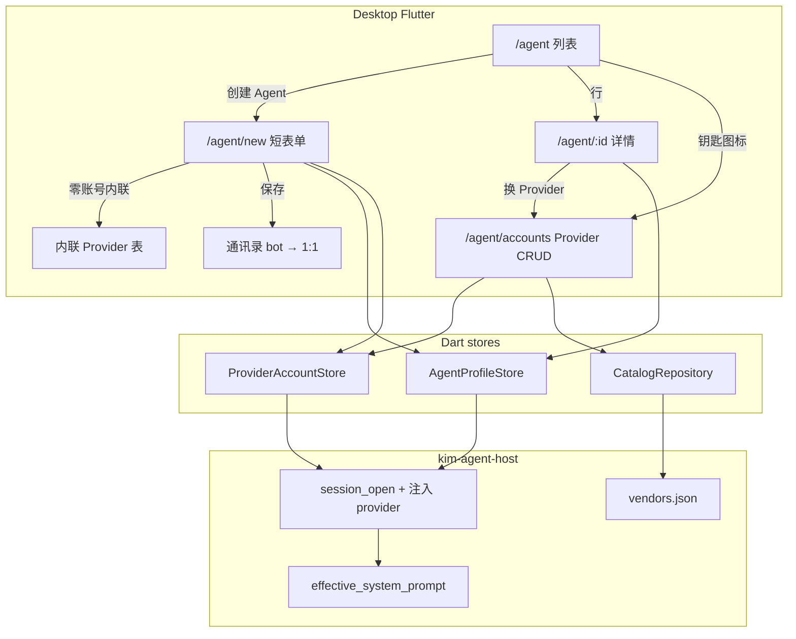
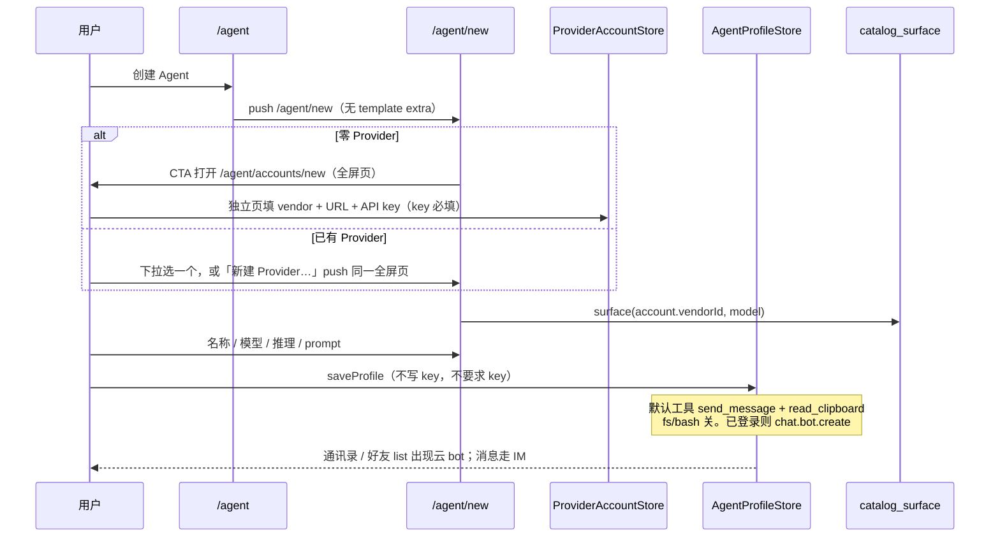
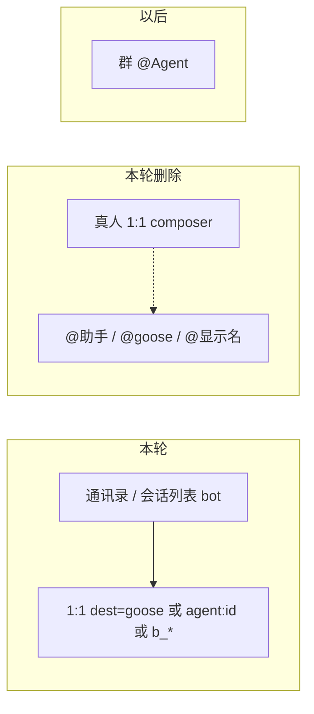

# Agent / Provider 信息架构与创建编辑 UX

| Field | Value |
|---|---|
| Author | KIM Agent Working Group |
| Date | 2026-09-13 |
| Status | Draft |
| Audience | 实现桌面 Goose Agent 创建/编辑 UX 的资深工程师（`sdk/mobile` + `kim-agent-host`） |
| 仓库 | `/Users/zhangfan/develop/github.com/im` |
| 扩展（不替换） | `docs/impl/multi-agent-vendor-catalog.md`（C-KD）。**不重做** VendorCatalog / `ReasoningSurface` / HTTP mapping |
| 产品合同 | 2026-09-13 逐条确认，本文当作终态，不重开 |
| Goose pin | `goose-agent` / `goose-provider-types` / `goose-providers` **0.1.0-alpha.9**（与父文档相同） |
| 编号 | 本文新决策写作 **P-KD *n***。修订父决策时必须写 **revises C-KD *n***。不要混用 bot-KD。 |

---

## Overview

C-KD 已经把领域拆成 Agent / ProviderAccount / ModelChoice / Vendor，并把厂商协议、字面 URL、`ReasoningSurface`、`to_model_spec` 放进 `kim-agent-host` catalog。**UI 没有跟着分层。** 今天的 `AgentEditorPage` 仍是一张厨房水槽：vendor / URL / API key / 模型 / 推理 / fs / bash / MCP / 权限焊在人设上；创建走「空白 / 译者 / 编码」假向导；`system_prompt` 已落盘、host 已注入，设置页却没有编辑器；goose 行不可删、空列表会合成「助手」；真人 1:1 composer 用 `@助手` 在本机 `_appendLocal` 一条助手回复——产品明确不要这条路径。

本设计只做 **信息架构与创建/编辑 UX**：用户可见两层 **Provider** 与 **Agent**；本轮 **不发内置模板、不做用户模板 CRUD**；模型列表挂在 **每个 Provider 账号** 上；创建是短表单；人设页出现可编辑 system prompt；goose 不再特殊；Agent 是通讯录 bot，只走 1:1。Catalog FFI、`ReasoningSurface`、session_open 注入 `provider`、零后台变更全部沿用 C-KD。

---

## Background & Motivation

### 父文档已落地、本文不重做

| 能力 | 现状 | 证据 |
|---|---|---|
| 三层领域 | Agent 磁盘 JSON 已不写 `provider` 块；`toHostJson` 在 `session_open` 注入 | `agent_profiles.dart` `toJson` / `toHostJson`；C-KD 1 |
| Catalog + Surface | `catalog_vendors` / `catalog_surface` / `catalog_validate`；Dart `ReasoningControls` | `catalog.rs`；`catalog.dart`；`reasoning_controls.dart` |
| ProviderAccount | `agent.provider_accounts` + `agent.api_key.acct.<id>` | `provider_accounts.dart` |
| 拉模型按钮 | Agent 编辑器 `_fetchModels`；缓存键是 **vendor id** | `agent_settings_page.dart`；`saveCatalogModelCache(_backend, models)` |
| 路由 | `/agent`、`/agent/new`、`/agent/:id`、`/agent/accounts`；`/agent/settings` → `/agent` | `app_router.dart:121-158` |
| 云删除 | 非 goose 的 `delete` 已 `botDelete`；108 清本地 | `agent_profiles.dart:985-1015`；C-KD 9 |
| login 批量 ensure | 代码里 `ensureVisibleIdentities` **只**从 `setServerIdentity(true)` 调用，`link.dart` 已无 | 与 C-KD 9 一致，保持 |

### 产品痛点（已核对代码，不是对照愿望）

1. **创建不是创建。** `agent_wizard_sheet.dart` 不是向导：三行 `空白|译者|编码`，然后 `context.push('/agent/new', extra: template)`。`draftFromTemplate` **绑定 vendor**：译者 → deepseek/`deepseek-flash`/effort none/无工具；编码 → anthropic/`claude-sonnet-4-5`/effort high/fs；空白抄 goose 的 vendor 和空 prompt。这是 C-KD 16 的产品模板，**本轮撤销。**
2. **编辑器把 Provider 焊进人设。** `AgentEditorPage` 有 display name、aliases、**vendor 下拉、base URL、备选 URL、模型+fetch、API key**、reasoning、fs、bash、MCP、权限。**没有 system prompt 字段。** `_save` 要求 API key + URL。`_selectVendor` 在 Agent 表单上改 URL/模型。`saveEditor` upsert ProviderAccount **并且**把 `providerKind`/`baseUrl` 拷回 profile。
3. **模型缓存在 vendor 上。** 两把 OpenAI key 共享 `agent.catalog_cache.openai`。Create Agent 的模型下拉不是「这个账号能用的模型」。
4. **空列表会造一个 goose。** `_reload`：`agent.profiles` 空或缺失 → `AgentProfile.gooseFromSettings`。`inbox.dart` / `contacts.dart`：`visibleAgents` 空 → `withGooseThread` / `withGooseAgent` 再注一条合成助手。`ChatAgent._profileForDest` 找不到人设就 `gooseFromSettings`。另两处合成器不查 store：`ContactsState.person` 对 `isGooseAgentDest` 直接返回 `kGooseAgentPerson`；`isOwnedAgentAccount` 对任意 `isAgentDest` 返回 true。
5. **goose 特殊。** `delete` / `setEnabled` / 列表 UI 都 `if (id == kGooseAgentId) return;`。C-KD 8 / C-KD 9 / bot-KD 18 写明不可删。
6. **真人 1:1 的 @Agent 不是产品。** `ChatSession.sendText` 对人类 dest 先走 Outbox，再 `onOutgoingText` → `mentionedProfile` → `_prompt` → `_appendLocal`。对端收到的是原句，本机多一条 Goose 回复。composer hint 还写着「发消息，或 @助手」。
7. **列表噪音。** 全局「云身份」和「多 Agent」开关顶在 `/agent`。`serverIdentity` 默认 `?? agentHostSupported`（桌面 true），新建人设 `saveProfile` 立刻 `chat.bot.create`。

---

## Goals & Non-Goals

### Goals

- 用户可见两层：**Provider**（厂商账号 + 该账号模型列表）和 **Agent**（人设 + 选中的 Provider/模型/推理 + 可编辑 system prompt + 1:1 bot 联系人）。
- 创建 Agent = 短表单（名称、Provider、模型、推理、system prompt）。零 Provider 时 **内联**建 Provider。
- 创建/详情都有多行 system prompt；空值合法；运行时注入现有长英文 `DEFAULT_SYSTEM_PROMPT`，占位符展示 **同一段**。
- 模型列表按 Provider 账号隔离；Refresh 仍是按钮（C-KD 10）；手填 id 追加到该账号。
- 新装：Agent 列表空，CTA「创建 Agent」。旧装：`id=goose` 降为普通 Agent，可改名、可删。
- 对话入口 = 通讯录 / 会话列表里的 **云 bot** → 1:1（消息走 IM；Goose 只在桌面本机跑）。本轮从真人 1:1 composer **拿掉 @Agent**。
- 列表藏掉「多 Agent」和「云身份」开关——它们是设置噪音，**不是**「可以不注册云 bot」。创建仍 `chat.bot.create`。
- 沿用 catalog FFI；Dart 推理 UI 仍只看 `ReasoningSurface.kind`，禁止 `switch (vendorId)`。
- 本地硬上限 20（与 `BOT_MAX_PER_OWNER` 对齐），**按本机 profile 行计数**（revises C-KD 7：disabled 仍占云帽）。

### Non-Goals

- **不重做** VendorCatalog / `ReasoningSurface` / `to_model_spec` / URL 切分 / MiniMax builder（C-KD 全文）。
- **本轮不发内置模板，不做用户模板 CRUD，不做 Skills。** revises C-KD 16。
- **群内 Agent / 群 @。** 未实现，本轮不做。
- 不在 login 批量 `ensureVisibleIdentities`（C-KD 9 仍成立）。创建保存 / 第一次打开 1:1 两条路径保持 bot-KD 22。
- 服务端代跑 Goose；后台存 API key（bot-KD 12）；改 proto / gateway / chat / royal（C-KD 13）。
- 合并 `kim_agent_ffi` 与 `kim_client_ffi`。Fork Goose `ThinkingEffort`。
- 手机 / Web Goose runtime（仍 IM-only，`docs/agent-goose.md`）。
- Gemini 一等公民、catalog 热更、OAuth、温度条。

---

## Key Decisions

1. **P-KD 1 — 本轮只有两层用户对象：Provider 与 Agent。Catalog 不露面，不发模板。** revises C-KD 16（「产品模板只存在向导」）。也收窄 C-KD 14「第一屏含 3 个工具预设」：工具不出现在创建表单。Vendor Catalog 仍是 `kim-agent-host` `vendors.json`，用户从不编辑 reasoning *levels*。
2. **P-KD 2 — 创建是短表单，不是厨房水槽，也不是多步向导。** 字段：名称、Provider（可内联新建）、该 Provider 的模型、`catalog_surface(vendor, model)` 驱动的推理、system prompt。工具 / 权限 / MCP 只在详情 **Advanced**。新 Agent 默认工具：`send_message` + `read_clipboard` 开，`fs` / `bash` 关。
3. **P-KD 3 — system prompt 必须上屏；空值合法；运行时默认就是现有长英文 `DEFAULT_SYSTEM_PROMPT`。** 不另造短中文兜底。占位符 / helper **原文**展示这段（`crates/kim-agent-host/src/lib.rs` 的 `DEFAULT_SYSTEM_PROMPT`）。用户清空 = 用这段；用户改了 = 用用户的。
4. **P-KD 4 — 模型列表挂在每个 ProviderAccount 上，不是全局 vendor cache。** 打开账号用 catalog `models[]` + default **种子**；Refresh 按钮用该账号 `base_url` + key，结果只写回该账号，且为 **union**（`selectableModelIds(fetched ∪ 账号已有 models)`），保留「其他…」手填 id。Agent 模型选择器只读选中 Provider 的列表。「其他…」把 id **追加到该 Provider**。手填 id 仍走 `catalog_surface` prefix/none。
5. **P-KD 5 — Agent 磁盘 JSON 只留 `account_id` + `model.name` + `reasoning` + `system_prompt`（加人设字段）。** 迁移后不再写 `providerKind` / `baseUrl` / `keyRef`。ChatAgent 仍在 `session_open` 注入 host-only `provider`（C-KD 1 冻结合同）。
6. **P-KD 6 — goose 不再特殊。** revises C-KD 8 与 C-KD 9「不可删 goose」，并修订 bot-KD 18 的同一句。新装空列表。旧装 `id=goose` 当普通 Agent。`@助手` 不是永久别名。
7. **P-KD 7 — 跟 Agent 说话 = 打开通讯录 / 会话列表里的 bot 1:1。本轮从真人 1:1 拿掉 @Agent。** 已注册时 dest 是 `b_*`，消息上云；Goose 在桌面本机跑。群 @ 仍 Non-Goals。Agent 1:1 composer 是普通聊天，不必 @ 自己。
8. **P-KD 8 — 列表藏掉「多 Agent」与「云身份」开关；云 bot 注册仍是创建默认路径。** 产品不是「本机人设、消息不上云」。**IM 身份在云，Goose 运行时在桌面。** 创建保存（已登录）立刻 `chat.bot.create`，`serverAccount=b_*` 进好友 list / inbox，1:1 走 `chat.user.talk` / `chat.bot.reply`。手机 / Web 是 IM-only，能看见 Agent、能发消息。key / prompt / 工具仍只在本机（bot-KD 12）。列表上那两个开关是设置噪音：用户不该决定「要不要云身份」——没有云身份就没有会话、没有跨设备。`agent.multi_profile` 与 `agent.server_identity` 都保留为隐藏 kill-switch；桌面默认 on（`?? agentHostSupported`）。升级时若桌面曾 persist `false`，**一次性**写成 `true`（与 multi_profile 同一套哨兵模式，见「列表页」），避免藏掉开关后永远不再注册。不 login 批量 ensure（C-KD 9）。未登录时人设先落盘，登录后走 bot-KD 22 路径 b（第一次打开该 1:1 才 create）。
9. **P-KD 9 — 详情可换 Provider。** 当前模型不在新列表 → 落到该 Provider 默认模型并 toast；`alignChoice` 对齐新 surface。Agent 页 **没有** URL / API key。
10. **P-KD 10 — 协议（OpenAI vs Anthropic）永不展示。** Dart 推理 UI 禁止 `switch (vendorId)`（C-KD 4 仍成立）。
11. **P-KD 11 — 保存 Agent 不要求再填 API key。** key 在 Provider。选中的 Provider 没 key 仍可存人设；聊天时再提示去补全。内联新建 Provider **必须**填 key。独立 `/agent/accounts` 仍允许先存无 key 的账号。
12. **P-KD 12 — 本机 20 帽按 profile 行计数（含 disabled、含未注册）。** revises C-KD 7。今日 `_assertCanInsert` 走 `cloudIdentitySlots`，`serverIdentity=false` 时几乎不计数，会放开无限本地人设。`cloudIdentitySlots` 只留给开 flag 时的云帽提示。云端 101 仍是第二道闸。
13. **P-KD 13 — `dest=goose` 只在该行仍存在时有效。** 不合成 goose。删掉后历史线程只读，与其它已删 bot 相同。lookup API 可空（`profileForDest` / `profileForChatDest`），禁止 `gooseFromSettings`。ChatPage 只读门 **仅** `agentHostSupported`（桌面 Goose）；手机 / Web 的 `b_*` 保持今日 composer。lookup 走全量 store（含 disabled）。
14. **P-KD 14 — 空 prompt 只在 host `MachineFactory::assemble` 注入 `DEFAULT_SYSTEM_PROMPT`。** Dart 存空字符串，不在 `toHostJson` 里预填。`from_legacy` 写空，由 assemble 注入同一常量。不新增 `FALLBACK_SYSTEM_PROMPT`。`ops/subagent.rs` **不改**。`system_prompt` 加 `#[serde(default)]`，缺字段与 `""` 同等。

---

## 与 C-KD / bot-KD 的关系

| 决策 | 本文 |
|---|---|
| C-KD 1 三层领域、磁盘无 `provider`、session_open 注入 | **遵守**；UI 终于按层画 |
| C-KD 4 Surface 驱动 UI | **遵守** |
| C-KD 6 `multi_profile` kill-switch | **遵守** 隐藏开关 + 桌面默认 true；**从列表拿掉**。桌面 persist `false` 一次性迁 true |
| C-KD 7 插入闸 = 将注册的云 bot 数 | **revises C-KD 7**：插入闸改本机行数；`cloudIdentitySlots` 只留给开 flag 时的云帽提示 |
| C-KD 8 默认 `id=goose` | **revises C-KD 8**：新装不种子；goose 不是默认人设 |
| C-KD 9 云身份路径 + 不可删 goose | **遵守** 两条 create 路径与 `botDelete`；**revises**「不可删 goose」 |
| C-KD 10 拉模型按钮 | **遵守**；按钮从 Agent 编辑器 **搬到** Provider |
| C-KD 13 零后台 | **遵守** |
| C-KD 14 第一屏含工具预设 | **revises**：创建不含工具 |
| C-KD 15 路由 | 路由已在；**改页面内容**，不改 path |
| C-KD 16 向导模板 | **revises C-KD 16**：本轮无模板 |
| C-KD 17 Duplicate 共享 `account_id` | **遵守** |
| bot-KD 12 后台不存 key | **遵守** |
| bot-KD 18 不可删 goose | **revises**：可删；仍先 `botDelete` |
| bot-KD 22 两条 create 路径、不 login 批量 | **遵守**；创建保存仍是路径 a（立刻 `botCreate`）；P-KD 8 只藏开关，不改默认 |

---

## Proposed Design

### 用户可见信息架构

```text
用户对象
  Provider  厂商账号：vendor、显示名、base URL、API key、该账号模型列表
  Agent     人设：名称、别名、provider_id、模型、ReasoningChoice、system prompt
            Advanced：工具 / 权限 / MCP
            IM：云 bot（serverAccount）→ 1:1 上云；Goose 仅桌面本机跑

非用户对象（本轮保持）
  Vendor Catalog   kim-agent-host vendors.json
  Template         以后：prompt + tools，不绑 vendor。本轮不存在
  Skill            以后
```



### 路由与空态

| 路由 | 页面 | 本轮行为 |
|---|---|---|
| `/agent` | `AgentListPage` | 行：名称、Provider·模型、enable / duplicate / delete（**含 goose**）。无全局开关。空态 CTA「创建 Agent」 |
| `/agent/new` | `AgentEditorPage(create)` | **忽略** `state.extra` 模板。短表单。零 Provider 时内联 Provider 字段 |
| `/agent/:id` | `AgentEditorPage(edit)` | 主字段 + 折叠 Advanced。无 URL/key |
| `/agent/accounts` | `ProviderAccountsPage` | 独立 CRUD；账号 sheet 含模型列表 + 拉取按钮 |
| `/agent/settings` | redirect `/agent` | 保持 |

删除 `openAgentWizardSheet` / `AgentWizardBody` / `agent_wizard_sheet.dart`。`/agent/new` 不再读 `extra: template`。

空态：

- **列表空：** `EmptyState`（沿用 `widgets/empty_state.dart`）title=`agentEmptyTitle`「还没有 Agent」，subtitle=`agentEmptyHint`「创建一个助手，出现在通讯录和会话列表里」，action=「创建 Agent」→ `/agent/new`。
- **通讯录：** `visibleAgents` 空则 **整节「本地 Agent」不渲染**，禁止 `withGooseAgent`。
- **会话列表：** 空人设时 **禁止** `withGooseThread`。`ConversationStore` 里已有的 `dest=goose` 历史行仍显示。
- **Provider 列表空：** 保持「添加账号」；从创建 Agent 进来时走内联，不强迫先去 accounts 页。

### 创建 Agent（短表单）



字段（创建）：

| 字段 | 必填 | 行为 |
|---|---|---|
| 名称 | 是 | 空则拒存。placeholder「给 Agent 起个名字」 |
| Provider | 是 | 下拉已有账号（`displayName` 空则 catalog vendor 名）。「新建 Provider…」push `/agent/accounts/new` |
| 模型 | 是 | **只**读选中 Provider 的 `models`。可「其他…」 |
| 推理 | 随 surface | `ReasoningControls`；Dart 不 `switch (vendorId)` |
| system prompt | 否 | 多行。placeholder = 现有 `DEFAULT_SYSTEM_PROMPT` 全文 |

不出现：aliases（详情才有）、URL、API key、协议、工具、权限、MCP。

新建 Provider 是 **独立全屏页** `/agent/accounts/new`（编辑 `/agent/accounts/:accountId`），不是内联块、不是 bottom sheet。手机键盘和滚动按普通设置页走。

- vendor + API key **创建必填**。编辑留空 key 则保留已保存的密钥。
- URL 预填 `default_base_url`，可改；备选 URL 下拉若 `alt_base_urls` 非空。
- 显示名可选，空则用 vendor 显示名。
- 保存后 pop 账号 id；Agent 表单选中该账号。
- `/agent/accounts` 列表仍在，点 + / 行进入同一套全屏页。

保存：

- **终态（PR3）：** Agent 表单不收 API key。人设走 `saveProfile`；key 只在 Provider sheet / 内联 Provider 写 keychain。
- **PR1 过渡：** 保持 `saveEditor(profile, {String apiKey = ''})`。`apiKey` 非空则写入选中 `ProviderAccount` 的 keychain；**不再**因空 key 拒存；**不再** `id==goose` → `saveGoose` / `AgentSettings` 双写。厨房水槽编辑器的 `_save` 仍可把 key 传进来（现有 happy path 不断）。**仍**用表单 `providerKind`/`baseUrl` `upsert` 账号 vendor/url（今日 `_selectVendor` 路径）；**仍**把账号 vendor/url `copyWith` 回内存 `providerKind`/`baseUrl`，供厨房水槽 hydrate（磁盘 `toJson` 仍不写 `provider` 块）。PR3 删掉 Agent 页 key / URL / vendor 时一并去掉 `apiKey` 参数，并停止用 Agent 表单改账号 URL/vendor。
- 选中 Provider 无 key：允许存。`ChatAgent._prompt` 已有空 key 分支，文案改为指向 Provider（「打开「我 → Agent → 厂商账号」补全密钥」），不要「填入 OpenAI 或 Anthropic」。
- 内联 Provider 无 key：拒存 Provider，Agent 也不存。
- 新 id：**create 与 `duplicate` 都用** `p-<microseconds>`（今日 `duplicate` 误用 milliseconds，本切片对齐）。不要用 `goose`。
- 新工具默认：

```dart
const kCreateDefaultTools = AgentToolSet(
  sendMessage: true,
  readClipboard: true,
);
```

`mode` 保持 `smart_approve`（有 IM 工具）。不要把 gooseFromSettings 那套 `search_contacts` / `search_messages` / `list_profiles` 带给新 Agent。旧 goose 行的工具 **不改写**。

`saveProfile` 对新 id **必须** `ensureBotIdentity`（今日行为，P-KD 8 不改这条）。已登录且 `serverAccount` 空 → `chat.bot.create`，人设带上 `b_*`。`personForProfile` 优先用 `serverAccount` 当通讯录 dest，所以会话 list / 好友 list 里是云 bot，不是 `agent:<id>` 合成联系人。未登录：人设先落盘，登录后第一次打开该 1:1 再 create（bot-KD 22 路径 b / `_maybeRegisterLocalAgent`）。失败：保留行，写 `identityError`，toast（今日 `agentRegisterError`）。

删掉 `draftFromTemplate` / `createFromTemplate` / `templateBlank|translator|coder`。

### 详情（保存之后）

主字段与创建相同，另加 **aliases**（逗号分隔，保持）。

折叠 **Advanced**（默认收起）：

- 工具开关：至少 `send_message`、`read_clipboard`、`fs`、`bash`（现有开关）。
- 权限下拉（现有 `always_allow` / `ask_before` / `never_allow`）。
- MCP 文本（现有「名称 命令 参数…」）。

**可以换 Provider。** 算法：

```text
onProviderChanged(next: ProviderAccount):
  account_id = next.id
  vendor = next.vendorId
  if model ∉ next.models:
    model = defaultModel(next)   // 列表里匹配 catalog default，否则 models.first
    toast agentModelFallback     // 「模型不在新账号列表中，已改用 {model}」
  surface = catalog_surface(vendor, model)
  choice = alignChoice(surface, choice)   // 已有
  if aligned.dropped: toast agentReasoningDropped
```

Agent 页 **禁止** vendor URL / API key / 拉取模型按钮。那些只在 Provider。

`_selectVendor` 整段从人设编辑器删除（**PR3**，与停止 `saveEditor` 改账号 URL/vendor 同 PR）。PR1 厨房水槽仍靠它改表单 URL/模型并经 `saveEditor` 写进 ProviderAccount。

### Provider 数据：每账号模型列表

`ProviderAccount` 增字段 `models: List<String>`（已 `selectableModelId` 过滤）。JSON：

```json
{
  "id": "acct-171000",
  "vendor_id": "openai",
  "base_url": "https://api.openai.com/v1",
  "key_ref": "agent.api_key.acct.acct-171000",
  "display_name": "OpenAI 工作",
  "models": ["gpt-4o", "gpt-5"]
}
```

Prefs 仍是 `agent.provider_accounts`。**不**新开 SQL。权威是账号行，不是 `agent.catalog_cache.<vendor>`。

种子与刷新：

1. **新建 / 打开时 `models` 空：** `catalog_vendors` 里该 `vendorId` 的 `models[]` ∪ `default_model`。不发 HTTP（C-KD 10）。
2. **Refresh 按钮：** 该账号 `base_url` + key 调现有 `fetch_supported_models`（`kind` = catalog vendor id）。成功则 **union** 写回：`account.models = selectableModelIds(fetched ∪ account.models)`（保留「其他…」手填、也不丢 catalog 种子里厂商没回的 id）。**不要**整表替换。失败保留原列表 + toast（已有 `agentFetchModelsFailed`）。
3. **「其他…」：** 对话框收一个 id；校验 `isSelectableModelId`；**append** 到该 Provider 的 `models` 并立刻 `upsert`。随后对该 id 调 `catalog_surface`。Refresh 不得把它冲掉。
4. 两个 OpenAI 账号可以有不同列表。Create Agent 模型选择器 **只**读当前 `account_id`。

迁移 `agent.catalog_cache.<vendor>`：

```text
migrateAccountModels(account):
  if account.models.isNotEmpty: return
  seed = catalog.models ∪ catalog.defaultModel
  cached = loadCatalogModelCache(account.vendorId)   // 旧键 agent.catalog_cache.<vendor>
  account.models = selectableModelIds(seed ∪ cached)
  upsert(account)
  // 不删旧 cache；回滚仍可忽略（C-KD Data Model）
```

每个账号迁移一次。之后刷新互不影响。旧 cache 不再被 Agent 编辑器读写。

`defaultModel(account)`：catalog `default_model` 若在 `account.models` 中则用它，否则 `models.first`，再否则 `''`（选择器走「其他…」）。

### Agent JSON

迁移后 **新 id** 写入（已接近 C-KD 1，补齐「停止把 vendor/url 拷回内存再间接依赖」）。`kCreateDefaultTools` **只**用于新 id，不要拿来改写旧 goose 行：

```json
{
  "id": "p-1710000000000",
  "display_name": "工作助手",
  "aliases": [],
  "account_id": "acct-171000",
  "model": { "name": "deepseek-flash" },
  "reasoning": { "v": 1, "kind": "effort_enum", "value": "high" },
  "system_prompt": "",
  "mode": "smart_approve",
  "tools": { "send_message": true, "read_clipboard": true },
  "enabled": true,
  "server_account": ""
}
```

旧 `id=goose` 行：`tools` **原样保留**（今日 `gooseFromSettings` 还开着 `search_contacts` / `search_messages` / `get_conversation_context` / `list_profiles`）。只把缺失的 `account_id` 补上、去掉磁盘 `provider` 块。

`fromJson` **仍读**旧 `provider.{kind,base_url,key_ref}`，供 `_migrateAccounts` 合成 ProviderAccount。读完写回时 `toJson` 已不写 `provider` 块——保持（PR1 就成立）。

**PR1 仍做（厨房水槽还在）：**

- `saveEditor` 用表单 `providerKind`/`baseUrl` `upsert` 账号 `vendorId`/`baseUrl`（外加非空 `apiKey` 写 keychain）。
- `_migrateAccounts` / `saveEditor` 把账号 vendor/url **填回内存** `providerKind`/`baseUrl`，旧编辑器才能 hydrate。不要把这些字段写进磁盘 `provider` 块。

**PR3 才停止（与删 `_selectVendor`、Agent 页无 URL/vendor 同 PR）：**

- `saveEditor` 不再用 Agent 表单改账号 URL/vendor；人设只改 `accountId`。
- `_migrateAccounts` 不再把 `providerKind`/`baseUrl` 当 UI 源（内存遗留只读可留）。
- 列表 subtitle 改读 `account.displayName ?? vendorId` · `profile.model`。

`saveGoose` 特殊路径：PR1 起 `saveEditor` 不再 `if (id == goose) saveGoose`，停止为 goose 双写 `AgentSettings`；key 非空仍写入该账号 keychain。PR3 去掉 Agent 页 key 字段后，签名不再带 `apiKey`。`readApiKey` 对 `agent.api_key.goose` / `agent.api_key` 的读兼容 **留一版**（已有）。

### 运行时空 prompt（P-KD 3 / 14）

**只在 host 注入。** Dart 把用户清空存成 `""`，不在 `toHostJson` 里填默认（否则磁盘上看不出「用内置默认」和「用户存了同一段」）。

默认就是现有常量，**不另造短文案**：

```rust
// crates/kim-agent-host/src/lib.rs — 已存在，不要改字、不要换名
pub const DEFAULT_SYSTEM_PROMPT: &str =
    "You are 助手, a local desktop agent inside the KIM messenger. \
You run on the user's machine (not a cloud bot). Reply in the user's language. \
Be concise. You can see the current conversation because the host pasted it into this session. \
You have search_contacts, search_messages, get_conversation_context, list_profiles, \
send_message, and read_clipboard. send_message and clipboard require user confirmation. \
You do not have filesystem or shell access. Do not claim you have tools you were not given.";
```

禁止新增 `FALLBACK_SYSTEM_PROMPT`。`effective_system_prompt` 空则返回 `DEFAULT_SYSTEM_PROMPT`。

`profile.rs`：`system_prompt` 加 `#[serde(default)]`（缺字段 = `""`）。

```rust
impl AgentProfile {
    pub fn effective_system_prompt(&self) -> &str {
        let t = self.system_prompt.trim();
        if t.is_empty() {
            DEFAULT_SYSTEM_PROMPT
        } else {
            t
        }
    }
}
```

**唯一运行时注入点**是 `MachineFactory::assemble`：

```rust
let mut steps = vec![Step::Operation(Arc::new(SystemPromptOp {
    prompt: profile.effective_system_prompt().to_string(),
}))];
```

`from_legacy` 今日已经写入 `DEFAULT_SYSTEM_PROMPT`。改为写 **空字符串**，由 assemble 注入同一常量，磁盘/JSON 与 Dart「空 = 用默认」一致。测试夹具可以继续引用 `DEFAULT_SYSTEM_PROMPT`。

`ops/subagent.rs` **不动**。它读的是 `builtin_templates()`（译者/编码夹具，C-KD 16），不是用户 `AgentProfile`。

Dart 占位符必须与 Rust 常量 **逐字相同**（单测锁两端字符串）：

```dart
const kDefaultSystemPrompt =
    'You are 助手, a local desktop agent inside the KIM messenger. '
    'You run on the user\'s machine (not a cloud bot). Reply in the user\'s language. '
    'Be concise. You can see the current conversation because the host pasted it into this session. '
    'You have search_contacts, search_messages, get_conversation_context, list_profiles, '
    'send_message, and read_clipboard. send_message and clipboard require user confirmation. '
    'You do not have filesystem or shell access. Do not claim you have tools you were not given.';
```

创建/详情 `TextField`：`hintText: kDefaultSystemPrompt`，helper=`agentPromptHint`「留空则使用该默认」。用户一旦编辑，存的是编辑后的全文，不再跟默认走。

Host 单测（PR1）：`system_prompt: ""` **以及** JSON 缺 `system_prompt` 键 → assemble 后 `SystemPromptOp.prompt == DEFAULT_SYSTEM_PROMPT`。显式非空 prompt 不得被覆盖。

### 跟 Agent 说话（P-KD 7）



改动点：

| 位置 | 今日 | 本轮 |
|---|---|---|
| `ChatSession.sendText` | 人类 dest：Outbox + `onOutgoingText` | 人类 dest：**只** Outbox。不要再 `unawaited(onOutgoingText)` |
| `ChatAgent.onOutgoingText` | `mentionedProfile` → `_prompt` | 仅在 `isAgentDest` 时转 `sendDirect`（或删掉人类分支）。注册 bot dest 仍忽略 mention（已有） |
| `KimComposer.hintText` | 非 agent：`agentComposerHint`「发消息，或 @助手」 | 非 agent：普通发消息 hint（新 key `composerHint` 或复用现有非 agent 文案）。Agent 1:1：保持 `agentComposerDirect`，不要 @ |
| mention 自动完成 | **没有**独立 mention picker | 无需加。拿掉的是 send 拦截 + hint |
| `mentionedProfile` | 供 composer 与测试 | **保留函数**（群 @ 以后用），本轮无调用方在人类 1:1。测试改断言人类 1:1 不再 prompt |

Agent 1:1 分两条（今日已如此，本轮不改）：

- 已注册（`dest == profile.serverAccount`，即 `b_*`）：`ChatAgent.sendDirect` **直接 return**。用户句走 Outbox / `chat.user.talk`；桌面 host 补跑后 `chat.bot.reply`。这是产品主路径。
- 尚未注册（`dest=goose` / `agent:<id>`，未登录或 create 失败）：现有 `sendDirect` 本机 `_appendLocal` + `_prompt`。用户不必 @ 自己。

通讯录 `personForProfile`：**有 `serverAccount` 就用它当 `KimPerson.account`**，所以创建成功后点开的是云 bot 会话，不是 `agent:` 合成 dest。

`mentionsGooseAgent` / 文档里「@助手 永久别名」作废。解析只看该 Agent 的 `aliases` ∪ `display_name` ∪ `id`——且本轮人类 1:1 根本不解析。

### dest 兼容（P-KD 6 / 13）

```text
AgentProfile.dest:
  id == "goose" → "goose"          // 旧本地线程继续命中
  其它         → "agent:<id>"

isAgentDest(dest)      = dest == "goose" || dest.startsWith("agent:")
isGooseAgentDest(dest) = dest == "goose" || dest == "agent:goose"
canonicalAgentDest     = "agent:goose" → "goose"（避免双会话）
```

`isGooseAgentDest` **留下**当 dest 检测，不再当「不可删 / 默认人设 / 合成联系人」。

**唯一 lookup**（`mention.dart` 或 `agent_profiles.dart` 顶层函数，ChatAgent / ChatPage / `_maybeRegisterLocalAgent` 共用）：

```dart
/// null = 人设不存在。永不 gooseFromSettings / 永不造行。
AgentProfile? profileForChatDest(String dest, List<AgentProfile> all) {
  if (dest.isEmpty) return null;
  for (final p in all) {
    if (p.serverAccount.isNotEmpty && p.serverAccount == dest) return p;
  }
  final canon = canonicalAgentDest(dest);
  if (canon == kGooseAgentId) {
    for (final p in all) {
      if (p.id == kGooseAgentId) return p;
    }
    return null;
  }
  if (canon.startsWith('agent:')) {
    final id = canon.substring('agent:'.length);
    for (final p in all) {
      if (p.id == id) return p;
    }
  }
  return null;
}
```

```dart
Future<AgentProfile?> profileForDest(String dest); // ChatAgent：ensureLoaded 后调 profileForChatDest
```

`all` **必须是** `ref.watch(agentProfilesProvider)` / `store.state`（含 `enabled=false`），**禁止**传 `visibleAgents`。停用的人设仍在磁盘、云 bot 仍在（C-KD 9）；若只查 `visibleAgents`，`setEnabled(false)` 会被当成「已删除」。

今日 `Future<AgentProfile> _profileForDest` 末尾 `store.goose ?? gooseFromSettings` **删掉**。调用方合同：

- `sendDirect` / `_pumpDest` / `_prompt`：`profile == null` → **不** prompt、**不** `_appendLocal` 假助手句；UI 只读。
- `_maybeRegisterLocalAgent`：`profileForChatDest(dest, store.state)`；null 则 **return**。禁止 `profile ??= store.goose`（今日会把未知 `agent:*` 错绑到 goose）。

找不到人设：不要 prompt。UI 走只读（下节）。

历史 `dest=goose`：只要 `id=goose` 行还在，1:1 继续工作（本地 `_appendLocal`；若已注册则 redirect `b_*`，现有 `_maybeRegisterLocalAgent`）。用户 **删掉** 该行：

- 不再注入合成 goose。
- `ConversationStore` 里 `goose` 线程还在 → 只读。
- 若曾注册：本机 store **已无该行** 后，桌面 Goose（`agentHostSupported`）把 inbox `b_*` 当只读。手机 / Web IM-only **不**走这条只读门，composer + Outbox 照旧。`botDelete` 仍先于清行。

### 删除 goose / 只读线程

去掉：

```dart
// AgentProfileStore.delete / setEnabled
if (id == kGooseAgentId) return;

// AgentListPage trailing
if (profile.id != kGooseAgentId) Switch(...)
if (profile.id != kGooseAgentId) IconButton(delete)
```

删除合同（所有 Agent，含 goose）：

1. 若 `serverAccount` 非空：先 `botDelete`；108 / not-owner 视为云端已无，仍清本地；其它错误保留行 + `identityError` + toast。
2. 清本地 profile 行。
3. **禁止**再插入合成 `dest=goose`。
4. 引用该 `account_id` 的其它 Agent 不级联删 Provider（已有「仍有 Agent 使用此账号」）。

只读（**不要**依赖 FriendGate / 108）：今日 ChatPage

```dart
final gated = !agentChat && !isServerBotAccount(widget.id) && ... !social.isFriend(widget.id);
```

`isServerBotAccount`（`b_` 前缀）**退出** FriendGate，composer 一直在。`isAgentDest` 不含 `b_*`。Outbox 可能 `notFriends` / 服务器 108，那是发送失败，不是只读空态。

ChatPage 是共享 Flutter，手机 / Web `agentHostSupported==false`：无 Goose runtime，通常也 **没有** 带 `serverAccount` 的 `agent.profiles`。手机跟已注册助手的 1:1 就是普通好友线程 `dest=b_*`（bot-KD 11 / C-KD 9：IM-only，发送走 Outbox）。若对任意 `b_*` + lookup null 藏 composer，会把 **活着的云 bot** 显示成「此 Agent 已删除」。

**ChatPage 规则（必须闸 `agentHostSupported`）：**

```text
profiles = ref.watch(agentProfilesProvider)   // 全量，含 disabled；禁止 visibleAgents
orphan   = profileForChatDest(widget.id, profiles) == null

if !agentHostSupported:
  今日 composer + Outbox / FriendGate     // 手机/Web：b_* 保持可发
else if isAgentDest(widget.id) && orphan:
  不挂 composer；EmptyState = agentDeletedReadOnly   // dest=goose / agent:* 历史
else if isServerBotAccount(widget.id) && orphan:
  不挂 composer；EmptyState = agentDeletedReadOnly   // 本机曾拥有、人设已删的 b_*
else:
  现有 composer / FriendGate
```

等价：`readOnly = agentHostSupported && orphan && (isAgentDest || isServerBotAccount)`。

`isFriend` 对 `isAgentDest` 的短路可留（避免误弹加好友）；只读由上面规则负责。`Outbox._assertCanQueue` 对 `isAgentDest` 仍拒绝，作为出站后门闸。

`setEnabled(..., false)` 允许：通讯录 / mention 消失（`visibleAgents` 过滤 `enabled`），云 bot 若已注册仍在（C-KD 9 停用语义）。lookup 走全量 store，停用不等于删除，桌面 `b_*` composer **仍在**。新装没有 goose 行，无所谓。

### 通讯录与可见性

`visibleAgents`：

- `!agentHostSupported` → `[]`（手机）。
- 隐藏 kill-switch `multiProfile==false`（**仅** support 在一次性迁移之后再写 pref；见下）→ 若 goose 行仍在则只露出它，**没有 goose 就空**，不要合成。
- 默认桌面 `multiProfile==true` → 所有 `enabled` profile。

`personForProfile` 不变：有 `serverAccount` 用它，否则 `canonicalAgentDest(profile.dest)`。保存本地 Agent 后立刻出现 bot 人。

禁止合成（PR4 必须点名改，否则删 goose 后「助手」还活着）：

- `contacts.dart` `agents.isEmpty ? withGooseAgent(...)` → 一律 `withLocalAgents(friends, agents)`（空列表就是空）。
- `inbox.dart` `agents.isEmpty ? withGooseThread(...)` → 一律 `withLocalThreads(loaded, agents)`。
- `ContactsState.person`：删掉 `if (isGooseAgentDest(account)) return kGooseAgentPerson;`。bot 人只来自 `friends` 里 `withLocalAgents` 注入的 `personForProfile`（或同等 dest→profile lookup）。`person('goose')` 在 goose 行删除后必须是 `null`。
- `isOwnedAgentAccount(account, profiles)`：必须查真实 profile（`serverAccount == account` **或** `canonicalAgentDest(p.dest) == canonicalAgentDest(account)`），**禁止** `if (isAgentDest(account)) return true;`。`isOwnedAgentAccount('goose', [])` 为 false。

空列表 = 没有 bot 联系人。ChatPage `liveTitle` 用 `social.person`；人设已删时 fallback 到 dest 字符串即可，不要再显示「助手」。

### 列表页留下什么

Header：标题 Agent；`+` → `/agent/new`（**不再**开 wizard sheet）；钥匙 → `/agent/accounts`。

**删除**两块 `SwitchListTile`（`agentServerIdentity` / `agentMultiProfile`）。pref 仍读写，只是没 UI。

桌面隐藏「多 Agent」开关时的一次性迁移（**PR1** `_reload`，与藏 UI 的 PR5 解耦，避免 CTA 创建的 `p-*` 被旧过滤器吃掉）：

```text
if agentHostSupported && prefs.getBool('agent.multi_profile_migrated_on') != true:
  if prefs.getBool('agent.multi_profile') == false:
    persist true
  persist agent.multi_profile_migrated_on = true
multiProfile = prefs.getBool('agent.multi_profile') ?? agentHostSupported
```

之后 support 若再把 pref 写成 `false`，kill-switch **生效**（只露 goose 行 / 无 goose 则空）。产品 UI 不再提供拨回去的开关。测试：persist `false` + 未迁移 → 加载后 `multiProfile==true` 且 `p-*` 出现在 `visibleAgents`。

行：所有 profile（不受「只展示 goose」除非 kill-switch 关）。trailing：enable（含 goose）、duplicate、delete（含 goose）。subtitle：`providerDisplay · model`。删除按钮在 **PR5** 揭开；PR1 只让 `delete('goose')` 在 store 生效。

底部 `Copy.agentGooseHint`（「也可以 @助手」）删除或换成不含 @ 的短说明 `agentListHint`：「点进通讯录里的 Agent 即可对话。密钥在厂商账号里。」

### 云身份（P-KD 8）——开关可藏，注册不能关

产品分层（bot-KD 已落地，本文不重做协议）：

| 层 | 在哪 | 做什么 |
|---|---|---|
| IM 身份 | 云 `users(kind=bot)` + 创建者好友 | `chat.bot.create` → `serverAccount`。好友 list / inbox 有 Agent |
| 消息 | 云 `chat.user.talk` / `chat.bot.reply` | 手机也能看、能发。**不是** `_appendLocal` 本机气泡 |
| 运行时 | 桌面 `kim_agent_ffi` | Goose 推理、工具、key。不服务端代跑 |
| 人设 / Provider | 本机 prefs + keychain | prompt、模型、工具。后台不存（bot-KD 12） |

今日代码已经是这条路：

- `serverIdentity = prefs.getBool('agent.server_identity') ?? agentHostSupported` → 桌面未写 pref 即为 **true**。
- 新建 `saveProfile` → `ensureBotIdentity`（flag 开且已登录且 `serverAccount` 空 → `chat.bot.create`）。
- 打开 1:1 → `_maybeRegisterLocalAgent`（bot-KD 22 路径 b）。
- 已注册 dest：`ChatAgent.sendDirect` 对 `_isRegisteredDest` **直接 return**，消息走 Outbox / IM，桌面 host 用 `chat.bot.reply` 代发。
- `setServerIdentity(true)` → `ensureVisibleIdentities`。**login 不再批量 ensure。**

本轮只改 UI 噪音，**不改默认路径**：

- 列表 **无** 那两个 `SwitchListTile`（PR5 藏 UI）。不要在创建表单上露出云开关。
- 加载（**PR1** `_reload`）：

```text
if agentHostSupported && prefs.getBool('agent.identity_migrated_on') != true:
  if prefs.getBool('agent.server_identity') == false:
    persist true
  persist agent.identity_migrated_on = true
serverIdentity = prefs.getBool('agent.server_identity') ?? agentHostSupported
```

  与 `multi_profile` 同一套路：藏开关前把曾经拨到 false 的桌面一次性拉回 true。新装未写 pref → 仍 `?? agentHostSupported` → 桌面 true → 创建即 `botCreate`。
- 已有 `serverAccount` 的读写、redirect、`bot.reply` 管道不动。
- 隐藏 pref 仍可作为 support kill-switch：迁完之后若再手写 `false`，`ensureBotIdentity` 会 skip。产品 UI 不提供拨回去。

`cloudIdentitySlots` 仍用于「会占云帽」的提示。**插入闸**改成本机行数（P-KD 12，revises C-KD 7）——始终注册时本机行 ≈ 云帽；disabled 仍占云 bot，所以按行计，避免只数 `enabled`：

```dart
void _assertCanInsert() {
  if (state.length >= kMaxBotsPerOwner) {
    throw AgentProfileCapExceeded();
  }
}
```

disabled 计入。超 20 先拒。若 flag 开仍打到服务器 101，沿用 `Copy.agentRegisterFailed`。

### l10n

**删除或停用（UI 不再引用）：**

- `agentWizardBlank` / `Translator` / `Coder` / `Title` / `Hint` / `BlankHint` / `TranslatorHint` / `CoderHint`
- `agentMoreComing`
- 列表上的 `agentMultiProfile`、`agentServerIdentity`、`agentServerIdentityHint`（key 可留，免破坏 arb；UI 不引用）
- `agentGooseHint` 现文案（含 @助手）

**新增：**

| key | zh | 用途 |
|---|---|---|
| `agentEmptyTitle` | 还没有 Agent | 列表空态 |
| `agentEmptyHint` | 创建一个助手，出现在通讯录和会话列表里 | 列表空态 |
| `agentCreate` | 创建 Agent | CTA |
| `agentPrompt` | 系统提示 | 字段 label |
| `agentPromptHint` | 留空则使用该默认 | helper；hintText 用常量句 |
| `agentNewProvider` | 新建 Provider… | 创建表单 |
| `agentModelOther` | 其他… | 模型选择器 |
| `agentModelFallback` | 模型不在新账号列表中，已改用 {model} | 换 Provider toast |
| `agentListHint` | 点进通讯录里的 Agent 即可对话。密钥在厂商账号里。 | 列表底部 |
| `agentDeletedReadOnly` | 此 Agent 已删除，记录只读 | 历史线程 |
| `agentProviderKeyMissing` | 未配置 API Key。打开「我 → Agent → 厂商账号」补全密钥。 | ChatAgent 空 key |
| `composerHint` | 发消息 | 真人 1:1 composer（替换「或 @助手」） |

`agentComposerDirect` 可留「给助手发消息」或日后插显示名；不要加 @。

`agentMode`（「协议」）从 Agent 页拿掉。`agentProvider` 文案从「Goose Provider」改为账号选择「Provider」。

---

## API / Interface Changes

无 proto、无 gateway。Dart / host 形状：

```dart
class ProviderAccount {
  final String id, vendorId, baseUrl, keyRef, displayName;
  final List<String> models; // NEW
}

class AgentProfile {
  // 权威：id, displayName, aliases, accountId, model, reasoning,
  //       systemPrompt, mode, tools, permissions, extensions,
  //       enabled, steer, serverAccount
  // 遗留只读：providerKind, baseUrl, keyRef（fromJson 旧行；UI 不展示）
}

const kDefaultSystemPrompt = /* 与 Rust DEFAULT_SYSTEM_PROMPT 逐字相同 */;
const kCreateDefaultTools = AgentToolSet(sendMessage: true, readClipboard: true);
```

```dart
// AgentProfileStore
Future<void> saveProfile(AgentProfile profile); // 新 id 仍 ensureBotIdentity（flag 门）
// PR1：apiKey 默认空；非空写入选中 ProviderAccount；不再 saveGoose / AgentSettings 双写
//      仍 upsert 账号 vendor/url（厨房水槽）；仍填内存 providerKind/baseUrl；磁盘不写 provider 块
Future<void> saveEditor(AgentProfile profile, {String apiKey = ''});
// PR3：去掉 apiKey 参数；停止用 Agent 表单改账号 URL/vendor（与删 _selectVendor 同 PR）
Future<void> delete(String id);                 // 含 goose；PR1 store 生效，PR5 揭 UI
AgentProfile draftNew({required String accountId, required String model});
```

```dart
/// 同步 lookup。null = 缺失，永不合成 goose。
/// [all] = 全量 agentProfilesProvider（含 disabled），禁止 visibleAgents。
AgentProfile? profileForChatDest(String dest, List<AgentProfile> all);

/// ChatAgent。ensureLoaded 后转 profileForChatDest。
Future<AgentProfile?> profileForDest(String dest);
```

`isOwnedAgentAccount` 改查真实 profile，签名不变。

`CatalogRepository` / FFI 不变。`fetch_supported_models` 的调用方从 `AgentEditorPage` 挪到 `ProviderAccountsPage` / 内联 Provider sheet。

Host：

```rust
// 已有 DEFAULT_SYSTEM_PROMPT，不要新增 FALLBACK_* 常量
// profile.rs: system_prompt 加 #[serde(default)]
impl AgentProfile {
    pub fn effective_system_prompt(&self) -> &str; // 空 → DEFAULT_SYSTEM_PROMPT
}
```

`SystemPromptOp` 本身不改。调用方只改 `MachineFactory::assemble` + `from_legacy`。不改 `ops/subagent.rs`。

---

## Data Model Changes

| Key | Store | 本轮 |
|---|---|---|
| `agent.profiles` | prefs | 空数组是合法终态。缺失或 `[]` **不再**种子 goose。字段见上 |
| `agent.provider_accounts` | prefs | 每行加 `models: string[]` |
| `agent.api_key.acct.<id>` | keychain | 不变 |
| `agent.api_key.goose` | keychain | 读兼容一版 |
| `agent.catalog_cache.<vendor>` | prefs | 一次性并入各账号 `models`；之后忽略 |
| `agent.multi_profile` | prefs | 隐藏；默认 `agentHostSupported`。桌面一次性 `false`→`true` |
| `agent.multi_profile_migrated_on` | prefs | 一次性迁移哨兵（PR1） |
| `agent.server_identity` | prefs | 隐藏；默认 `agentHostSupported`。桌面一次性 `false`→`true` |
| `agent.identity_migrated_on` | prefs | 一次性迁移哨兵（PR1，与 multi_profile 并列） |
| `agent.active_profile_id` | prefs | 无产品入口，可留 |

无 SQL、无 proto。

`_reload` 伪代码：

```dart
if (raw == null || raw.isEmpty) {
  profiles = [];          // 新装：空。不要 gooseFromSettings
} else {
  profiles = decode(raw); // 旧装：goose 行当普通人设
}
// 桌面 multi_profile / server_identity 曾 persist false → 一次性迁 true
profiles = await _migrateAccounts(profiles);
await _migrateAccountModels(profiles);
```

不要为了「记住已经初始化」再写第三个 flag：空列表 persist `[]` 即可。`raw==null` 与 `[]` 都当空。旧客户端一旦跑过 `_reload` 就会把种子 goose 写成非空 JSON，那些用户会带着 goose 行升级——符合「现有安装迁移为普通 Agent」。

---

## Alternatives Considered

### 1. 内置模板 vs 用户模板 vs 无模板

| | 内置（今日向导 / C-KD 16） | 用户模板 CRUD | 本轮无模板（选定） |
|---|---|---|---|
| 创建路径 | 先选译者/编码，vendor 被绑死 | 多一套对象 | 短表单，用户自己选 Provider |
| 实现量 | 已有，但是假向导 | 超出本轮 | 删 sheet + `draftFromTemplate` |
| 风险 | 译者=DeepSeek 变成隐藏决策 | 范围膨胀 | 非专家要自己选模型 |

产品已确认无模板。用户模板以后做，且 **不绑 vendor**。

### 2. 模型挂 Provider vs 全局 vendor cache vs 仅 catalog

| | 全局 `agent.catalog_cache.<vendor>`（今日） | 仅 catalog 种子 | 每 Provider 一份（选定） |
|---|---|---|---|
| 两把 OpenAI key | 互相覆盖 | 都只能看到 app 内置 id | 各拉各的 |
| 离线 | 有 cache | 有 bundled | 种子 + 每账号 cache |
| 手填 | 常写进 vendor cache，脏别人 | 不持久 | 追加到该账号；Refresh **union** 保留 |

### 3. goose 特殊 vs 不特殊

特殊（C-KD 8）：永远有「助手」、`@助手` 稳定、不可删。代价：空态撒谎、删除路径分叉、`profile ??= goose` 错绑。

不特殊（选定）：新装空列表；旧 goose 行可删可改名；历史 dest 在行仍在时可用。合成联系人一律禁止。

### 4. 真人 1:1 @ vs 只 1:1 联系人 vs 群

今日 @：人类消息仍到对端，助手回复只在本机——产品否定。群 @ 未实现，Non-Goals。选定：只 1:1 联系人。

### 5. 厨房水槽编辑器 vs 短表单 + Advanced

厨房水槽：创建就要 key/URL/MCP，劝退。选定：创建五字段；详情同主字段 + 折叠 Advanced。Provider 凭证永不出现在人设页。

---

## Security & Privacy Considerations

| 威胁 | 严重度 | 缓解 |
|---|---|---|
| key 进人设 JSON / 日志 | **高** | 人设页不再收 key；`toJson` 无 key；`SessionOpenOpts` 无 `Debug`；永不 log key |
| 内联 Provider 钓鱼 URL | 中 | 保存前 `isAllowedAgentBaseUrl`（https / localhost）；不自动拉模型 |
| 无 key 的 Agent 被当成已可用 | 低 | 允许保存；聊天时明确提示补 Provider key |
| 误删 goose / 唯一 Agent | 中 | 可删是产品；历史只读；不合成顶替 |
| 无 key 的 fetch_models | 中 | 按钮仍要求 key（现有 toast `agentKeyMissing`） |
| 20 帽 | 中 | P-KD 12 按行计数（disabled 仍占云 bot） |
| 后台看到 key | — | bot-KD 12；本轮零后台 |

Auth：Agent 不持 JWT。推迟的云注册仍走 `chat.bot.create`，body 无 key。

---

## Observability

- 现有：`session_open` 打 `profile_id` / `provider.kind` / `model`（无 key）；`catalog.fortify dropped=`；fetch toast。
- 新增 Dart toast：换 Provider 模型回落、空 key 指向账号页、Agent 已删只读。
- Host：空 prompt 走 fallback 时 `tracing::debug!(profile_id, "system_prompt_fallback")`，**不要**把 prompt 正文打进 log。
- 回归：见各 PR 必须通过的测试（PR1 store/host；PR2 refresh union；PR4 mention/contacts/ChatPage；PR5 列表 UI）。回滚：忽略 `models` 字段；不要删 `serverAccount`。

---

## Rollout Plan

桌面-only Goose。无 feature flag 新键：`agentHostSupported` 仍是总闸；`multi_profile` 隐藏且默认 on。

分 PR 合入（见文末 PR Plan）。每 PR 可独立回滚：

- 数据 PR：旧客户端忽略未知 `models`；空 `agent.profiles` 在旧客户端会再次种子 goose——因此 **空列表语义与「goose 可删」必须同 PR 或其后紧跟 UI PR**，避免旧 UI 把空列表又写成 goose。
- 推荐顺序：先停 `_reload` 种子并让 delete(goose) 生效，再发空态 UI。

风险：

| 风险 | 严重度 | 缓解 |
|---|---|---|
| 旧用户升级后「助手」消失 | **高** | 只在 `raw==null/[]` 时空；已 persist 的 goose 行保留 |
| 删 goose 后 `profileForDest` / `person` / `isOwnedAgentAccount` 合成回来 | **高** | 可空 lookup；禁 `kGooseAgentPerson`；测试锁定 |
| 真人 1:1 仍 `_appendLocal` 助手回复 | **高** | `sendText` 去掉 `onOutgoingText`；widget/unit 测 |
| 空 prompt 没用上 `DEFAULT_SYSTEM_PROMPT`（另造短中文） | **高** | host 单测 `effective_system_prompt`（`""` + 缺字段）== 现有长英文 |
| 藏开关后 persist `server_identity=false` 不再注册 | **高** | PR1 一次性迁 true；测创建仍 `botCreate` |
| persist `multi_profile=false` 把新 `p-*` 藏掉 | **高** | PR1 一次性迁 true |
| Refresh 冲掉「其他…」 | 中 | union，不是 replace |
| 未写 pref 的新装不注册 | **高** | 保持 `?? agentHostSupported`，不要改成「无 serverAccount → false」 |
| 两把 key 仍共享 vendor cache | 中 | 模型权威迁到账号；迁移只 copy 一次 |

---

## Open Questions

None — product contract locked 2026-09-13.

实现向细节已写入 P-KD（空 prompt 注入点、云 bot 仍是创建默认、开关一次性迁移、20 帽按行计数、Refresh union、可空 dest lookup）。不要把已拍板项再列成未决。

2026-09-13 修订：P-KD 8 曾误写成「新装 local-only、创建不 botCreate」。产品纠正为：藏开关，注册路径不变。P-KD 3 / 14 曾误写成短中文兜底；空值默认改回现有长英文 `DEFAULT_SYSTEM_PROMPT`。

---

## References

- 产品合同 2026-09-13（本文 Overview / P-KD）
- `docs/impl/multi-agent-vendor-catalog.md` — C-KD 1–20
- `docs/impl/goose-personalized-agents.md` — dest / mention
- `docs/impl/goose-bot-first-class.md` — bot-KD 12 / 18 / 22，`BOT_MAX_PER_OWNER=20`
- `docs/agent-goose.md`、`docs/glossary.md`（Agent 默认 id=goose 需随本切片改）
- 代码：`sdk/mobile/lib/screens/agent/{agent_list_page,agent_settings_page,agent_wizard_sheet,provider_accounts_page,reasoning_controls}.dart`；`state/{agent_profiles,provider_accounts,chat_agent,chat_session,inbox,contacts}.dart`；`agent/{mention,catalog}.dart`；`router/app_router.dart`；`crates/kim-agent-host/src/{lib,profile,machine,ops/system_prompt,catalog}.rs`（`ops/subagent.rs` 本切片不改）

无 `CONTEXT.md`、无 `docs/adr/`。

---

## PR Plan

每条可单独审、可合。不改 `services/**`、不改 `kim-client` 热路径、不改 proto。

### PR1 — 人设/账号数据：空列表、goose 可删、每账号模型、短 prompt、P-KD 8 加载

- **Title:** `agent: empty first-run, deletable goose, per-account models, short prompt fallback`
- **Files:** `sdk/mobile/lib/state/agent_profiles.dart`（`_reload` 不种子；桌面 `multi_profile` / `server_identity` `false`→`true` 一次性迁移；默认仍 `?? agentHostSupported`；`delete`/`setEnabled` 去掉 goose 哨兵；`_assertCanInsert` 按行数；`saveEditor(profile, {String apiKey = ''})` 非空 key 写入账号，停止 `saveGoose` / `AgentSettings` 双写；**仍** upsert 账号 vendor/url、**仍**填内存 `providerKind`/`baseUrl`；create/`duplicate` 均 `p-<microseconds>`；**仍** `saveProfile`→`ensureBotIdentity`）；`sdk/mobile/lib/state/provider_accounts.dart`（`models` 字段 + 种子/迁移 `agent.catalog_cache.<vendor>`）；`crates/kim-agent-host/src/profile.rs`（`#[serde(default)] system_prompt`；`effective_system_prompt` 空则 `DEFAULT_SYSTEM_PROMPT`；`from_legacy` 写空）；`machine.rs`（assemble 用 effective）。**不改** `DEFAULT_SYSTEM_PROMPT` 正文、**不新增** fallback 常量、**不改** `ops/subagent.rs`、不改列表 UI
- **Depends:** 无（建立在已合入的 C-KD catalog 上）
- **Desc:** 旧 `id=goose` 行原样加载（tools 不改写）。新装 `agent.profiles` 空。`readApiKey` goose 读兼容保留。厨房水槽编辑器仍把 key 传入 `saveEditor`，vendor/URL 仍能存进 ProviderAccount。空 key 不再拒存。删除按钮在 **PR5** 揭开；PR1 只让 `delete('goose')` 在 store 生效。停止用 Agent 表单改账号 URL/vendor 是 **PR3**。
- **必须通过的测试：**
  - 空 first-run：`raw==null` / `[]` → profiles 空，不 `gooseFromSettings`
  - `delete('goose')` 清行（有 `serverAccount` 则先 `botDelete`；108 仍清）
  - P-KD 8：unset pref → `serverIdentity==agentHostSupported`（桌面 true）；persist `false` + 未迁 → 加载后 true；迁完后再手写 false 则 kill-switch 生效
  - persist `agent.multi_profile=false` + 未迁 → 加载后 `multiProfile==true`，`p-*` 在 `visibleAgents`
  - 已登录 + 新 id `saveProfile` **调用** `botCreate`（不要回归成 skip）
  - 20 条本地行 → 第 21 条 `AgentProfileCapExceeded`（revises C-KD 7；与 flag 无关）
  - host：`system_prompt: ""` 与 JSON **缺键** → assemble 注入现有 `DEFAULT_SYSTEM_PROMPT`；非空不被覆盖
  - Dart `kDefaultSystemPrompt` 与 Rust `DEFAULT_SYSTEM_PROMPT` 逐字相同

### PR2 — Provider 页：账号模型列表 + 拉取按钮搬家

- **Title:** `mobile: fetch models onto ProviderAccount, not vendor cache`
- **Files:** `provider_accounts_page.dart`（sheet：模型列表、Refresh、`isAllowedAgentBaseUrl`、无 key toast）；`catalog.dart`（Agent 编辑器停止 `saveCatalogModelCache(vendor)`）；`agent_settings_page.dart` 去掉 `_fetchModels` / vendor cache 读取（若 PR3 尚未删编辑器，先改为读 `account.models`）
- **Depends:** PR1
- **Desc:** C-KD 10 仍是按钮。两把 OpenAI key 列表独立。手填暂可留在 Agent 选择器（PR3）。
- **必须通过的测试：** Refresh = `selectableModelIds(fetched ∪ 原 models)`（「其他…」id 还在）；失败不改列表。

### PR3 — 短表单创建/详情 + system prompt + 去掉向导

- **Title:** `mobile: slim agent create/edit, system prompt, no templates`
- **Files:** 删除 `agent_wizard_sheet.dart` 与 `test/agent/agent_wizard_sheet_test.dart`；`agent_settings_page.dart` 拆 create vs edit：创建无 Advanced / 无 URL / 无 key；详情主字段 + 折叠 Advanced；prompt 多行；Provider 下拉 + 内联新建（key 必填）；换 Provider 时模型回落 + `alignChoice`；删 `_selectVendor`；`saveEditor` **去掉** `apiKey` 参数，**停止**用 Agent 表单改账号 URL/vendor；`app_router.dart` `/agent/new` 不再读 template extra；`draftFromTemplate` 删除；l10n 去 `agentWizard*`，加 prompt / empty / other…
- **Depends:** PR1、PR2
- **Desc:** 保存人设不要求 key。协议不下拉。`ReasoningControls` 不动。默认工具 `kCreateDefaultTools` **仅新 id**。厨房水槽上的 vendor/URL 字段与 `saveEditor` 写账号 URL 一起消失。
- **必须通过的测试：** 向导 UI 不存在；create/edit 有 prompt 字段，placeholder = `kDefaultSystemPrompt`（现有长英文）；模型选择器只读选中 Provider 的 `models`；无 key 仍可存 Agent；内联新建 Provider 无 key 拒存。

### PR4 — 1:1 联系人：去掉人类 @Agent、停合成 goose、删后只读

- **Title:** `mobile: agent is a 1:1 contact; drop human @mention; no synthetic goose`
- **Files:** `mention.dart`（`profileForChatDest` 查 **全量** store 含 disabled；`isOwnedAgentAccount` 查真实 profile）；`chat_session.dart`（人类 `sendText` 不调 `onOutgoingText`；`_maybeRegisterLocalAgent` 用 lookup，禁止 `??= goose`）；`chat_agent.dart`（`Future<AgentProfile?> profileForDest`；null 不 prompt / 不假 `_appendLocal`；空 key 文案）；`chat_page.dart`（hint；只读门 **先** `agentHostSupported`；lookup 用 `agentProfilesProvider` 不是 `visibleAgents`）；`contacts.dart` / `inbox.dart` / `contacts_page.dart`（无 `withGooseAgent` / `withGooseThread` / `kGooseAgentPerson`；空节不渲染）
- **Depends:** PR1（否则删 goose 会再被合成）
- **Desc:** 群 @ 仍不实现。`mentionedProfile` 函数保留。`isGooseAgentDest` 保留为 dest 检测。手机 / Web 的 `b_*` composer 不动。
- **必须通过的测试：**
  - 人类 1:1 `@助手` 不再 prompt（`chat_agent_test` / `sendText`）
  - `person('goose')` 在 goose 行删除后为 null；ChatPage title 不是合成「助手」
  - `isOwnedAgentAccount('goose', [])` 为 false
  - `_maybeRegisterLocalAgent` 对未知 `agent:*` 不绑 goose、不 `botCreate`
  - ChatPage 桌面：`dest=goose` 人设已删 → 无 composer + `agentDeletedReadOnly`；本机删行后的孤儿 `b_*` 同样
  - ChatPage `agentHostSupported==false` + dest=`b_*` + profiles 空 → **仍挂 composer**（活着的云 bot）
  - ChatPage 桌面 `setEnabled(false)` 后 dest=`b_*` → composer **仍在**（lookup 全量 store，停用 ≠ 删除）

### PR5 — 列表 IA：空态、可删 goose UI、隐藏开关

- **Title:** `mobile: agent list empty-state and hidden kill-switches`
- **Files:** `agent_list_page.dart`（空态 CTA；行上 enable/delete **含 goose**；去掉两个 Switch；subtitle 走 Provider）；l10n `agentEmpty*` / `agentListHint` / `agentDeletedReadOnly`；`me_page` 入口文案若仍说 @助手则改。**不再**改 `server_identity` 加载（已在 PR1）
- **Depends:** PR1、PR3、PR4
- **Desc:** `multi_profile` / `server_identity` pref 保留为隐藏 kill-switch。新装桌面默认注册云 bot。删除按钮本 PR 揭开。
- **必须通过的测试：** 列表空态 CTA；goose 行上有删除且点了走 store `delete`；开关不在树上。

### PR6 — 文档与 glossary

- **Title:** `docs: agent provider persona IA`
- **Files:** `docs/glossary.md`（Agent 不再「默认 id=goose」）；`docs/agent-goose.md`（拿掉「真人聊天 @助手」作为主路径）；`docs/impl/multi-agent-vendor-catalog.md` 在 **C-KD 7 / 8 / 16** 处加指针「revises：见 agent-provider-persona.md」；`goose-bot-first-class.md` 划掉「不可删 goose」
- **Depends:** PR5
- **Desc:** 形状写回专题。不改后台文档里的 bot 协议。C-KD 7 插入闸改为本机行数。

**刻意不做（本切片）：** 用户模板 CRUD；Skills；群 @；每 Agent 云注册按钮；Gemini；catalog 热更；把用户人设接到 `delegate` / `ops/subagent.rs`。
