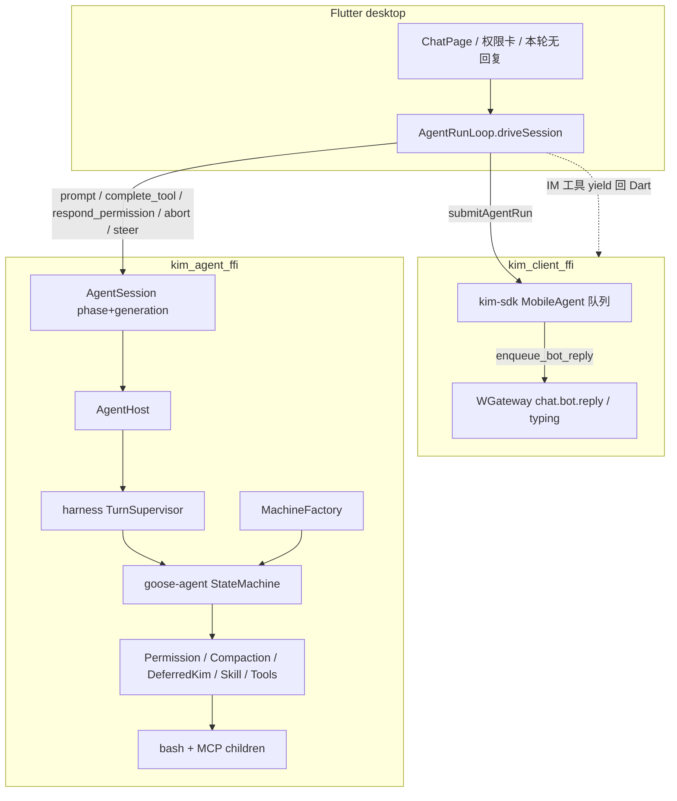
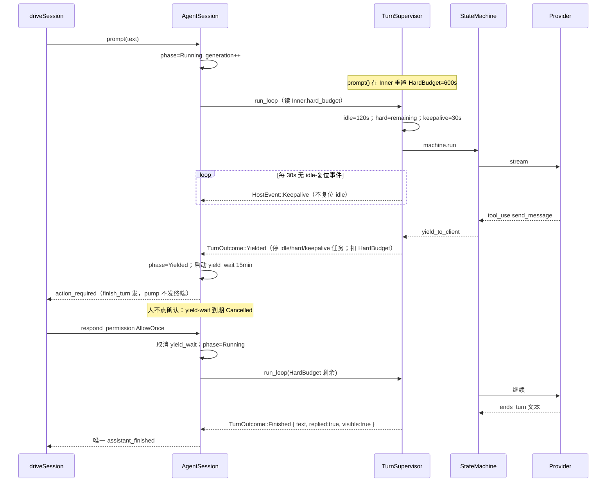
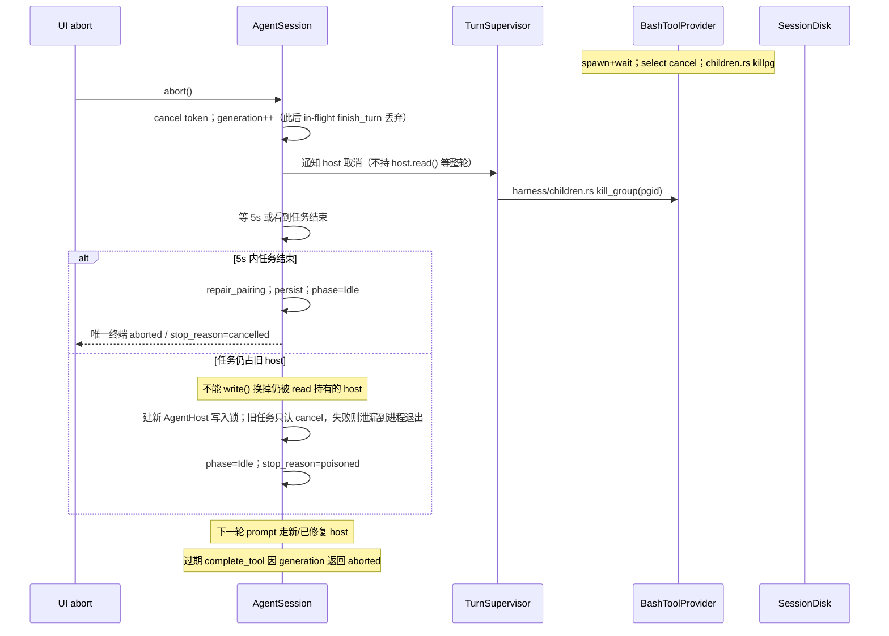
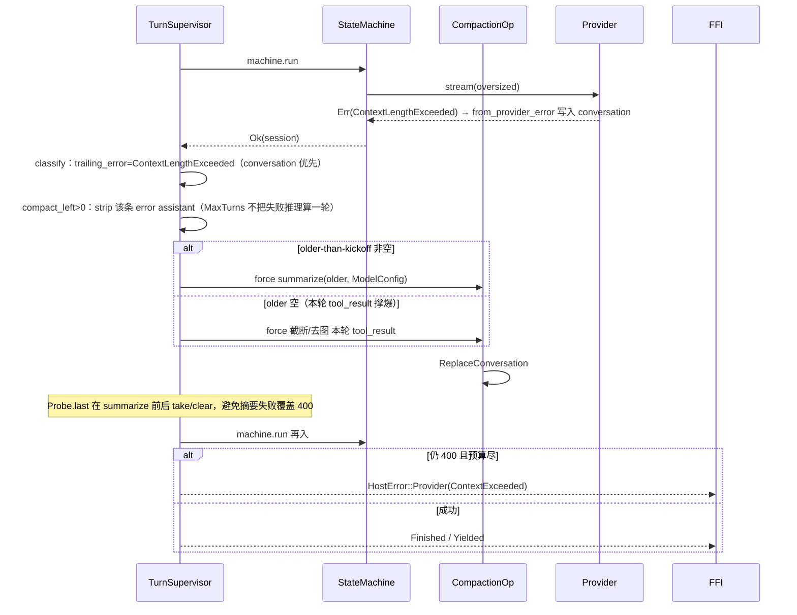

# Goose Agent Harness（内嵌 Goose 的运行时监督核）

| Field | Value |
|---|---|
| Author | KIM Agent Working Group |
| Date | 2026-09-19 |
| Status | Draft |
| Audience | 实现 `kim-agent-host` + `sdk/mobile/rust_agent` + `kim-sdk` agent 队列的资深工程师 |
| Goose pin | `goose-agent` / `goose-provider-types` / `goose-providers` **0.1.0-alpha.9** |
| 仓库 | `/Users/zhangfan/develop/github.com/im` |
| 扩展（不替换） | `docs/impl/goose-personalized-agents.md`、`docs/impl/agent-provider-persona.md`（P-KD）、`docs/impl/multi-agent-vendor-catalog.md`（C-KD）、`docs/impl/goose-bot-first-class.md`（bot-KD）、`docs/impl/agent-productivity.md`（S-KD）、`docs/impl/agent-capability-blocks.md`（B-KD）、`docs/impl/human-agent-im-parity.md`（HA-KD） |
| 编号 | 本文决策写作 **H-KD *n***。不重开 P-KD / C-KD / bot-KD / S-KD / B-KD / HA-KD，除非 harness 决策显式修订其中一条（会标明）。 |
| 原则 | **Embedding is the deeper seam.** Buzz 通过 ACP（浅层 JSON-RPC/stdio）做到的一切是 **下限**，不是上限。我们在 `AgentHost` 内用 Conversation / Operation / HostEvent / Dart yield 实现同一组不变量，**不**包一层 ACP，**不** spawn `goose acp`。 |

---

## Overview

KIM 桌面 Agent 已经把已发布的 `goose-agent` 状态机组装进进程：`AgentProfile` → `MachineFactory` → `StateMachine`，IM 工具在 `SessionPhase::Yielded` 让给 Dart，进程内工具（fs / bash / MCP）走 `ToolOperation`，会话 JSON 按 dest×profile 落盘。两条 FFI（`kim_agent_ffi` / `kim_client_ffi`）按 `docs/agent-goose.md` 硬隔离。

缺的不是循环，是 **监督核**。今天 `AgentHost::run_loop` 把 `machine.run` 的 `anyhow::Error` 一律收成 `HostError::Failed(String)`；idle / hard 超时不存在；abort 立刻把 phase 置 Idle，bash/MCP 可能继续跑；LLM 400 / 429 / 截断被 goose-agent 写成 conversation error message 之后，host 当成空 `Finished`；MCP 只 `close()`；队列满丢 turn；`resume()` 是空 stub。Buzz 在 ACP 子进程外壳上已经把这些做成了稳健性下限（idle / hard / PromptOutcome / killpg / 400 环内恢复 / 毒化重建）。KIM 的缝更深，实现却更浅。

本设计把 **goose-agent-harness** 做成 `AgentHost` 内部模块。对外仍是 `AgentHost::{prompt, complete_tool, respond_permission, abort}`（+ `steer` + `snapshot`）。对内由 Turn supervisor 包住 `StateMachine::run`：语义 idle（**Keepalive 不复位 idle**）、session 级 hard 剩余墙钟、推理 keepalive（UI-only）、Yielded 时 `run_loop` 时钟停掉并由 FFI 跑 yield-wait、类型化 `TurnOutcome`（`replied`/`visible`）、`finish_turn` 单一终端事件、取消后 history 配对、conversation 优先的 provider 恢复、compaction `force`、unix `process_group`+`killpg`、中途 steer、`JoinError` 毒化重建、队列一次重试。不重写 goose-agent，不引入 ACP，不合并两条 FFI。

---

## Feasibility Assessment

对照当前代码，结论先写在前面，依据写在后面。

**结论：Feasible with caveats。** 监督核可以完全落在已发布 goose 0.1.0-alpha.9 + 现有 `AgentHost` / FFI / `MobileAgent` 上。不能承诺的是「Goose panic 不拖垮 `kim_agent_ffi`」——嵌入共享进程，crash domain 比 Buzz 子进程池更差，必须诚实；以及 goose-agent **没有**已发布的 conversation summary / Permission / Compaction Operation，compaction 与恢复必须 KIM 自实现。

已验证、可直接依赖的表面：

1. **`AgentHost::run_loop` 是唯一包 `machine.run` 的地方。** `crates/kim-agent-host/src/lib.rs:470-530`：组装 `MachineFactory`、`StateMachine::new(steps, cancel)`、`machine.run(self, session_id, &emit)`。超时、keepalive、recovery 只能加在这里，不能加在 Dart，也不能加在 goose-agent 内部。`run_loop` 返回后时钟任务必须停掉；Yielded 的 yield-wait 归 FFI。
2. **状态机语义已够深。** `goose-agent-0.1.0-alpha.9/src/machine.rs:158-173`：`run` 循环 `load → step → apply`，`yield_to_client` 则停。续跑是一次全新 `StateMachine::run`（从头找第一个 Applicable），不是旧 iterator resume。这正是 complete_tool / respond_permission / steer drain 的入口。
3. **Conversation 可变且可替换。** `ConversationEffect::{AppendMessage, ReplaceConversation, PatchToolRequestMeta, SetMessageVisibility}`（`goose-agent/.../operation.rs:200-212`）；host `EffectHandler::apply_effects`（`lib.rs:545-584`）已全部接线并 `persist_session`。配对修复、compaction、steer、image strip 都走这条路，不必 ACP `loadSession`。
4. **Yield 已是一等语义。** `TurnOutcome::{Finished, Yielded}`（`events.rs:6-15`）；FFI `SessionPhase::{Idle, Running, Yielded}` + `generation` fence + `complete_gate`（`sdk/mobile/rust_agent/src/api/session.rs:199-224, 377-434, 667-747`）。idle/hard 只包 Running；Yielded 必须暂停。
5. **取消令牌已经穿过推理。** `Emitter::new(tx, cancel)`（`lib.rs:477`）；`InferenceRunner::infer` 在 stream 上 `select emit.cancelled()`（`goose-agent/.../inference.rs:438-442`）。缺口在 bash/MCP **没接到** 同一 token。
6. **持久化已存在。** `SessionDisk { v, messages }` 原子写 JSON（`lib.rs:708-758`）；`session_open` 调 `configure_persist`（`session.rs:294-296`）；`restore_runtime_state` 已被 `reconfigure` 使用（`session.rs:605-611`）。`resume()` 空 stub（`session.rs:558-563`）是产品债，不是缺磁盘。
7. **`AgentUiEvent` 已有 `stop_reason` / `ok` / `message`。** `session.rs:57-70, 109-129`。`completed()` 写 `stop_reason = "completed"`。扩展稳定枚举字符串，不必爆炸 Dart kind。
8. **空结束已被部分识别，但类型不够。** `driveSession` 注释「Empty finish is Goose ends_turn with no user-visible text」（`sdk/mobile/lib/bridge/agent_bridge.dart:268-271`）；`MobileAgent` 仅当 `!run.output.trim().is_empty()` 才 `enqueue_bot_reply`（`crates/kim-sdk/src/agent/mod.rs:157-192`）；测试 `empty_finish_does_not_enqueue_bot_reply`（`crates/kim-sdk/tests/agent_port.rs:387`）。`send_message` 已由 Dart `KimImTools._sendMessage` 对 **工具 dest** `enqueueMessage`（`kim_im_tools.dart:151-172`），拒绝 agent dest。缺的是拆开 `replied`（本 dest 非空助手文本）与 `visible`（replied 或成功 send）。Goose 空流会注入 `EMPTY_RESPONSE_MESSAGE`（`inference.rs:67-68, 498-514`），那不是 KIM 空结束。
9. **ScriptedProvider 已够写 hang/400 单测。** `crates/kim-agent-host/src/scripted.rs`：队列消息 + `with_context_limit`。PR1 加 `hanging()`；PR3 加 `fail(ProviderError)` **以及独立 summarize hook**（`complete()` 不得 pop 推理队列）。
10. **Provider 表面够 compaction。** `Provider::get_context_limit` 是 async（`goose-provider-types/.../base.rs:501-505`）；`Provider::complete` 取 `&ModelConfig`（同文件 `:485-494`）。已发布 crate **没有** conversation summary 辅助函数——CompactionOp 必须自己调 `complete`。**今天的 CompactionOp 已经** `get_context_limit` + 70% 阈值（`ops/compaction.rs:58-62`）；浅的是 **token 估计**（`chars/4`）和 80 字 snippet、只压一次、older-than-kickoff 为空则 NA。
11. **类型化 provider 错误存在，但 host 看不见。** `ProviderError::{ContextLengthExceeded, RateLimitExceeded { retry_delay }, ...}`（`goose-provider-types/.../errors.rs:8-61`）。`InferenceRunner` 把它变成 `Message::from_provider_error`（`goose-agent/.../inference.rs:305-311, 410-415`），`machine.run` 返回 **Ok**。`trailing_error`（`operation.rs:33-35`）之后推理不再 `applies`。host `last_assistant_text` 因 `ends_turn` 为 false 返回空串（`lib.rs:816-825` + `operation.rs:60-70`），于是 **LLM 失败变成空 Finished**。这是 harness 必须修的核心语义洞。
12. **子进程现状明确。** bash：`tokio::time::timeout(30s, cmd.output())`，`kill_on_drop(true)`，**忽略** `Emitter`（`ops/bash.rs:91-123`）。MCP：`TokioChildProcess::new` + `close()`，无 `setpgid`、无 timeout、无 env 白名单、无单 server poison（`ops/mcp.rs:34-74, 110-141`）。Buzz 对照：`buzz-agent/src/mcp.rs` `PASSTHROUGH_ENV` + `killpg` + `MAX_MCP_SERVERS=16` / `MAX_TOOLS_PER_SESSION=128`。
13. **队列与 LRU 已分开。** `QUEUE_CAP=8`（`kim-sdk/src/agent/queue.rs:1`）；满 → `SdkError::Busy`（`mod.rs:274-276`）。`SessionLru` `LRU_CAP=4` 只 touch dest×profile（`sessions.rs:3-32`），**不是**进程池。store/session_snapshot 失败 `continue` 静默丢 turn（`mod.rs:107-118`）。
14. **`replace_prompt_steer` 只改 system/steer 字段**（`lib.rs:246-254`），不是中途插入 user 消息。goose-provider-types 有 `Message::with_steer()`（`message.rs:1308-1309`）可标 metadata。
15. **桌面开关已在。** `agentHostSupported`（`sdk/mobile/lib/features/agent/host_support.dart:8-18`）。新 flag `agent.harness_v1` 放 SharedPreferences，**必须**经 `SessionOpenOpts.harness_json` 进 Rust；仅 Dart bool 关不掉 host 定时器。
16. **截断信号已在 Conversation 上。** `MessageMetadata.output_token_limit_reached`（`goose-provider-types/.../message.rs:838`）；goose-agent 空响应路径会检查它（`inference.rs:498-501`）。分类优先读 conversation，不要先扫 `finish_reasons`。
17. **终端事件今天不对称。** `run_loop` 发 `HostEvent::Finished`（`lib.rs:517-522`），pump 映射 `assistant_finished`（`session.rs:638-639`）；`finish_turn` 对 Finished **不再发**（`:690-697`）。失败只从 `finish_turn` 发。PR0 必须收成 **单一终端发射器**。

Caveats（必须在实现中显式处理，不是阻塞）：

| Caveat | 证据 | 处理 |
|---|---|---|
| goose-agent 把 `ProviderError` 吞进 conversation，`machine.run` 仍 Ok | `inference.rs:410-415`；`lib.rs:501-528` | **先**读 conversation：`trailing_error` / `output_token_limit_reached`。`ProviderProbe` **只**补消息丢掉的数据（429 `retry_delay`）。宣布 Finished 前分类，禁止空 Finished 吞 400 |
| Truncated / Image 无独立 `MessageErrorKind` 臂 | `message.rs:262-268`；`output_token_limit_reached` 在 `message.rs:838` | Truncated：先 metadata，再 `finish_reasons`。Image：conversation 里仍有 `Image` 块则 strip 一次（有 fixture），不是扫错误字符串 |
| 不要 `catch_unwind` 包 goose-agent | `machine.rs:158-173` 持 Emitter/mutex，非 UnwindSafe | `machine.run` 作为 task；`JoinError::is_panic()` → `HostError::Poisoned`。撕毁 runtime 的 panic 仍杀 Goose FFI。panic hook 只打日志 |
| CompactionOp 已有 70% + `get_context_limit`，浅在估计与只压 older | `ops/compaction.rs:20-78` | 摘要改 `provider.complete(&ModelConfig, …)`；`force` 在 older 空时可压 **本轮** tool_result；ScriptedProvider 独立 summarize 队列 |
| `HostError::Busy` 从未构造 | `events.rs:75` | host 内 session 单飞（H-KD 7） |
| `HostEffect::Usage` 丢弃；InferenceRunner **不** `emit(AgentEvent::Usage)` | `lib.rs:560`；`InferenceEffect::record_usage` → effect，不是 AgentEvent | `apply_effects` 缓存 Usage 并 `HostEvent::Usage`。不要声称 pump `AgentEvent::Usage` 有效。Keepalive **不**复位 idle |
| abort 立刻 Idle 且 `prompt` 全程 `host.read()` | `session.rs:356-371, 534-555` | 不把 `read()` 持过整轮；poison 换 host 走 `write()`。generation++ 后旧任务的 `finish_turn` 丢弃；abort 自己发终端事件 |
| `cancel_pending_tools` 只配确认卡 + KIM 世界工具 | `lib.rs:418-451` | `repair_pairing` 覆盖全部 unanswered |
| `resume()` 空 vec | `session.rs:558-563` | PR8：`driveSession` open 后 `resume()`；pending yield 先走完再 prompt |
| FRB 新字段必须 codegen | DTO 无 `stop_reason`/`visible`/`recently_active`；`AgentTurnStateDto` 无 Empty | **PR1** 就加 waiter 字段（超时必须到达 MobileAgent）；Empty 在 PR5 + `link.dart` |
| 根 workspace `unsafe_code = "deny"`；`libc` **不是**依赖 | `Cargo.toml:34` | unix：`Command::process_group(0)` + 显式 `nix`（`killpg`）。禁止 `pre_exec`+libc。杀进程在 `harness/children.rs`，不在 FFI |
| FFI `scripted` backend 在 session_open 被拒 | `session_scripted.rs:31-54` | hang 测 `from_provider_for_test` / `session_from_host` |
| `parse_tool_output` 从不设 `is_error` | `lib.rs:794-802` | send 成功看 Dart JSON `{"ok": true}`，不看 `CallToolResult.is_error` |

**Fully feasible** 的子集：PR0 类型 + 单一终端发射器（`visible`/`replied` 恒 true，保留 `contains("cancel")`）；PR1 时钟 + yield-wait + `harness_json` + waiter 字段（默认 MAX 定时器直到 flag 开）。

**Feasible with caveats** 的全集：PR2 起的取消合同、provider 恢复、进程组、可见性、steer、毒化、resume。阻塞不在架构，而在「把浅实现补成深不变量」的工作量，以及 crash domain 必须写进产品预期。

---

## Background & Motivation

### 产品 / 架构论点（必须读）

KIM 选择 **进程内嵌入** `goose-agent`，因为可以比 ACP 更深：

| 深缝 | 嵌入能做、ACP 做不到或只能做字节协议 |
|---|---|
| 类型化 `Conversation` 突变 | `ReplaceConversation`、tool pairing、visibility；不是 JSON transcript 往返 |
| `MachineFactory` Operation 管线 | `PermissionOp` / `CompactionOp` / `DeferredKimToolOp` / `SkillOp` 是汇编单元（B-KD） |
| 语义 `HostEvent` | TextDelta / ToolRequest / ToolResult / ActionRequired / Usage，不是 stdout 字节 |
| Dart yield | IM 工具与权限卡；两条 FFI 永不合并 |
| dest×profile JSON | `SessionDisk` 已落盘 |
| 共享 `CancellationToken` | 推理 / bash / MCP 同一取消域 |

Buzz（`/Users/zhangfan/develop/github.com/buzz`）是 **prior art，不是模板**：

- `buzz-acp` spawn `goose acp`（或 `buzz-agent`）为 **子进程**。稳健性活在 harness：当前代码 `DEFAULT_IDLE_TIMEOUT_SECS = 1_500`（`buzz-acp/src/config.rs:27`，注释写明要高于 1200s shell）、`DEFAULT_MAX_TURN_DURATION_SECS = 7200`（同文件 `:31`）。历史表里出现过 ~620s idle——那是浅层「无 stdout」时代的数量级，**不要抄数字，抄不变量**。
- `PromptOutcome::{Ok, Error, AgentExited, Timeout(Idle\|Hard{recently_active}), Cancelled, CancelDrainTimeout}`（`buzz-acp/src/pool.rs:634-655`）。
- MCP：`setpgid` + `killpg(SIGKILL)`、env 白名单、单 server poison（`buzz-agent/src/mcp.rs`）。
- 400 环内恢复、max_tokens 预算、image strip（`buzz-agent/src/agent.rs` + `handoff.rs`）。
- `buzz-agent` 是他们为了可审计小循环 **另写的 ACP agent**。**我们不重写 goose-agent。已经组装好了。**

用户指令：嵌入更深，**每条 ACP 可见的稳健性属性必须在 host 里存在，而且应比 Buzz 更精确。** 嵌入赢不了的只有进程崩溃域（Goose panic 与 `kim_agent_ffi` 同命运）。缓解：毒化重建 + 两条 FFI 分离。不要假装 isolation 更好。

### 当前痛点（已核对代码，不是愿望）

| 属性 | Buzz（ACP，浅） | KIM 今天（深缝，浅实现） |
|---|---|---|
| Idle timeout | 无 stdout 若干秒（现码 1500s） | 无；只有用户 abort |
| Hard timeout | 7200s wall | 无 |
| Panic / hang | 重建子进程 | FFI waiter drop → `SdkError::Internal`（`runtime.rs:127-129`）；host 复用 |
| Cancel | session/cancel + drain + grace kill | abort token + **立刻** Idle；bash/MCP 可能继续；`cancel_pending_tools` 配对未当成不变量测试 |
| Context overflow | handoff + 400 环内恢复 | CompactionOp `chars/4` + 80 字 snippet、只一次；400 → 被吞成空 Finished 或 `Failed(String)` |
| LLM errors | 类型化恢复（429、max_tokens、strip images） | `HostError::Failed(String)`；更糟：error message 导致空 Finished |
| MCP children | env 白名单、setpgid+killpg、poison+backoff | `close()` only |
| Queue overflow | paced replay | cap 8 → Busy，turn 未入队（这点对）；**store miss 静默 continue** |
| Silent IM turn | reply-guard 扫 `messages send` 子串 | 空 `ends_turn` → `Done` 空串 |
| Steer | 不稳定 ACP extension | 下一轮 prompt 才行；`replace_prompt_steer` 只改 system |
| resume | `loadSession:false` | persist JSON 已有，`resume()` 空 stub |
| Tests | 回归名 = bug changelog | scripted provider；几乎没有协议失败测试 |

聊天路径今天：Flutter `AgentRunLoop` ← `FfiAgentRuntime` waiter ← `driveSession` ← `AgentSession::prompt` ← `AgentHost::prompt` ← `run_loop` ← `StateMachine::run`。Harness 插在 `run_loop` 与 FFI `finish_turn` 之间，**不**改 WGateway，**不**改 plaza / capability 汇编模型。

---

## Goals & Non-Goals

### Goals

- 在 `AgentHost` 内实现与 Buzz ACP harness **语义等价或更精确** 的不变量：idle / hard / cancel drain / 400 恢复 / 子进程纪律 / 可见性 / 毒化重建 / 一次重试。
- 对外接口保持 `prompt` / `complete_tool` / `respond_permission` / `abort`（+ snapshot）；新增 `steer`。
- `TurnOutcome` / `HostError` / `stop_reason` 类型化；Dart / kim-sdk **禁止** 扫错误字符串做控制流。
- 每次 cancel / timeout / yield 之后 conversation 合法：每个 `tool_use` 有 `tool_result`；未回答确认卡已 Cancel；persist 后下一轮 `prompt` 合法。
- 真 `CompactionOp`：provider context limit + usage tokens + 模型摘要；可多次；400 路径共用。
- bash/MCP：共享 cancel token、timeout、unix 进程组杀、单 MCP 毒化懒重启、env 白名单。
- IM 可见性：成功 `send_message` 或非空 assistant 可见文本 → `visible: true`；空结束是一等结局。
- 中途 steer：在 round 边界折入 Conversation，不 abort 当前推理。
- 毒化 host：drop + `from_resolved` + `restore_runtime_state` + `generation++`。
- `MobileAgent`：timeout/poison 有界重试一次；store miss 发 Error。
- `SessionPhase` 仍是 Idle/Running/Yielded + generation。可抽纯状态机单测，不必 spawn Goose。
- rust-strict：无 `unwrap`/`expect` 在生产路径；日志永不打印 API key 或仓库绝对路径（info 以上）。

### Non-Goals

- **不是 ACP。** 不 spawn `goose acp`。不做 `kim-acp-harness` 把 in-process host 再包一层 stdio。
- **不重写 goose-agent** / 不 vendor 未发布 `block/goose`。
- **不合并** `kim_agent_ffi` 与 `kim_client_ffi`。
- 不是 Buzz 的 N 子进程池、Nostr 身份、observer frames、author gates、`!cancel` 聊天命令（我们有 abort + 权限卡）。
- 不是 S-KD 工作区 / Skill / 广场（已设计）。Harness **可以使用** `project_root` 与 MCP extensions。
- 不是 B-KD capability-block 重写。Harness 坐在 `MachineFactory` 之下；blocks 仍是汇编单元。
- 不是后台 / WGateway 协议变更。`chat.bot.reply` / `chat.bot.typing` 已存在（HA-KD）。
- 不做 OS seatbelt / Docker。
- 不做手机 Goose runtime。
- 不把 UI IA / plaza / 人设编辑塞进这些 PR。

---

## Current Surface Inventory

本计划会碰到的 API。未列出的 crate（`services/*`、`kim-client` 热路径、IM FFI）**保持不变**。

### Host — `crates/kim-agent-host`

| 符号 | 路径 | 今天 |
|---|---|---|
| `TurnOutcome::{Finished{text}, Yielded{kind,call_id,name}}` | `src/events.rs:6-15` | 无 Cancelled / TimedOut / `visible` |
| `HostError` | `events.rs:67-84` | `Failed(String)` 兜底；`Busy` 从未构造 |
| `HostEvent` | `events.rs:33-64` | 有 Finished（run_loop 会 send）；Usage 定义了但 `apply_effects` 丢弃；pump 只转 Message |
| `AgentHost::prompt` / `prompt_with_context` | `lib.rs:290-331` | 拒空 prompt；无字节上限；直接 `run_loop` |
| `complete_tool` / `respond_permission` | `lib.rs:333-407` | 写回后或继续 Yielded 或 `run_loop` |
| `cancel_pending_tools` | `lib.rs:418-451` | 只配确认卡 + KIM 世界工具 |
| `run_loop` | `lib.rs:470-530` | 无超时；`Err` → `Failed`；无 pending 时 **send `HostEvent::Finished`**（PR0 删除，改由 finish_turn 发） |
| `replace_prompt_steer` | `lib.rs:246-254` | 改 profile 字段，不插入 user 消息 |
| `restore_runtime_state` | `lib.rs:265-270` | reconfigure 已用 |
| `MachineFactory::assemble` | `src/machine.rs:29-119` | PromptCompose + optional MaxTurns + Compaction + Permission/Deferred/Tools/Skill/Unknown 或 ChatGuard + Inference |
| `CompactionOp` | `ops/compaction.rs` | **已有** `get_context_limit`+70%；token 估计 chars/4；80 字 snippet；只压 older 一次 |
| `BashToolProvider::run_argv` | `ops/bash.rs:107-138` | 30s；不看 cancel |
| `McpHub` | `ops/mcp.rs` | connect/close；无组杀 |
| `ChatGuardOp` | `ops/chat_guard.rs` | chat-only 未知工具配对，**不是** IM 可见性 |
| `ScriptedProvider` | `scripted.rs` | 队列；无 hang/fail |
| `SessionDisk` | `lib.rs:708-758` | JSON v1 |
| `HostRuntimeState` | `lib.rs:139-143` | conversations + path + resume_on_open |

### Goose published crates

| 符号 | 路径 | 用途 |
|---|---|---|
| `StateMachine::run/step/apply` | `goose-agent-.../machine.rs:72-173` | cancel 时 `operation.cancel`；yield 停 |
| `Emitter` | `operation.rs:243-269` | Message + 共享 `CancellationToken` |
| `AgentEvent::{Message,Usage,...}` | `goose-agent/.../events.rs:9-18` | InferenceRunner **不** emit Usage；Usage 走 `HostEffect` |
| `output_token_limit_reached` | `message.rs:838` | 截断的 conversation 信号 |
| `trailing_error` / `ends_turn` / `messages_since_kickoff` | `operation.rs:20-70` | 恢复与可见性的判定 |
| `InferenceRunner` | `inference.rs:183+` | 错误 → error message，不返回 Err |
| `Message::from_provider_error` / `with_steer` | `goose-provider-types/.../message.rs` | 错误气泡；steer metadata |
| `ProviderError` | `errors.rs:8-61` | 类型化失败 |
| `Provider::complete` / `get_context_limit` | `base.rs:485-505` | compaction |
| `ProviderUsage.finish_reasons` | `token_usage.rs:17` | max_tokens 探测 |
| `MessageContentBlock::Image` | `message.rs:320` | image strip |

### Agent FFI — `sdk/mobile/rust_agent`

| 符号 | 路径 | 今天 |
|---|---|---|
| `SessionPhase` | `session.rs:199-214` | Idle/Running/Yielded |
| `Shared` | `session.rs:216-225` | `RwLock<AgentHost>` + generation + complete_gate |
| `begin_run` | `session.rs:316-334` | Running 拒 busy；Yielded 拒「waiting for tool」 |
| `abort` | `session.rs:534-555` | 立刻 Idle |
| `resume` | `session.rs:558-563` | 空 |
| `finish_turn` | `session.rs:685-747` | Finished→Idle；Yielded→replay；`Failed` 含 `"cancel"` → aborted（**字符串扫描**） |
| `spawn_host_pump` | `session.rs:627-665` | 忽略 `ActionRequired` / `Usage`（yield 由 finish_turn 补发） |
| `session_from_host` | `session.rs:846-860` | 测试可注入 host |

### kim-sdk / Dart

| 符号 | 路径 | 今天 |
|---|---|---|
| `MobileAgent` | `crates/kim-sdk/src/agent/mod.rs` | per-dest 队列 cap 8；store miss `continue` |
| `AgentTurnState` | `timeline.rs:138-144` | Queued/Running/WaitingPermission/Done/Error |
| `AgentRunResult` | `runtime.rs:20-26` | dest/profile/epoch/output/error |
| `FfiAgentRuntime` | `runtime.rs:41-131` | waiter drop = Internal |
| `QUEUE_CAP` / `LRU_CAP` | `queue.rs:1` / `sessions.rs:3` | 8 / 4 |
| `AgentRunLoop.driveSession` | `sdk/mobile/lib/bridge/agent_bridge.dart:231-291` | 只认 assistant_finished / failed / aborted |
| `AgentRunResultDto` | `sdk/mobile/rust/src/api/types.rs:245-251` | 无 stop_reason / visible |
| `agentHostSupported` | `host_support.dart` | 桌面 true |

---

## Proposed Design

### 分层（嵌入缝，不是 ACP）



两条 FFI 只在 Dart 汇合。Harness 看不见 WGateway，也看不见 `KimImTools`。

### 模块布局

**不要**把监督逻辑继续堆进 `lib.rs`。新模块：

```
crates/kim-agent-host/src/harness/
  mod.rs          TurnSupervisor::run；HarnessLimits；session 单飞
  timeout.rs      IdleClock / HardDeadline / Keepalive / YieldWatch
  recovery.rs     ProviderProbe；ProviderFail 匹配；预算；image strip
  outcome.rs      从 conversation + probe 分类 TurnOutcome；visible
  pairing.rs      repair_pairing；history_valid
  steer.rs        SteerInbox drain
  children.rs     ProcessGroup spawn/kill；env 白名单
  poison.rs       HostPoison 原因；供 FFI 重建（类型 + 帮助函数）

crates/kim-agent-host/src/ops/compaction.rs   重写（仍是 Operation）
crates/kim-agent-host/src/ops/bash.rs         接 cancel + children
crates/kim-agent-host/src/ops/mcp.rs          组杀 + poison + bounds + timeout
crates/kim-agent-host/src/events.rs           扩展 TurnOutcome / HostError / HostEvent
crates/kim-agent-host/src/scripted.rs         hanging / fail
sdk/mobile/rust_agent/src/phase.rs            纯 SessionPhase 状态机（可选，PR0/1）
```

`MachineFactory` **不**改汇编顺序（B-KD 3 仍成立）。Harness 包在 assemble 之后、`machine.run` 周围。

### Supervisor 放置与时钟所有权（H-KD 4 / 5 / 6）

`AgentHost::run_loop` 是 **唯一** 用 idle/hard/keepalive 包 `machine.run` 的地方。`run_loop` **返回即停掉这些任务**（Yielded 时它们不存在，不是「暂停在原地」）。FFI `AgentSession` 在 `phase=Yielded` 时启动 `yield_wait`。

**时钟所有权表：**

| 时钟 | 所有者 | 何时跑 | 何时停 | 复位条件 |
|---|---|---|---|---|
| idle 120s | `run_loop` supervisor | `SessionPhase::Running` 且 `machine.run` 在飞 | `run_loop` 返回（含 Yielded） | **仅** provider 语义事件：`TextDelta` / `ToolRequest` / `ToolResult` / `ActionRequired` / `HostEvent::Usage`（来自 `apply_effects`）。**Keepalive 不复位 idle** |
| hard 剩余墙钟 | **唯一权威：host `Inner.hard_budget`**（选项 B）。FFI 只经 clone 后的 `AgentHost` 读取，**不**在 `Shared` 另存一份 | 同上 Running | Yielded / Idle 停止扣减 | **仅 `prompt()` 重置为 600s**。`complete_tool` / `respond_permission` **不得**重置。每次 `run_loop` 扣 Running 实耗。Yielded 等人的时间不计入 |
| keepalive 30s | `run_loop` supervisor | Running | `run_loop` 返回 | 只发 `HostEvent::Keepalive` 给 UI/usage 槽，**不是 idle 活动** |
| yield-wait 15min | **FFI** `AgentSession` | 进入 Yielded | `complete_tool` / `respond_permission` / `abort` | 到期：`repair_pairing` + `Cancelled{YieldAbandoned}` |

Idle 是 **静默推理看门狗**。`ScriptedProvider::hanging()`（`pending().await`）不产生模型事件；Keepalive 仍每 30s 发，但 idle **必须**在 120s 触发。长思考模型：若 120s 内没有 TextDelta/Tool*/ActionRequired/Usage，会被 idle 杀掉——需要 idle ≥ 预期思考时间，或 provider 把 thinking 变成上述事件之一。Hard 600s 仍是总墙。

`recently_active`：hard 触发时，过去 60s 内是否有过 **idle 复位事件**（不含 Keepalive）。布尔字段走 `AgentUiEvent.recently_active` 与 `AgentRunResult.recently_active`，**禁止**塞进 `message` 字符串。

```mermaid
stateDiagram-v2
  [*] --> Idle
  Idle --> Running: prompt / complete_tool / respond_permission
  Running --> Yielded: TurnOutcome::Yielded
  Running --> Idle: Finished / Cancelled / TimedOut / Provider / Failed
  Running --> Poisoned: JoinError panic 或 grace 后仍卡住
  Yielded --> Running: complete_tool / respond_permission（最后一项）
  Yielded --> Idle: abort / yield-wait 超时
  Poisoned --> Idle: 新 host + generation++
  note right of Running
    run_loop 拥有 idle/hard扣减/keepalive
  end note
  note right of Yielded
    run_loop 任务已停
    FFI yield-wait 15min
    HardBudget 不扣减
  end note
```

### 序列：prompt + idle + 权限暂停



Hard 是 **session 级剩余墙钟**（选项 B）：`prompt()` 置 600s；每次 `run_loop` 只扣 Running 实耗；Yielded 不扣。禁止每次 `run_loop` `HardDeadline::new(600s)`，否则工具环每轮续命。Idle 仅在单次 `run_loop` 内、仅被 provider 语义事件清零。

### 序列：abort 期间 bash



### 序列：context 400 恢复



---

## API / Interface Changes

### 公共类型（PR0 落地，默认行为不变）

放在 `crates/kim-agent-host/src/events.rs`，`lib.rs` re-export。

```rust
#[derive(Debug, Clone)]
pub enum TurnOutcome {
    Finished {
        text: String,
        /// 本 dest 上有非空 user-visible assistant 文本 → 才 `enqueue_bot_reply`。
        replied: bool,
        /// `replied || send_ok`。仅用于 UI「本轮无回复」；**不**单独触发 bot.reply。
        visible: bool,
    },
    Yielded {
        kind: YieldKind,
        call_id: String,
        name: String,
    },
    Cancelled {
        reason: CancelReason,
    },
    TimedOut {
        kind: TimeoutKind,
    },
}

#[derive(Debug, Clone, Copy, PartialEq, Eq)]
pub enum TimeoutKind {
    Idle,
    Hard {
        recently_active: bool,
    },
}

#[derive(Debug, Clone, Copy, PartialEq, Eq)]
pub enum CancelReason {
    UserAbort,
    YieldAbandoned,
}

#[derive(Debug, Clone, Copy, PartialEq, Eq)]
pub enum YieldKind {
    ToolRequest,
    ActionRequired,
}

#[derive(Debug, thiserror::Error)]
pub enum HostError {
    #[error("api key missing")]
    MissingApiKey,
    #[error("unknown provider {0}")]
    UnknownProvider(String),
    #[error("invalid provider url: {0}")]
    InvalidUrl(String),
    #[error("session {0} is busy")]
    Busy(String),
    #[error("unknown session {0}")]
    UnknownSession(String),
    #[error("unknown tool call {0}")]
    UnknownToolCall(String),
    #[error("profile: {0}")]
    Profile(String),
    #[error(transparent)]
    Provider(ProviderFail),
    #[error("host poisoned: {message}")]
    Poisoned { message: String },
    /// 最后手段。禁止新代码把可分类失败塞进来。
    #[error("{0}")]
    Failed(String),
}

#[derive(Debug, thiserror::Error, Clone)]
pub enum ProviderFail {
    #[error("rate limited")]
    RateLimited {
        retry_after: Option<std::time::Duration>,
    },
    #[error("context exceeded")]
    ContextExceeded,
    #[error("output truncated")]
    Truncated,
    #[error("unsupported image")]
    UnsupportedImage,
    #[error("{0}")]
    Other(String),
}

#[derive(Debug, Clone)]
pub enum HostEvent {
    TextDelta { delta: String },
    ToolRequest { call_id: String, name: String, arguments_json: String },
    ToolResult { call_id: String, name: String, output_preview: String, ok: bool },
    ActionRequired { call_id: String, name: String, arguments_json: String, prompt: String },
    Usage { input_tokens: u64, output_tokens: u64 },
    /// UI-only。**不**复位 idle。
    Keepalive,
    // 终端结局不走 HostEvent。PR0 删除 run_loop 对 Finished 的 send。
}
```

`YieldKind` 已存在，保持。

**PR0 行为纪律：**

- `Finished.replied` / `visible` **恒 true**（构造点加字段，不算 H-KD 12）。
- **删除** `run_loop` 里 `events.send(HostEvent::Finished)`（`lib.rs:517-522`）。pump 只转发增量：`TextDelta` / `ToolRequest` / `ToolResult` / `ActionRequired` / `Usage` / `Keepalive`。
- `finish_turn` 是 **唯一** 终端发射器：Finished / Yielded 的 action_required|tool_request replay / Cancelled / TimedOut / Failed / Poisoned。测试：`listen()` 每轮恰好一条终端。
- **保留** `Failed` `contains("cancel")` → `aborted`，直到 PR2 有 `TurnOutcome::Cancelled`。

`HostError::from(anyhow::Error)` 仍映射 `Failed`。PR3 起 `run_loop` 用 conversation 分类，不再把 400 变成空 Finished。

`AgentUiEvent` 增补（**PR1**，与首次发出 timeout 同一 PR）：

```rust
pub struct AgentUiEvent {
    // …现有字段…
    pub recently_active: bool, // 默认 false；hard_timeout 时由 TimeoutKind 填
}
```

### `AgentHost` 新 / 改方法

```rust
impl AgentHost {
    pub fn with_limits(self, limits: HarnessLimits) -> Self { /* 测试与 profile 覆盖 */ }

    pub async fn prompt(...) -> Result<TurnOutcome, HostError> { /* 单飞 + 拒空 + 1MiB cap + drain steer + supervisor */ }
    pub async fn complete_tool(...) -> Result<TurnOutcome, HostError> { /* 不变的写入语义 + supervisor */ }
    pub async fn respond_permission(...) -> Result<TurnOutcome, HostError> { /* 同上 */ }

    /// 运行中或 Yielded 时入队；Idle 返回 Failed("not running")。
    /// 不打断 in-flight Inference。
    pub async fn steer(&self, session_id: &str, text: &str) -> Result<(), HostError>;

    pub async fn abort_session(&self, session_id: &str) -> Result<TurnOutcome, HostError>;
    /// 取消后调用：为所有 unanswered tool_request / confirmation 补 result。
    pub async fn repair_pairing(&self, session_id: &str);

    pub async fn last_usage(&self, session_id: &str) -> Option<ProviderUsage>;

    /// FFI `session_from_host` / yield-wait 必须拷这份，禁止 Shared 自造 Default 15min。
    pub fn limits(&self) -> HarnessLimits;
}
```

`abort` 仍主要由 FFI 调 `CancellationToken` + `repair_pairing`；host 提供 `abort_session` 便于单测不等 FFI。

### `HarnessLimits`（H-KD 4）

```rust
#[derive(Debug, Clone)]
pub struct HarnessLimits {
    pub idle: Duration,            // 120s
    pub hard: Duration,            // 600s
    pub keepalive: Duration,       // 30s
    pub recently_active: Duration, // 60s
    pub cancel_grace: Duration,    // 5s
    pub yield_wait: Duration,      // 15min
    pub bash: Duration,            // 30s
    pub mcp_tool: Duration,        // 120s
    pub max_compaction_recoveries: u32, // 3
    pub max_token_recoveries: u32,      // 3
    pub max_rate_limit_retries: u32,    // 3
    pub max_rate_limit_wait: Duration,  // 20s cap on Retry-After
    pub prompt_bytes: usize,            // 1 MiB
    pub tool_result_bytes: usize,       // 50 KiB
    pub max_mcp_servers: usize,         // 16
    pub max_mcp_tools: usize,           // 128
}

impl Default for HarnessLimits { /* 上表 */ }
```

人设可选覆盖（新字段，缺省 = Default；**不**做人设编辑 IA）：

```rust
// AgentProfile 新增，全部 Option
pub struct HarnessSpec {
    pub idle_timeout_secs: Option<u64>,
    pub hard_timeout_secs: Option<u64>,
    pub bash_timeout_secs: Option<u64>,
    pub mcp_tool_timeout_secs: Option<u64>,
    pub yield_wait_secs: Option<u64>,
    pub require_reply: Option<bool>,
    /// 杀开关。`#[serde(default)]` → **false**（禁止 `enabled_true`）。
    /// false → idle/hard/yield_wait = Duration::MAX。
    #[serde(default)]
    pub enabled: bool,
}
```

`SessionOpenOpts.harness_json: String`（PR1 + FRB）。解析：

1. `harness_json` 非空 → `serde_json::from_str::<HarnessSpec>`
2. 否则若 `profile.harness` 有值 → 用人设
3. **否则（空 json + 无人设）→ `enabled: false`，MAX 定时器**

`session_open` 测试不传 `harness_json` 时必须仍是 MAX（与今天「只用户 abort」等价）。单测要短时钟必须 `with_limits` 或显式 `{enabled:true, idle_timeout_secs:0, yield_wait_secs:0, ...}`。

`enabled == false`：idle/hard/**yield_wait** 皆 MAX。`enabled == true` 才用 120/600/15min 或字段覆盖。

测试：`with_limits(HarnessLimits { idle: 50ms, hard: 200ms, yield_wait: 50ms, .. })`。FFI：`session_from_host` **必须** `shared.limits = host.limits()`，禁止 `HarnessLimits::default()`。

### `stop_reason` 稳定字符串（FFI / Dart / sdk）

PR2 起禁止扫 `Failed` 文本里的 `"cancel"`。PR0 **保留** 该扫描。

| `stop_reason` | 来源 | `driveSession` |
|---|---|---|
| `completed` | `Finished { replied: true }` | 返回 struct，不 throw |
| `side_effect` | `Finished { replied: false, visible: true }`（send_ok） | 返回，不 throw |
| `empty` | `Finished { replied: false, visible: false }` | 返回，不 throw |
| `cancelled` | `Cancelled { UserAbort }` | 可 throw 或返回；sdk Error |
| `yield_abandoned` | `Cancelled { YieldAbandoned }` | 同上 |
| `idle_timeout` | `TimedOut { Idle }` | **不 throw**；带 `recently_active` |
| `hard_timeout` | `TimedOut { Hard { recently_active } }` | **不 throw**；布尔字段 |
| `poisoned` | `HostError::Poisoned` | **不 throw** |
| `provider` | `HostError::Provider` | 返回 error 字段 |
| `failed` | 其余 | throw 或 error 字段 |

kind 仍主要是 `assistant_finished` | `failed` | `aborted` | …。**控制流看 `stop_reason` + 布尔字段，不看 `message`。** timeout/poison 可用 kind=`failed` 但 `driveSession` 按 `stop_reason` 当成非异常结果提交。

### FFI `AgentSession`

```rust
impl AgentSession {
    pub fn steer(&self, text: String) -> Result<(), String>;
    // abort：等 grace；timeout → 重建 host
    pub fn abort(&self) -> Result<(), String>;
    pub fn resume(&self) -> Result<ResumeReportDto, String>; // PR8 真实现
}
```

`finish_turn` 伪代码：

```rust
async fn finish_turn(inner: &Shared, op: String, result: Result<TurnOutcome, HostError>, gen: u64) {
    if !turn_is_current(inner, gen) { return; }
    match result {
        Ok(TurnOutcome::Finished { text, replied, visible }) => {
            set_phase_if_current(inner, gen, SessionPhase::Idle);
            let mut ev = AgentUiEvent::completed(op, text);
            ev.ok = replied;
            ev.stop_reason = if replied {
                "completed"
            } else if visible {
                "side_effect"
            } else {
                "empty"
            }.into();
            let _ = inner.events.send(ev); // 唯一终端
        }
        Ok(TurnOutcome::Yielded { .. }) => {
            /* phase=Yielded + replay action_required/tool_request；启动 yield_wait */
        }
        Ok(TurnOutcome::Cancelled { reason }) => { /* stop_reason cancelled | yield_abandoned */ }
        Ok(TurnOutcome::TimedOut { kind }) => {
            let mut ev = AgentUiEvent::failed(op, String::new());
            ev.stop_reason = match kind {
                TimeoutKind::Idle => "idle_timeout",
                TimeoutKind::Hard { recently_active } => {
                    ev.recently_active = recently_active;
                    "hard_timeout"
                }
            }.into();
            let _ = inner.events.send(ev);
        }
        Err(HostError::Poisoned { message }) => { /* stop_reason=poisoned；recently_active 若适用 */ }
        Err(HostError::Provider(fail)) => { /* stop_reason=provider */ }
        Err(err) => {
            // PR0/PR1：保留 contains("cancel") → aborted
            // PR2：Cancelled 变体落地后删除扫描
        }
    }
}
```

Yielded 进入时 FFI 用 `inner.limits.yield_wait` 启动 yield-wait；离开时取消。`HardBudget` **只**在 host `Inner`；FFI 不另存。

Poisoned / 换 host：

- `RwLock<AgentHost>` **只用于 swap**。`prompt` 任务：短暂 `read()` clone `AgentHost`（`Arc<Inner>`），**不要**把 guard 持过 `prompt_with_context`。
- 若旧任务 5s 内不归还：`generation++`，`write()` 放入新 host（旧 `Arc<Inner>` 仍被旧任务握着，互不影响）。旧任务随后 `finish_turn` 因 generation 丢弃。
- `ResolvedProfile` 在 `Shared`；`Debug`/`Display` **必须 redact `api_key`**。
- 不使用 `catch_unwind`。`run_loop` 把 **`'static` 的** `machine.run` `tokio::spawn`（clone host、owned session_id、move machine+emit）；`JoinError::is_panic()` → `Poisoned`。撕毁整个 agent runtime 的 panic 仍杀死 Goose FFI（IM FFI 存活）。超时/取消臂必须 **join 之后** 才返回终端 outcome。

### `driveSession` / `AgentRunResult`

**PR1 必须**把超时送到 `MobileAgent`（不能等到 PR5/PR7）。同一 PR 改齐：

| 层 | 文件 |
|---|---|
| host outcome | `TurnOutcome::TimedOut { recently_active }` |
| FFI 事件 | `AgentUiEvent.recently_active`；`sdk/mobile/rust_agent/src/api/session.rs` + `frb_generated.rs` + `lib/src/rust_agent/**` |
| waiter | `AgentRunResult`（`kim-sdk/src/agent/runtime.rs`）、`AgentRunResultDto`（`sdk/mobile/rust/src/api/types.rs`）、`From` impl、`client.rs` `submit_agent_run` |
| FRB IM | `sdk/mobile/rust/src/frb_generated.rs`、`lib/src/rust/api/types.dart`、`types.freezed.dart`、`frb_generated.dart` / `.io.dart` / `.web.dart` |
| Dart | `agent_bridge.dart`、`fake_kim.dart`、`ScriptedRuntime` 默认 |
| 生成命令 | `cd sdk/mobile && flutter_rust_bridge_codegen generate --config flutter_rust_bridge.yaml` **以及** `--config flutter_rust_bridge.agent.yaml` |

```rust
pub struct AgentRunResult {
    pub dest: String,
    pub profile_id: String,
    pub epoch: u64,
    pub output: String,
    pub error: Option<String>,
    pub stop_reason: String,      // 默认 "completed"
    pub replied: bool,            // 默认 true（旧测试）
    pub visible: bool,            // 默认 true
    pub recently_active: bool,    // 默认 false
}
```

`driveSession` 返回 `DriveResult { text, stop_reason, replied, visible, recently_active }`：

- **不 throw：** `completed` / `side_effect` / `empty` / `idle_timeout` / `hard_timeout` / `poisoned`
- throw 或 `error:`：其余 `failed` / `provider` / `cancelled`（产品可把 cancelled 也当非 throw，但必须 submit 字段）
- `AgentRunLoop.start` 把字段原样 `submitAgentRun`

`MobileAgent` 映射（PR5 接 `replied`/`Empty`；PR1 先把 timeout 当 Error 但 **带 stop_reason**，以便 PR7 重试读 `recently_active`）：

| 结果 | `AgentTurnState` | `enqueue_bot_reply` | 重试 |
|---|---|---|---|
| `replied=true` | `Done` | **是**（非空本 dest 文本） | 否 |
| `replied=false && visible=true`（send_ok） | `Done` | **否**（Dart 已对工具 dest enqueue） | 否 |
| `replied=false && visible=false` | **`Empty`** | 否 | 否 |
| cancelled / yield_abandoned | `Error` | 否 | 否 |
| idle_timeout | `Error` | 否 | 否 |
| hard_timeout `recently_active=true` 且未重试 | 不发终态；**requeue 一次** | 否 | 一次（PR7） |
| hard_timeout 第二次 / `recently_active=false` | `Error` | 否 | 否 |
| poisoned 且 recently_active | 同 hard：一次 | 否 | 一次 |
| provider / failed | `Error` | 否 | 否 |
| store / snapshot 失败 | `Error` | 否 | 否 |

`AgentTurnState::Empty`（H-KD 13）在 PR5 落地。`link.dart` `SessionUpdateDto_AgentTurn` 的 exhaustive switch **必须**加 `empty => false`（不当 busy，同 Done）。禁止合成假助手气泡。

Goose `EMPTY_RESPONSE_MESSAGE`（「The model returned an empty response…」）是 **user-visible 英文句子**，`replied=true`，会 `bot.reply`。PR3：**strip 该占位** → 走 Empty；不要把它当成「ends_turn 无文本」。吞掉的 ProviderError 在 PR3 之后是 `HostError::Provider`，不是 Empty。

### `AgentHost::run_loop` 目标结构

```rust
async fn run_loop(...) -> Result<TurnOutcome, HostError> {
    self.acquire_session(session_id)?; // Busy if already running
    let _busy = SessionGuard { ... };

    self.drain_steer(session_id).await?;

    let mut compact_left = limits.max_compaction_recoveries;
    let mut token_left = limits.max_token_recoveries;
    let mut rate_left = limits.max_rate_limit_retries;
    let probe = ProviderProbe::wrap(self.inner.provider.clone());
    let profile = self.profile_snapshot();
    // assemble 用 probe 当 Provider；每轮在 loop 内重建 StateMachine

    // HardBudget 只在 Inner。from_remaining 读取；prompt() 已重置，这里不重置。
    let hard = HardDeadline::from_remaining(self.hard_budget(session_id));

    loop {
        let idle = IdleClock::new(limits.idle); // Recover 再入必须新 idle（或 idle.reset()）
        let ka_task = spawn_keepalive(events.clone(), limits.keepalive); // 不碰 idle

        let (tx, rx) = mpsc::channel(64);
        let emit = Emitter::new(tx, cancel.clone());
        let pump = spawn_pump(events.clone(), rx, idle.clone());
        // pump：Message → TextDelta/Tool*；**不**匹配 Finished
        // Usage 不来自 AgentEvent；见 apply_effects

        // 每轮重建。StateMachine / Step **不是 Clone**（goose-agent machine.rs）。
        // 禁止循环外 assemble 再 move 进 spawn：Recover continue 无法再用。
        let steps = MachineFactory::assemble(
            &profile,
            Arc::clone(&probe) as Arc<dyn Provider>,
            self.inner.model.clone(),
            &self.inner.project_root,
            Arc::clone(&self.inner.mcp),
        );
        let machine = StateMachine::new(steps, cancel.clone());

        // 'static spawn：clone host（Arc<Inner>）、owned session_id、move machine + emit。
        // 禁止 tokio::spawn(machine.run(self, session_id, &emit)) — 非 'static。
        let host = self.clone();
        let sid = session_id.to_string();
        let mut run = tokio::spawn(async move { machine.run(&host, &sid, &emit).await });

        enum Supervised {
            Join(Result<HostSession, anyhow::Error>),
            Stop(TurnOutcome),
            Poisoned(String),
        }
        let supervised = tokio::select! {
            biased;
            _ = cancel.cancelled() => {
                Supervised::Stop(TurnOutcome::Cancelled { reason: CancelReason::UserAbort })
            }
            _ = idle.sleep() => {
                Supervised::Stop(TurnOutcome::TimedOut { kind: TimeoutKind::Idle })
            }
            _ = hard.sleep() => {
                Supervised::Stop(TurnOutcome::TimedOut {
                    kind: TimeoutKind::Hard { recently_active: idle.recently_active() },
                })
            }
            join = &mut run => match join {
                Ok(Ok(session)) => Supervised::Join(Ok(session)),
                Ok(Err(e)) => Supervised::Join(Err(e)),
                Err(e) if e.is_panic() => Supervised::Poisoned("machine panic".into()),
                Err(e) => Supervised::Poisoned(e.to_string()),
            },
        };
        ka_task.abort();

        async fn join_or_poison(
            run: &mut tokio::task::JoinHandle<anyhow::Result<HostSession>>,
            cancel: &CancellationToken,
            grace: Duration,
        ) -> Result<(), HostError> {
            cancel.cancel();
            match tokio::time::timeout(grace, &mut *run).await {
                Ok(Ok(_)) => Ok(()),
                Ok(Err(e)) if e.is_panic() => {
                    Err(HostError::Poisoned { message: "machine panic".into() })
                }
                Ok(Err(e)) => Err(HostError::Poisoned { message: e.to_string() }),
                Err(_elapsed) => {
                    // 禁止 drop JoinHandle（detach 后仍能 AppendMessage）。
                    run.abort();
                    let _ = run.await;
                    Err(HostError::Poisoned { message: "cancel_grace exceeded".into() })
                }
            }
        }

        let join_result = match supervised {
            Supervised::Poisoned(message) => return Err(HostError::Poisoned { message }),
            Supervised::Stop(outcome) => {
                join_or_poison(&mut run, &cancel, limits.cancel_grace).await?;
                self.charge_hard_budget(session_id, elapsed_running);
                self.repair_pairing(session_id).await;
                let _ = pump.await;
                // **禁止** classify：取消/超时后的半截 conversation 不是 Finished/Recover
                return Ok(outcome);
            }
            Supervised::Join(result) => {
                self.charge_hard_budget(session_id, elapsed_running);
                let _ = pump.await;
                result
            }
        };

        let session = match join_result {
            Ok(s) => s,
            Err(e) => return Err(HostError::Failed(e.to_string())),
        };

        match classify_from_conversation(&session, probe.take_fail())? {
            Classify::Yield(y) => return Ok(y),
            Classify::Finished(f) => {
                return Ok(TurnOutcome::Finished {
                    text: f.text,
                    replied: f.replied,
                    visible: f.visible,
                });
            }
            Classify::Recover(kind) => {
                match kind {
                    RecoverKind::Context if compact_left > 0 => {
                        compact_left -= 1;
                        strip_trailing_error_message(...);
                        force_compact(...).await?;
                    }
                    RecoverKind::Truncated if token_left > 0 => {
                        token_left -= 1;
                        append_continue_hidden(...);
                    }
                    RecoverKind::RateLimit { wait } if rate_left > 0 => {
                        rate_left -= 1;
                        // 睡眠期间 **不要** select 旧 idle。独立 sleep，不跟 IdleClock 叠。
                        tokio::time::sleep(wait.min(limits.max_rate_limit_wait)).await;
                        if cancel.is_cancelled() {
                            self.repair_pairing(session_id).await;
                            return Ok(TurnOutcome::Cancelled { reason: CancelReason::UserAbort });
                        }
                        strip_trailing_error_message(...);
                    }
                    RecoverKind::StripImages => {
                        strip_images_keep_pairing(...);
                        strip_trailing_error_message(...);
                    }
                    other => return Err(HostError::Provider(other.into_fail())),
                }
                idle.reset(); // 或 loop 顶新建 IdleClock。第二次 machine.run 必须有完整 idle 窗口。
                continue;
            }
            Classify::Provider(fail) => return Err(HostError::Provider(fail)),
            Classify::Failed(s) => return Err(HostError::Failed(s)),
        }
    }
}
```

`apply_effects` 对 `HostEffect::Usage`：写入 `last_usage` 并 `events.send(HostEvent::Usage)`（复位 idle）。Keepalive 独立 task，**禁止** `idle.reset()`。

超时/取消后测试：`idle_timeout_no_further_append_message` — idle 触发并 `run_loop` 返回之后，conversation 不再增长（spawn 已 join，或 grace 超时后 **`run.abort()` 再 Poisoned**，没有迟到的 `AppendMessage`）。

`classify_from_conversation` 顺序（嵌入论：conversation 优先）：

1. pending yield → Yielded
2. `trailing_error() == ContextLengthExceeded` → Recover Context
3. `trailing_error()` + Probe `RateLimitExceeded` → Recover RateLimit（**Probe 只提供 retry_after**）
4. 任一条 `metadata.output_token_limit_reached` → Recover Truncated（其次才看 last_usage.finish_reasons）
5. `trailing_error` 为 Other/InvalidValue **且** conversation 仍有 `Image` 块 → Recover StripImages（有 fixture；不是扫 `"image"` 子串当唯一策略）
6. 其它 `trailing_error` → `HostError::Provider`
7. 否则 Finished + `turn_visibility()`

### 可见性（`outcome.rs`）

**不要**抄 Buzz 对 shell 子串的 reply-guard。拆两 bit：

```rust
pub struct TurnVisibility {
    pub text: String,    // 本 dest 最后一条 user-visible assistant 文本
    pub replied: bool,   // !text.trim().is_empty()
    pub send_ok: bool,   // 本 turn send_message 的 structured JSON ok==true
    pub visible: bool,   // replied || send_ok
}

fn successful_send_message(turn: &[Message]) -> bool {
    // 1. 本 turn 存在 name==send_message 的 tool_request
    // 2. 对应 tool_response 的 structured 对象 "ok" == true
    // 禁止 CallToolResult.is_error：parse_tool_output 对一切 JSON object 走 structured，从不设 is_error
}
```

映射：`replied` → `enqueue_bot_reply`；仅 `send_ok` → `Done` 且 **不**再 bot.reply（Dart 已对 **另一个 dest** 发过）；两者都假 → `Empty`。fs/bash 跑过但没回复仍是 Empty，不是 Error。

Strip Goose `EMPTY_RESPONSE_MESSAGE`（PR3）：该句不算用户回复。

`require_reply`（H-KD 14）：默认 **关**。

### Steer（`harness/steer.rs`）

```rust
struct SteerInbox {
    pending: Vec<String>,
}

impl AgentHost {
    pub async fn steer(&self, session_id: &str, text: &str) -> Result<(), HostError> {
        let text = text.trim();
        if text.is_empty() { return Err(HostError::Failed("empty steer".into())); }
        self.inner.steer.lock().await.pending.push(text.to_string());
        Ok(())
    }
}
```

`run_loop` 入口（含 `complete_tool` / `respond_permission` 再入）：

```rust
for text in inbox.drain(..) {
    conversation.push(Message::user().with_text(text).with_steer());
}
persist_session(...)?;
```

`with_steer()` 打 goose metadata，便于将来 compaction 保留。user_visible=true：这是用户的新意图，可以成为新 kickoff。不 abort 正在进行的 Inference——steer 等到该次 `machine.run` 返回后再折入（若在 Yielded 期间 steer，下一次 complete/respond 进入 run_loop 时 drain）。

FFI：`Running` 或 `Yielded` 才接受；`Idle` 返回错误。**不**把 `prompt` 在 Running 时重载成 steer（`begin_run` 继续拒 busy）。

### 取消合同（测试以 bug 命名）

不变量 `history_valid_after_cancel`：

1. `abort()` cancel token，`generation++`。
2. unix：bash/MCP `killpg(SIGKILL)`；Windows：`child.kill()` best-effort。
3. 等 in-flight `run_loop` 观察到 cancel，**或** `cancel_grace` 5s。
4. 超时 → `HostError::Poisoned`，FFI 重建 host。
5. `repair_pairing`：所有 unanswered tool_request + unanswered confirmations（Cancel + `tool_result` error `"cancelled"`）。
6. persist。
7. phase=Idle，发 `stop_reason=cancelled`。
8. 下一轮 `prompt()` 成功。
9. abort 之后的 `complete_tool` 因 generation fence 返回 `"aborted"`（已有）。

`cancel_pending_tools` 升级为调用 `repair_pairing`，覆盖 fs/bash/MCP，不只 kim_world。

goose-agent `InferenceRunner::cancel` 已会配对推理中的 tool_request（`inference.rs:320-336`）。Harness 在 ToolOperation 中途 abort 时仍必须自己配——不要假设 goose 总会跑到 `cancel()`。

### 子进程（`harness/children.rs` + ops）

Workspace `unsafe_code = "deny"`（根 `Cargo.toml:34`）。**禁止** `pre_exec` + `libc::setpgid`。

Unix（对齐 Buzz `buzz-agent/src/mcp.rs:757-764` 的安全 API）：

```rust
// kim-agent-host/Cargo.toml
[target.'cfg(unix)'.dependencies]
nix = { version = "0.29", default-features = false, features = ["signal", "process"] }

// harness/children.rs
cmd.kill_on_drop(true);
cmd.env_clear();
for key in PASSTHROUGH_ENV { /* PATH HOME LANG LC_ALL TMPDIR TERM */ if let Ok(v) = std::env::var(key) { cmd.env(key, v); } }
#[cfg(unix)]
cmd.process_group(0); // tokio::process::Command，父进程侧，避免 pre_exec 竞态
let child = cmd.spawn()?;
let pgid = child.id(); // TokioChildProcess::id() 同此
// timeout / cancel / disconnect — 只从 children.rs：
#[cfg(unix)]
nix::sys::signal::killpg(Pid::from_raw(pgid as i32), Signal::SIGKILL);
```

杀进程 **只** 由 bash/MCP ops 调 `harness/children.rs`，FFI **没有** pid，abort 序列不得画 FFI `killpg`。

Windows：`kill_on_drop` + `child.kill()`；passthrough 另加 `TMP` / `TEMP` / `USERPROFILE` / `Path`。无进程组。

**bash 与 MCP 同一 env 白名单。** 今天 bash 只 `env_remove(BASH_ENV/ENV)`，会把 API key 漏给脚本；必须 `env_clear` + 白名单。永不继承 `*_API_KEY`。

**bash**：`output()` 改为 `spawn` + `wait`，`select!` `emit.cancelled()` / timeout / wait。cancel 不得等到 30s。stdout/stderr 中段省略 50 KiB。

**MCP**：tool timeout 120s → kill_group + 该 server poison；16/128 上限；`Dead { until }` 懒重启；其它 server 继续；`disconnect` 对每个 pgid `kill_group` 再 close。`ExtensionSpec.env` 可选，v1 可忽略用户 env。

### CompactionOp 重写

仍是 `ops/compaction.rs`。**已有** `get_context_limit` + 70%（不要写成新发现）。要改的是摘要质量、多次、`force`、以及 older 空时的本轮收缩。

存 `model: ModelConfig`（不是 `String`）。`complete` 签名是 `&ModelConfig`。

摘要用的 `ModelConfig`：

- `model_name` 与推理相同
- `max_tokens: Some(1024)`
- `temperature: Some(0.2)`
- 不带 thinking_effort / 工具

`run`（主动，70%）：

1. tokens = last usage `input_tokens`，否则 `char_count/4` 下限。
2. 低于阈值 → NA。
3. older-than-kickoff 非空 → `provider.complete(&summarize_cfg, SUMMARIZE_SYSTEM, &[user(older)], &[])`。失败 → 每条最多 512 字、合计 4 KiB 截断 fallback。
4. older 空 → NA（主动路径不碰本轮）。
5. `ReplaceConversation`：hidden `kim.compaction.v1\n` + recent。预算在 supervisor（最多 3 次），允许再压。

`CompactionOp::force`（400 恢复，忽略 70%）：

- older 非空：同上 summarize。
- older **空**：收缩 **本轮** tool_result（截到 `tool_result_bytes`、去掉 Image），保持 pairing；若已无可缩 → `Provider(ContextExceeded)`，不要空转。

**禁止「refund 一轮」空话。** 定义：strip 那条 `from_provider_error` 的 assistant，使 `MaxTurnsOp::assistant_turn_count` 不把失败推理算进去。不增加 `compact_left`。

`ScriptedProvider`：独立 `summarize_queue`（或 `with_summarizer`）。`complete()`/`stream()` 若 system 为 `SUMMARIZE_SYSTEM` 则 pop 摘要队列，**不得** pop 推理队列，否则 `compaction_on_context_exceeded_retries_once` 会把下一句 assistant 当摘要。摘要前后 `probe.take_fail()`，避免 summarize 失败覆盖原始 400。

### ProviderProbe

只包 `stream`/`complete` 的 `Err`，供 **429 `retry_delay`**（`MessageErrorKind` 没有 RateLimit 臂）。Context/Truncated/Image **先** conversation。

`take_fail()` 在 classify 与 compact 边界清空。

Image strip：删 `MessageContentBlock::Image`，保留 tool_request/response id；fixture 测 pairing，不以 `"image"` 子串为唯一判定。

### 毒化重建

触发：

- `JoinError::is_panic()`
- `cancel_grace` 后 `machine.run` 任务仍在
- hard 后 cancel 仍不停止
- MCP hub 不可恢复错误

**不用 `catch_unwind` / `AssertUnwindSafe`。**

动作：`generation++`；新 `AgentHost::from_resolved` 经 `write()` 换入（见上：不持 `read()` 过整轮）；`restore_runtime_state` + `repair_pairing`。Dart 不 throw `poisoned`；`MobileAgent` 可按 `recently_active` 重试一次。

**诚实**：撕毁 `kim_agent_ffi` runtime 的 panic 仍杀死 Goose。IM FFI 分离是唯一进程边界。panic hook `harness.panic` 只做遥测。单测：panicking Operation → `JoinError` → phase Idle（新 host）；若无法在不拆 runtime 的情况下注入，标 `#[ignore]` 并写明 blocked。

### 队列 / MobileAgent

- store / `session_snapshot` / `profile_id_for_dest` 失败：**emit `AgentTurnState::Error`**，禁止 `continue`。
- admitted 增加 `retried: bool` 或旁表 `(epoch, in_reply_to) → already_retried`。`TimedOut Hard { recently_active: true }` 且未 retried → `try_send` 回同一 dest 队列（仍受 cap 8；满则 Error 不丢静默）。
- `QUEUE_CAP=8` 不变；满仍 `Busy`（调用方可重试入队）。
- `LRU_CAP=4` 不动。
- heartbeat `bot_typing` 不变；`catch_up` 仍用。
- `FfiAgentRuntime` waiter drop 仍是 Internal；Dart 必须在 `driveSession` finally 里 submit（已有 catch）。timeout 路径也要 submit，不能只关 session。

### Session 单飞（H-KD 7）

`Store` 增加 `busy: HashSet<String>`。`prompt` 对同一 `session_id` 重入 → `HostError::Busy`。Yielded 不是 busy。host 单测不依赖 FFI。FFI `begin_run` 仍拒 Running/Yielded。

Abort vs generation：abort **先** `generation++`（堵住 stale `complete_tool`），自己发终端事件；in-flight `finish_turn` 因 mismatch 丢弃。不要等 `TurnOutcome::Cancelled` 当唯一终端。

### `resume()`（PR8，H-KD 19）

**决议（原 19/19b 合并）：** `driveSession` 在 `session_open` 之后调用已有 `ResumeReportDto resume()`（不另造类型）。若 `statuses` 含 yielded / `resumed_ops` 非空：replay 权限卡/工具，**在 pending 清空或 yield-wait 放弃之前不得 `prompt` 本 turn**。否则 unpaired tool_use 会让 `InferenceRunner::applies` 为 false。

```rust
pub fn resume(&self) -> Result<ResumeReportDto, String> {
    // Idle 才能 resume；repair_pairing；pending_yields → phase=Yielded + replay
    // ResumeReportDto { resumed_ops, statuses } 已存在
}
```

yield-wait **不**放 PR8，归 PR1。

---

## Data Model Changes

| 存储 | 变更 | 迁移 |
|---|---|---|
| `SessionDisk` JSON | 仍 `v:1` + `messages` | 无需迁移 |
| `AgentProfile` | 可选 `harness: HarnessSpec`（含 `enabled`、`yield_wait_secs`） | 缺省 / 空 json → **enabled=false**（MAX 定时器） |
| `SessionOpenOpts` | `harness_json: String` | PR1 FRB |
| `ExtensionSpec` | 可选 `env` | 缺省空 |
| `AgentRunResultDto` | `stop_reason`, `replied`, `visible`, `recently_active` | **PR1** 默认 completed/true/true/false |
| `AgentUiEvent` | `recently_active: bool` | PR1 |
| `AgentTurnState` / Dto | 新变体 `Empty` | **PR5** + `link.dart` |
| SharedPreferences | `agent.harness_v1`，桌面默认 **off** 直到 PR5 映射绿 | kill-switch：`harness_json` `{enabled:false}` 或 idle/hard = u64::MAX |
| Proto / WGateway | **无** | — |

---

## Alternatives Considered

1. **Spawn `goose acp` 像 Buzz。** 放弃 Conversation / yield / permission 深度；桌面还要分发 goose 二进制；两套循环。**拒绝。** 嵌入是更深的缝。
2. **把 buzz-agent 重写成 KIM 循环。** 我们已有 goose-agent machine；再写一套 loop 是重复，且丢掉 Operation 管线。**拒绝。**
3. **外部 `kim-acp-harness` 用 stdio 包 in-process host。** 多一个进程、多一套协议、零额外深度；监督核属于 `AgentHost`。v1 **拒绝。**
4. **保持 `Failed(String)` 在 Dart 里 parse。** 浅，易碎，与 `finish_turn` 已有的 `contains("cancel")` 同类。**拒绝。**
5. **Idle 看「无 TextDelta」而不是语义 HostEvent。** 会把长工具（bash 25s）当 idle。必须包含 ToolRequest/Result/Usage。**Keepalive 不算。**
6. **Hard 也 7200s。** Buzz 是 2h 编码 agent。KIM 是桌面 IM。600s + profile 覆盖更合适（H-KD 4）。
7. **Keepalive 复位 idle。** 使 hang 测与 120s idle 产品保证同时成立不可能。**拒绝。**
8. **`visible=true` 就 `enqueue_bot_reply`。** 会把已由 Dart 发到好友 dest 的 send_message 再灌进 agent 会话。**拒绝。** 拆 `replied` / `visible`。
9. **空结束合成一句「我做完了」。** 强迫说话。**拒绝。** 用 `Empty`。
10. **Steer 通过 abort 当前 turn 再 prompt。** 丢工具配对。**拒绝 abort-as-steer。**
11. **`catch_unwind` 当崩溃边界。** `machine.run` Future 非 UnwindSafe，过承诺。**拒绝。** 用 `JoinError::is_panic()`。

---

## Security & Privacy Considerations

| 威胁 | 缓解 |
|---|---|
| MCP/bash 继承 API key | 两者都 `env_clear` + 同一白名单；永不传 `*_API_KEY` |
| bash 逃逸 / 悬挂孤儿 | argv 字面量；`process_group(0)`+`nix::killpg`；cancel 不等 30s |
| Windows 子进程 | 无进程组；passthrough `TMP`/`TEMP`/`USERPROFILE`/`Path`；`child.kill` |
| `ResolvedProfile` 泄 key | `Debug`/`Display` redact `api_key` |
| prompt 炸弹 | 拒空；1 MiB 上限；compaction 70% |
| tool_result 撑爆 JSON | 50 KiB 中段省略 |
| 权限卡挂起占用机器 | yield-wait 15min 后 Cancel |
| 毒化重建泄漏 key | `ResolvedProfile.api_key` 仅内存；日志只打 profile_id |
| 日志路径 | info 以上不打仓库绝对路径（S-KD 仍成立） |
| 进程崩溃 | 不假装比 Buzz 好；IM FFI 独立 |
| MCP 数量 DoS | 16 servers / 128 tools |

Threat model：本机恶意 skill / 恶意 MCP 命令行（用户已安装）= 已有 fs/bash 风险面。Harness 把「杀得掉、超时得了」补上，不扩大能力面。

---

## Observability

`tracing` 事件（info，无 key、无绝对路径）：

- `harness.turn_start` `{session_id, profile_id}`
- `harness.turn_end` `{outcome, visible, stop_reason}`
- `harness.idle_timeout` / `harness.hard_timeout` `{recently_active}`
- `harness.keepalive`（debug；非 idle 活动）
- `harness.recover_exhausted` `{kind}` vs `harness.idle_timeout`（分开，不要混成一条）
- `harness.compaction` `{tokens_before, tokens_after, source: proactive|context_400}`
- `harness.recover` `{kind, budget_left}`
- `harness.mcp_poison` `{name, reason}`
- `harness.host_recreate` `{reason}`
- `harness.steer_drain` `{n}`
- `harness.pairing_repair` `{n_tools, n_confirmations}`

可选 debug：last usage tokens。桌面不需要新后端 metrics。

---

## Rollout Plan

- **仅桌面**：`agentHostSupported`。
- **Flag `agent.harness_v1` 默认 off**，直到 PR5 把 `driveSession`/`Empty`/`replied` 映射接上。PR1 起 supervisor 已编译；**空 `harness_json` 本身就是 MAX**（`enabled` 默认 false），不必依赖 Dart 每次都写 `{enabled:false}`，但 `_promptGoose` 仍应显式写入以免人设 JSON 带 `harness.enabled=true`。
- Kill-switch：prefs false → 同一 JSON；Rust **必须**读到，不能只改 Dart bool。
- PR5 后桌面可默认 on。关 flag 时 Empty 退回今天空 `Done`。
- 回滚：关 flag 或 revert；会话 JSON 向前兼容。

---

## 风险表

| 风险 | 严重度 | 缓解 |
|---|---|---|
| Goose panic 杀 FFI runtime | 高 | 两条 FFI；`JoinError::is_panic` 毒化；不承诺进程隔离 |
| 5s grace 无法 `write()` 仍被 `read()` 占用的 host | 高 | 不持 `read()` 过整轮；换新 `Arc<Inner>` |
| Compaction 摘要幻觉丢掉 pairing | 中 | 先 pairing；kickoff 不进 summarizer |
| 400 死循环 | 中 | 预算 3；older 空且无法再缩 → Provider |
| keepalive 当 idle 活动 | 高（已否决） | Keepalive 不复位 idle |
| `Empty` 漏改 `link.dart` | 中 | PR5 穷尽匹配 `empty => false` |
| `process_group`/`killpg` 杀错组 | 高 | 只杀刚 spawn 的 pgid==child.id |
| Scripted summarize pop 错队列 | 中 | 独立 summarize hook |
| yield-wait 误杀慢用户 | 低 | 只关卡；profile 可覆盖 |

---

## Tests

测试名 = bug changelog。短 limits 注入。`cargo test -p kim-agent-host`、`cd sdk/mobile/rust_agent && cargo test`、`cargo test -p kim-sdk --test agent_port`、相关 Flutter 测。

### Host（`kim-agent-host`）

- `idle_timeout_fires_when_scripted_provider_hangs`（Keepalive 在跑也必须 idle）
- `idle_timeout_no_further_append_message`（join 之后无迟到 AppendMessage）
- `hard_timeout_fires_despite_keepalive`
- `idle_paused_while_permission_yielded`（断言：Yielded 时 idle/hard 任务已停；FFI yield-wait 到期才 Cancelled）
- `keepalive_does_not_reset_idle`
- `yield_watch_fires_after_limit`（`harness/timeout.rs` 纯 `YieldWatch`，不启 FFI）
- `listen_emits_exactly_one_terminal_event_per_turn`
- `cancel_leaves_history_valid_for_next_prompt`
- `cancel_kills_bash_before_timeout`
- `cancel_pairs_in_process_tools_not_just_kim_world`
- `stale_complete_tool_after_abort_is_aborted`（可放 FFI）
- `compaction_on_context_exceeded_retries_once`
- `compaction_budget_exhausted_surfaces_provider`
- `max_tokens_recovery_budget`
- `unsupported_image_stripped_keeps_tool_pairing`
- `rate_limited_retries_with_capped_wait`
- `empty_finish_is_not_replied_nor_visible`
- `send_message_ok_json_is_visible_not_replied`
- `send_message_ok_false_is_not_send_ok`
- `assistant_text_marks_replied`
- `force_compact_shrinks_current_turn_tool_results_when_older_empty`
- `classify_uses_output_token_limit_reached`
- `mcp_timeout_poisons_one_server`
- `mcp_env_does_not_inherit_api_keys`
- `steer_folds_user_message_on_next_round`
- `steer_does_not_abort_in_flight_inference`
- `poisoned_host_recreated_from_persist`
- `prompt_rejects_oversize_bytes`
- `session_busy_rejects_reentrant_prompt`
- `yield_wait_abandon_cancels_permission`

### FFI（`rust_agent/tests/session_scripted.rs` 及模块测）

- abort vs complete_tool generation（`session_from_host`，`tests/session_scripted.rs`）
- `finish_turn_maps_stop_reason_without_string_scan`（PR2 起）
- `yield_wait_abandon_cancels_permission`（**PR1**：`session_from_host` 后 `shared.limits = host.limits()`，`yield_wait: 50ms`）
- `resume_reports_pending_yields`（PR8）

抽 `phase.rs` 纯函数：Idle+prompt→Running；Running+Yielded→Yielded 并启动 yield-wait；abort→Idle；generation mismatch 丢事件。

### kim-sdk `tests/agent_port.rs`

- `timed_out_recently_active_requeues_once`
- `timed_out_second_time_is_error`
- `empty_visible_false_does_not_enqueue_bot_reply`（升级现测 → `AgentTurnState::Empty`）
- `send_ok_without_assistant_text_does_not_enqueue_bot_reply`
- `store_miss_emits_error_not_drop`
- `catch_up_still_enqueues`

### Dart（`sdk/mobile/test/agent/`）

- `test/agent/drive_session_stop_reason_test.dart` — 不 throw：empty / idle_timeout / hard_timeout / poisoned；`recently_active` 布尔
- `test/agent/kim_im_tools_test.dart` — 现有 deferred tool 保持绿
- `test/widgets/agent_action_bubble_test.dart` — `_BubbleSession` 实现 `AgentSessionPort` 新方法
- `test/agent/agent_permission_test.dart` — `_FakeSession.steer` 若 PR6 加接口
- `link.dart` Empty 臂：`test/state/` 或 session 测 busy=false
- 不引入广场 / 人设 IA 测试

---

## Open Questions

仅产品，不含已被论点回答的架构问题。

1. **Idle/hard 默认是否按人设覆盖暴露 UI？** 实现上 `HarnessSpec` 可进 JSON；v1 编辑器不露字段，靠默认 120/600。编码人设以后可在 Advanced 加。
2. **`AgentTurnState::Empty` vs `Done`+flag。** 本文锁定 Empty（H-KD 13）+ `link.dart` 补臂。**不是**实现期静默降级。
3. **`require_reply` nag 默认。** 本文关。
4. **长思考模型 idle 120s 是否过短。** 实现按 120s；人设可覆盖。不靠 Keepalive 续命。

---

## References

- `docs/agent-goose.md` — 两 FFI 隔离、仅桌面 Goose
- `docs/impl/goose-personalized-agents.md` — 组装 / yield / 权限
- `docs/impl/agent-capability-blocks.md` — B-KD：blocks 是汇编单元，harness 在其下
- `docs/impl/agent-productivity.md` — S-KD 工作区 / Skill；本文不重做
- `docs/impl/human-agent-im-parity.md` — HA-KD：`bot.reply` / `bot.typing` 已有
- `crates/kim-agent-host/src/lib.rs` — `run_loop` / persist / pairing
- `crates/kim-agent-host/src/ops/{compaction,bash,mcp}.rs` — 浅实现证据
- `sdk/mobile/rust_agent/src/api/session.rs` — phase / abort / resume stub
- `crates/kim-sdk/src/agent/{mod,runtime,queue,sessions}.rs`
- `goose-agent` 0.1.0-alpha.9 `machine.rs` / `inference.rs` / `operation.rs`
- `goose-provider-types` 0.1.0-alpha.9 `errors.rs` / `message.rs` / `base.rs`
- Buzz prior art：`buzz-acp/src/{config,pool}.rs`，`buzz-agent/src/{agent,handoff,mcp}.rs`（借不变量，不借文件布局）

---

## Key Decisions

1. **H-KD 1 — Embedding is the deeper seam。** Conversation / Operation / HostEvent / Dart yield，不包 ACP。Crash domain 更差，不假装更好。恢复分类 **先读 conversation**（`trailing_error`、`output_token_limit_reached`）；Probe 只补 429 `retry_after`。
2. **H-KD 2 — Harness 是 `AgentHost` 深模块。** 对外 `prompt/complete_tool/respond_permission/abort`（+ `steer`）。不改 B-KD / S-KD。
3. **H-KD 3 — 类型化 outcome。** Dart/sdk 禁止扫字符串。`recently_active` 是布尔字段。PR0 **保留** `contains("cancel")` 直到 PR2。
4. **H-KD 4 — idle 120s / hard 600s session 剩余墙钟 / keepalive 30s。** Hard 选项 B：**唯一权威在 host `Inner.hard_budget`**。仅 `prompt()` 置 600s；`complete_tool` / `respond_permission` **不得**重置。Running 扣减，Yielded 不扣。Keepalive **不**复位 idle。Recover 再入必须 `idle.reset()`（或新建 IdleClock）；429 sleep **不**叠在旧 idle 上。
5. **H-KD 5 — Idle 复位事件不含 Keepalive。** 仅 TextDelta / ToolRequest / ToolResult / ActionRequired / `HostEvent::Usage`（来自 `apply_effects`）。Usage **不是** `AgentEvent::Usage` pump。
6. **H-KD 6 — 时钟所有权。** Running：`run_loop` 拥有 idle/hard/keepalive，返回即停。Yielded：FFI 拥有 yield-wait（`HarnessSpec.yield_wait_secs` / `HarnessLimits.yield_wait`，**PR1**）。`session_from_host` 必须 `shared.limits = host.limits()`。
7. **H-KD 7 — Host session 单飞 + 不持 `read()` 过整轮。** `Busy` 给单测。Abort 先 `generation++` 自己发终端。
8. **H-KD 8 — 恢复环 conversation 优先。** 预算 3/3/3；Retry-After cap 20s。Strip 失败 assistant = MaxTurns 不计数（这就是原「refund」的唯一定义）。
9. **H-KD 9 — CompactionOp 已有 70%+limit；重写摘要与 `force`。** `complete(&ModelConfig{max_tokens:1024, temperature:0.2})`。older 空时 `force` 缩本轮 tool_result/去图，否则 `Provider(ContextExceeded)`。Scripted 独立 summarize 队列。
10. **H-KD 10 — unix `Command::process_group(0)` + `nix::killpg`；显式 unix 依赖。** 禁止 unsafe `pre_exec`。杀在 `children.rs`。bash **与** MCP 同一 env 白名单。Windows：`TMP`/`TEMP`/`USERPROFILE` + `child.kill`。
11. **H-KD 11 — MCP 单 server poison。**
12. **H-KD 12 — `replied` vs `visible`。** `replied` = 本 dest 非空 assistant 文本 → 唯一 `enqueue_bot_reply` 条件。`visible` = replied \|\| send_ok（Dart `{"ok":true}`）。仅 send_ok → `Done` 不 enqueue。两者假 → `Empty`。
13. **H-KD 13 — `AgentTurnState::Empty`。** PR5 + `link.dart` `empty => false`。不在实现期降级成 Done+flag。
14. **H-KD 14 — `require_reply` 默认关。** Goose `EMPTY_RESPONSE_MESSAGE` 在 PR3 strip，不当用户回复。
15. **H-KD 15 — Steer 入队。** PR6 含 `AgentSessionPort.steer` 与 fakes。
16. **H-KD 16 — 毒化：`JoinError::is_panic()`；不用 catch_unwind。** `'static` spawn：clone host、owned session_id、move machine+emit。**每轮 `MachineFactory::assemble` + `StateMachine::new`**（`StateMachine`/`Step` 非 Clone，Recover `continue` 不能复用已 move 的 machine）。idle/hard/cancel 臂：`cancel` + abort keepalive + **join 至 cancel_grace**；grace 尽 → **`run.abort()` 再 reap** → Poisoned。Stop 路径 `charge_hard_budget` + `repair_pairing` + **直接 return TimedOut/Cancelled，禁止 classify**。撕 runtime 仍杀 Goose FFI。
17. **H-KD 17 — 队列重试一次靠 `AgentRunResult.recently_active`。** 字段在 **PR1** 就存在。store miss → Error。
18. **H-KD 18 — `repair_pairing` 全工具。**
19. **H-KD 19 — `driveSession` open 后 `resume()`；pending yield 清空或放弃前不 prompt。** yield-wait 不塞进 resume PR。
20. **H-KD 20 — `stop_reason`：** `completed | side_effect | empty | cancelled | yield_abandoned | idle_timeout | hard_timeout | poisoned | provider | failed`。单一终端发射器：`finish_turn`。
21. **H-KD 21 — `agent.harness_v1` 默认 off 直到 PR5。** 空 `harness_json` 且无人设 `harness` → **`enabled: false`（MAX）**。`HarnessSpec.enabled` 用 `#[serde(default)]`（false），禁止 `enabled_true`。关 = idle/hard/yield_wait MAX。
22. **H-KD 22 — prompt 1 MiB；tool_result 50 KiB。**
23. **H-KD 23 — abort 5s grace；换 host 不依赖旧 `read()` 释放。**
24. **H-KD 24 — Keepalive UI-only，非 idle 活动，非用户可见输出。**
25. **H-KD 25 — 不重开 P-KD / C-KD / bot-KD / S-KD / B-KD / HA-KD。**
26. **H-KD 26 — PR0 单一终端：删除 `run_loop` 的 `HostEvent::Finished` send。** pump 只增量。`visible`/`replied` PR0 恒 true。
27. **H-KD 27 — spawn 必须 `'static`，终端前必须 join；Recover 必须重建 machine。** 见 H-KD 16。grace 超时必须 `JoinHandle::abort()`，禁止 drop 造成 detach。测试 `idle_timeout_no_further_append_message`。

---

## PR Plan

每个 PR 可单独 review、单独合并。不改 `services/**`、不改 proto、不做 UI IA / plaza / capability blocks。

**顺序：** 0 → 1 → 2 → 3 → 5 → 7 → 8；**4 与 6 在 2/0 之后可并行**。PR5 **硬依赖 PR3**（否则吞掉的 400 会被标成 Empty）。yield-wait 在 PR1，resume 单独 PR8。

FRB 命令（凡改 `SessionOpenOpts` / `AgentUiEvent` / `AgentRunResultDto` / `AgentTurnStateDto` / `AgentSession` 方法）：

```
cd sdk/mobile && flutter_rust_bridge_codegen generate --config flutter_rust_bridge.yaml
cd sdk/mobile && flutter_rust_bridge_codegen generate --config flutter_rust_bridge.agent.yaml
```

提交：`sdk/mobile/rust/src/frb_generated.rs`、`lib/src/rust/{frb_generated.dart,frb_generated.io.dart,frb_generated.web.dart,api/types.dart,api/types.freezed.dart}`，以及 rust_agent 对应树 `rust_agent/src/frb_generated.rs`、`lib/src/rust_agent/**`。

### PR0 — feat(agent): typed outcomes + single terminal emitter

- **Title:** `harness: typed TurnOutcome and one terminal UI event`
- **Depends:** none
- **Files:** `events.rs`；`lib.rs`（删 `HostEvent::Finished` send；`Finished { text, replied: true, visible: true }`）；`harness/{mod,outcome}.rs` 纯函数（单测可算 replied/visible，**生产恒 true**）；`session.rs` pump 不匹配 Finished，`finish_turn` 发唯一 `assistant_finished`；**保留** `contains("cancel")`
- **Desc:** 行为等价。测试 `listen_emits_exactly_one_terminal_event_per_turn`。
- **验收:** 现有 host/FFI 测绿；每轮一条终端。

### PR1 — feat(agent): clocks, yield-wait, harness_json, waiter fields

- **Title:** `harness: idle/hard/keepalive, yield-wait, timeout plumbing`
- **Depends:** PR0
- **Files:**
  - `harness/timeout.rs` — IdleClock、`Inner.hard_budget`、Keepalive（不复位 idle）、`YieldWatch` 纯辅助
  - `lib.rs` `run_loop`（`'static` spawn + join-before-terminal）；`apply_effects` 转发 Usage；`AgentHost::limits()`
  - `scripted.rs` `hanging()`
  - `profile.rs` `HarnessSpec`（`yield_wait_secs`；`enabled` serde default **false**）；`SessionOpenOpts.harness_json`
  - `AgentUiEvent.recently_active`；`AgentRunResult`/`Dto`：`stop_reason`/`replied`/`visible`/`recently_active`
  - Dart：prefs `agent.harness_v1` **默认 off**；`_promptGoose` 写 harness_json；`driveSession` **不 throw** idle/hard/poisoned/empty；`fake_kim.dart`；`ScriptedRuntime`
  - FRB 两套 generate
  - `session.rs`：Yielded 用 `shared.limits.yield_wait`；**`session_from_host` 拷 `host.limits()`**
  - 测试：idle hang、`idle_timeout_no_further_append_message`、hard despite keepalive、`yield_watch_fires_after_limit`（host）、`yield_wait_abandon_cancels_permission`（FFI + `with_limits(yield_wait:50ms)`）、`keepalive_does_not_reset_idle`、空 harness_json → MAX
- **Desc:** 空 json → enabled false → MAX。超时必须到达 MobileAgent。
- **验收:** 短 idle 杀 hang 且之后无 AppendMessage；Keepalive 不救 idle；`session_from_host(host.with_limits(yield_wait:50ms))` 在 50ms 后 yield-abandoned。

### PR2 — feat(agent): cancel contract + process_group kill + pairing

- **Title:** `harness: abort waits, kills process groups, repairs pairing`
- **Depends:** PR1
- **Files:** `harness/{pairing,children}.rs`；`ops/bash.rs` spawn+wait+`process_group(0)`+env 白名单；`ops/mcp.rs` 先接 cancel/kill；unix `nix` 依赖；`cancel_pending_tools`→`repair_pairing`；`session.rs` abort：generation++、不持 read、删除 `contains("cancel")`（Cancelled 落地）
- **验收:** history_valid；bash 在 30s 前死；stale complete_tool aborted。

### PR3 — feat(agent): conversation-first recovery + CompactionOp

- **Title:** `harness: compaction and in-loop provider recovery`
- **Depends:** PR1（时钟）
- **Files:** `ops/compaction.rs`（`ModelConfig`、`force` 含本轮 tool_result）；`harness/recovery.rs`；`scripted.rs` summarize 队列 + `fail`；strip `EMPTY_RESPONSE_MESSAGE`
- **验收:** 400 重试一次；older 空时 force 缩 tool_result；`output_token_limit_reached` 触发截断恢复；image fixture 保 pairing；预算尽 → Provider。

### PR5 — feat(agent): replied/visible/Empty through sdk + Dart

- **Title:** `harness: replied vs visible, AgentTurnState::Empty`
- **Depends:** **PR3**（硬）
- **Files:** `outcome.rs` 接线；`timeline.rs` Empty；`mod.rs` 映射表；`types.rs` `AgentTurnStateDto::Empty`；**`sdk/mobile/lib/features/session/link.dart`** `empty => false`；FRB；`agent_bridge.dart`；`agent_port.rs`；`test/agent/drive_session_stop_reason_test.dart`
- **Desc:** 仅 replied enqueue；send_ok 不二次 bot.reply。PR5 后可将 flag 默认 on。
- **验收:** empty 不 enqueue；send_ok 不 enqueue；`link.dart` 编译。

### PR4 — feat(agent): MCP poison, bounds（可与 PR6 并行）

- **Title:** `harness: MCP poison, env whitelist, tool/server bounds`
- **Depends:** PR2
- **Files:** `ops/mcp.rs`、`children.rs`、可选 `ExtensionSpec.env`
- **验收:** 一 server hang 毒化；另一仍在；env 无 API key（bash+MCP）。

### PR6 — feat(agent): steer

- **Title:** `harness: steer folds user message at next round`
- **Depends:** PR0
- **Files:** `harness/steer.rs`；`session.rs` + FRB `steer`；`goose_bridge.dart` `AgentSessionPort.steer`；`NativeAgentSession`；`_BubbleSession` / `_FakeSession` / `_ImmediateSession`
- **验收:** 下一 round 折入；不 abort 推理。

### PR7 — feat(agent): poisoned recreate + requeue once

- **Title:** `harness: poisoned host recreate and single requeue`
- **Depends:** PR1、PR2、PR5
- **Files:** `harness/poison.rs`；`Shared.resolved`（redact key）；clone host 不持 read；`MobileAgent` retried 位
- **Desc:** `JoinError::is_panic`；无 catch_unwind。
- **验收:** persist 后 recreate 可 prompt；requeue 一次；store miss Error。

### PR8 — feat(agent): resume() only

- **Title:** `harness: resume from persist before prompt`
- **Depends:** PR2
- **Files:** `session.rs` `resume()` 真实现（现有 `ResumeReportDto`）；`agent_bridge.dart` open 后 `resume()`，pending 非空则先走卡再 prompt
- **验收:** 磁盘未完成 confirmation → yielded + replay；然后才 prompt。

**依赖图：** 0→1→2→3→5→7；1→8（resume 也要 pairing→2）；2→4；0→6。

---

## 实现备忘

PR0：

- `TurnOutcome::Finished { text, replied: true, visible: true }` 替换所有 `Finished { text }`（含 `lib.rs` 约 522 行）。
- 删除 `run_loop` 里 `events.send(HostEvent::Finished)`。pump 不再匹配 Finished。
- `finish_turn` 对 Finished 发唯一 `assistant_finished`。
- 保留 `contains("cancel")`。

PR1 `ScriptedProvider::hanging()`：

```rust
async fn stream(...) -> Result<MessageStream, ProviderError> {
    std::future::pending::<()>().await;
    unreachable!()
}
```

Keepalive 任务不得调用 `idle.reset()`。Recover 之后 **必须** `idle.reset()`（或新建 IdleClock）。429 sleep 不 select 旧 idle。

`HardBudget` **只**在 `Inner`。`prompt()` 重置 600s；`complete_tool` / `respond_permission` 不重置。`run_loop` 用 `from_remaining`。

`'static` spawn（**loop 内 assemble**，不要循环外的 `machine`）：

```rust
let steps = MachineFactory::assemble(...); // 每轮；Step 非 Clone
let machine = StateMachine::new(steps, cancel.clone());
let host = self.clone();
let sid = session_id.to_string();
let mut run = tokio::spawn(async move { machine.run(&host, &sid, &emit).await });
```

idle/hard/cancel：`cancel.cancel()`；`ka_task.abort()`；`timeout(cancel_grace, &mut run)`；`charge_hard_budget`；`repair_pairing`；`return TimedOut/Cancelled`（**不要 classify**）。grace 尽：`run.abort(); let _ = run.await;` → `Poisoned`（禁止 drop `JoinHandle` 导致 detach 后仍 `AppendMessage`）。

`driveSession` 伪代码：

```dart
final ev = /* 直到终端 kind */;
switch (ev.stopReason) {
  case 'idle_timeout':
  case 'hard_timeout':
  case 'poisoned':
  case 'empty':
  case 'side_effect':
  case 'completed':
    return DriveResult(...); // 不 throw
  default:
    throw StateError(ev.message);
}
```
