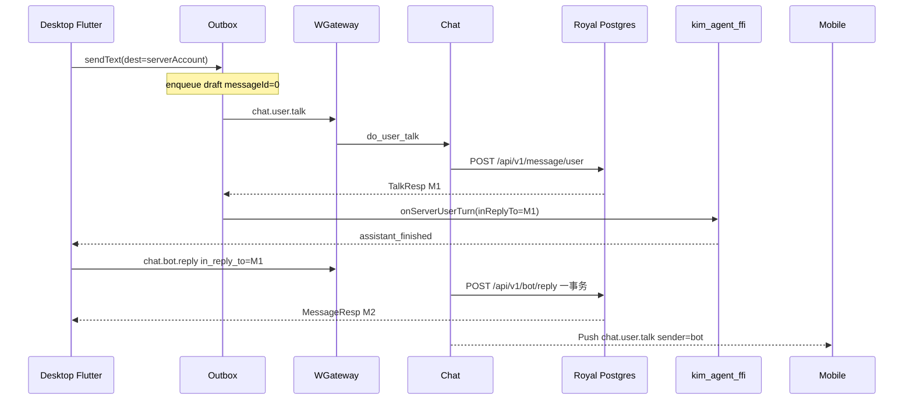
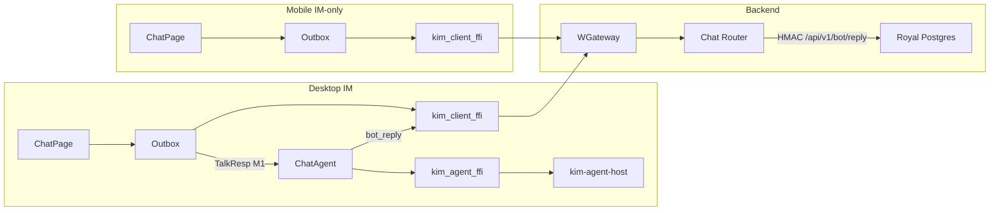

# 端侧 Goose Agent 的后台 Bot 一等公民身份

| Field | Value |
|---|---|
| Author | KIM Agent Working Group |
| Date | 2026-09-11 |
| Status | Draft |
| Audience | 实现 Goose × Chat 社交身份衔接的资深工程师 |
| 推翻 | `docs/impl/goose-personalized-agents.md` Non-goal「把本地 Agent 消息发到 WGateway」——**仅 1:1 用户↔agent**；群 `@mention` 仍本机 |
| 保留 | 端侧执行；`kim_agent_ffi` 与 `kim_client_ffi` 永不合并；不服务端代跑 Goose |

---

## Overview

今天桌面 Goose 是本地合成联系人：`dest=goose` / `agent:<profile_id>`，`ChatAgent._appendLocal` 只写 `ConversationStore`，`OutboxNotifier._assertCanQueue` 拒绝 agent dest，消息不到 WGateway，手机看不到。后台已经为 bot 留了槽位——`users.kind` / `owner_account`（`0011_user_kind.sql`）、`UserProfile.kind`、`PROFILE_KIND_BOT=2`、搜索排除 bot——但 `UserRecord.owner_account` 仍标着 **"Wired when create-bot lands."**，没有创建命令、没有自动成友、没有代发。

本设计让「创建 Agent」在 Chat 落一行 `users(kind=bot)` + 一条 `friendships(owner, bot)`，1:1 消息走现有 `chat.user.talk` 写扩散。Goose 仍只在桌面 `kim_agent_ffi` 跑；回复由**创建者 session 代发** `chat.bot.reply`（sender=bot）。生产落库必须走 Royal **一条 HMAC RPC** 在同一事务里写 `bot_turns` + `insert_user`。手机 / Web 用现成 `inbox.list` / `history` / talk Push 查看与发送。Bot **不登录、无 JWT、无 Location**。桌面补跑走客户端可见的 `chat.bot.pending`，不扫看不见的 `bot_turns` 表。

---

## Background & Motivation

### 当前状态（代码，不是愿望）

| 层 | 现状 | 证据 |
|---|---|---|
| 产品文档 | 本地 Agent，消息不发 WGateway | `docs/agent-goose.md:18` |
| 个性化设计 | Non-goal：不发 WGateway；群 mention 不 fan-out；「明确不改」含 kim-client / chat / royal | `docs/impl/goose-personalized-agents.md:100,107` 与文内「明确不改」表 |
| 后台 schema | `kind IN ('user','bot')`，`owner_account` 默认 `''` | `services/chat/migrations/0011_user_kind.sql` |
| 用户目录 | `UserProfile.kind`；search `AND kind = 'user'`；Memory 测了 bot 不可搜 | `users.rs` `search` / `memory_profile_exposes_bot_kind` |
| exists 缓存 | `CachedUserDirectory` 只缓存 `bool`，TTL 默认 30s | `social_cache.rs:13-14,278-294` |
| 好友 | 申请/接受/列表；无自动成友给 bot；Royal `product::friend_request` 无 kind 闸 | `friends.rs` / `social.rs` / `product.rs:106-121` |
| 私聊 | dest 必须存在；非好友 `NotFriends=109`；filter 在 insert 前 | `talk.rs` `do_user_talk` |
| 生产写路径 | Chat `HttpMessageStore.insert_user` → HMAC `POST /api/v1/message/user` | `royal.rs:242-279` |
| Push | `persist_then_push` 调 `ctx.dispatch`，**复制 inbound command** | `talk.rs:314+`；`context.rs:85-91` |
| 登录 | Royal `/api/v1/auth/login` 靠 `password_hash`；NULL → 401 | `services/royal/src/auth.rs:224-243` |
| 账号规则 | `[A-Za-z0-9_]{3,32}`；`:` / `-` 非法；**`goose` 合法** | `royal/src/auth.rs:34-43` |
| 端侧 dest | `AgentProfile.dest` 是 getter（`goose` / `agent:<id>`），无 `serverAccount` | `agent_profiles.dart:168` |
| `_profileForDest` | 只认 `goose` 与 `agent:` 前缀 | `chat_agent.dart:117-135` |
| 出站 | `_assertCanQueue` 对 `isAgentDest` 抛 `Copy.agentLocalOnly` | `outbox.dart:340-343` |
| `sendText` | 返回 `enqueue` 的 draft（`messageId=0`）；真 id 在 `_sendOne` 的 TalkResp | `outbox.dart:79-85,213-230` |
| 助手句 | `assistant_finished` / `failed` **永远** `_appendLocal` | `chat_agent.dart:166-175` |
| 运行时 | 仅桌面编 `kim_agent_ffi` | `host_support.dart` `agentHostSupported` |
| 写扩散 | 1 content + 2 index；Push recipients = 双方 `account_a` | `store/mod.rs` `insert` / `fanout_from_write` |
| 1:1 Push dest | kim-client 用 `push.sender` 当线程 id | `crates/kim-client/src/wire.rs:376-380` |
| Web 1:1 | Push 设 `receiver = this.account`；`threadOf` 在 `sender===me` 时用 `receiver` | `sdk/web/src/client.ts:791-800`；`app/lib/chat.ts:30-38` |
| `kim_talk_total` | labels 是 `service_id, service_name, kind`；`receive` 只对 user/group 调 `on_talk` | `kim-metrics/src/lib.rs:116-119,364-367`；`lib.rs:671-675` |
| `decode_event` | 无 account 参数；调用点：`pump.rs:224`、`client.rs:163,527,599,604`、`tests.rs` | `wire.rs:257-265` |

痛点：手机是 IM-only 却看不到助手会话；通讯录「本地 Agent」是客户端注入，不是 `chat.friend.list`；`owner_account` 从未写入。

### 产品必须全部覆盖

1. Agent 仍端侧执行，不改成服务端代跑 Goose。
2. 用户↔Agent 消息必须经过后台，mobile / 其它设备可查看。
3. 创建 Agent → `users` 行 `kind=bot`。
4. 该身份出现在好友 list。
5. 本阶段只自动成友创建者；其它用户不能添加 Agent。

---

## Goals & Non-Goals

### Goals

- 创建者调用 `chat.bot.create`，Royal 事务插入 bot 用户 + owner↔bot 好友。
- 1:1 dest = 服务端分配的稳定 bot account；走 `chat.user.talk` / inbox / history / ACK。
- 创建者桌面 Goose 跑完后，用 `chat.bot.reply` 代发；生产经 `POST /api/v1/bot/reply` **一事务**写 `bot_turns` + content。
- 桌面补跑调用 `chat.bot.pending`（客户端可见的未回复用户 `message_id` 列表）。
- `chat.friend.list` 返回 `UserProfile.kind=2`；客户端通讯录以服务端好友为准。
- 搜索、非 owner 社交/talk、bot 登录：用代码路径拒绝（非 owner 一律 108）。
- Profile / API key / 工具配置仍只在本机。
- 增量 PR，每 PR 可独立合入且**不会留下「只发不回」空窗**；rust-strict。

### Non-Goals

- 服务端代跑 Goose / 云端多租户 Agent runtime。
- 合并两条 FFI。
- 其它用户搜索、申请、加 bot 为好友。
- Bot 登录、JWT、Location、假 session。
- 群 / 真人线程 `@mention` 的 Agent 回复 fan-out（保持 `_appendLocal`）。
- 把本地未同步的 `goose` 历史批量上传（**不导入**，KD 24）。
- 账号注销级联（G-20 后半仍开；本设计只规定不变量）。
- 两桌面 runtime 租约（**本切片延期**，KD 25）。
- Bot 进群（**本阶段禁止**，KD 26）。群 `@mention` 仍本机 `_appendLocal`。
- OS sandbox、把 `AgentUiEvent` 改成 enum。
- 已注册 1:1 把图片喂给 Goose、把工具确认卡同步到其它设备、在 bot 线程里再跑 `@mention`。

---

## Key Decisions

1. **代发选 B：`chat.bot.reply`，创建者 session 冒充 bot。** 拒绝 A（bot 双 session 登录）与 C（服务端 Goose）。校验 `session.account == users.owner_account` 且 dest 是该 bot。
2. **创建走 Chat 长连接 `chat.bot.create`，不走 Royal 公开注册。** 与 `chat.group.create` 同构。Chat handler **只**调 `UserDirectory::create_bot`（见 KD 20）。Bot 禁止 `POST /api/v1/auth/register|login`。
3. **服务端分配稳定 account：`b_` + `base36_upper(snowflake)`。** 两件分开的事：（1）`valid_account` 只允许 `[A-Za-z0-9_]{3,32}`，所以本地 `agent:<id>` 和带 `-` 的 `p-171000` **不能**当 dest；（2）`goose` **能**通过校验，真人可以注册这个号，因此 **产品上禁止**把 `goose` 写成 bot account（撞号 + 无法表达多 persona），不是校验器拒绝。客户端判定 bot 用 `KimPerson.kind==bot` / `AgentProfile.serverAccount`，**禁止**用 `b_` 前缀（人类也能注册 `b_xxx`）。幂等键 `(app, owner_account, client_profile_id)`。
4. **Bot 无密码、不发 JWT、不进 Location。** `password_hash` 保持 NULL；Royal login 对 `kind=bot` 一律 401；`do_sys_login` 发现 bot 拒绝 `add` loc。
5. **自动成友直接写 `friendships`，不走 `chat.friend.request`。** Bot 无法 accept。`ordered_pair` 仍要求 `account_a < account_b`。
6. **非 owner 对 bot 的 talk / profile / request / remove / block 统一 `UserNotFound=108`。** 不泄露「这是 bot」。`BotSocialDenied=113` **只**留给 **owner** 误用 `friend.remove` / `block` / `friend.request`（应走 `chat.bot.delete`）。Royal `product` 与 Chat 同步闸。
7. **1:1 切到真实 dest 后禁止双写。** 已注册 bot 不再 `_appendLocal` 用户句与助手句；出站走 Outbox。未注册 profile 与群 mention 仍本地。
8. **必须修 1:1 echo 的线程 dest（kim-client **和** web 都是必修）。** kim-client：`sender == me` 则 dest = `Header.dest`。Web：1:1 Push 必须 `message.receiver = pkt.dest`（今日写成 `this.account`，echo 会进自己线程）。
9. **`persist_then_push` 只增加 `push_command`。** locs 仍 `get_locations(fanout.recipients)`（今日 `talk.rs:337-349`：1:1 `fanout_from_write` 含 **sender 与 dest**，发送方其它设备才能收到 echo）。**禁止**用 `[receiver]` 替换这组账号——手机给 bot 发时 receiver=bot、bot 无 loc，否则任何设备都收不到 Push。pending / `online_targets` 才是收件方：`do_user_talk` 保持 `fallback_targets(&[receiver])`（`talk.rs:152`）；`do_bot_reply` 设 `online_targets = fallback_targets(&[owner])`。bot.reply 的 Push command 必须是 `chat.user.talk`（`dispatch` 默认复制 inbound，会变成 `chat.bot.reply`）。`do_group_talk` 签名跟着加 `push_command`，recipients 仍是成员账号，不是 group id。Response 仍是 `chat.bot.reply`。
10. **一用户句最多一条 bot 回复：`in_reply_to` 唯一，且 v1 拒绝 `in_reply_to <= 0`。** 服务器不区分 Goose 与手写；空引用一律 `InvalidPacketBody=101`。UI「以助手身份说话」另开 RFC。两桌面竞态第二次返回已有 `messageId`。
11. **Runtime 只有桌面 `kim_agent_ffi`。** 手机 / Web 是 IM-only。发送永不因「助手不在线」失败。每个已注册 `serverAccount` **一条 FIFO**（`(text, inReplyTo)`），live echo / TalkResp 钩子 / `chat.bot.pending` 都入队、按 `message_id` 去重；一次只 prompt 一条；`assistant_finished` 只用队头的 `inReplyTo` 调 `bot_reply`。禁止单槽 `pendingInReplyTo` + `unawaited` 覆盖。
12. **后台不存 API key / 工具 / Goose 配置。** 工具确认卡仍本机，跨设备不可审批。
13. **生产 `bot_turns` 与 content 必须在 Royal 同一事务。** HMAC `POST /api/v1/bot/reply`。Chat 的 `HttpMessageStore` 没有 bot 表句柄，禁止 Chat 先 `insert_user` 再另写 `bot_turns`。
14. **补跑合同是 `chat.bot.pending`，不是客户端扫 `bot_turns`。** `HistoryItem` 没有 `in_reply_to`。pending 返回该 bot 上尚未回复的 owner 用户句（id + body）。本机 watermark 只是优化，权威在服务器。
15. **`agent.server_identity` 默认 false，直到身份 + Outbox + Goose 代发 **同一客户端 PR** 就绪。** 禁止「先停 `_appendLocal`、后接 `bot_reply`」的空窗。
16. **talk 热路径用缓存的 `{exists, kind, owner}`，不每条多一跳 `bot_owner` RPC。** 扩展 `/internal/user/lookup`（`AccountExists` 加字段）与 `CachedUserDirectory`。TTL 与现 social 相同（默认 30s，`KIM_SOCIAL_CACHE_TTL_MS`）。
17. **`do_bot_reply` 与 `do_user_talk` 走同一 `ContentFilter`。** 失败 `ContentBlocked=106`。Owner 代发不是绕过滤的通道。
18. **`chat.bot.delete` 后：好友消失、inbox/历史保留只读、再发送 108、本机清 `serverAccount` 保留 profile。** 不复活合成 `dest=goose` 去顶替仍存在的 `b_XXX` inbox 行。
19. **已注册 1:1 只把 text 同步并喂 Goose。** 图片可出站但不 prompt；bot 线程忽略 `@mention`；工具卡本机。
20. **创建时 Chat 只调 `create_bot`。** Memory 经注入的 `SocialDirectory` 内部 `ensure_friends`；Http/Royal 在 `/api/v1/bot` 内完成。`ensure_friends` 不作为 Chat handler 的第二次调用。
21. **个性化文档「明确不改 kim-client / chat / royal」必须在 Chat 行为变更的同一 PR 划掉。** 不能拖到文档扫尾 PR。隔离本身保留：Goose 仍 `kim_agent_ffi`，代发走 Dart → `kim_client_ffi`。
22. **`chat.bot.create` 两条路径，不是一律「第一次打开会话」。** flag 打开且已登录时：**(a) 新建 profile**（设置页「创建/配置 Agent」保存成功，含 `duplicate()` 得到的新 id）→ **立刻** `chat.bot.create`，写回 `serverAccount`，自动成友；**(b) 已有 profile**（打开时已在 `agent.profiles` 里、`serverAccount` 仍空，包括当前「助手」/goose）→ **第一次打开该助手 1:1 会话**才 create。判定：「这次操作是否新建了一个 profile」vs「打开一个已经存在、尚无 `serverAccount` 的会话」。不在每次 login 对全部 profile 静默 ensure。幂等键仍是 `(owner, client_profile_id)`。
23. **桌面离线时手机 UI 静默。** 发送不失败、不弹窗、不顶栏。桌面上线后 `chat.bot.pending` 补跑。**不为此加 l10n 文案。**
24. **旧 `dest=goose` 历史不导入服务器。** 旧本地会话留在该设备；新 `b_XXX` 会话从服务器空开始。不 rewrite `ConversationStore` 行。
25. **两桌面 runtime 租约本切片不做。** v1：`bot_turns` + `pending` 去重落库，接受可能双倍 LLM。
26. **本阶段禁止 bot 进群。** `group.create` 已忽略非 owner members（`group.rs:55-58`）。群 `@mention` 仍 `_appendLocal`。进群另开 RFC。

---

## Proposed Design

### 目标数据流

```text
Flutter composer（agent.server_identity=true 且已注册）
  ├─ 1:1 dest=serverAccount
  │     └─► Outbox.enqueue（draft messageId=0）
  │           └─► _sendOne TalkResp.messageId=M1
  │                 └─► ChatAgent.onServerUserTurn(dest, text, inReplyTo=M1)
  │                       └─► kim_agent_ffi prompt
  │                       └─► assistant_finished → kim_client_ffi chat.bot.reply
  │                             └─► Chat HMAC POST /api/v1/bot/reply（一事务）
  │
  └─ 群/真人 @mention / 未注册本地 dest
        └─► 仍 ChatAgent._appendLocal
```

### 身份与创建

#### 命令放哪、谁鉴权

| 项 | 选择 |
|---|---|
| 入口 | Chat 长连接 `chat.bot.create` / `delete` / `update` / `reply` / `pending` |
| 鉴权 | WGateway JWT Accept 之后的 `session.account`（与 `chat.group.create` 相同，`group.rs:51-54`） |
| 落库 | 生产：Chat HMAC → Royal `/api/v1/bot`、`/api/v1/bot/reply`、`/api/v1/bot/pending`（**不是**公开 `/api/v1/auth/*`） |
| 为何不 Royal Bearer HTTP | 好友 / talk / profile 都是 Chat command |
| 为何不 bot 走 `users.create` | `create` 要 `password_hash`；`HttpUserDirectory.create` 已是 `"create is royal-only"`（`royal.rs:702-709`） |

`service_name("chat.bot.create")` 第一段是 `chat`，网关现有 `forward("chat")` 不用改（`wire.rs:76-80`）。

#### 账号命名空间与映射

```text
AgentProfile.id            本机稳定 id，如 "goose"、"p-171000"
AgentProfile.dest          getter，仍是 goose / agent:<id>（mention / Goose session 键）
AgentProfile.serverAccount 字段，空=未注册；非空=服务端 account
IM dest / Header.dest      已注册后必须用 serverAccount
Goose session 键           仍是 (threadDest, profileId)；1:1 的 threadDest 是 serverAccount
判定 bot                   kind==2 或 profiles 里 serverAccount==dest；不用 b_ 前缀
```

生成：`format!("b_{}", base36_upper(idgen.next_id()?))`，复用 `directory.rs:140-153`。长度约 15，落在 3–32。展示用 nickname。

`_profileForDest` 必须增加：`serverAccount == dest` 命中对应 profile。否则 1:1 切到 `b_XXX` 会掉进默认 goose（`chat_agent.dart:117-135` 今日只认 `goose` / `agent:`）。

`personForProfile` / 打开会话：已注册用 `serverAccount` 当 `KimPerson.account` 与路由 id。

create 时机（flag 打开且已登录，KD 22）：

| 路径 | 判定 | 何时 `chat.bot.create` |
|---|---|---|
| **新建** | 设置页保存 **新** `AgentProfile.id`（`saveProfile` 插入、`duplicate()` 出新 id） | 本机 persist **成功后立刻**。失败则 profile 仍本地-only，可下次打开会话按「已有」路径补 |
| **已有** | 打开 1:1 时该 profile **已经在** `agent.profiles` 且 `serverAccount.isEmpty`（含默认「助手」/goose） | **第一次打开该 1:1 会话**。之后 `serverAccount` 非空，不再 create |

两条都幂等：返回的 `UserProfile.account` 写回 JSON `server_account`（不是 secret）。**不要**在 `ConnStatus.online` 时对全部 profile 扫一遍 ensure。

打开已有未注册会话时：create 成功后再把路由 dest 切到 `serverAccount`（旧 `goose` 本地行不搬）。新建路径：保存后通讯录 / 会话入口直接用 `serverAccount`。

#### `owner_account`

| 问题 | 答案 |
|---|---|
| 何时写 | 仅 `create_bot` INSERT；人类行保持 `''` |
| 谁可改 | **不可改**。没有 `chat.bot.transfer` |
| 谁可删 | `chat.bot.delete`：`session.account == owner_account` |
| 级联 | 该 bot 的 `friendships` / `friend_requests` / `blocks` / `bot_turns` |
| 消息 | `message_content` / `message_index` / `conversation_inbox` **保留** |
| 删后发送 | users 行已删 → `exists=false` → **108**（不是 109） |
| 删后打开 | inbox 行仍在，历史只读；composer 禁用。标题用缓存 nickname，没有则 account |
| 删后本机 | 清 `serverAccount`，**保留** `AgentProfile` 与 key。允许同一 `client_profile_id` 再 create（新雪花 account）。**禁止**在仍有 `b_XXX` inbox 时再注入合成 `dest=goose` 空线程 |
| 读路径 | 不进 `UserProfile` proto。内部 `lookup` / `bot_owner` |

#### 创建事务与幂等

幂等键：`(app, owner_account, client_profile_id)`。`client_profile_id` 校验 `[A-Za-z0-9_-]{1,64}`。

**单一调用图：**

```text
Chat do_bot_create
  └─ users.create_bot(app, CreateBot{ owner: session.account, ... })
        ├─ HttpUserDirectory → HMAC POST /api/v1/bot
        │     Royal 一事务：count≤20 → INSERT users → INSERT friendships ON CONFLICT DO NOTHING
        │     幂等命中：按 (app, owner, client_profile_id) SELECT，补 friendship，返回旧 account
        └─ MemoryUserDirectory
              必须 with_social(Arc<dyn SocialDirectory>)（e2e harness / 单测注入）
              内部 insert UserRecord + social.ensure_friends
              无 social handle → create_bot 返回 Backend（测试配置错误，不是生产路径）
```

Chat handler **禁止** `create_bot` 后再调 `ensure_friends`。`ensure_friends` 只是目录内部函数。

硬上限：`BOT_MAX_PER_OWNER = 20`。超出 → `InvalidPacketBody=101`。

#### Bot 不登录

| 路径 | 行为 |
|---|---|
| `POST /api/v1/auth/register` | 撞 bot PK → 409。拒绝 `kind=bot` 行被 `set_password` |
| `POST /api/v1/auth/login` | hash NULL 已 401；**再查 kind，bot → 401 同样文案** |
| `login.signin` | JWT `acc` 为 bot：不 upsert 成人类、不 `add` Location，`Unauthorized=105` |
| `users.upsert` | `ON CONFLICT DO NOTHING` + 默认 `user`；不得把 bot 改成 user |
| Location | bot 永不出现 |

### 消息路径（核心）

#### 用户 → Agent：现有 `chat.user.talk`

```
Header.command = chat.user.talk
Header.dest    = bot serverAccount
session        = 创建者（本阶段唯一合法发送方）
body           = MessageReq（clientId 仍由 Outbox UUID = draft.key）
```

`do_user_talk` 顺序：filter → **cached lookup `{exists,kind,owner}`** → block → friend → insert → persist_then_push。

闸：

1. lookup 不存在 → 108。
2. `kind==bot` 且 `session.account != owner` → **108**（在 is_friend 之前，避免 109 泄露）。
3. `kind==bot` 且是 owner → 继续 friend 检查（创建时已写入）。
4. 不为 bot 造 session。insert 仍 Success。

写扩散不变。Bot 永不 ACK。`fallback_targets(&[receiver])` 对 bot 为空 loc → 无 bot 侧 `pending_delivery`。

#### 热路径缓存（KD 16）

今日 `CachedUserDirectory` 只存 `exists: bool`（`social_cache.rs`），`profile` / `bot_owner` 不缓存。生产每次 talk 多一次 Royal 会拉高 `kim_royal_rpc_seconds`，且吃掉 `DIRECTORY_BUDGET` 800ms（`talk.rs:84`）。

```protobuf
message AccountExists {
  bool exists = 1;
  int32 kind = 2;           // 0 缺省 → 当 user；1 user；2 bot
  string ownerAccount = 3;  // bot 才有；不要经 UserProfile 下发
}
```

`/internal/user/lookup` 一次返回。`CachedUserDirectory` 存 `UserPresence { exists, kind, owner }`，TTL 同 `social_ttl()`（默认 30s）。`exists()` 读 `presence.exists`。talk / friend 闸读同一条目。`create_bot` / `delete_bot` / `upsert` evict 该 key。

#### Agent 回复：`chat.bot.reply` + Royal 原子 RPC（KD 13）

```
Header.command = chat.bot.reply
Header.dest    = bot account
session        = owner
body           = BotReplyReq { message: MessageReq, in_reply_to: int64 }  // in_reply_to 必须 > 0
```

Chat `do_bot_reply`（`services/chat/src/bot.rs`）：

1. dest 空 → 300。
2. 解 `BotReplyReq`。`in_reply_to <= 0` → **101**（KD 10，无「手写例外」）。
3. `filter.check(&req.message)`，失败 **106**。
4. cached lookup：非 bot → 108；`owner != session.account` → **112**。
5. `InsertMessage.online_targets = fallback_targets(&[owner])`（**不是** header.dest=bot）。只影响 `pending_delivery`，不决定 Push 收件人。
6. `store.insert_bot_reply(...)` → 生产 `HttpMessageStore` HMAC `POST /api/v1/bot/reply`。fanout.recipients 仍是 `[bot, owner]`（写扩散两条 index）。
7. `persist_then_push(..., push_command=CMD_CHAT_USER_TALK)`。locs = `get_locations(fanout.recipients)`：bot 无 loc，owner 各设备收到 Push（发送 channel 仍被 `dispatch` 跳过）。
8. `ChatHandler::receive` 对 `chat.bot.reply` 调 `on_talk("bot")`。

Royal `/api/v1/bot/reply` **一个事务**：

```text
BEGIN;
-- 校验 in_reply_to：message_index 上 owner 对该 bot 的 direction=1 行，且 content.sender=owner
-- 否则 400（Chat 映射 InvalidPacketBody）

INSERT INTO bot_turns (app, bot_account, in_reply_to, reply_message_id)
VALUES (..., 0)  -- 占位或先锁
ON CONFLICT (app, bot_account, in_reply_to) DO NOTHING;

IF conflict THEN
  SELECT reply_message_id ...;  -- 幂等返回已有 fanout，不 insert_user
  COMMIT; return duplicate=true;
END IF;

-- 与 POST /api/v1/message/user 同一套 insert_user 写路径
-- sender=bot, dest=owner, client_id=MessageReq.client_id
-- 更新 bot_turns.reply_message_id
COMMIT;
```

两桌面不同 `client_id` 挡不住同一 `in_reply_to`；**只有 `bot_turns` PK 能挡**。Chat 不得拆成两次 HTTP。

`MessageStore` 新增：

```rust
async fn insert_bot_reply(
    &self,
    app: &str,
    owner: &str,
    bot: &str,
    in_reply_to: i64,
    req: &InsertMessage, // sender 必须是 bot，dest 必须是 owner
) -> Result<InsertResult, StoreError>;

async fn bot_pending(
    &self,
    app: &str,
    owner: &str,
    bot: &str,
    limit: i32,
) -> Result<Vec<BotPendingItem>, StoreError>;
```

Http / Memory / Postgres **三套都要实现**（含 `talk.rs` `FailStore` 等测试 stub）。Memory 的 `bot_turns` 放 `MemoryMessageStore::Inner`，与 content 同一把锁，模拟事务。

#### `persist_then_push` 签名（KD 9）

今日两件独立的事（`talk.rs:152` vs `talk.rs:337-349`）：

1. **`InsertMessage.online_targets`** ← `fallback_targets(&[receiver])`：只写 `pending_delivery`（收件方）。发送方其它设备 **没有** receipt，靠 Push echo。
2. **Push locs** ← `get_locations(fanout.recipients)`：1:1 含 sender **和** dest。`dispatch` 再跳过本 `channel_id`。

今日 `ctx.dispatch` 复制 inbound command（`context.rs:85-91`）。handler 若直接复用，Push 会变成 `chat.bot.reply`，`kim-client` 只把 `chat.user.talk` / `chat.group.talk` 的 **Push** 解成 `IncomingTalk`（`wire.rs:370-390`），手机丢回复。

```rust
async fn persist_then_push(
    ctx: &Context,
    inserted: &InsertResult,
    kind_label: &str,
    metrics: Option<&KimMetrics>,
    push_budget: Duration,
    push_command: &str, // user/group: inbound command；bot.reply: CMD_CHAT_USER_TALK
)
```

- locs：**仍** `unique_accounts(inserted.fanout.recipients)` → `get_locations`。**不要**加 `receipt_accounts` 去替换这组账号。
- Push：`dispatch_cmd(push_command, MessagePush { sender: fanout.sender, ... }, locs)`。
- `do_user_talk`：`push_command = ctx.header().command`（`chat.user.talk`）；`online_targets` 仍 `fallback_targets(&[receiver])`。与今日 Push/echo **等价**。
- `do_group_talk`：同样加 `push_command`（`chat.group.talk`）；recipients 仍是 **成员账号**，不是 Header.dest 的 group id。`online_targets` 保持今日对成员的 `fallback_targets`。
- `do_bot_reply`：`push_command = CMD_CHAT_USER_TALK`；insert 前 `online_targets = fallback_targets(&[owner])`。fanout.recipients = `[bot, owner]` → Push 打到 owner 各设备。
- e2e：alice **设备 1** `chat.user.talk` dest=bot，**设备 2** 必须收到 Push（`command=chat.user.talk`，修好 dest 后线程 dest=bot）。alice `chat.bot.reply`：Push `command=chat.user.talk`、`sender=bot`；`pending_delivery.account==owner`（不是 bot）。

#### 补跑：`chat.bot.pending`（KD 14）

`HistoryItem` 只有 `message_id / type / body / extra / sender / send_time / direction`（`events.rs:65-73`），没有 `in_reply_to`。客户端 **不能**扫 `bot_turns`。本机 watermark 不跨设备；第二台桌面若按「最后一条 bot 回复之后的用户句」启发式，连发会漏/乱配。

```
Header.command = chat.bot.pending
Header.dest    = bot account
session        = owner
body           = InboxReq.limit（默认 20，最大 50）
resp           = BotPendingResp { repeated BotPendingItem items }
BotPendingItem { int64 messageId; string body; int64 sendTime; }
```

语义：该 1:1 上 `sender=owner` 且 **没有** `bot_turns` 行的用户句，按 `message_id` 升序。非 owner → 112。非 bot → 108。

Royal SQL 大意：owner 对该 bot 的 `direction=1` index，LEFT JOIN `bot_turns` ON `in_reply_to = message_id`，WHERE turn IS NULL。

桌面：

| 场景 | 行为 |
|---|---|
| 本机刚 `TalkResp` | `onServerUserTurn` **入队** `(text, M1)`，不必等 pending |
| 其它设备 echo（修好 dest） | `IncomingTalk.sender==me` 且 dest 是自己的 bot → **入同一 FIFO** |
| 冷启动 / 重连 | `chat.bot.pending` 升序 **入同一 FIFO** |
| 本机 watermark | 入队前可跳过已成功 reply 的 id；**权威仍是 pending / bot_turns** |

v1 **接受**两桌面同时 prompt 造成双倍 LLM；落库仍一条。不做 `chat.bot.claim`。

`offline.index` 只拉 `direction=0`，自己从手机发出的在 owner 侧是 `direction=1`，**不能**当补跑源。这一点仍然成立，只是补跑 API 换成 pending。

#### 完整 sequence（桌面在线，本机发送）



### Flutter runtime 接线（对照今日代码）

今日三处会让「只改 sendText」落地失败：

1. `_ensureSession` 的 listen 对 `assistant_finished` / `failed` **无条件** `_appendLocal`（`chat_agent.dart:166-175`）。
2. `_profileForDest` 不认 `serverAccount`。
3. `outbox.sendText` = `enqueue`，返回 draft；`result.messageId` 在 `_sendOne`（`outbox.dart:213-230`）。发送 channel 被 `dispatch` 跳过，本机也收不到 echo。

**规定（同一客户端 PR，flag 打开后）：**

每个已注册 `serverAccount` 一条 FIFO，元素 `(text, inReplyTo)`。现有 LRU 只限制 session 个数，**不**把同一 dest 的 prompt 排成 FIFO，必须另做。`kim-agent-host` 对忙会话返回 `HostError::Busy`，并发 prompt 会变成 failed 本地泡。

```dart
class _DestQueue {
  final queue = ListQueue<(String text, int inReplyTo)>();
  var pumping = false;
}

// 入队（TalkResp 钩子 / live echo / chat.bot.pending 三条路径共用）：
void enqueueTurn(String dest, String text, int inReplyTo) {
  final q = _queues.putIfAbsent(dest, _DestQueue.new);
  if (q.queue.any((e) => e.$2 == inReplyTo)) return; // message_id 去重
  q.queue.add((text, inReplyTo));
  unawaited(_pumpDest(dest));
}

Future<void> _pumpDest(String dest) async {
  final q = _queues[dest]!;
  if (q.pumping) return;
  q.pumping = true;
  try {
    while (q.queue.isNotEmpty) {
      final (text, inReplyTo) = q.queue.first; // 队头在 prompt 期间保留
      await _prompt(dest, text);               // 一次一条；Busy 视为失败
      // assistant_finished → bot_reply(inReplyTo: 队头)
      q.queue.removeFirst();
    }
  } finally {
    q.pumping = false;
  }
}

// OutboxNotifier._sendOne 在 persist sent 且 messageId != 0 之后：
if (agentHostSupported && flag && isOwnedRegisteredBot(msg.dest) && msg.isText) {
  ref.read(chatAgentProvider).enqueueTurn(msg.dest, msg.body, sent.messageId);
}

// ChatSessionNotifier.sendText：已注册 bot 只 outbox.sendText，禁止 sendDirect，
// 禁止在 await sendText 返回时 prompt。

// ChatAgent._ensureSession listen：
// dest 已注册：
//   assistant_finished → bot_reply(dest, text, inReplyTo: 当前队头)
//                        成功后 UI 靠 TalkResp/Push，禁止 _appendLocal 助手句
//   failed → 允许一条本地 sys 错误泡（不代发）；仍 pop 队头以免卡死
//   tool_* / action_required → 仍 _appendLocal / 本地卡（跨设备不可审批）
// dest 未注册或群 mention：保持今日 _appendLocal
```

**禁止**单槽 `_Live.pendingInReplyTo` 被第二次 `unawaited(onServerUserTurn)` 覆盖。**禁止** enqueue 成功就 prompt。测试：连续两条 TalkResp + `pending` 返回 3 条（去重后若含那两条则仍 3）→ 三次 `bot_reply` 的 `in_reply_to` 分别对应，且 `_prompt` 不并发。

图片：`sendImages` 今日不走 `isAgent` 分支。v1 已注册 1:1 **允许出站**（普通 IM 附件）但 **不** `onServerUserTurn`。Host 仍只吃 text。

`onOutgoingText`：`isRegisteredBotDest(dest)` 时 **忽略 mention**（避免 `b_XXX` 里打 `@助手` 再 prompt 一次）。群/真人 mention 不变。

缺 API key：已注册路径用本地 sys 泡提示去设置页，不 `bot_reply`。

**create 接线（flag 开，KD 22）：**

- `AgentProfilesNotifier.saveProfile` / `duplicate`：若这次是 **新 id**（保存前 list 里没有），persist 成功后立刻 `botCreate`。编辑已有 profile 的模型/key **不**再 create。
- `ChatSessionNotifier._start`（或打开页）：`isLocalOnlyAgentDest(dest)` 且对应 profile `serverAccount.isEmpty` → 调 `botCreate`，成功后 `go` 到 `serverAccount`（替换当前路由，避免同一屏双 dest）。
- 登录瞬间 **不**批量 create。

### 1:1 echo 修复调用点

`decode_event` 今日无 account（`wire.rs:257-265`），`decode_logic` 是其唯一入口。

```rust
pub fn decode_event(frame: &Frame, me: &str) -> Result<Event, ClientError>;
```

| 调用点 | 传入 me |
|---|---|
| `pump.rs:224` | live session.account |
| `client.rs:163` ping probe | `session().account`（空则旧行为：dest=sender） |
| `client.rs:527,599,604` | 同上 |
| `tests.rs` 全部 `decode_event` | 按断言传入 `"alice"` / `""` |

`me` 为空：保持旧行为（probe 不应收到 talk Push）。新测：同账号 echo，`sender=alice`、`Header.dest=bob`、`me=alice` → `IncomingTalk.dest==bob`。

**Response 分支必须认识 `chat.bot.reply`。** 今日只有 `chat.user.talk` / `chat.group.talk` 的 Flag=Response 会解 `MessageResp`→`Event::TalkResp`（`wire.rs:392-408`）。`bot_reply` 的 `write_wait` 若仍等 `TalkResp`，会超时或落到未匹配 Status，桌面拿不到 M2（发送 channel 本就被 dispatch 跳过，不能靠 Push 刷新自己的气泡）。PR4：

```rust
// decode_logic Flag=Response
command ∈ { CMD_CHAT_USER_TALK, CMD_CHAT_GROUP_TALK, CMD_BOT_REPLY }
  Success → Event::TalkResp { message_id, send_time, sequence }
  其它 status → Event::Status
```

`bot_pending` **不要**走这条：解 `BotPendingResp` 成独立 Event（或 `write_wait` 专用匹配）。单测：sequence 匹配的 `chat.bot.reply` Success → `TalkResult.message_id`。

**Web 必修**（不是「若同样则一起修」）：

今日 `client.ts:791-800`：`message.receiver = this.account`。`threadOf`（`chat.ts:30-38`）在 `sender===me` 时返回 `receiver` → echo 进自己。改为 1:1 `message.receiver = pkt.dest`（group 仍用 `message.group = pkt.dest`）。加测试。

### 多设备

**查看：** `inbox.list` / `history` dest=serverAccount。`kind=2` 画徽标。

**手机发：** `agentHostSupported==false`，Outbox。桌面靠修好的 echo 或 pending。

**桌面离线（KD 23）：** 手机发送照常 Success，**静默**——不弹窗、不顶栏、不加 l10n。桌面上线后 `chat.bot.pending` 入 FIFO 补跑。

### 与本地路径迁移

| 阶段 | 1:1 dest | 用户句 | 助手句 |
|---|---|---|---|
| flag 关 / 未注册 | `goose` / `agent:<id>` | `_appendLocal` | `_appendLocal` |
| flag 开且已注册 | **只** `serverAccount` | Outbox；`_sendOne` 后 prompt | `bot_reply`；禁止 `_appendLocal` 助手句 |
| 群 / 真人 `@mention` | 人类 dest | Outbox | `_appendLocal` |

`isAgentDest` **不要**把服务端 account 算进去。

旧 `dest=goose` 行 **不 rewrite、不导入**（KD 24）。该设备仍看得到旧本地会话；新 `b_XXX` 线程从服务器空历史开始。手机只看见注册之后的服务器消息。

### 好友与列表

| 操作 | 非 owner | owner |
|---|---|---|
| `chat.friend.list` | 不含别人的 bot | 含自己的 bot，`kind=2` |
| `chat.friend.request` dest=bot | **108** | **113**（应 delete） |
| `chat.friend.remove` dest=bot | **108** | **113** |
| `chat.block.*` dest=bot | **108** | **113** |
| `chat.user.talk` dest=bot | **108** | Success（已是好友） |
| `chat.user.profile` dest=bot | **108** | 返回 profile |
| `chat.user.search` | 不含 bot（现 SQL） | 不含 bot |
| `chat.bot.reply` / `delete` / `update` / `pending` | **112**（reply/delete/update/pending 需要 owner；非 bot 用 108） | 正常 |

Royal `product::friend_request` / `accept` / `remove` / `block`：peer 为 bot 时对 **调用方 account ≠ owner** 返回 not found（Chat 映射 108）；owner 返回 403 类 → Chat 113。HMAC 内部口不能绕过。

`ContactsState.isFriend`：服务端 list 已含 bot 则 true；本地-only dest 仍短路径 true。

### 与个性化 Goose 设计的关系

| 决策 | 本设计 |
|---|---|
| dest=`agent:<id>`、本地 `KimPerson` | **修订（1:1）**：IM dest = `serverAccount` |
| `_appendLocal` | **修订（1:1 已注册）**：停用户句与助手句。工具卡仍本地 |
| Non-goal「消息发 WGateway」 | **推翻，仅 1:1** |
| Non-goal 群 mention 不 fan-out | **保留** |
| 两条 FFI 不合并 | **保留** |
| Profile / keychain | **保留** |
| `MachineFactory` / ToolSet | **不改** |
| 「明确不改」`crates/kim-client/**`、`sdk/mobile/rust/**`、`services/chat` / `royal` | **删除这三行**（KD 21）。在 **PR3** 回写 `docs/impl/goose-personalized-agents.md`，不要等到文档扫尾 PR |

### 新 / 改接口

#### proto

```protobuf
enum Status {
  // 0–111, 300, 404 不改号
  NotBotOwner = 112;
  BotSocialDenied = 113; // 仅 owner 对自家 bot 误用好友/拉黑
}

message AccountExists {
  bool exists = 1;
  int32 kind = 2;
  string ownerAccount = 3;
}

message BotCreateReq {
  string clientProfileId = 1;
  string nickname = 2;
  string avatar = 3;
  string bio = 4;
}
message BotCreateResp { UserProfile profile = 1; }

message BotReplyReq {
  MessageReq message = 1;
  int64 inReplyTo = 2; // 必须 > 0
}

message BotPendingItem {
  int64 messageId = 1;
  string body = 2;
  int64 sendTime = 3;
}
message BotPendingResp { repeated BotPendingItem items = 1; }
```

`UserProfile` **不加** `owner_account`。112/113 是 1xx：`isRetryable` 不重试。

#### wire.rs

```rust
pub const CMD_BOT_CREATE: &str = "chat.bot.create";
pub const CMD_BOT_DELETE: &str = "chat.bot.delete";
pub const CMD_BOT_UPDATE: &str = "chat.bot.update";
pub const CMD_BOT_REPLY: &str = "chat.bot.reply";
pub const CMD_BOT_PENDING: &str = "chat.bot.pending";
```

`COMMANDS` 29 → 34。`receive`：`CMD_BOT_REPLY` → `on_talk("bot")`。`kim_talk_total` 的 label 是 **`kind`**（`user|group|bot`），不是 `command`。`kim_handler_duration_seconds` 才用 `command`。

#### UserDirectory / MessageStore

```rust
async fn create_bot(&self, app: &str, req: &CreateBot) -> Result<UserProfile, UserError>;
async fn bot_owner(&self, app: &str, account: &str) -> Result<Option<String>, UserError>;
async fn delete_bot(&self, app: &str, owner: &str, account: &str) -> Result<(), UserError>;
async fn count_bots(&self, app: &str, owner: &str) -> Result<u32, UserError>;
async fn lookup(&self, app: &str, account: &str) -> Result<Option<UserPresence>, UserError>;
// UserPresence { exists 隐含于 Option, kind: i32, owner_account: String }

// MessageStore
async fn insert_bot_reply(...) -> Result<InsertResult, StoreError>;
async fn bot_pending(...) -> Result<Vec<BotPendingItem>, StoreError>;
```

impl 必须补：Memory / Postgres / Cached / Http UserDirectory；`CountExists`；MessageStore 的 Memory / Postgres / Http / `FailStore`。

Cached `lookup` 命中则不再打 Royal。`bot_owner` 可走同一缓存。

HttpUserDirectory：

| 方法 | RPC |
|---|---|
| `create_bot` | `POST /api/v1/bot` |
| `delete_bot` | `DELETE /api/v1/bot` body AccountPair |
| `insert_bot_reply`（在 HttpMessageStore） | `POST /api/v1/bot/reply` |
| `bot_pending` | `POST /api/v1/bot/pending` |
| `lookup` | `POST /internal/user/lookup`（扩展后的 AccountExists） |

#### kim-client

```rust
bot_create / bot_delete / bot_update / bot_reply / bot_pending
```

`bot_reply` 等 command=`chat.bot.reply` 的 `TalkResp`（PR4 必须把该 command 加进 `decode_logic` 的 Response 分支，见上）。`bot_pending` 等自己的 Resp 类型。FFI + Dart `KimClientPort` 同步加。

### 架构图



---

## Data Model Changes

```sql
-- services/chat/migrations/0012_bot_identity.sql

ALTER TABLE users
    ADD COLUMN client_profile_id TEXT NOT NULL DEFAULT '';

CREATE UNIQUE INDEX users_bot_owner_profile
    ON users (app, owner_account, client_profile_id)
    WHERE kind = 'bot' AND client_profile_id <> '';

CREATE INDEX users_bot_owner
    ON users (app, owner_account)
    WHERE kind = 'bot';

CREATE TABLE bot_turns (
    app TEXT NOT NULL,
    bot_account TEXT NOT NULL,
    in_reply_to BIGINT NOT NULL,
    reply_message_id BIGINT NOT NULL,
    created_at TIMESTAMPTZ NOT NULL DEFAULT now(),
    PRIMARY KEY (app, bot_account, in_reply_to)
);
```

`0011` 已有 `kind` / `owner_account`。人类行 `client_profile_id=''` 不进唯一索引。不剪 bot 的 `message_index`。

回滚：drop `bot_turns` + 新索引 + 列；不自动 DELETE bot 用户行。

Memory：`UserRecord` 去掉 `#[allow(dead_code)]`，补 `client_profile_id`；`MemoryMessageStore::Inner` 加 `bot_turns`。

---

## API / Interface Changes

见 Proposed Design「新 / 改接口」。热路径前后对比：

| | 今日 | 之后 |
|---|---|---|
| 1:1 talk 目录 | `exists` bool 缓存 | `lookup` `{exists,kind,owner}` 同 TTL |
| bot 回复落库 | 无 | `insert_bot_reply` → `/api/v1/bot/reply` 一事务 |
| Push command | inbound 原样（`dispatch` 复制） | bot.reply 强制 `chat.user.talk`；user/group 仍 inbound |
| Push locs | `get_locations(fanout.recipients)` | **不变**（1:1 含 sender+dest） |
| pending receipt | `fallback_targets([receiver])` / 群成员 | bot.reply 改为 `fallback_targets([owner])` |
| 客户端 1:1 echo dest | dest=sender | dest=Header.dest when sender==me |
| `chat.bot.reply` Response | 无（不解 TalkResp） | 与 user/group talk 一样解 `TalkResp` |

---

## Alternatives Considered

### 1. 代发机制

| 方案 | 优点 | 缺点 | 结论 |
|---|---|---|---|
| A. Bot 登录双 session | 复用 talk sender | JWT/Location/互踢 | **拒绝** |
| B. Owner `chat.bot.reply` | 绑定 owner | 新命令 | **选定** |
| C. 服务端 Goose | 手机离线也能回 | 产品拒绝 | **拒绝** |
| D. talk 加 impersonate | 少命令 | 污染热路径 | 拒绝 |

### 2. 账号分配

| 方案 | 优点 | 缺点 | 结论 |
|---|---|---|---|
| 本地 `goose` / `agent:id` | 少映射 | `:` `-` 非法；`goose` 撞号 | **拒绝** |
| 用户自选 bot 账号 | 好看 | 抢注 | 拒绝 |
| `b_` + 雪花 | 稳定合法 | 不可读；人类也能叫 `b_foo` | **选定**；判定靠 kind 不是前缀 |

### 3. 补跑合同

| 方案 | 优点 | 缺点 | 结论 |
|---|---|---|---|
| (a) `chat.bot.pending` | 客户端可见、精确未回复集合 | 新命令 | **选定** |
| (b) `in_reply_to` 写入 `extra` | history 可扫 | 与图片 extra JSON 冲突；旧行无字段 | 拒绝作权威 |
| (c) 仅本机 watermark | 零协议 | 不跨设备；第二台全量再跑 LLM | 仅作优化 |

### 4. 创建编排

| 方案 | 优点 | 缺点 | 结论 |
|---|---|---|---|
| Handler 连续 `create_bot` + `ensure_friends` | Memory 简单 | Http 双 RPC、非原子 | **拒绝** |
| 只调 `create_bot` | 单一调用图 | Memory 要注入 social | **选定** |

### 5. 桌面唤醒

修 echo + live talk + pending 冷启动。假 Location **拒绝**。

---

## Security & Privacy Considerations

| 威胁 | 严重度 | 缓解 |
|---|---|---|
| 任意用户 `chat.bot.reply` 伪造 sender | **高** | owner 校验；112；e2e |
| 猜到 `b_XXX` 加好友/私聊 | 中 | 非 owner **一律 108**（含 request/remove/block）；search 排除；Royal product 同步闸 |
| 空 `in_reply_to` 刷屏 | 中 | v1 一律 101 |
| Bot 走 `login.signin` | 高 | 无 hash；login HTTP + `do_sys_login` 双拒 |
| JWT 密钥泄露后 `acc=bot` | 高（全局失陷） | 仍拒 Location |
| API key 进后台 / 日志 | 高 | 创建 body 无 key；不打 body |
| 代发绕 ContentFilter | 中 | `filter.check` 与 talk 相同 |
| Owner 设备被盗 | 中 | 与盗号发 talk 同等；`token_epoch` |
| 两桌面双 LLM | 低 | `bot_turns` 去重落库；不做 lease |
| `in_reply_to` 引用别人的消息 | 中 | 必须是 owner→该 bot 的用户句 |
| 删除 owner 后 bot 孤儿 | 中 | 注销 RFC：`DELETE users WHERE owner_account=$acc AND kind='bot'` |
| 速率 | 低 | `on_talk("bot")` 计数；无 per-user 配额。若以后加 limiter，计入 **owner** |

---

## Observability

| 信号 | 用法 |
|---|---|
| `kim_handler_duration_seconds{command=chat.bot.*}` | `COMMANDS` +5 |
| `kim_talk_total{kind="bot"}` | `receive` 里 `on_talk("bot")`。**不是** `{command=...}` |
| `kim_dispatch_fail_total{kind="bot"}` | `persist_then_push` 的 `kind_label` |
| `kim_bot_create_total{result=created\|idempotent\|limit\|error}` | Royal |
| `kim_bot_reply_denied_total{reason=not_owner\|not_bot\|bad_reply_to\|filtered}` | Chat |
| 日志 | `owner, bot_account, profile_id, message_id, in_reply_to`；永不打 key / body |

---

## Rollout Plan

1. **后台先合**（PR1–PR3）：旧客户端不发新 command，1:1 仍本地。
2. **kim-client + web echo**（PR4）：真人多端 bugfix，可先于 Flutter flag 打开。
3. **Flutter 同一 PR 落地身份 + Outbox + runtime**（PR5）。`agent.server_identity` **默认 false**。打开后：新建 profile 立刻 create；已有 profile 第一次打开 1:1 才 create；停已注册 1:1 的 `_appendLocal` 并接 `bot_reply`。没有「只发不回」的中间合入。手机离线桌面时静默，无新文案。
4. **回滚：** 关 flag → `_appendLocal` + 拒绝本地 dest 出站。服务器 bot 行保留；再打开幂等命中同一 `client_profile_id`。
5. **不要**回滚 migration。
6. 不插队 B0。Bot 无 loc，不产生 bot 侧 receipt；owner 侧与普通 talk 相同。

---

## 实现约束

- rust-strict：无 `unwrap`/`expect`；`BotError` 类型化。
- `do_sys_login` 拒 bot → 105，不是 99。
- 测试 mock 同步加 trait；生产 impl 必须实装 `insert_bot_reply` / `bot_pending`。
- e2e：`services/chat/tests/e2e_bot.rs`。
- Flutter：`chat_agent_test` 覆盖「TalkResp 之后才入队」「FIFO 一次一条、`in_reply_to` 对队头」「assistant_finished 走 bot_reply 不 `_appendLocal`」；outbox 允许 `kind=bot` 好友 dest。
- PR3 **必须**回写个性化文档「明确不改」表。

---

## 测试契约

| 用例 | 期望 |
|---|---|
| create bot | `kind=bot`，`owner_account=alice`，hash NULL，自动好友 |
| 幂等 create | 同一 account |
| alice talk dest=bot | Success |
| alice 设备1 talk dest=bot，设备2 在线 | 设备2 收到 Push `command=chat.user.talk`，修好 dest 后线程 dest=bot（echo 来自 fanout.recipients 含 sender） |
| bob talk / request / remove / block / profile dest=bot | **108** |
| alice `friend.remove` dest=自家 bot | **113** |
| alice `chat.bot.reply` | Push command=`chat.user.talk`，sender=bot；`pending_delivery.account==owner`（不是 bot） |
| bob `chat.bot.reply` | **112**，无 insert、无 bot_turns |
| `in_reply_to<=0` | **101** |
| 相同 `in_reply_to` 两次（不同 clientId） | 同一 messageId，一条 content |
| reply 命中敏感词 | **106**，无 insert |
| `chat.bot.pending` | 只返回无 turn 的 owner 句；reply 后消失 |
| search | 不含 bot |
| login HTTP / signin JWT acc=bot | 401 / 105，无 Location |
| 超 20 | 101 |
| delete 后 talk | 108；history 仍可读 |
| Flutter flag 关 | 行为与今日相同 |
| Flutter flag 开 | enqueue 不 prompt；TalkResp **入队**后串行 prompt；finished 不 `_appendLocal` |
| Flutter 新建 profile | 设置页保存新 id 后立刻 `botCreate`，`serverAccount` 非空 |
| Flutter 已有 goose | 第一次打开 1:1 才 `botCreate`；登录不批量 ensure |
| 旧 goose 历史 | 本机仍在 `dest=goose`；`b_XXX` history 为空（不导入） |
| Flutter FIFO | 连续 2 条 TalkResp + pending 3 条（去重）→ 三次 `bot_reply` 的 `in_reply_to` 对应队头，不并发 prompt |
| kim-client `chat.bot.reply` Success | `Event::TalkResp.message_id`（不是超时 Status） |
| kim-client echo | me=alice, dest=bob → thread bob |
| web echo | `receiver=pkt.dest`，`threadOf` ≠ 自己 |
| 跨端 history | mobile 见 bot sender 气泡 |

---

## Open Questions

产品已拍板。下列不再作为未决项；实现按 **Resolved** 执行。

1. **何时 `chat.bot.create`？** **Resolved（KD 22，非单纯 C）。** 新建 profile：设置页保存成功后立刻注册。已有 profile（含「助手」/goose）：第一次打开该 1:1 会话才注册。不在 login 批量 ensure。
2. **桌面离线时手机 UI？** **Resolved = 静默（KD 23）。** 发送不失败、不弹窗、不顶栏、不加 l10n。桌面上线后 `chat.bot.pending` 补跑。
3. **旧 `dest=goose` 历史？** **Resolved = 不导入（KD 24）。** 旧本地会话留在设备；新 `b_XXX` 从服务器空开始。
4. **两台桌面 runtime 租约？** **Resolved = 本切片延期（KD 25）。** v1 用 `bot_turns` + pending 去重落库，接受可能双倍 LLM。
5. **Bot 进群？** **Resolved = 本阶段禁止（KD 26）。** 群 `@mention` 仍 `_appendLocal`。进群另开 RFC。

此前已升为 Key Decision：空 `in_reply_to`、delete 后本地 profile/inbox、补跑 API、Chat 只调 `create_bot`、flag 默认 false。

---

## Risks

| 风险 | 严重度 | 缓解 |
|---|---|---|
| 用 `[receiver]` 当 Push locs | **高** | 只加 `push_command`；locs 仍 fanout.recipients；双设备 e2e |
| 忘记修 echo dest（含 web） | **高** | PR4 必修两端；双 session e2e |
| 单槽 `pendingInReplyTo` 覆盖 | 高 | per-dest FIFO + 去重单测 |
| `_appendLocal` 仍接 finished | 高 | 与 TalkResp 接线同一 PR + 单测 |
| Chat 拆两次 RPC 写 turn | **高** | 只有 `insert_bot_reply`；Http 禁止调 `/message/user` 冒充 |
| 热路径每 talk 多一跳 | 中 | `lookup` 缓存 |
| `COMMANDS` / `on_talk("bot")` 漏 | 低 | 与 handler 同一 PR |
| 旧客户端不认识 kind=2 | 低 | proto3 0→人类 |
| bot index 无人 ACK | 低 | 无 bot 侧 pending 行 |

---

## References

- `docs/agent-goose.md`、`docs/impl/goose-personalized-agents.md`、`docs/impl/next-stage.md`
- `docs/user-social-inbox.md`、`docs/control-layer-chat.md`、`docs/reliable-delivery.md`
- `docs/observability.md`（`kim_talk_total` 的 `kind` label；`COMMANDS` 29）
- `services/chat/migrations/0011_user_kind.sql`
- `services/chat/src/users.rs`、`talk.rs`、`royal.rs` `HttpMessageStore::insert_user`
- `services/chat/src/social_cache.rs` exists 缓存
- `services/royal/src/auth.rs` `valid_account`；`product.rs` `friend_request`
- `crates/kim-router/src/context.rs` `dispatch` 复制 command
- `crates/kim-metrics/src/lib.rs` `on_talk` / `talk_total` labels
- `crates/kim-client/src/wire.rs` `decode_event` / 1:1 dest
- `sdk/web/src/client.ts:791-800`、`sdk/web/app/lib/chat.ts:30-38`
- `sdk/mobile/lib/state/outbox.dart` `_sendOne`；`chat_agent.dart` listen / `_profileForDest`
- `sdk/mobile/lib/agent/host_support.dart`

无 `CONTEXT.md`、无 `docs/adr/`。

---

## PR Plan

每条可独立 review / 合入。不改 ACK 模型，不挡 B0。PR5 之前桌面 1:1 仍本地，无空窗。

### PR1 — Schema + 目录 / store trait（无对外行为）

- **Title:** `bot: client_profile_id, bot_turns, lookup cache, store methods`
- **Files:** `0012_bot_identity.sql`；`users.rs`（`UserPresence` / `create_bot` / `lookup`；Memory 经 `with_social`）；`social.rs` 内部 `ensure_friends`；`store/mod.rs` `insert_bot_reply` / `bot_pending`；`social_cache.rs` 缓存 `{exists,kind,owner}`；Http/Postgres stub 或实装列读写；所有 impl 补方法
- **Depends:** 无
- **Desc:** 编译通过；Memory 单测 create+friend+幂等 turn。不注册 Chat command。

### PR2 — Royal 原子 create / reply / pending + 登录拒绝 + 社交闸

- **Title:** `royal: atomic bot create and bot/reply transaction`
- **Files:** `services/royal/src/bot.rs`；`lib.rs` 路由 `POST /api/v1/bot`、`DELETE /api/v1/bot`、`POST /api/v1/bot/update`、**`POST /api/v1/bot/reply`**、`POST /api/v1/bot/pending`；扩展 `/internal/user/lookup`；`auth.rs` 拒 bot login；`product.rs` bot 社交闸（非 owner 当 not found）；`AccountExists` proto 字段；HttpUserDirectory / HttpMessageStore 接实 RPC；Royal 单测竞态双 reply
- **Depends:** PR1
- **Desc:** create 一事务 user+friendship。reply 一事务校验 `in_reply_to` + `bot_turns` + `insert_user`。Chat 仍无长连接命令。

### PR3 — Chat 长连接 + persist_then_push 改写 + e2e + 个性化文档「明确不改」

- **Title:** `chat: bot commands, filter, cached lookup, push rewrite`
- **Files:** `pkt.proto` 其余 bot messages + Status 112/113；`wire.rs`；`bot.rs` handlers；`talk.rs` `persist_then_push` 新参数；`lib.rs` handle + `on_talk("bot")` + `COMMANDS`；`friends.rs` / `profile.rs` / `login.rs` 闸；`kim-metrics`；`e2e_bot.rs`；**`docs/impl/goose-personalized-agents.md` 删除对 kim-client / chat / royal 的「明确不改」**
- **Depends:** PR2
- **Desc:** `persist_then_push` **只**加 `push_command`；locs 仍 `fanout.recipients`。bot.reply Push=`chat.user.talk`；`online_targets=[owner]`。filter；`in_reply_to<=0`→101；非 owner 社交 108。e2e：alice 双设备 talk dest=bot，设备2 必须收到 user.talk Push。

### PR4 — kim-client echo + web echo + bot API

- **Title:** `kim-client: 1:1 echo dest, decode_event(me), bot_* ; web receiver=pkt.dest`
- **Files:** `wire.rs` `decode_event(frame, me)`；`pump.rs` / `client.rs` 所有调用点；`tests.rs`（含 echo）；`sdk/mobile/rust` FRB；**`sdk/web/src/client.ts` + `app/lib/chat.ts` + web tests（必修）**
- **Depends:** PR3（bot_* 命令）；echo 修复可理解为 bugfix，但与 bot_* 同 PR 以免签名改两次
- **Desc:** 列出 `decode_event` 调用点并全部改。`me` 空保持旧 dest=sender。web 1:1 `receiver = pkt.dest`。**`decode_logic` Response 分支把 `CMD_BOT_REPLY` 与 user/group talk 一起解成 `TalkResp`**；`bot_pending` 用自己的 Resp。单测：`chat.bot.reply` Success → `TalkResult.message_id`。

### PR5 — Flutter 身份 + Outbox TalkResp + Goose 代发（flag 默认 false）

- **Title:** `mobile: server bot identity, outbox turn hook, bot_reply runtime`
- **Files:** `agent_profiles.dart` `serverAccount`；`outbox.dart` `_sendOne` 回调 + `_assertCanQueue`；`chat_session.dart`；`chat_agent.dart`（`_profileForDest`、listen 分支、`onServerUserTurn`、pending 补跑）；`contacts.dart` / `contacts_page.dart` / `inbox.dart`；`kim_bridge.dart`；测试；`agent.server_identity` **default false**
- **Depends:** PR4
- **Desc:** **同一 PR** 停已注册 1:1 的 `_appendLocal` 并接上 `bot_reply`。flag 关时零行为变化。打开后两条 create 路径（KD 22）：新建 profile 立刻 `botCreate`；已有 profile 第一次打开 1:1 才 create。text 入 FIFO；队头 `in_reply_to`；图片出站不喂 Goose；bot 线程忽略 mention；工具卡本机。旧 goose 历史不导入。手机静默、无新 l10n。不存在「PR 合入后助手不回」的窗口。

### PR6 — Web 好友 `kind` 展示

- **Title:** `web: render UserProfile.kind=2 on friend list`
- **Files:** `sdk/web` 通讯录 / 会话标题
- **Depends:** PR3（协议）；echo 已在 PR4
- **Desc:** Web IM-only，不调 `bot_reply`。

### PR7 — 专题文档回写（agent-goose / user-social-inbox）

- **Title:** `docs: agent 1:1 via WGateway`
- **Files:** `docs/agent-goose.md`、`docs/user-social-inbox.md`、`docs/observability.md`（`on_talk("bot")`）
- **Depends:** PR3（个性化 impl 文档已在 PR3 改过）
- **Desc:** 形状写回专题。本设计 scratch 不进 git。
