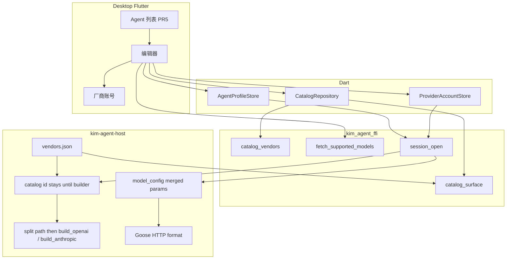
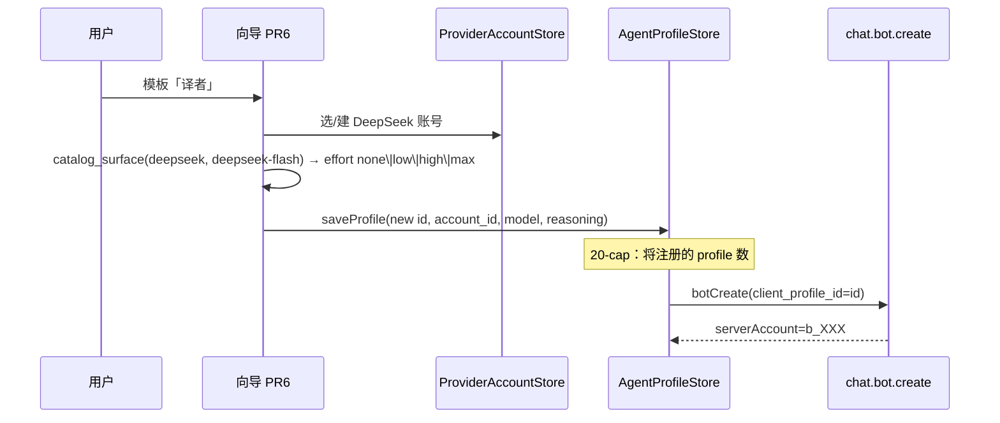

# 多 Agent + 厂商感知的模型 / 推理配置

| Field | Value |
|---|---|
| Author | KIM Agent Working Group |
| Date | 2026-09-12 |
| Status | Draft |
| Audience | 实现桌面 Goose 多 persona 与厂商目录的资深工程师 |
| 仓库 | `/Users/zhangfan/develop/github.com/im` |
| 扩展（不替换） | `docs/impl/goose-personalized-agents.md`、`docs/impl/goose-bot-first-class.md` |
| Goose pin | `goose-agent` / `goose-provider-types` / `goose-providers` **0.1.0-alpha.9** |
| 编号 | 本文决策写作 **C-KD *n***。父文档 `goose-bot-first-class.md` 写作 **bot-KD *n***（例如 bot-KD 12 = 后台不存 key）。不要混用「KD 12」。 |

---

## Overview

桌面 Goose 已经能按 `AgentProfile` 跑机器、把 bot 注册成好友、1:1 走 `chat.user.talk` / `chat.bot.reply`。但产品仍卡在「一个全局档位」：设置页只认真编辑 goose 行，推理下拉写死 Off/Low/Medium/High/Max（Goose `ThinkingEffort`），厂商列表来自 46 份 declarative JSON 却没有 per-model 能力面，Moonshot / Zhipu 因 `${ENV}` 被 `is_mobile_eligible` 灰掉，底部还挂着「更多 Agent（即将推出）」。

本设计把现有 `AgentProfile` 拆成三层——**Agent（人设 / IM 身份）**、**ProviderAccount（厂商账号 / key）**、**ModelChoice（模型 id + `ReasoningChoice`）**——并在 `kim-agent-host` 引入 **KIM VendorCatalog**。**Catalog 的字面 URL 必须进入 `build_openai` / `build_anthropic`，不得再走 Goose `${ENV}` JSON。** 设置 UI 按 `ReasoningSurface` 变形；Dart 持久化 `ReasoningChoice`，Rust 在 `session_open` 转成 Goose `request_params`。本阶段不改 gateway / chat / royal 热路径。

---

## Background & Motivation

### 已落地（对照代码，不是对照旧设计愿望）

| 能力 | 现状 | 证据 |
|---|---|---|
| AgentProfile | Dart + Rust 都有；JSON 在 `agent.profiles`；key 在 `agent.api_key.<id>` | `sdk/mobile/lib/state/agent_profiles.dart`；`crates/kim-agent-host/src/profile.rs` |
| 多 persona store | `saveProfile` / `duplicate` / `setEnabled` / `delete` 已存在 | `agent_profiles.dart:401-633` |
| 云身份 | `serverAccount`；`ensureBotIdentity`；`agent.server_identity` 桌面默认 true | `agent_profiles.dart:184-480`；bot-KD 22 |
| 幂等键 | `(app, owner_account, client_profile_id)`；上限 `BOT_MAX_PER_OWNER = 20` | `services/chat/src/users.rs:17` |
| 登录批量 ensure | `link.dart:222-232` 在 `ConnStatus.online` 调 `ensureVisibleIdentities` | **偏离 bot-KD 22**（「不在每次 login 静默 ensure」）。C-KD 9 要求拆掉 |
| 通讯录 | `visibleAgents`；`personForProfile` 用 `serverAccount` 或本地 dest | `mention.dart:29-37`；`contacts_page.dart:211-226` |
| Provider 构建 | OpenAI / Anthropic builder + bundled `from_json` | `provider.rs:54-96`。非 openai/anthropic 走 `bundled_declarative_json`，**忽略** `ProviderSpec.base_url` |
| `is_mobile_eligible` | `base_url` 含 `"${"` 或任一 `env_vars.required` → false | `provider.rs:152-162`。Moonshot/Zhipu JSON 因此灰掉 |
| 拉模型 | FFI `fetch_supported_models`；空列表回退 known / JSON `models` | `provider.rs:172-207`；设置页已是**按钮** `_fetchModels`（`agent_settings_page.dart:367-374`） |
| 推理 | UI `_kEfforts = off/low/medium/high/max`；host `ModelConfig::with_thinking_effort` | `agent_settings_page.dart:19`；`machine.rs:112-114` |
| 旧设置双写 | `saveGoose` 写 `AgentSettings` + `agent.api_key` + `agent.api_key.goose` | `agent_profiles.dart:531-557`；`agent_settings.dart:148-164` |
| `copyWith` | 不能改 `id` / `aliases` / `keyRef` | `agent_profiles.dart:189-223` |
| `SessionOpenOpts` | **无** `Debug` derive | `session.rs:18-33`。安全项「禁止 Debug 打 key」已成立，不是新任务 |

`docs/impl/goose-personalized-agents.md` Phase 8 与 Phase 2 **代码已大部分合入**，但产品闭环没合上：设置页只 `_save` goose；复制出的 profile 不能改模型 / 提示 / 工具；`agent.multi_profile` 默认 **false**；文案 `agentMoreComing`。

### 痛点（已核对）

1. **人设与厂商账号焊死。** `AgentProfile` 同时持有人设字段和 `providerKind` / `baseUrl` / `keyRef` / `model` / `thinkingEffort`。`duplicate` 把 secret 再写一份 `agent.api_key.p-…`（`agent_profiles.dart:608-618`）。
2. **推理五档是谎言。** Goose `ThinkingEffort` 把 `none`→Off、`xhigh`→Max（`thinking.rs:315-324`）。OpenAI 格式只对 **OpenAI 推理模型名** 把 Max→`xhigh`（`openai_reasoning_effort_for_thinking`）；对 DeepSeek 等兼容厂商 `is_openai_responses_model` 为 false，`thinking_effort` 被 `is_goose_internal_request_param` **剥掉**，不会变成 wire 上的 `reasoning_effort`。
3. **Goose 46 JSON 不够当产品目录，也不能当构建入口。** Moonshot `base_url: "${MOONSHOT_BASE_URL}"`、Zhipu 同理 → `is_mobile_eligible` false。Alibaba 默认 intl。Goose DeepSeek 名叫 **`custom_deepseek`**，Qwen 叫 **`alibaba`**。**没有** SiliconFlow / OpenRouter / 火山引擎 bundled JSON。
4. **多 Agent UX 半开。** 编辑器只绑 goose；`delete` 不调 `botDelete`；无 rename aliases。
5. **拉模型无能力元数据。** `Vec<String>`；fetch 补的 id 若不走 prefix 规则就没有 surface。

### 与既有设计的关系

| 文档 | 本设计 |
|---|---|
| `goose-personalized-agents.md` | **深化** Profile / MachineFactory / 设置页；不重做工具环、不合并 FFI |
| `goose-bot-first-class.md` | **遵守** bot-KD 12（后台不存 key）、bot-KD 22 的两条 create 路径、上限 20。**修订** bot-KD 18：人设删除 = `botDelete` + 去掉本机行（见 C-KD 9）。**纠正** 代码对 bot-KD 22 的偏离（去掉 login 批量 ensure） |
| `docs/agent-goose.md` | 仍桌面-only Goose；手机 / Web IM-only |
| `docs/impl/next-stage.md` | **客户端轨**。禁止改 gateway / chat / royal 热路径 |
| `docs/glossary.md` | 无 Agent / Provider 词条。新词见 C-KD 1，不复用 `Session` / `dest` |

---

## Goals & Non-Goals

### Goals

- 用户可创建、复制、重命名、停用、删除多个 Agent；每个有独立 prompt / 工具 / 模型 / 推理 / IM 身份。
- **Agent 与 ProviderAccount 分离**：3 个 Agent 共用一把 OpenAI key，或 1 个 Agent 换 DeepSeek，不必复制 secret。
- 设置 UI 按 **`ReasoningSurface` DTO** 变形。Callers 只消费 `VendorSummary` + `ReasoningSurface` + `ReasoningChoice`，不 `switch (vendorId)`。
- 目录：**混合 C**——KIM 内置能力 schema（中国优先字面 URL）+ 按钮拉模型 id + 自定义 OpenAI 兼容逃生舱。未知模型 id 走 prefix 规则，否则 `none`。
- **构建路径**用 catalog URL + 封闭 `kind` 映射，不把 catalog id 丢进 `bundled_declarative_json`。
- 第一批 PR 可独立合入，不破坏当前单助手 + 云同步。
- rust-strict；永不 log key。

### Non-Goals

- 服务端代跑 Goose；后台存 API key / 工具 / 目录（**bot-KD 12** 仍成立）。
- 合并 `kim_agent_ffi` 与 `kim_client_ffi`。
- Fork Goose `ThinkingEffort`，或给 goose-providers 提上游补丁作为本阶段门槛。
- 用户导入任意 declarative JSON。
- 远程 CDN 目录；v1 不要求 OpenRouter key。
- Gemini 一等公民（Goose `google.rs` 未进 `build_provider_from_spec`）；`AuthStyle::Query`；v1 `ReasoningSurface::Combo`。
- 火山引擎独立 vendor（v1 走 `openai_compatible`）。
- 流式 delta、OS sandbox、bot 进群、两桌面租约。
- 本阶段改 proto / chat / royal。超 20 个 bot 沿用 `101`。

---

## Research findings

### 1. 开源配置 UI / 目录策略

| 项目 | 目录来源 | Provider vs Profile vs Model | 推理怎么建模 | 自定义端点 | 抄什么 | 拒什么 |
|---|---|---|---|---|---|---|
| **cc-switch** ([farion1231/cc-switch](https://github.com/farion1231/cc-switch)) | **内置 presets** + 运行时 `/v1/models` | 按 CLI 工具分栏的 **账号+端点**，不是人设 | 几乎不建模厂商推理面；切 base URL + model + `apiFormat` | 再加一个 preset | Presets 与账号分离；中国厂商一等公民 | 不要把 Agent 做成「当前启用的一个 provider」；不要中继赞助商列表 |
| **Goose declarative**（46 JSON） | **内置 JSON**，部分 `dynamic_models` | Provider JSON ≠ Agent | 只有 `preserves_thinking`。真正 mapping 在 `formats/openai.rs` / `formats/anthropic.rs` / `openrouter_format.rs` | `openai_compatible` + 自定义 URL | 字面 URL 的 engine；`fetch_supported_models` 回退 | 不要把 46 文件当能力权威或构建入口；不要 `${ENV}` |
| **OpenRouter** [`GET /api/v1/models`](https://openrouter.ai/docs/overview/models) | **现场拉**，带 `reasoning.supported_efforts` | 统一 model id | `reasoning: { effort \| max_tokens }` | 自身是网关 | per-model allowed efforts 形状 | 不要强制用户先有 OpenRouter key |
| **LiteLLM** | 巨型 bundled JSON + 适配器 | model 字符串路由 | 适配器转原生 | 自定义 openai | 适配器模式 | 不要引入运行时 |
| **Continue.dev** | 用户 YAML | 一条 = 一个模型角色，焊死 key | `reasoning` bool + `reasoningBudgetTokens` | `apiBase` | 自定义兼容 | 不要 YAML 给 IM 用户 |
| **Cherry Studio / LobeChat** | 内置 + 自定义 + `/v1/models` | **账号 ≠ 助手** | 各家开关 | 一等公民 | 账号与助手分离 | 不要抄 100+ provider |
| **Claude Code / Codex** | 官方 settings | 全局 CLI 设置 | model + effort | 靠 cc-switch 改 URL | effort 是模型属性 | 不要做成全局 provider |

**结论：** 内置 preset（URL / 协议 / 默认模型）+ 可选拉模型；能力面必须 per-model（含 fetch 到的 id 的 prefix 规则）；账号 ≠ 助手。

### 2. 厂商推理 / 思考参数面（官方）+ catalog 种子

Goose 五档：`Off/Low/Medium/High/Max`；`FromStr`：`none`→Off、`xhigh`→Max。OpenAI 格式 **仅当** `is_openai_responses_model(name)`（o-series / gpt-5*）才把 `ThinkingEffort` 写成 wire `reasoning_effort`；Max→`xhigh` 也只在该模型的 supported 列表里。兼容厂商必须走 **非 internal** 的 `request_params` 键。

| 厂商 | 官方参数 | 允许值 | **KIM catalog 种子 id（v1）** | Goose JSON 名 / 模型（勿盲抄） | 五档是否谎言 |
|---|---|---|---|---|---|
| **OpenAI** | `reasoning.effort` / `reasoning_effort` | 模型相关 `none/minimal/low/medium/high/xhigh` | `gpt-4o`（默认无推理）、`gpt-5` 家族按官方 | `OPEN_AI_KNOWN_MODELS`；走 builder 不是 46 JSON | 对 gpt-4o 画五档是谎；对 GPT-5 缺 `minimal`/`none` 独立档 |
| **Anthropic** | Adaptive：`thinking: {type:"adaptive"}` + `output_config.effort`。Enabled：`thinking: {type:"enabled", budget_tokens}`（Goose 从 effort 推导预算） | UI v1：`low\|high\|max`（无 Off、无 Medium、无 budget 滑条） | `claude-sonnet-4-5` 等 `FALLBACK_ANTHROPIC` | `apply_thinking_config`（`formats/anthropic.rs:754-781`）。canonical `thinking_mode=adaptive`（如 sonnet-4.6 / opus-4.6+）走 Adaptive；sonnet-4.5 仅 `reasoning:true`、无 thinking_mode → Enabled | **谎** 若画五档或只画 budget。v1 UI = effort；budget 仅 host 内部 |
| **Google Gemini** | 2.5 `thinkingBudget`；3.x `thinkingLevel` | per-model | **v1 不进主列表** | `google.rs` 未接线 | — |
| **xAI Grok** | `reasoning_effort`；4.5 不能关 | 4.5：`low/medium/high`；4.6 +`xhigh` | v1 可手填进 openai_compatible | 无独立 JSON | 无 Off |
| **DeepSeek** | `thinking: {type: enabled\|disabled}` + `reasoning_effort` `none\|low\|high\|max`（默认思考 **on** / effort **high**）。`minimal`→low，`medium/xhigh`→high | [thinking_mode](https://api-docs.deepseek.com/guides/thinking_mode) | **`deepseek-flash`（默认）、`deepseek-v4-pro`**。不要 `deepseek-chat` | Goose 名 **`custom_deepseek`**；模型 `deepseek-v4-flash` / `deepseek-v4-pro` / `deepseek-reasoner` | **谎**。v1 单一控件 = effort（含 `none`=关） |
| **Alibaba Qwen** | 兼容模式顶层 `enable_thinking` + 可选 `thinking_budget`。qwen3.8-max 可吃扁平 `reasoning_effort` | bool 开关；思考-only 不能关 | `qwen-plus`、`qwen3.6-plus`、`qwen3.8-max` | Goose 名 **`alibaba`**；intl URL | **谎**。wire 是 HTTP JSON 顶层字段，不是 Python `extra_body` |
| **Moonshot / Kimi** | K2.6：`thinking.type`；K2.7-code 永远 on；K3：`reasoning_effort` `low\|high\|max` 默认 max | [Kimi 参数](https://platform.kimi.ai/docs/api/models-overview) | `kimi-k2.6`、`kimi-k2.7-code`、`kimi-k3` | Goose 名 `moonshot`；`${MOONSHOT_BASE_URL}`，default 还带 `/chat/completions` path。Catalog 用 `https://api.moonshot.cn/v1` | **谎**。按 **模型 prefix** 选 surface |
| **Zhipu GLM** | `thinking.type`；5.3 不能 disabled；effort `low\|high\|max` 默认 max | [GLM thinking](https://docs.z.ai/guides/capabilities/thinking) | `glm-5`、`glm-5.2`、`glm-5.3` | Goose 名 `zhipu`；`${ZHIPU_BASE_URL}` | **谎** |
| **MiniMax** | Anthropic 兼容 `thinking`。M3 默认关，官方 `{type:"adaptive"}` 开；M2.x 不能关 | [Anthropic API](https://platform.minimax.io/docs/api-reference/text-anthropic-api) | `MiniMax-M3`、`MiniMax-M2.5` | Goose `engine: anthropic`，`https://api.minimax.io/anthropic`。Catalog 默认 CN `https://api.minimaxi.com/anthropic` | v1 UI：M3=toggle，M2=always_on。**Goose 写出 `enabled`+`budget_tokens`，不是 adaptive** |
| **Groq** | 多数无统一 effort | — | groq.json 列表 | 字面 URL，名 `groq` | 多数 `none` |
| **SiliconFlow** | 透传 `enable_thinking` / `reasoning_effort` | 以上游为准 | 不内置上游全表；prefix 规则 + 手填 | **不在** 46 JSON | 按模型 id 规则 |
| **OpenRouter** | 归一 `reasoning` | `supported_efforts` | 网关分组；prefix `qwen/` `moonshotai/` `deepseek/` | crate 有、**不在** 46 JSON | 按上游 prefix |
| **火山方舟** | 按上游 | — | **v1 仅 openai_compatible** | 无 JSON | — |

官方入口：OpenAI reasoning、Anthropic extended-thinking / effort、Gemini thinking、xAI reasoning、DeepSeek thinking_mode、Qwen deep-thinking、Kimi thinking、GLM thinking、MiniMax Anthropic API、OpenRouter reasoning-tokens。

### 3. 目录新鲜度：A / B / C

| | A 纯内置 | B 纯现场拉 | C 混合（选定） |
|---|---|---|---|
| 离线 | 可用 | 不行 | 能力面可用；模型 id 可退回 bundled |
| 新鲜度 | 46 文件已落后 | `/v1/models` 新，多数 **无** effort 允许值 | schema 随 app；id 可刷新；**未知 id 靠 prefix** |
| 隐私 | 无额外请求 | 打开设置就打厂商 | **按钮才拉**（C-KD 10 = **保持**现状按钮，不是新行为） |
| 能力正确性 | 只有写进去的才对 | OpenRouter 最好 | schema + prefix 是权威；fetch 只补 id |
| 实现 | 低，很快过时 | 每家 parser | 中 |

**选定 C。** Fetch 到的新 id **必须**走 `catalog_surface` 的 fallback，不能塌成 vendor 级单一 surface。

---

## Key Decisions（C-KD）

1. **三层领域，禁止再焊死。**
   - **Agent**：`AgentProfile` 的 id / display_name / aliases / system_prompt / tools / mode / permissions / enabled / `serverAccount` + **`account_id`** + **`model.name`** + **`reasoning`（`ReasoningChoice`）**。
   - **ProviderAccount**：`account_id` + **catalog vendor id** + base_url + `key_ref`。不是 glossary `Session`。
   - **ModelChoice**：`model_id` + `ReasoningChoice`，挂在 Agent 上。
   - **Vendor**：目录条目，无用户 key。
   - 磁盘人设 JSON **不再持久化** `provider`。Rust `AgentProfile.provider` 仍是必填（`kind`/`key_ref` 无 `#[serde(default)]`，`profile.rs:22-55`），因此 **FFI `session_open` 必须注入** host-only `provider` 对象（见「session_open 合同」）。`kind` 全程是 **catalog vendor id**（`deepseek` 不是 `openai`），直到 builder 内部才折叠。

2. **目录策略 = 混合 C。** 能力 schema + 默认模型随 app；按钮拉 id；手填 id 永远允许。不拉 CDN，不要求 OpenRouter key。

3. **Catalog 模块放 Rust host。** `crates/kim-agent-host/src/catalog.rs` + **单一文件** `crates/kim-agent-host/src/catalog/vendors.json`。FFI 见下；Dart 只拿小 DTO。

4. **`ReasoningSurface` 是唯一 UI 合同；v1 每个模型一个主控件（无 Combo）。**
   - `none` — 隐藏；可展开 Advanced 手填 JSON
   - `always_on` — 文案，无控件
   - `toggle` — 开关
   - `effort_enum` — 允许值来自目录
   - `budget_tokens` — 整数（**仅 MiniMax / Qwen budget**；**不是** Claude UI）
   未知 → `none` + Advanced，**绝不**回退 Off–Max。
   DeepSeek：只用 `effort_enum`（`none|low|high|max`，默认 `high`）；`none` = 关思考。不要 toggle+effort 双控件。
   **Anthropic Claude：`effort_enum` `low\|high\|max`，默认 `high`。** 无 budget 滑条。MiniMax 仍是 toggle/always_on + host 内部 `enabled`+`budget_tokens`，不要和 Claude effort 混用。

5. **不 fork Goose `ThinkingEffort`。** 映射进 `ModelConfig` 用 **`with_merged_request_params`**（`goose-provider-types` `model.rs:206-217`）以及 Claude 的 `with_thinking_effort(Low/High/Max)`。**不存在** `with_request_param`。`model.rs:220-226` 是 `with_thinking_effort`，它插入的 `"thinking_effort"` 会被 `is_goose_internal_request_param` 从 OpenAI HTTP body **剥掉**；Anthropic 格式层会消费该内部键。Claude UI `low/high/max` → Goose `Low/High/Max`（不暴露 Off/Medium）。键表见 Proposed Design。

6. **`agent.multi_profile`：保留作 kill-switch；默认值在 PR5 才改成桌面 true。** PR4 仍默认 false，只改 goose 编辑器的推理控件。删除 `agentMoreComing`。

7. **本地硬上限 20，与 `BOT_MAX_PER_OWNER` 对齐。** 每个插入路径都闸：`saveProfile` 新 id、`duplicate`、向导。计数 = **`serverIdentity` 开启时「已有 `serverAccount` 或即将注册」的 profile 数**（含 disabled——它们仍占云 bot），不是 `enabled.length`。客户端先拒；若仍打到服务器 101，用已有 `Copy.agentRegisterFailed` / `agentRegisterError`（`status 101` 已在 `errors.dart`），不要新 FFI 文案。

8. **默认 Agent 仍是 `id=goose`。** `mentionedProfile` 精确 id 优先。禁止「最近用过」抢走 `@助手`。

9. **云身份：遵守 bot-KD 22 两条路径；人设删除修订 bot-KD 18。**
   - **Create：** 新建 / duplicate / 向导保存成功后立刻 `chat.bot.create`。已有空 `serverAccount` 在 **第一次打开该 1:1** 才 create。**禁止** login / `ConnStatus.online` 批量 `ensureVisibleIdentities`。PR5 从 `link.dart:222-232` 拆掉该调用（保留 `catchUpPending`）。`setServerIdentity(true)` 仍可对当前可见未注册 profile 补注册（用户显式打开开关，不是静默 login）。
   - **删除人设（修订 bot-KD 18）：** 不可删 goose。若 `serverAccount` 非空：先 `botDelete`；成功则 **去掉本机 profile 行**（人设没了）。inbox 里残留 `b_*` 只读（bot-KD 18 的「历史保留」仍成立）；**禁止**再注入合成 `dest=goose` 顶替。失败：保留行，写入 `identityError`，toast（`agentRegisterError` 同类）。`botDelete` 映射：非 owner / 已删 → 108 视为「云端已无」，仍清本地行；其它错误保留。
   - **停用 `enabled=false`：** 不 `botDelete`；桌面通讯录 / mention 消失；云 bot 仍在。**本阶段手机仍能看到该 bot**（无 `chat.bot.update`）。
   - **注销云身份**（可选后续，v1 不做单独按钮）：`botDelete` + 清 `serverAccount` + **保留**人设——这才是未修订的 bot-KD 18。v1 人设删除走上一子弹。

10. **拉模型 = 按钮，不自动。** **保持**现有 `_fetchModels` 按钮，不是新交互。失败保留 bundled id。

11. **自定义 OpenAI 兼容：默认 `none` + Advanced。** 不猜测对端。

12. **KIM 目录字面 URL、中国优先；并且这些 URL 必须用于构建。** 见下表。备选是 ProviderAccount 下拉，不是进程 env。`is_mobile_eligible` **不再**作为产品列表闸——列表来自 catalog；构建不读 Goose `${ENV}` JSON。

    | Vendor id | 默认 base_url | 备选 |
    |---|---|---|
    | openai | `https://api.openai.com/v1` | — |
    | anthropic | `https://api.anthropic.com` | — |
    | deepseek | `https://api.deepseek.com` | — |
    | qwen | `https://dashscope.aliyuncs.com/compatible-mode/v1` | intl `dashscope-intl…` |
    | moonshot | `https://api.moonshot.cn/v1` | `https://api.moonshot.ai/v1`（**不要** Goose 的 `/v1/chat/completions` path） |
    | zhipu | `https://open.bigmodel.cn/api/paas/v4` | coding plan URL |
    | minimax | `https://api.minimaxi.com/anthropic` | `https://api.minimax.io/anthropic` |
    | siliconflow | `https://api.siliconflow.cn/v1` | — |
    | openrouter | `https://openrouter.ai/api/v1` | — |
    | groq | `https://api.groq.com/openai/v1` | — |
    | openai_compatible | 用户填 | — |

13. **本阶段零后台变更。**

14. **v1 字段 vs 以后。** Agent v1：name、aliases、prompt、mode、工具开关、enabled、account_id、model.name、reasoning。ProviderAccount v1：vendor、base_url、key、display_name。第一屏：人设 + 账号 + 模型 + 推理 + 3 个工具预设。MCP / 全量权限 / bash 折叠。以后：Gemini、温度条、catalog 热更、OAuth。

15. **信息架构：PR4 仍单页 goose 编辑器；PR5 才拆路由。**
    - PR4：现 `/agent/settings` 上 catalog 驱动的推理/模型/vendor（仍 `_save` goose）。
    - PR5：`/agent` 列表、`/agent/:id` 编辑器、`/agent/accounts`；`/agent/settings` 重定向 `/agent`。`multi_profile` 默认 true 与路由同 PR。

16. **产品模板只存在向导（PR6）。Host `translator_template` / `coder_template` 降为测试夹具，不再当 UI 源。** `list_builtin_profiles` 不驱动向导。`_reload` 已不插入这两行（保持）。Host 模板继续 openai/gpt-4o 以免测试漂移；产品「译者」= DeepSeek `deepseek-flash` + effort `none` + 无工具。

17. **Duplicate Agent 默认共享 `account_id`，不复制 key。** 新 `key_ref` 仅当「复制账号」。

18. **Goose 46 JSON 只作模型 id 回退表，不作构建入口。** 构建走 `build_openai` / `build_anthropic`，但 **必须先改 URL 切分**（见「Provider 构建」），否则 Qwen/Zhipu/Groq/OpenRouter/MiniMax 的 path 会被 `split_openai_url` / `anthropic_host` 丢掉。`fetch_models` 空列表回退 = catalog `models[]`，再否 `goose_fallback_name` 对应的 Goose JSON，**禁止**把非 OpenAI vendor 回退成 `OPEN_AI_KNOWN_MODELS`。未进 catalog 的 Goose 名进「其他」折叠（`VendorSummary.group=other`）。

19. **Catalog `schema_version: 1`。** `include_str!("catalog/vendors.json")`。未知 `reasoning.kind` → `none` + warn。

20. **保存时 `catalog_validate`；运行时 fortify。** 丢掉的 key：`tracing::warn`（无 value）+ Dart toast「已忽略不受支持的推理参数」（避免用户看成「Goose 挂了」）。

---

## Proposed Design

### Provider 构建（C-KD 12 / 18 的实现合同）

今日 `build_provider_from_spec`（`provider.rs:54-96`）：

- `openai*` → `build_openai`：`split_openai_url` 只留 origin，**永远**把 `base_path` 设成 `OPEN_AI_DEFAULT_BASE_PATH`（`"v1/chat/completions"`，Goose `openai.rs:38`）。`provider.rs:245-260`。
- `anthropic` → `build_anthropic`：`anthropic_host` 返回 `url[..BeforePath]`（`provider.rs:263-275`），再 `AnthropicProviderBuilder::new(client).build()`，默认 `name="anthropic"`、`skip_canonical_filtering=false`（Goose `anthropic.rs:91-99`）。
- 其它 → `bundled_declarative_json` + `is_mobile_eligible` + `from_json`。Goose Anthropic `from_json` 把 **完整** `config.base_url` 传给 `ApiClient`（`anthropic.rs:451-456`）。

因此「把 catalog URL 丢进现有 `build_openai`/`build_anthropic`」会：

| Catalog URL | 现 `split_*` 结果 | 需要 |
|---|---|---|
| `https://api.deepseek.com` | `…/v1/chat/completions` | OK |
| `https://api.moonshot.cn/v1` | `…/v1/chat/completions` | OK |
| `https://dashscope.aliyuncs.com/compatible-mode/v1` | `https://dashscope.aliyuncs.com/v1/chat/completions` | **错** |
| `https://open.bigmodel.cn/api/paas/v4` | `https://open.bigmodel.cn/v1/chat/completions` | **错** |
| `https://openrouter.ai/api/v1` | `https://openrouter.ai/v1/chat/completions` | **错** |
| `https://api.groq.com/openai/v1` | `https://api.groq.com/v1/chat/completions` | **错**（今日 Groq JSON 是完整 `/openai/v1/chat/completions`，且 **mobile-eligible**） |
| MiniMax `https://api.minimaxi.com/anthropic` | `https://api.minimaxi.com` | **错** |

**PR1 必须先改切分，再把 catalog vendor 从 `from_json` 迁走。未改切分之前，活着的 `kind=groq` 继续走 `from_json`，禁止 remap。**

#### URL 切分合同（`split_openai_url` / Anthropic host）

Goose 0.1.0-alpha.9：**chat POST 把 `base_path` 原样交给 `api_client.request`**（`openai.rs:838`）。`map_base_path` **只**用于 models / responses（`openai.rs:328-331, 540-563`）。若 `base_path` 不含 `chat/completions` 或 `responses`，`map_base_path(..., "models", "v1/models")` **丢掉自定义前缀**，回退 `v1/models`（单测 `unknown_path_falls_back_to_default_models_path`：`"custom/path"` → `"v1/models"`）。因此 **不能**把 `compatible-mode/v1` 原样当 `base_path` 再指望 Goose 补上 `chat/completions`。

OpenAI 兼容 **一条规则**：

- path 已含 `chat/completions` 或 `responses` → **原样保留**（去掉 leading `/`）。
- 否则 → `base_path = {trim(path, 去首尾 `/`) 或 `"v1"}/chat/completions`。

等价：空 `/` → `v1/chat/completions`；`/v1` → `v1/chat/completions`；`/compatible-mode/v1` → `compatible-mode/v1/chat/completions`。

Anthropic / MiniMax：`ApiClient` 仍用 **完整 URL（含 `/anthropic`）**；Goose 再拼 `v1/messages`。不要 `anthropic_host` origin-only。

PR1 金样必须同时断言：

1. `split_openai_url` 的 `(host, base_path)`（chat POST 即此 path）
2. `OpenAiProvider::map_base_path(base_path, "models", "v1/models")` **保留厂商前缀**

| input | host | `base_path`（chat POST） | `map_base_path(..., "models")` |
|---|---|---|---|
| `https://api.deepseek.com` | `https://api.deepseek.com` | `v1/chat/completions` | `v1/models` |
| `https://api.moonshot.cn/v1` | `https://api.moonshot.cn` | `v1/chat/completions` | `v1/models` |
| `https://dashscope.aliyuncs.com/compatible-mode/v1` | `https://dashscope.aliyuncs.com` | `compatible-mode/v1/chat/completions` | `compatible-mode/v1/models` |
| `https://open.bigmodel.cn/api/paas/v4` | `https://open.bigmodel.cn` | `api/paas/v4/chat/completions` | `api/paas/v4/models` |
| `https://openrouter.ai/api/v1` | `https://openrouter.ai` | `api/v1/chat/completions` | `api/v1/models` |
| `https://api.groq.com/openai/v1` | `https://api.groq.com` | `openai/v1/chat/completions` | `openai/v1/models` |
| `https://api.groq.com/openai/v1/chat/completions` | `https://api.groq.com` | `openai/v1/chat/completions` | `openai/v1/models` |
| MiniMax `https://api.minimaxi.com/anthropic` | — | client URL 含 `/anthropic` | n/a |

**禁止**金样把 Qwen/Groq 的 `base_path` 写成不含 `chat/completions` 的前缀。`kind=groq` 从 `from_json` 迁走的门槛是：**上表 chat path 与 models mapping 都绿**。`build` Ok 不能代替。

#### kind 全程是 catalog vendor id

```text
磁盘 / ProviderAccount.vendorId / opts.llm_backend / ProviderSpec.kind
  = catalog vendor id（deepseek, qwen, groq, minimax, openai, …）
build_provider_from_spec(spec):
  先 alias 表（下）规范化 kind
  match builder_for(kind):
    Openai     → build_openai（改过的 split）
    Anthropic  → build_anthropic（完整 URL；minimax 见下）
```

**禁止**在 `_openOpts` 把 `llmBackend` 改成 `openai` 再送 FFI，否则 `to_model_spec` / prefix（`openrouter` + `qwen/*`）丢失。openai/anthropic 折叠只发生在 `builder_for` 内部。

| Catalog vendor id | 内部 builder | `goose_fallback_name` |
|---|---|---|
| openai, openai_compatible | `build_openai` | 无（`OPEN_AI_KNOWN_MODELS` 仅这俩） |
| deepseek | `build_openai` | `custom_deepseek` |
| qwen | `build_openai` | `alibaba` |
| moonshot | `build_openai` | `moonshot` |
| zhipu | `build_openai` | `zhipu` |
| groq | `build_openai`（**切分金样绿了之后**才从 `from_json` 迁走） | `groq` |
| siliconflow, openrouter | `build_openai` | 无 → fallback = catalog `models[]` |
| anthropic | `build_anthropic` 默认 name | 无（`FALLBACK_ANTHROPIC`） |
| minimax | `build_anthropic` **特化**（下） | `minimax` |

#### MiniMax（不能用默认 `AnthropicProviderBuilder`）

`thinking_type_for_provider`（`formats/anthropic.rs:150-176`）：

1. `reasoning != Some(true)`（且无 canonical）→ **Disabled**。
2. `reasoning == Some(true)` 之后：`effort.is_none() && budget_tokens is some` → Enabled；否则 `effort.unwrap_or(Off)`，**None 当成 Off → Disabled**。

因此只设 `cfg.reasoning = Some(true)`、不设 `budget_tokens`、不设非 Off 的 `thinking_effort`，HTTP **仍无** `thinking` 对象。`MiniMax-M3` 不在 Anthropic canonical 表；默认 builder `name="anthropic"` + `skip_canonical_filtering=false` 同样 Disabled。

合同（选 b，PR1 builder + PR2 `to_model_spec`）：

```rust
AnthropicProviderBuilder::new(client) // 完整 …/anthropic
    .name("minimax")
    .skip_canonical_filtering(true)
    .build()
```

`to_model_spec`（surface ≠ off）：**同时**

- `cfg.reasoning = Some(true)`（pub 字段，无 `with_reasoning`）
- **`budget_tokens` ≥ 1024**（v1 默认 4096），**或** `with_thinking_effort` ≠ Off（High 即可拿 `ThinkingType::Enabled`）

v1 **选 budget**：不设 `thinking_effort`，只 merge `budget_tokens`，避免 Off+budget 陷阱。Goose 写出 `thinking: {type:"enabled", budget_tokens:N}`，**不是**官方 M3 `{type:"adaptive"}`。v1 不承诺 adaptive；若以后要 adaptive，另开切片并加 HTTP 断言。

关（仅 M3）：`reasoning = Some(false)`，无 budget、无 effort。M2.x always_on：永远走「开」分支。

`vendors.json` 必须种子 `MiniMax-M3`（toggle，默认 off）与 `MiniMax-M2.5` / `MiniMax-M2*`（always_on），否则 prefix 表空会塌成 `none`。PR2 HTTP 断言：provider name **`minimax`**，body 含 `thinking.type=enabled` 且 `budget_tokens>=1024`。

#### 遗留 kind 别名（迁移 + `catalog_surface` + `fetch_models`）

| 存储 / Goose / 旧 `llm_backend` | catalog vendor id |
|---|---|
| `custom_deepseek` | `deepseek` |
| `alibaba` | `qwen` |
| `moonshot` | `moonshot` |
| `zhipu` | `zhipu` |
| `groq` | `groq` |
| `minimax` | `minimax` |
| `openai` / `openai_compatible` / `responses_http` / `live` / `responses` / `""` | `openai`（compatible 有自定义 URL 则 `openai_compatible`） |
| `anthropic` / `messages` | `anthropic` |

PR3 迁移：旧 `providerKind=groq` → `vendorId=groq`，URL 保持；`catalog_surface("groq", …)` 与 `fallback_models` 仍列出 Groq 模型。`catalog_surface("custom_deepseek", …)` 先 alias 再查。

#### `fallback_models`（`provider.rs:189-206` 必须改）

规范化 kind 之后：

1. catalog `VendorEntry.models[].id`（若有）
2. 否则 `goose_fallback_name` → `bundled_declarative_json` 的 `models`
3. 仅 `openai` / `openai_compatible` 才用 `OPEN_AI_KNOWN_MODELS`
4. 仅 `anthropic` 才用 `FALLBACK_ANTHROPIC`
5. 禁止 `kind=deepseek` 查名为 `deepseek` 的 JSON（会空）；禁止把 DeepSeek 失败回退成 `gpt-4o`

`list_bundled_providers` **行为冻结**到 PR4。PR1 只加并行 `catalog_*` FFI。PR4 下拉改读 `catalog_vendors`。

### `catalog_surface` fallback（未知 / 网关模型）

```text
catalog_surface(vendor, model):
  1. VendorEntry.models 精确 id
  2. 该 vendor 的 prefix 规则（见下）
  3. 否则 ReasoningSurface.none + custom_model 手填 + Advanced JSON
```

Prefix 规则（Rust 内，Dart 不写）：

| vendor | prefix | surface |
|---|---|---|
| anthropic | `claude-*` | `effort_enum` `low\|high\|max`，默认 `high` |
| moonshot | `kimi-k2.7-code*` | always_on |
| moonshot | `kimi-k2.6*` / `kimi-k2.5*` | toggle `thinking.type`，默认 on |
| moonshot | `kimi-k3*` | effort `low\|high\|max` 默认 max |
| zhipu | `glm-5.3*` | always_on + 若只允许一个主控件：effort `low\|high\|max`（不能 disabled；effort 即深度） |
| zhipu | `glm-5.2*` | effort `low\|high\|max`（关思考用高级 / 非 v1 主路径） |
| deepseek | `deepseek-*` | effort `none\|low\|high\|max` 默认 high |
| qwen | `qwen*` | toggle `enable_thinking` |
| openrouter | `qwen/*` | 同 qwen |
| openrouter | `moonshotai/*` / `deepseek/*` | 同对应直连 |
| siliconflow | 含 `qwen` / `deepseek` / `glm` 的 id | 同对应直连 |
| minimax | `MiniMax-M3*` | toggle，默认 **off**（关 = `reasoning=false`；开 = `reasoning=true` + `budget_tokens`≥1024） |
| minimax | `MiniMax-M2*` | always_on（同上「开」分支，无关控件） |
| 其它 | — | none |

GLM-5.3：v1 主控件 = `effort_enum`（`low|high|max`，默认 `max`），文案注明「无法关闭思考」。不要 Combo。

### 目标结构

```text
Flutter
  ├─ PR4: AgentSettingsPage（仍 goose）+ ReasoningControls(surface)
  ├─ PR5: AgentListPage / AgentEditorPage / ProviderAccountsPage
  └─ ChatAgent
        读磁盘 AgentProfile（account_id + reasoning，无 provider）
        解析 ProviderAccount → 注入 SessionOpenOpts + profile_json.provider
         │
kim_agent_ffi
  ├─ catalog_vendors → VendorSummary[] JSON
  ├─ catalog_surface(vendor, model) → ReasoningSurface JSON
  ├─ catalog_validate(vendor, model, choice_json)
  ├─ fetch_supported_models（kind = catalog vendor id）
  └─ session_open(profile_json 含 provider.kind=catalog id + reasoning)
         │
kim-agent-host
  ├─ catalog.rs + catalog/vendors.json
  ├─ split_openai_url / anthropic 完整 URL（PR1 合同）
  ├─ build_provider_from_spec(kind=deepseek|qwen|… → 内部 builder)
  └─ to_model_spec(vendor=deepseek, …) → with_merged_request_params
```





### 模块切分

| 模块 | 路径 | 职责 | 不做什么 |
|---|---|---|---|
| VendorCatalog | `catalog.rs` + **`catalog/vendors.json`** | 厂商/模型/surface/prefix/validate/fortify/`to_model_spec` | 不持有 key；不发 HTTP；不 `from_json` Goose env |
| Provider 运行时 | `provider.rs` | 按封闭映射 `build_openai`/`build_anthropic`；fetch_models | 产品列表不读 `is_mobile_eligible` |
| Profile | `profile.rs` | AgentProfile；Rust 侧可读 `reasoning` JSON | 不内嵌 raw key |
| CatalogRepository | `sdk/mobile/lib/agent/catalog.dart` | 缓存 FFI；反序列化 DTO | 不写 vendor 字符串分支 |
| ProviderAccountStore | `provider_accounts.dart` | 账号 CRUD + key | **不** `botCreate`（单测锁定） |
| AgentProfileStore | `agent_profiles.dart` | 人设 CRUD + bot 身份；20-cap；delete | 不画推理控件 |
| UI | `screens/agent/` | PR4 单页；PR5 三路由 | 不直接 `ThinkingEffort` |

### 非专家路径

| 用户意图 | 操作 | 落库 |
|---|---|---|
| 翻译 = DeepSeek，不要工具 | PR6 模板「译者」→ DeepSeek 账号 → `deepseek-flash` → effort **none** | tools 全 false，mode Chat |
| 编码 = Claude，高思考，fs | 模板「编码」→ Anthropic → `claude-sonnet-4-5` → effort **high** → fs | tools.fs，mode Approve |
| 三助手一把 key | 一个 ProviderAccount，三个 `account_id` | 一个 `agent.api_key.acct.*` |
| 自建 vLLM | `openai_compatible`，推理 `none` | reasoning.kind=none |

---

## API / Interface Changes

### Catalog schema（v1：无 Gemini、无 Query、无 Combo）

```rust
pub struct VendorCatalog {
    pub schema_version: u32, // 1
    pub vendors: Vec<VendorEntry>,
}

pub struct VendorEntry {
    pub id: String,
    pub display_name: String,
    pub group: VendorGroup,       // Primary | Gateway | Other — 进 VendorSummary
    pub sort_rank: u32,
    pub protocol: VendorProtocol, // OpenaiCompat | Anthropic  // 无 Gemini
    pub default_base_url: String,
    pub alt_base_urls: Vec<UrlOption>,
    pub auth: AuthStyle,          // Bearer | AnthropicApiKey  // 无 Query
    pub builder: BuilderKind,     // Openai | Anthropic  — 封闭映射，不是 Goose JSON name
    pub goose_fallback_name: Option<String>, // 仅 fallback 模型 id：Some("custom_deepseek")
    pub dynamic_models: bool,
    pub models: Vec<ModelEntry>,
    pub custom_model: bool,
    pub model_rules: Vec<ModelPrefixRule>,
}

pub struct ModelPrefixRule {
    pub prefix: String, // "kimi-k3"
    pub surface: ReasoningSurface,
}

pub struct ModelEntry {
    pub id: String,
    pub display_name: String,
    pub context: Option<u32>,
    pub supports_tools: bool,
    pub reasoning: ReasoningSurface,
    pub default: bool,
}

#[serde(tag = "kind", rename_all = "snake_case")]
pub enum ReasoningSurface {
    None,
    AlwaysOn { note: String },
    Toggle { param: ToggleParam, default_on: bool },
    EffortEnum { param: EffortParam, allowed: Vec<String>, default: String },
    BudgetTokens { min: u32, max: u32, default: u32 },
}
```

DeepSeek 种子（**不要** `deepseek-chat`，**不要** Combo）：

```json
{
  "id": "deepseek",
  "display_name": "DeepSeek",
  "protocol": "openai_compat",
  "default_base_url": "https://api.deepseek.com",
  "builder": "openai",
  "goose_fallback_name": "custom_deepseek",
  "dynamic_models": true,
  "custom_model": true,
  "models": [
    {
      "id": "deepseek-flash",
      "display_name": "DeepSeek Flash",
      "supports_tools": true,
      "default": true,
      "reasoning": {
        "kind": "effort_enum",
        "param": "reasoning_effort",
        "allowed": ["none", "low", "high", "max"],
        "default": "high"
      }
    },
    {
      "id": "deepseek-v4-pro",
      "display_name": "DeepSeek V4 Pro",
      "supports_tools": true,
      "default": false,
      "reasoning": {
        "kind": "effort_enum",
        "param": "reasoning_effort",
        "allowed": ["none", "low", "high", "max"],
        "default": "high"
      }
    }
  ]
}
```

### FFI

现有 `fetch_supported_models` / `list_bundled_providers` **保持语义**。新增：

```rust
/// 小摘要，不含 auth/builder/engine。Flutter 不得靠这些字段分支。
pub fn catalog_vendors() -> Result<String, String>; // Vec<VendorSummary>
pub fn catalog_surface(vendor: String, model: String) -> Result<String, String>; // ReasoningSurface
pub fn catalog_validate(vendor: String, model: String, choice_json: String) -> Result<(), String>;
```

```json
// VendorSummary — Dart 只按 group/sort_rank 分组，不 switch id
{
  "id": "deepseek",
  "display_name": "DeepSeek",
  "group": "primary",
  "sort_rank": 10,
  "default_base_url": "https://api.deepseek.com",
  "alt_base_urls": [],
  "dynamic_models": true,
  "custom_model": true,
  "default_model": "deepseek-flash"
}
```

`group`：`"primary" | "gateway" | "other"`。主列表 `primary`（OpenAI / Anthropic / DeepSeek / Qwen / Kimi / GLM / MiniMax / SiliconFlow / 自定义）；OpenRouter = `gateway`；未进 catalog 的 Goose 名 = `other`。Dart **只**按 `group` + `sort_rank` 分段，禁止 `if (id == "openrouter")`。

`builder` / `auth` / `goose_fallback_name` / `model_rules` 留在 Rust。

### session_open 合同（磁盘无 `provider`，Rust 仍需要）

`resolved_from_opts`（`session.rs:231-254`）：`profile_json` 非空则 `serde_json::from_str` → `AgentProfile`。`provider.kind` 与 `key_ref` **无 default**。ChatAgent 始终送 `profileJson`。若磁盘 JSON 没有 `provider`，open 会反序列化失败。

冻结合同：

1. 磁盘 `agent.profiles` **不写** `provider`（C-KD 1）。
2. `_openOpts` 在送 FFI 前 **注入** host-only 块（不写回 prefs）：

```dart
'provider': {
  'kind': account.vendorId, // catalog id，例如 deepseek；已经过 alias
  'base_url': account.baseUrl,
  'key_ref': '',            // secret 只在 SessionOpenOpts.api_key
}
```

`llmBackend: account.vendorId`（同样是 catalog id，不是 `openai`）。

3. 可选加固：Rust `ProviderSpec.kind`/`key_ref` 加 `#[serde(default)]`，空则用 `opts.llm_backend` + `opts.base_url` 填。磁盘缺字段时仍能 open。以注入 JSON 为权威。
4. PR3 往返测试：磁盘 JSON 无 `provider` → open DeepSeek → HTTP body 含 `thinking` + `reasoning_effort`。

### `ReasoningChoice`（持久化合同）

与 Surface 平行的 **用户选择**。存在 `agent.profiles[].reasoning`，**不是** wire key。

```json
// ReasoningChoiceDto — catalog_validate 的 choice_json；profile JSON 同形
{ "v": 1, "kind": "none" }
{ "v": 1, "kind": "always_on" }
{ "v": 1, "kind": "toggle", "on": false }
{ "v": 1, "kind": "effort_enum", "value": "none" }
{ "v": 1, "kind": "budget_tokens", "value": 8000 }
{ "v": 1, "kind": "advanced", "json": { } }
```

`kind` 必须是当前 `catalog_surface` 的 kind，或 `advanced`。换模型时：若新 surface 不含旧 value，回落到 surface.default 并 toast。

权威：磁盘上的 `reasoning`。`session_open` 时 Rust `catalog::to_model_spec(vendor, model, choice)` → `thinking_effort` + `request_params`。Fortify 之后若丢掉键，UI toast；下次保存写回已校验 choice。

旧档只有 `model.thinking_effort` 字符串：打开时升成 `effort_enum` 或 `none`（按当前 surface）；能映射才填 Goose `ThinkingEffort`。

### Dart DTO + 控件表（PR1 快照 / PR4 实现）

```dart
class VendorSummaryDto {
  final String id, displayName, group; // group: primary|gateway|other
  final int sortRank;
  final String defaultBaseUrl, defaultModel;
  final List<String> altBaseUrls;
  final bool dynamicModels, customModel;
}

class ReasoningSurfaceDto {
  final String kind; // none|always_on|toggle|effort_enum|budget_tokens
  final String? note;
  final bool? defaultOn;
  final List<String> allowed;
  final String? defaultValue;
  final int? min, max, defaultBudget;
}

class ReasoningChoiceDto {
  final int v; // 1
  final String kind;
  final bool? on;
  final String? value;
  final int? budget;
  final Map<String, Object?>? advanced;
}
```

| surface.kind | Widget | Choice 字段 | `to_model_spec` → Goose |
|---|---|---|---|
| none | 隐藏；Advanced 可选 | `kind=none` 或 `advanced` | 无 thinking_effort；advanced 经 allowlist merge |
| always_on | 只读文案 `note` | `kind=always_on` | 不设 Off；不传 disabled |
| toggle | Switch | `on` | 见键表 |
| effort_enum | Segmented/Dropdown(`allowed`) | `value` ∈ allowed | 见键表 |
| budget_tokens | Int 输入 [min,max] | `budget` | MiniMax/Qwen：扁平 `budget_tokens`。**Claude 不用此控件** |

**不要**在 Dart 把 choice 先变成 `enable_thinking` 再存盘。

### `to_model_spec` 键表（断言 **Goose format 之后的 HTTP JSON**，不是 `ModelConfig` 字段）

OpenAI 兼容路径：`formats/openai.rs:1798-1805` 转发 **非** `is_goose_internal_request_param` 且非 reserved 的键。Internal 包括 `thinking_effort`。因此兼容厂商的努力必须用 wire 名 `reasoning_effort` / `thinking` / `enable_thinking`。

**Anthropic Claude（UI = effort，不是 budget 滑条）：** `to_model_spec` 把 `low/high/max` 写成 `with_thinking_effort(Low/High/Max)`，**不要**把用户 budget 写进 `extra_params`。Goose `thinking_type_for_provider`（`formats/anthropic.rs:150-176`）+ `apply_thinking_config`（`754-781`）：

- canonical `thinking_mode=adaptive` 或 `always_on_adaptive`（如 `claude-sonnet-4.6`、`claude-opus-4.6+`、`claude-fable-5`）→ HTTP **`thinking: {type:"adaptive"}` + `output_config: {effort: "low"|"high"|"max"}`**（`adaptive_output_effort`：Off 会被抬成 High，v1 UI 不提供 Off）。
- canonical 仅 `reasoning:true`、无 `thinking_mode`（如 `claude-sonnet-4.5`）→ **Enabled**：Goose 用 `thinking_budget_tokens` 从 effort **内部**推导预算（Low=4000, High=16000, Max=32000），写出 `thinking: {type:"enabled", budget_tokens:N}`。这是 host 实现细节，UI 仍是 effort。
- **MiniMax 不是 canonical Anthropic 模型**，走 Enabled：必须 `reasoning=true` + 显式 `budget_tokens`（见下），**不要**对 MiniMax 发 `output_config.effort`。

错把 Claude 当 Enabled-only（漏 `output_config.effort`）或把 MiniMax 当 Adaptive（`type:adaptive` 可能 400）→ PR2 用 **真实模型名** 断言 HTTP body。

调用：

```rust
pub fn model_config(spec: &ModelSpec) -> Result<ModelConfig, HostError> {
    let mut cfg = ModelConfig::new(name);
    if let Some(effort) = spec.thinking_effort {
        cfg = cfg.with_thinking_effort(effort);
    }
    if !spec.extra_params.is_empty() {
        cfg = cfg.with_merged_request_params(spec.extra_params.clone());
    }
    // max_tokens / temperature 同现逻辑
    Ok(cfg)
}
```

| 场景 | `thinking_effort` | `with_merged_request_params` | HTTP body（OpenAI 格式） | HTTP body（Anthropic 格式） |
|---|---|---|---|---|
| OpenAI gpt-5 `high` | `High` | — | format 层写 `reasoning_effort=high`，剥 `thinking_effort` | n/a |
| OpenAI `minimal` / `none` / 非枚举档 | **None**（不要 Off/Max 撒谎） | `reasoning_effort: "minimal"` 等 | 顶层 `reasoning_effort` | n/a |
| DeepSeek effort `high` | None | `thinking: {type:"enabled"}`, `reasoning_effort: "high"` | 两键都在 body | n/a |
| DeepSeek `none` | None | `thinking: {type:"disabled"}`, `reasoning_effort: "none"` | 同上 | n/a |
| Qwen 开 | None | `enable_thinking: true`；可选 `thinking_budget` | 顶层字段 | n/a |
| Qwen 关 | None | `enable_thinking: false` | 顶层 | n/a |
| Kimi K2.6 关 | None | `thinking: {type:"disabled"}` | 顶层 `thinking` | n/a |
| Kimi K3 `max` | None | `reasoning_effort: "max"` | 顶层 | n/a |
| Claude Adaptive（如 `claude-sonnet-4-6`）effort `high` | `High` | **不要** merge `budget_tokens` | n/a | `thinking: {type:"adaptive"}` + `output_config.effort: "high"` |
| Claude Adaptive effort `low` / `max` | `Low` / `Max` | 无 budget | n/a | `output_config.effort: "low"` / `"max"` |
| Claude Enabled（如 `claude-sonnet-4-5`）effort `high` | `High` | 无用户 budget（Goose 内部 High→16000） | n/a | `thinking: {type:"enabled", budget_tokens:16000}`（由 format 推导） |
| MiniMax M3/M2 开 | **None**（不要 Off） | **`budget_tokens` ≥ 1024**（默认 4096）+ **`cfg.reasoning = Some(true)`** | n/a | name=`minimax`；Goose 写 `thinking: {type:"enabled", budget_tokens:N}`（**不是** `adaptive`） |
| MiniMax 关（仅 M3） | None | `cfg.reasoning = Some(false)`，无 budget | n/a | 无 `thinking` 块 |
| Advanced JSON | None | allowlist 键 | 转发 | Anthropic 只认 `budget_tokens` 等已知键 |

PR2 测试：**构造真实 format 函数后的 JSON**（`goose_provider_types::formats::openai::create_request_*` / Anthropic 等价）。Scripted provider **不能**证明 Qwen/DeepSeek payload。

### ProviderAccount + 人设 JSON

迁移后 Agent `toJson`：

```json
{
  "id": "goose",
  "display_name": "助手",
  "aliases": ["助手"],
  "account_id": "acct-goose",
  "model": { "name": "deepseek-flash" },
  "reasoning": { "v": 1, "kind": "effort_enum", "value": "high" },
  "system_prompt": "...",
  "mode": "smart_approve",
  "tools": {},
  "enabled": true,
  "server_account": "b_XXX"
}
```

**不再写** `provider: {kind, base_url, key_ref}`。读旧行：无 `account_id` → 合成 `acct-<profile_id>`，把旧 kind/url 拷到 ProviderAccount；`agent.api_key.goose` 继续当该账号 `key_ref`（不复制 secret）。写回时去掉人设上的 provider 块。

`saveGoose`：**只**更新默认 ProviderAccount + goose 人设的 model/reasoning/tools；key 写入账号 `key_ref`；**停止**把 live key 再双写一份与 acct 分叉的路径。过渡期仍可写旧 `agent.llm_backend` 以便 PR3 前 ChatAgent 回退，PR3 完成 `_openOpts` 后停写旧 key（保留读一版）。

`copyWith` 增加 `aliases` / `accountId`（`keyRef` 只在 ProviderAccount 上改）。

`account_id` 有值但账号行缺失：`readApiKey` / `_openOpts` **拒绝 open**，typed 错误「厂商账号已删除」，不要静默用残留 kind/url。

ChatAgent `_openOpts`：从 store 取账号 → `llmBackend = vendorId`（catalog id）、`baseUrl`、`apiKey`；`profileJson` = 磁盘人设 **加上注入的 `provider`**；host `to_model_spec(profile.provider.kind, model, reasoning)`。缺失账号行拒绝 open。

---

## Data Model Changes

| Key | Store | 内容 |
|---|---|---|
| `agent.profiles` | prefs | `account_id` + `model.name` + `reasoning`；无 provider 块（迁移后） |
| `agent.provider_accounts` | prefs | 账号列表，无 key |
| `agent.api_key.acct.<id>` | keychain | 账号 secret |
| `agent.api_key.goose` 等 | keychain | 读兼容一版 |
| `agent.multi_profile` | prefs | PR5 起默认 `agentHostSupported`；此前仍 false |
| `agent.server_identity` | 不改 | |
| `agent.catalog_cache.<vendor>` | prefs 可选 | fetch id 列表。回滚：忽略即可，非权威 |

无 SQL / 无 proto。

删除人设（C-KD 9）：

```dart
Future<void> delete(String id) async {
  if (id == kGooseAgentId) return;
  final p = state.firstWhere((e) => e.id == id);
  if (p.serverAccount.isNotEmpty) {
    try {
      await ref.read(clientPortProvider).botDelete(p.serverAccount);
    } catch (err) {
      if (!isAlreadyGone(err)) { // 108 / not found
        identityError = agentRegisterError(err);
        state = [...state];
        rethrow;
      }
    }
  }
  await _persist([...state.where((e) => e.id != id)]);
}
```

20-cap 伪代码：`wouldRegister = serverIdentity && enabled 将创建云身份`；数 `profiles.where((p) => p.serverAccount.isNotEmpty || wouldRegister)`；`>= 20` 拒。disabled 且已有 `serverAccount` 计入。

---

## Alternatives Considered

### 1. 目录来源

同前：C 选定。A 拒；B 拒；D 拒。

### 2. 人设 vs 账号

焊死拒绝终态；cc-switch「当前一个 provider」拒绝；拆开选定。迁移后停止双写 kind/url。

### 3. 推理 UI

全局五档拒绝；每厂商 Widget 拒绝；Surface 驱动选定。**v1 不做 Combo**（改原先「组合要设计好 Combo」）。

### 4. Catalog 放哪

只 Dart 拒；两边手写拒；Rust + 小 FFI 选定。`catalog_vendors` 返回 `VendorSummary` 不是整份 catalog。

### 5. 构建仍走 Goose `from_json`

省事，但 Moonshot/Zhipu 永远 `is_mobile_eligible=false`，用户 URL 被丢。**拒绝。**

---

## Security & Privacy Considerations

| 威胁 | 严重度 | 缓解 |
|---|---|---|
| key 进 profiles / catalog / 日志 | **高** | schema 无 key；`SessionOpenOpts` 已无 `Debug`（无需新任务） |
| fetch_models 打错 host | **高** | 只用该账号 `base_url`；https（localhost debug 例外） |
| 自定义端点钓鱼 | 中 | 保存前显示 host；不自动拉 |
| 误删共享账号 | 中 | 引用计数 |
| 人设删了云 bot 残留 | 中 | 先 `botDelete`（C-KD 9） |
| extra_params 乱键 | 中 | allowlist = surface 声明 |
| 打开设置就打 `/v1/models` | 中 | **保持**按钮（C-KD 10） |
| 账号 CRUD 误占 20-cap | 中 | ProviderAccount 保存 **禁止** `botCreate`（单测） |
| 目录篡改 | 低 | 编进二进制 |

Auth：Agent 不持 JWT。`chat.bot.create` 仍无 key。

---

## Observability

`tracing`：`catalog.surface` / `catalog.fortify dropped=`（无 value）/ `catalog.fetch` / builder kind。

Dart：fetch 失败 toast（已有）；**fortify 丢键 toast**（新）。`identityError` + toast 覆盖 `botDelete` 失败。

回归：每个 vendor 一条 surface 金样 JSON（PR1）；每家一条 **HTTP body** 单测（PR2）；`save account ≠ botCreate`（PR3）；20-cap 含 disabled（PR5）。

回滚：忽略 `agent.catalog_cache.*`；不要删 `serverAccount`。

---

## Rollout Plan

1. PR 顺序如下。**`agent.multi_profile` 默认 true 与新路由只在 PR5。** PR4 不改该默认。
2. 旧客户端忽略未知 JSON 字段。
3. 回滚：恢复旧 settings 页；profile 向前兼容。
4. 不插队 B0；不改 ACK。

风险：

| 风险 | 严重度 | 缓解 |
|---|---|---|
| `base_path` 缺 `chat/completions` → chat POST 404，models 回退 `v1/models` | **高** | PR1 金样必须是完整 completions path + `map_base_path` 保前缀；未绿不 remap groq |
| extra_params 被剥掉 | **高** | PR2 断言 format 后 HTTP JSON |
| Claude Adaptive/Enabled 映射错 → 漏 thinking 或 400 | **高** | PR2：canonical Adaptive 名（`claude-sonnet-4-6`）断言 `thinking.type=adaptive` **且** `output_config.effort`；Enabled 名（`claude-sonnet-4-5`）断言 `enabled`+推导出的 `budget_tokens`。MiniMax 不得出现 `adaptive` |
| `ThinkingEffort` 撒谎 `xhigh`/`none` | **高** | 非 OpenAI 推理模型名不走该枚举 |
| 拆账号丢 goose key | **高** | 迁移测 `agent.api_key.goose` |
| PR1 改 bundled 列表导致灰项变可选然后 open 失败 | **高** | PR1 **不改** `list_bundled_providers` |
| 多 Agent 默认开但编辑器仍只存 goose | **高** | 默认开与路由同 PR5 |
| login 批量 create 违反 bot-KD 22 | 中 | PR5 拆 `link.dart` ensure |
| delete 不调 botDelete | 中 | **PR5** 测试契约（不是 PR4） |

---

## PR Plan

每条独立可审。不改 `services/**`、`crates/kim-client` 热路径。

### PR1 — VendorCatalog + surface FFI + URL 切分（无 UI 行为变化）

- **Title:** `agent: vendor catalog and reasoning surface FFI`
- **Files:** `crates/kim-agent-host/src/catalog.rs`；**`src/catalog/vendors.json`**；`provider.rs`：**先**改 `split_openai_url` / Anthropic 完整 URL（金样表）；alias 表；`fallback_models` 走 catalog/`goose_fallback_name`；`build_provider_from_spec` 认 catalog id。**仅当 Groq 金样绿了** 才把 `kind=groq` 从 `from_json` 迁走，否则 Groq 仍 `from_json`（避免 chat 回归）。MiniMax builder：`name("minimax")` + `skip_canonical_filtering(true)` + 完整 `/anthropic` URL。FFI `catalog_vendors`（含 `group`/`sort_rank`）/ `catalog_surface` / `catalog_validate`；FRB；surface 金样（含 prefix、`custom_deepseek` alias）
- **Depends:** 无
- **Desc:** **不改** `list_bundled_providers`。设置页暂不调用新 FFI。未迁走的 groq/`from_json` 路径行为不变。金样必须是 **完整 `…/chat/completions` path** 且 `map_base_path(..., "models")` 保留前缀；禁止只测 `build` Ok，禁止把 `openai/v1` 当 chat `base_path`。`vendors.json` 种子 MiniMax-M3 / MiniMax-M2.5。`group`：openai/anthropic/deepseek/qwen/moonshot/zhipu/minimax/siliconflow/openai_compatible = `primary`；openrouter = `gateway`。Claude 模型 surface = `effort_enum` `low|high|max`。

### PR2 — `to_model_spec` + `with_merged_request_params` + HTTP 断言

- **Title:** `host: extra_params for vendor-native reasoning`
- **Files:** `profile.rs` 读 `reasoning`；`machine.rs` `model_config` 调 `with_merged_request_params`；`catalog.rs` `to_model_spec` / `fortify`；**OpenAI/Anthropic format HTTP JSON 单测**（DeepSeek thinking 对象、Qwen `enable_thinking`、Claude Adaptive `thinking.type=adaptive`+`output_config.effort`、Claude Enabled 推导 `budget_tokens`、MiniMax `enabled`+budget 且无 adaptive）；Dart 尚未改 UI
- **Depends:** PR1
- **Desc:** 旧 `thinking_effort` 仍工作。不 fork `ThinkingEffort`。不用 scripted 冒充 Qwen payload。Claude UI `low/high/max` → Goose `Low/High/Max`；PR2 必须用 **canonical 模型名** 断言 Adaptive vs Enabled 两条 HTTP 形状。MiniMax 仍 name=`minimax` + `budget_tokens>=1024` + `type=enabled`（不是 adaptive）。DeepSeek 用 `kind=deepseek` 不是 `openai`。

### PR3 — ProviderAccount 存储与迁移（设置页仍单页）

- **Title:** `mobile: ProviderAccount store, share keys across agents`
- **Files:** `provider_accounts.dart`；`agent_profiles.dart`：`accountId`、`reasoning`、`copyWith(aliases, accountId)`、duplicate 共享账号、`readApiKey` 走账号、缺失账号拒绝、`saveGoose` 写默认账号且不双写分叉 key；**磁盘不写 `provider`**；`ChatAgent._openOpts` 注入 `provider.kind=catalog vendor id` + `llmBackend=vendorId`；alias 迁移（`custom_deepseek`→`deepseek`，`groq`→`groq`）；**磁盘无 provider → open DeepSeek HTTP 含 thinking**；**`save account` 不调用 `botCreate`**
- **Depends:** PR2
- **Desc:** goose 仍能聊。无新路由。`multi_profile` 默认仍 false。`kind=groq` 账号迁移后 `fallback_models` 仍是 Groq 列表不是 gpt-4o。

### PR4 — 现有 goose 编辑器上的 catalog 控件

- **Title:** `mobile: catalog-driven reasoning controls`
- **Files:** `agent_settings_page.dart`：`ReasoningControls`；下拉改 `catalog_vendors`（此 PR 才启用 Moonshot/Zhipu 等）；删全局 `_kEfforts`；模型 = catalog ∪ fetch 缓存；拉取按钮（保持）；vendor 切换默认 URL；`catalog_validate`；fortify toast；l10n 去掉 `agentMoreComing` 或改为「在多 Agent 开关打开后管理列表」
- **Depends:** PR1–PR3
- **Desc:** **仍只 `_save` goose。`agent.multi_profile` 默认 false。无新路由。** 选 DeepSeek 出现 `none/low/high/max`，不是 Off–Max。

### PR5 — 多 Agent 闭环（拆成两提交可接受，仍一 PR 或 5a/5b）

- **Title:** `mobile: multi-agent editor loop and bot delete`
- **Files:** 路由 `/agent` `/agent/:id` `/agent/accounts`；列表/编辑器/账号页；`me_page`；`multi_profile` 默认 true（桌面）；20-cap（所有插入路径）；rename aliases；delete→`botDelete`（C-KD 9）；**删除** `link.dart` 里 `ensureVisibleIdentities`；测试：新建立刻 create；删已注册调 botDelete；108 仍清本地；goose 不可删；disabled 计入 20
- **Depends:** PR4
- **Desc:** 去掉「即将推出」。`multi_profile=false` 仍只展示助手。恢复 bot-KD 22（无 login 批量 ensure）。若体积过大：5a 路由+列表+delete+flag+cap；5b 账号页打磨。向导不在此 PR。

### PR6 — 自定义端点 + fetch 缓存 + 产品向导

- **Title:** `mobile: custom endpoint conservative UI and agent templates`
- **Files:** https 校验；`agent.catalog_cache.*`；向导：空白 / 译者（DeepSeek flash, effort none, 无工具）/ 编码（Claude + budget + fs）；**不**改 host `translator_template` 为产品源
- **Depends:** PR5
- **Desc:** 非专家路径。无后台。

### PR7 — 文档回写

- **Title:** `docs: multi-agent vendor catalog shape`
- **Files:** `docs/agent-goose.md`；`goose-personalized-agents.md`（Phase 8 由本文接续）；`goose-bot-first-class.md`：**修订 bot-KD 18**（人设删除去掉本机行）并划掉「login 批量 ensure」若仍写着；可选 `glossary.md`
- **Depends:** PR5
- **Desc:** 形状写回专题。

**刻意不做：** Gemini 一等公民；catalog 热更新；中继列表；后台改 20；火山独立 vendor。

---

## Open Questions (resolved)

拍板日期 **2026-09-12**。实现按此表，不要再当作未决分叉。

| # | 问题 | 决定 |
|---|---|---|
| 1 | Anthropic UI：effort vs `budget_tokens` 滑条 | **`effort_enum` `low\|high\|max`（默认 high）**，跟 Claude Code。UI **不**暴露 budget 滑条。Goose Adaptive（canonical `thinking_mode=adaptive`）HTTP = `thinking.type=adaptive` + `output_config.effort`。Enabled（如 sonnet-4.5）由 Goose 从 effort **内部**推导 `budget_tokens`。MiniMax **分开**：`enabled`+显式 `budget_tokens`，不发 Claude effort。 |
| 2 | Qwen 国内 vs intl 默认 | **`https://dashscope.aliyuncs.com/compatible-mode/v1`**，intl 为账号页备选下拉。不按 locale 猜。与 C-KD 12 一致。 |
| 3 | OpenRouter 是否第一屏 | **`VendorSummary.group=gateway`，不进第一屏。** `primary`：OpenAI / Anthropic / DeepSeek / Qwen / Kimi / GLM / MiniMax / SiliconFlow / 自定义（`openai_compatible`）。`vendors.json` 种子 `group` 必须与此一致。 |
| 4 | 停用的已注册 bot 对手机隐藏 | **本阶段仍可见。** 不做 `chat.bot.update`。桌面 `visibleAgents` 不 prompt；云好友 list 仍含 bot。 |

---

## References

- `docs/impl/goose-personalized-agents.md`
- `docs/impl/goose-bot-first-class.md` — bot-KD 12 / 18 / 22，`BOT_MAX_PER_OWNER=20`
- `docs/agent-goose.md`、`docs/impl/next-stage.md`、`docs/glossary.md`
- 代码：`agent_profiles.dart`、`agent_settings.dart`、`agent_settings_page.dart`、`chat_agent.dart`、`link.dart`、`mention.dart`、`crates/kim-agent-host/src/{profile,provider,machine}.rs`、`sdk/mobile/rust_agent/src/api/session.rs`
- Goose 0.1.0-alpha.9：`model.rs` `with_merged_request_params` / `is_goose_internal_request_param` / `INHERITED_SESSION_PARAM_KEYS`；`formats/openai.rs` 转发与 `openai_reasoning_effort_for_thinking`；`formats/anthropic.rs` `thinking_type_for_provider` / `apply_thinking_config` / `adaptive_output_effort` / `thinking_budget_tokens`；canonical `thinking_mode`（`canonical_models.json`：sonnet-4.6/opus-4.6+ = `adaptive`，sonnet-4.5 无 thinking_mode → Enabled）；`thinking.rs` `ThinkingEffort`；`declarative/definitions/deepseek.json` name=`custom_deepseek`；`alibaba.json`；`moonshot.json`；`zhipu.json`
- cc-switch：https://github.com/farion1231/cc-switch
- 厂商文档：Research findings 表

无 `CONTEXT.md`、无 `docs/adr/`。
