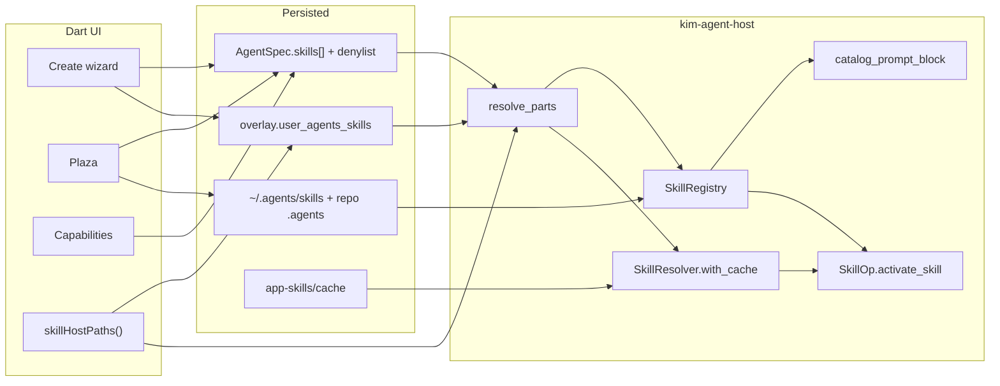
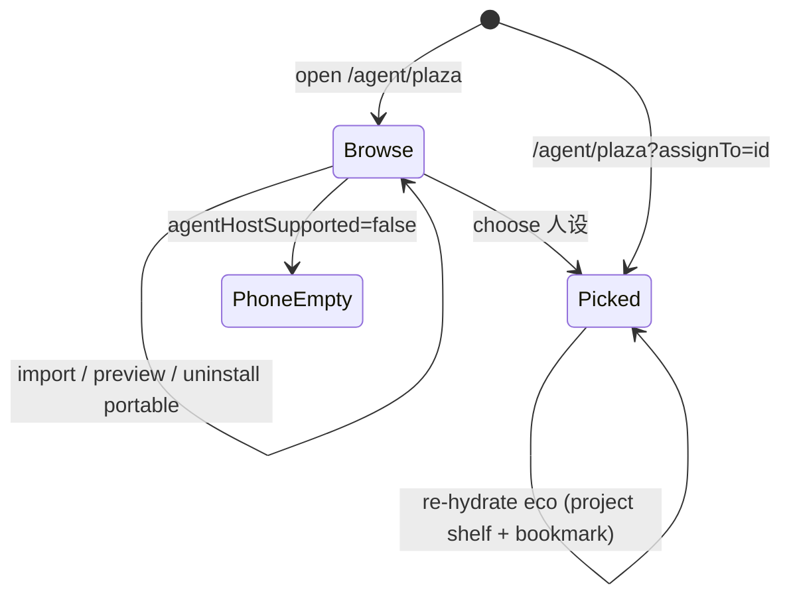

# KIM Skills Plaza Closed Loop

| Field | Value |
|---|---|
| Author | KIM Agent Working Group |
| Date | 2026-09-17 |
| Status | Draft |
| Audience | Senior engineers on `sdk/mobile` + `kim-agent-host` |
| Branch | `feat/mobile-desktop-agent-create` (`dead0fc`) |
| Extends | [agent-productivity.md](docs/impl/agent-productivity.md) (S-KD), [agent-capability-blocks.md](docs/impl/agent-capability-blocks.md) (B-KD), [agent-config-as-data.md](docs/impl/agent-config-as-data.md) (A-KD) |
| Numbering | **SK-KD *n*** for this document. Revises S-KD / B-KD / A-KD when stated. |

---

## Overview

The host already parses `SKILL.md`, scans two portable shelves, resolves bundled `kim-*` skills, injects a catalog into the system prompt, and loads bodies only through `activate_skill`. The Flutter desktop UI already lists those same packages in the create wizard, plaza, and capabilities page. **The two sides do not share configuration.** The UI scans the real `~/.agents/skills` via `WorkspaceAccess.realUserAgentsSkills()`; `session_open` builds `RegistryScan.user_root` from `AgentProfile.user_agents_skills`, which Dart never fills. The UI app catalog passes a cache root; assemble constructs `SkillResolver::new()` with none. Plaza without `?assignTo=` cannot assign. `requires_tools` is a two-id Dart switch. Activation is a hidden user message the chat never surfaces.

This design closes that loop so a skill the user checks is the skill the model can `activate_skill`, and so a later first-party cloud catalog plugs into the same resolver without a second assignment model. Cloud is not shipped here. The product must stop looking like a cloud plaza until fetch, signature, and cache actually exist.

---

## Background & Motivation

### What is already built (verified 2026-09-17)

Host (`crates/kim-agent-host`) is the complete parser and runtime:

| Piece | Path | Behavior |
|---|---|---|
| `parse_skill_md` | `skills.rs:358` | YAML frontmatter + body; repairs unquoted colons; ignores unknown keys |
| Dual-shelf scan | `scan_portable` / `build_registry` | `user_root` + `{project}/.agents/skills`; project wins; `kim-` ids dropped; denylist mutes |
| `SkillResolver` | `skills.rs:436` | **cache first**, then bundled `kim-im` / `kim-memory`. `origin: cloud` is a string, not a fetch |
| `catalog_prompt_block` | `skills.rs:607` | system prompt lines are `id: description` only (S-KD 13) |
| `SkillOp` | `ops/skill.rs` | `Operation`, not `ToolProvider`. Hidden `Message::user().with_visibility(false, true)` |
| Empty registry | `machine.rs:105` | `SkillOp` is omitted when `skill_registry.is_empty()` |
| `AGENTS.md` | `read_agents_md` | ≤4 KiB into prompt layers |
| Scan gate | `capability/mod.rs:157` | portable scan iff `fs \|\| fs_write \|\| workspace.kind == Repo` (S-KD 3) |

Mobile UI (`sdk/mobile`):

| Piece | Path | Behavior |
|---|---|---|
| Plaza | `features/agent/agent_plaza_page.dart` | Two shelves. KIM assign only when `assignTo` resolves. Eco is read-only. Import copies into real `~/.agents/skills` |
| Capabilities | `agent_capabilities_page.dart` | App assign + portable mute via `SkillPickerList`. Host `previewAssembled` for tool names, not skill bodies |
| Create wizard | `agent_create_page.dart` (this branch) | 4 steps: 名称与模型 → 工具与工作区 → 技能 → 系统提示 |
| Origin chips | `skill_picker.dart` | `内置` / `下载` / `全局` / `项目` |
| macOS home | `WorkspaceBookmarkPlugin.realHomeAgentsSkills` | `getpwuid` home, not container `$HOME` (S-KD 23) |
| Overlay column | `agent_device_overlay.user_agents_skills` | Exists. Written `''`. Applied only for workspace path |

Cross-device: `AgentSpec.skills[]` + `portable_denylist` sync through Royal HMAC (`agent.proto:54-55`). `user_agents_skills` is stripped by `kim-agent-codec` (A-KD 12). Each device resolves bundled versions independently.

### Audit, verified against current code

| # | Claim | Verdict | Evidence |
|---|---|---|---|
| 1 | Runtime never sees user shelf | **Confirmed, critical** | `_promptGoose` calls `profile.toHostJson(account)` with default `userAgentsSkills = ''` (`agent_bridge.dart:188`, `agent_profiles.dart:971-983`). `_upsertOne` writes `userAgentsSkills: ''` (`agent_profiles.dart:1580`). Overlay apply ignores the column (`agent_bridge.dart:141-148`, `_fromDto` 1473-1481). `resolve_parts` then sets `RegistryScan.user_root` to that empty string (`capability/mod.rs:166`) |
| 2 | Cache not wired into assemble | **Confirmed, critical for cloud** | `resolve_parts` does `SkillResolver::new()` (`capability/mod.rs:160`). Only `skill_app_catalog_json` / UI FFI take a cache root. No `sha256` in `kim-agent-host` |
| 3 | Cloud catalog not started | **Confirmed** | `origin: cloud` is a SkillRef field. No fetch, signature, version UI. `SkillRef.version == ""` means latest in resolver, with no pin/float control |
| 4 | Plaza cannot pick persona; eco cannot assign; no uninstall | **Confirmed** | No `assignTo` → KIM trailing is `null` (`agent_plaza_page.dart:308`). Eco tiles have no action. Import exists; delete does not. Copy `请从人设的技能页进入广场再分配` is a paragraph, not a picker |
| 5 | No preview before assign | **Confirmed** | Rows are name + description + chip. No `skill_preview` FFI |
| 6 | `requires_tools` hardcoded | **Confirmed** | `requiresToolsForAppSkill` switch on `kim-im` / `kim-memory` only (`skills_catalog.dart:58-72`). Frontmatter parser has no `requires_tools` (`SkillFrontmatter` is name/description/version) |
| 7 | Zero user-visible activate feedback | **Confirmed** | Hidden inject is correct. `spawn_host_pump` maps `ToolResult` → `tool_finished`, but `AgentRunLoop._promptGoose` only consumes `assistant_finished` / `failed` (`sdk/mobile/lib/bridge/agent_bridge.dart:199-207`). `KimMessageRow` hides non-confirmation agent cards (`sdk/mobile/lib/design/kim_bubble.dart:88-92`). There is no `ChatAgent` type |
| Extra | Create wizard lists portable skills that runtime will not scan | **Confirmed, same class as #1** | Wizard `_reloadSkills` always loads `userRoot` (`agent_create_page.dart:182-187`). Default capabilities are IM-only (`kCreateDefaultCapabilities`). S-KD 3 then disables portable scan. Checked portable rows never reach the model |
| Extra | Capabilities preview also omits the user shelf | **Confirmed** | `previewAssembled(profileJson: draft.toJson())` (`agent_capabilities_page.dart:213-214`). `toJson()` does not write `user_agents_skills` |
| Extra | Stale empty-plaza copy | **Confirmed** | `agentPlazaEmptyTitle` = `广场即将到来` still in arb, unused by the live page, leftover from a fake cloud |

### Why the product feels fake

The plaza is a disk browser. Runtime is a different config object. Users can check `git-commit` in the wizard, chat, and the model has no catalog line and `activate_skill` returns `NotInCatalog`. Shipping a “cloud” origin chip (`下载`) before fetch exists repeats the same lie at the next layer.

### Docs that are stale relative to this branch

| Doc | Stale bit | Reality |
|---|---|---|
| `docs/impl/README.md` | Agent productivity “待执行” | Workspace, skills, plaza, overlay column, wizard skills step have landed. Closed loop has not |
| S-KD 29 | Create stays a short form; no skills | `dead0fc` is a 4-step wizard including 技能. This doc revises S-KD 29 |
| S-KD 21 prose | Resolver order `bundled → cache → cloud` | Today is **cache → bundled** (`cache_version_wins_over_bundled`). SK-KD 9: once cloud exists, fetch fills cache on miss; bundled is bootstrap only |
| S-KD 30 / B-KD 9 | `/skills` child page | Merged into `/agent/:id/capabilities` skills section |
| `agent-productivity.md` PR plan | PR1–PR5 still listed as future | Those PRs landed. This document replaces the remaining work |
| `agentPlazaEmptyTitle` | “广场即将到来” | Must not return. Phone empty-state is “在电脑上配置”, not a coming-soon cloud |

S-KD 1–28, 31–33, A-KD 12, B-KD 8 still match code and stay in force except where SK-KD below revises them.

---

## Goals & Non-Goals

### Goals

1. **UI catalog ≡ session catalog.** Same scan roots, same denylist, same resolver (cache root included).
2. **One source of truth per “selected” bit** (app ref vs portable mute vs overlay path), applied at create, plaza, capabilities, and `session_open`.
3. **Inspect before assign:** SKILL.md body, version, references. Short labels, no architecture lectures.
4. **Plaza has persona context** without requiring a deep link. Eco shelf can mute/enable for that persona. Portable uninstall exists.
5. **`requires_tools` comes from frontmatter**, not a Dart allowlist of two ids.
6. **Desktop chat shows which skill/version activated** (or `NotInCatalog`) without dumping the hidden body.
7. **Cloud is an interface + later PR.** No fake 云架. PR7 cannot merge before 1 and 2.

### Non-Goals

- Web (`sdk/web`) agent/skills. Unchanged.
- Phone Goose runtime. `agentHostSupported` stays the gate (`host_support.dart:8`).
- Default-assign `kim-memory` (S-KD 8). Discovery cue is a chip, not auto-assign.
- Login / overlay back-navigation. Landed in `dead0fc`; do not reopen.
- Verbose helper copy of the form “可多选。标签标明来自…”. Chips are enough.
- Hooks, third-party CDN, Goose Recipe, writing `kim-*` into `~/.agents`.
- Merging the two FFIs.
- Syncing `user_agents_skills` or cache paths through AgentSpec (A-KD 12).
- Persisting `activate_skill` bodies or tool traces as synced `KimMsgKind.agentCard`.

---

## Key Decisions

1. **SK-KD 1 — The catalog the user saw is the catalog `session_open` builds.** revises the implicit split between UI FFI and `resolve_parts`. Dart injects two session-only paths into host JSON: `user_agents_skills` and `app_skills_cache`. Host `resolve_parts` is the only builder. Preview uses the same function (already true for tools; must become true for skills). The inject helper is named `skillHostPaths`.

2. **SK-KD 2 — Three authorities, never mixed.**

   | Question | Authority | Syncs? |
   |---|---|---|
   | Is this **app** skill assigned? | `AgentProfile.skills: SkillRef[]` | Yes, `AgentSpec.skills` |
   | Is this **portable** skill muted? | `AgentProfile.portable_denylist` | Yes |
   | Where is **this device’s** `~/.agents/skills`? | Live `realUserAgentsSkills()`, persisted on `agent_device_overlay.user_agents_skills` | **No** |
   | Where is the app-skill cache? | `KimPaths.appSkillCache` (`support/agent/app-skills/cache`) injected as `app_skills_cache` | **No** |
   | What text does `activate_skill` load? | `SkillResolver` (cache → on miss, cloud fetch into cache → bundled bootstrap) | Package bytes never in Spec |

   Portable skills are **never** stored as `SkillRef`. Checking a portable row removes it from the denylist; unchecking adds it. That is mute, not assign.

3. **SK-KD 3 — Inject paths at the Dart edge, every host call.** `toHostJson` and `previewAssembled` JSON go through `skillHostPaths`. Empty/whitespace live ≡ missing (`resolveUserAgentsSkills`). **Overlay upsert is a full-row replace** (`upsert_overlay` writes workspace_path, workspace_bookmark, **and** `user_agents_skills` every call — `crates/kim-sdk/src/store/agent.rs:409-416`). Therefore `_upsertOne` **always** upserts. Workspace + bookmark always come from the profile. `userAgentsSkills` = trimmed live if non-empty, else the previously stored overlay value (load-then-write). Never pass `''` as a deliberate clear in PR1; `''` is only valid when both live and previous overlay are empty (initial row). `_promptGoose` is the session-open fallback site (`resolveUserAgentsSkills`). Do not store the shelf path on Dart `AgentProfile` / `toJson()` / Spec.

4. **SK-KD 4 — Create wizard may include a skills step.** revises S-KD 29 (“创建仍是短表单”). The 4-step wizard on this branch stays because create is the first assignment, not a follow-up the user can miss. It is not a kitchen sink: still no provider URL/key, still no MCP essay. **Portable rows are shown only when `portableScanEnabled(draft)` is true** (`fs` \|\| `fs_write` \|\| `kind==repo`, one Dart helper shared with capabilities/plaza). Otherwise the skills step is app skills only — no fake checkmarks. **Persist rule:** if scan is off at `_finish`, write `portable_denylist: []` and do not hydrate portable ids. If the user later turns fs/repo off, drop portable selection before save.

5. **SK-KD 5 — Plaza is global discovery; mutation is always persona-scoped.** Opening from 我 / 助手 list has no `assignTo`. The page shows a 人设 control (dropdown of `displayName`). Until a persona is chosen, KIM/eco rows have no 分配 / 屏蔽. Deep link `?assignTo=` preselects. After assign, **stay on plaza** (today `_assignApp` `context.pop()`s — that blocks multi-assign).

6. **SK-KD 6 — Preview is a sheet, not a row subtitle.** Tap the title (not the checkbox) or a 预览 control. Host FFI `skill_preview_json(id, user_root, project_root, cache_root, path)` defaults `path` to `SKILL.md`; a later tap passes `references/…` and reuses `activate`’s `resolve_in_dir` jail. Returns meta + body (≤64 KiB) + `references[]` + `versions[]`. Dart does not parse YAML.

7. **SK-KD 7 — `requires_tools` is frontmatter, enforced at assign and at assemble.** revises the Dart switch; implements B-KD 8 for real. Vocabulary is frozen to the existing Dart list: `send_message`, `search_contacts`, `search_messages`, `get_conversation_context`, `list_profiles`, `read_clipboard`, `fs`, `fs_write`, `bash`. Parse `metadata.kim.requires_tools` as that list. Unknown tokens → warning, do not assign, do not enable. `allowed-tools` is not mapped (S-KD 7). Missing known caps → existing dialog (`需要打开工具` / `打开这些开关`). Assemble: post-filter in `resolve_parts` using `projected` ToolSet; omit that app skill from catalog and push the warning onto `ResolvedParts.warnings` (capabilities preview already prints those). Do not fail `session_open`.

8. **SK-KD 8 — Activation feedback is a desktop chip, not a timeline card and not the hidden prompt.** revises S-KD 28 for `activate_skill` only: a **local** chip next to `KimTypingRow` is allowed; still not a synced `KimMsgKind.agentCard` and still not on the typing protocol. Path: SkillOp ToolResponse → pump loop (call_id correlated with preceding `activate_skill` ToolRequest) → `HostEvent::SkillActivated` → `spawn_host_pump` → `AgentUiEvent.kind == skill_activated` → `AgentRunLoop._promptGoose` → `AgentRunSink` → `ChatPage` sibling of `KimTypingRow`. Success JSON must be the full SkillOp object (`ok`+`id`+`version`+`path`). Every activate_skill outcome emits, including empty id. There is no `ChatAgent`. No new `HostEffect`.

9. **SK-KD 9 — Resolver order is cache → (PR7: cloud fetch into cache on miss) → bundled bootstrap.** revises S-KD 21 prose. Cloud is a **cache filler**. Empty `SkillRef.version` = latest at activate time. **v1 assign always writes `version: ""`.** `appSkillRef` must not copy catalog/cache/bundled version into the ref — that would pin `kim-im@7` and make 移除下载 miss bundled (`SkillError::Version`). Pin UI is PR7 only.

10. **SK-KD 10 — Cloud plaza cannot ship until SK-KD 1 and the shared resolver land.** No 云架, no “即将到来”. `下载` chip is only legal when `origin == cache` (or later `cloud` after a real fetch). PR7 adds `SkillCatalog` behind `SkillResolver`; assignment UI does not change.

11. **SK-KD 11 — Phone empty-state is “在电脑上配置”, not an empty catalog.** `agentHostSupported == false`: plaza and wizard skills step show `EmptyState`, no shelves, no import. Do not resurrect `广场即将到来`.

12. **SK-KD 12 — Uninstall is disk-only.** Portable 全局: delete `~/.agents/skills/<id>`. Cache `下载`: 移除下载 deletes `app-skills/cache/<id>/` recursively (all versions) and does **not** rewrite `SkillRef`. Because v1 refs have `version: ""`, `resolve(id, "")` then misses cache and takes bundled. Project-shelf skills are not deleted from plaza. Bundled `kim-*` cannot be uninstalled. PR7 pins (`version` non-empty) are unchanged by 移除下载 — that persona stays pinned and drops out of catalog until the user un-pins.

---

## Proposed Design

### Source of truth and when to scan

```text
                    persisted                         session-injected
                    ─────────                         ────────────────
AgentSpec (Royal)   skills[]  ──► app catalog ids
                    portable_denylist ──► mute set
Device overlay      user_agents_skills ──► last live ~/.agents/skills
KimPaths            appSkillCache ──► support/agent/app-skills/cache
Workspace           kind+path (overlay) ──► project_root ──► {cwd}/.agents/skills
```

Scan matrix used by **both** UI list helpers and `build_registry`:

| Shelf | When | Root | Notes |
|---|---|---|---|
| User portable | `scan_enabled` | `user_agents_skills` | `scan_enabled = fs \|\| fs_write \|\| kind==repo` |
| Project portable | `scan_enabled` | `{project_root}/.agents/skills` | Wins on id clash |
| App bundled | `skills[]` non-empty | binary | Always available to resolver |
| App cache | resolver constructed with cache root | `app_skills_cache/<id>/<version>/` | Wins over bundled for same id |
| App cloud | PR7 only | fetch on cache miss → write `cache/<id>/<version>/` | Cache filler, not a fourth lookup. Not a UI shelf until fetch exists |

Plaza **eco discovery** (read-only browse) may list the user shelf even when the selected persona has scan off, so the user can import/uninstall. **Mute/enable still no-ops into a catalog the model will not see** unless scan is on — the row must show `未扫描` instead of a checked box in that case.

### Assignment vs runtime catalog



`skillHostPaths()` (new, Dart — one name, used everywhere):

```dart
class SkillHostPaths {
  final String? liveUserAgentsSkills; // null = plugin unavailable
  final String appSkillsCache;
}

Future<SkillHostPaths> skillHostPaths({WorkspaceAccess? access, KimPaths? paths}) async {
  final live = await (access ?? workspaceAccess).realUserAgentsSkills();
  final cache = (paths ?? KimPaths.instance).appSkillCache.path;
  return SkillHostPaths(liveUserAgentsSkills: live, appSkillsCache: cache);
}

String resolveUserAgentsSkills({required String? live, required String overlay}) {
  final l = live?.trim() ?? '';
  if (l.isNotEmpty) return l;
  return overlay.trim();
}
```

`AgentProfile.toHostJson` already has `userAgentsSkills`. Add `appSkillsCache`. Callers:

| Call | User shelf value |
|---|---|
| `AgentRunLoop._promptGoose` `toHostJson` | `resolveUserAgentsSkills(live: paths.liveUserAgentsSkills, overlay: overlay?.userAgentsSkills ?? '')` |
| capabilities `previewAssembled` | same |
| `_upsertOne` overlay | **Always** `upsertDeviceOverlay`. `workspacePath` / `workspaceBookmark` from the profile. `userAgentsSkills` = trimmed live if non-empty, else `getDeviceOverlay(id)?.userAgentsSkills ?? ''`. Never write `''` to clear a good path |

Gating the whole upsert on a live shelf path is forbidden: it would skip workspace/bookmark persist (`upsert_overlay` is a full-row replace). Dart `AgentProfile` does not gain a shelf field. Overlay is not applied in `_fromDto`.

Host `AgentProfile` gains `app_skills_cache: String` (default empty), same lifetime as `user_agents_skills`. `kim-agent-codec` must strip it the way it already strips `user_agents_skills` (`old_json_user_agents_skills_not_in_blob`).

`resolve_parts` becomes:

```rust
let skill_resolver = Arc::new(if profile.app_skills_cache.trim().is_empty() {
    SkillResolver::new()
} else {
    SkillResolver::with_cache(PathBuf::from(profile.app_skills_cache.trim()))
});
```

`RegistryScan.user_root` stays `&profile.user_agents_skills`. No second scanner.

### session_open assembly

```mermaid
sequenceDiagram
  participant Loop as AgentRunLoop._promptGoose
  participant WA as WorkspaceAccess
  participant Spec as AgentSpec + overlay
  participant FFI as session_open
  participant RP as resolve_parts
  participant MF as MachineFactory

  Loop->>Spec: listAgentProfiles + getDeviceOverlay
  Loop->>WA: skillHostPaths / realUserAgentsSkills
  Loop->>WA: resolveAgentProjectRoot (bookmark startAccessing)
  Loop->>Loop: toHostJson(account, userAgentsSkills=live??overlay, appSkillsCache)
  Loop->>FFI: session_open(projectRoot, profileJson)
  FFI->>RP: serde profile + project_root
  RP->>RP: scan_enabled = fs \|\| fs_write \|\| Repo
  RP->>RP: SkillResolver::with_cache(app_skills_cache)
  RP->>RP: build_registry(skills, denylist, RegistryScan)
  RP->>RP: post-filter app refs vs projected ToolSet
  RP-->>MF: skill_registry + skill_resolver
  MF->>MF: catalog_prompt_block → PromptComposeOp
  alt registry non-empty
    MF->>MF: SkillOp::new(registry, resolver)
  else empty
    MF->>MF: omit SkillOp (chat_guard if no tools)
  end
```

Create-wizard first save maps onto this with no extra path:

1. `_finish` writes `skills` from `_appSelected` via `appSkillRef`. If `portableScanEnabled(draft)`: `portable_denylist` = portable ids **not** in `_portableSelected`. If scan is off: `portable_denylist: []` and do not load/hydrate portable ids.
2. `saveEditor` → `_upsertOne` → AgentSpec blob + **always** overlay upsert (workspace + bookmark from profile; shelf = live or previous overlay) + bookmark if repo.
3. First message: `AgentRunLoop._promptGoose` reloads spec, applies overlay **workspace** (existing), resolves user shelf as `live ?? overlay ?? ''`, injects cache path, opens a session. Draft checkboxes are not a parallel store.

If the user never opens chat after create, nothing is “pending” — the spec already has the refs. The bug today is only that session JSON drops the shelf path.

### Frontmatter `requires_tools`

Extend `SkillMeta`:

```rust
pub struct SkillMeta {
    pub name: String,
    pub description: String,
    pub version: String,
    pub requires_tools: Vec<String>, // empty = none
}
```

Parse `metadata.kim.requires_tools` as a YAML sequence of scalars. Frozen vocabulary (same strings `enableRequiredCapabilities` already switches on in `agent_profiles.dart:400-473`):

`send_message`, `search_contacts`, `search_messages`, `get_conversation_context`, `list_profiles`, `read_clipboard`, `fs`, `fs_write`, `bash`

Do **not** accept capability kinds (`im.send_message`) or Agents spec `allowed-tools` (S-KD 7). Unknown tokens: host warning `unknown requires_tools token`, Dart does not assign and does not call `enableRequiredCapabilities` for them.

Put the exact lists into the bundled files (today they have no `metadata.kim`):

- `app-skills/kim-im/SKILL.md`: `send_message`, `search_contacts`, `search_messages`, `get_conversation_context`
- `app-skills/kim-memory/SKILL.md`: `fs`, `fs_write`

`skill_app_catalog_json` / `skill_portable_list_json` include `"requires_tools": [...]`. Dart `CatalogSkill` carries the list. Delete `requiresToolsForAppSkill(id)`; callers use `skill.requiresTools`. Dialog copy unchanged (`需要打开工具` / `打开这些开关` / `取消` / `未打开所需工具，技能未分配`).

`build_registry` stays ToolSet-free. `resolve_parts` already has `projected`. After `build_registry`, drop any app entry whose `requires_tools` are missing from `projected` and push `kim-memory: needs fs, fs_write` onto `ResolvedParts.warnings` (capabilities preview already joins `warnings`). Do not fail `session_open`.

### Shared preview FFI

New host function, thin FFI next to `skill_portable_list`:

```rust
pub fn skill_preview_json(
    id: &str,
    user_root: &str,
    project_root: &str,
    cache_root: Option<&Path>,
    path: Option<&str>, // None / "" → SKILL.md
) -> String
```

Returns:

```json
{
  "id": "git-commit",
  "name": "git-commit",
  "description": "...",
  "version": "1.2",
  "origin": "global",
  "class": "portable",
  "requires_tools": [],
  "body": "...",
  "truncated": false,
  "references": ["references/style.md"],
  "versions": ["1.2"]
}
```

Reuse `scan_portable` + `SkillResolver` + `activate(..., path)` so the jail is one function (`resolve_in_dir`). Sheet: title = name, chip = origin, body in a scroll view. `references[]` are filenames; tap calls the same FFI with `path = "references/style.md"` and replaces the body. No architecture paragraph.

`versions[]` collection:

| Origin | Algorithm |
|---|---|
| bundled | singleton: the bundled `SkillMeta.version` (or `"0"`) |
| cache | directory names under `cache/<id>/*` that contain `SKILL.md`, sorted |
| portable | singleton: frontmatter `version` if set, else `"0"` |
| cloud (PR7) | union of cache dirs and `SkillCatalog::list` versions for that id |

### Activation telemetry

Do **not** add `HostEffect::SkillActivated`. `AgentHost::apply_effects` is an exhaustive match on `Usage` | `Conversation` (`lib.rs:558-580`) and has no events channel; a new effect variant would not reach Dart.

SkillOp already appends a user message whose ToolResponse is structured JSON (`ok`, `already`, `id`, `version`, `path`, `truncated`) or `CallToolResult::error` text (`ops/skill.rs:125-169`). `pump_message` emits `HostEvent::ToolResult` with `name: String::new()` (`lib.rs:670-688`). The matching ToolRequest (with name `activate_skill`) is on the **previous** assistant message; `AgentHost::run_loop` pumps messages sequentially (`lib.rs:479-484`).

Do **not** key SkillActivated off `id`+`version` alone (false-positive on any other tool JSON). Do **not** match only `NotInCatalog` (misses empty id, `Unknown`, `Version`, `PathEscape`, `Io`).

Path:

1. The pump task holds `HashMap<call_id, tool_name>` from ToolRequest. On ToolResponse, look up the name.
2. If name != `activate_skill`, skip SkillActivated (keep ToolResult).
3. If name == `activate_skill`:
   - **Success** iff the payload is a JSON object that contains all of `ok`, `id`, `version`, `path` (SkillOp structured result). Emit `HostEvent::SkillActivated { id, version, ok: true, error: "" }`.
   - **Else error** (including `"activate_skill requires an id"`, `NotInCatalog` `"skill {id} is not in this session's catalog"`, `Unknown` `"skill {id} is not installed"`, `Version` `"skill {id} has no version {version}"`, `PathEscape`, `Io`). Emit `SkillActivated { ok: false, id: json.id or "", version: "", error: text }`. Chip: `NotInCatalog` → `未在目录`; everything else including empty id → `未加载`.
4. Do not put the hidden body in this event. Keep existing `ToolResult` for traces.
5. `spawn_host_pump` (`sdk/mobile/rust_agent/src/api/session.rs:628`) maps to `AgentUiEvent { kind: "skill_activated", name: id, message: version or error, ok }`.
6. `AgentRunLoop._promptGoose` (`agent_bridge.dart:198`) must **not** return on this kind. Forward to `AgentRunSink`.
7. Extend `AgentRunSink` (`agent_presence.dart:11`) with `void skillActivated(String dest, {required String id, required String version, required bool ok, required String error})`. `AgentRunStatusNotifier` already implements the sink; store last chip per dest; `finish` clears it.
8. `ChatPage` (`chat_page.dart` ~230) already places `KimTypingRow` as `ChatList.footer` when `peerTypingProvider(dest)` is true. Add a session-local chip **sibling** of that footer (same dest), reading the notifier. `kim_typing_bars.dart` stays the equalizer; do not overload it.
9. Copy: `{id} · {version}` (e.g. `kim-im · 1`); `未在目录`; other errors `未加载`. `already: true` → same chip, no extra word.
10. Never `KimMsgKind.agentCard`. Phone: `agentHostSupported == false`, ignore.

This revises S-KD 28 only for `activate_skill`: local desktop chip, not a permission card, not typing protocol.

### Cloud plug-in (interface only until PR7)

```rust
pub struct CloudSkillMeta {
    pub id: String,
    pub version: String,
    pub sha256: String,      // hex of SKILL.md bytes
    pub signature: String,   // reserved; empty in tests
}

pub trait SkillCatalog: Send + Sync {
    fn list(&self) -> Vec<CloudSkillMeta>;
    fn latest(&self, id: &str) -> Option<CloudSkillMeta>;
    fn fetch(&self, id: &str, version: &str) -> Result<Vec<u8>, SkillError>;
}

impl SkillResolver {
    pub fn with_cloud(cache: PathBuf, catalog: Arc<dyn SkillCatalog>) -> Self { /* PR7 */ }
    pub fn resolve(&self, id: &str, version: &str) -> Result<SkillPackage, SkillError> {
        // 1. cache hit (SHA256 sidecar rules below)
        // 2. if catalog is Some: fetch → write cache/<id>/<version>/SKILL.md + SHA256
        // 3. bundled bootstrap
    }
}
```

Cloud is a cache filler (SK-KD 9). `skill_app_catalog_json` already iterates `bundled_ids()` then `resolve`. PR2 also lists `cache/<id>/*` so a downloaded id that is not bundled still appears with chip `下载`. PR7 adds catalog ids. Assignment (`SkillRef { origin, version }`) does not change.

**SHA256 sidecar (PR2):** file `support/agent/app-skills/cache/<id>/<version>/SHA256` — one hex line, SHA-256 of that directory’s `SKILL.md` bytes (not a tar, not `hash  filename`). Missing sidecar → **accept** (local testers drop a folder). Present + mismatch → skip that version, `tracing::warn`, fall through (next cache version, then bundled). PR7 requires the sidecar on every fetch.

---

## User Interaction

All strings below are product labels. Do not add explanatory paragraphs to the UI.

### Surfaces

| Surface | Entry | Persona context |
|---|---|---|
| Create wizard step 3 `技能` | `/agent/new` | The draft being created |
| Plaza | 助手 list header 技能广场; capabilities header store icon; 我 → 助手 → plaza | Dropdown, or `?assignTo=` |
| Capabilities → 技能 | `/agent/:id/capabilities` | That persona |
| Chat (desktop) | 1:1 with the agent | Implicit |

### Create wizard

Steps (already on this branch): `名称与模型` → `工具与工作区` → `技能` → `系统提示`. Progress `1 / 4`. Buttons `下一步` / `创建` / `返回`.

Skills step:

- `SkillPickerList` multi-select, origin chips only (`内置` / `下载` / `全局` / `项目`).
- App rows always listed (bundled ± cache).
- Portable rows **only if** `portableScanEnabled(draft)` (shared helper: `fs || fs_write || kind==repo`). If not: omit portable rows; do not hydrate `_portableSelected`; do not show them checked.
- Checking `kim-memory` with fs off → existing `需要打开工具` dialog. Cancel leaves the box unchecked.
- Title tap → preview sheet (`skill_preview_json`, default path `SKILL.md`).
- Empty app catalog: `还没有可分配的技能`.
- Phone (`agentHostSupported == false`): this step is `EmptyState` `在电脑上配置` / `技能在桌面运行`, not an empty picker.
- Finish: `saveEditor`; then `go('/agent/$id')` (S-KD 31). Today `maybePop()` back to the list — change it.
- Persist: scan off → `portable_denylist: []`. Toggling fs/repo off after visiting 技能 drops portable selection before save.

Default: no `kim-memory`. Portable, when shown, default **checked** (denylist empty = inherit shelf), matching S-KD 3.

### Plaza



Layout (desktop):

1. Header title `技能广场`. Trailing import `导入技能文件夹`.
2. 人设  [dropdown of displayName] — not a toast paragraph. `?assignTo=` pre-fills.
3. Section `KIM 架` — app skills. Trailing on each row, only when persona is set: `分配` or `已分配` (toggle unassign). Chip `内置` or `下载`. Origin `cache` (or PR7 `cloud`): extra 移除下载, deletes `app-skills/cache/<id>/` recursively; does not rewrite `SkillRef.version` (v1 refs are already `""`).
4. Section `生态架` — disk scan of `~/.agents`. When a 人设 is chosen, **re-hydrate** and merge that profile’s project shelf (`resolveAgentProjectRoot` + bookmark `startAccessing`). If bookmark fails: existing repo-reselect copy, omit project rows. Trailing when persona set and `portableScanEnabled`: checked = not muted, unchecked = `屏蔽`. If scan off: chip `未扫描`, no checkbox. Trailing 卸载 for `全局` origin only.
5. Empty eco: title `生态架为空`. Hint shortened to `右上角导入 SKILL.md 文件夹`. Drop the Claude/Cursor lecture currently in `agentPlazaEcoEmptyHint`.
6. No persona: actions hidden; dropdown is the cue. Delete `请从人设的技能页进入广场再分配` from the body (keep a dropdown placeholder `选择人设`).
7. After `分配`, toast `已分配 {id}` and **remain**. Missing tools: same dialog as capabilities.
8. Preview: tap title.

Phone (`agentHostSupported == false`):

- `EmptyState` title `在电脑上配置`, subtitle `技能在桌面运行`.
- No import, no shelves. Replace unused `广场即将到来`.

### Capabilities page

Skills section stays a `SkillPickerList` on the same catalog merge. Semantics:

| Row class | Check | Uncheck |
|---|---|---|
| App | assign `SkillRef` (dialog if tools missing) | remove from `skills[]` |
| Portable, scan on | remove id from denylist | add id to denylist |
| Portable, scan off | do not show as checked; section uses existing `当前不扫描生态技能` / `agentSkillsPortableScanOff` (unused today; wire it) | — |

`portableScanEnabled(profile)` is the same helper as the wizard (`fs || fs_write || kind==repo`). Today `AgentCapabilitiesPage` always loads portable and checks any id not on the denylist — that is the lie this page must stop.

Title tap → same preview sheet as plaza. Plaza icon in the header keeps `?assignTo=`.

Mute ≠ unassign: unassign drops an app ref; mute only denylists a portable id. Do not write portable ids into `skills[]`.

### Chat-time

Desktop `ChatPage` footer: existing `KimTypingRow` when `peerTypingProvider(dest)`; chip from `AgentRunStatusNotifier` for that dest (`{id} · {version}` or `未在目录`). Hidden prompt stays hidden. Phone: typing bars only. S-KD 28 revised only for this chip.

### Missing tools

One dialog, three callers (wizard, plaza, capabilities). Never silently flip `ToolSet`. bash stays `ask_before`.

### First-run matrix

| Moment | What the user sees |
|---|---|
| First create, IM defaults, no `~/.agents` | Skills step = `kim-im` / `kim-memory` only. Portable absent |
| First create, fs on, shelf has `git-commit` | Portable row checked, chip `全局` |
| Plaza from 我 / 助手 list | Dropdown empty, shelves browsable, no 分配 |
| Plaza from capabilities | Dropdown preselected, 分配 live |
| Mute on capabilities | Portable unchecked; next session catalog omits it |
| Unassign `kim-im` | Removed from `skills[]`; catalog line gone |
| Phone plaza | `在电脑上配置` |
| Cache has `kim-im/7` | Chip `下载`, preview shows 7; assign writes `SkillRef.version = ""`; runtime `resolve(id, "")` uses cache 7; 移除下载 then uses bundled |

---

## API / Interface Changes

No gateway / proto field changes in PR1–PR6. `AgentSpec.skills` already exists.

### Rust host

```rust
// profile.rs — session-injected, default empty
pub struct AgentProfile {
    // existing:
    pub user_agents_skills: String,
    // new:
    pub app_skills_cache: String,
}

// skills.rs
impl SkillMeta { pub requires_tools: Vec<String> }

pub fn skill_preview_json(
    id: &str,
    user_root: &str,
    project_root: &str,
    cache_root: Option<&Path>,
    path: Option<&str>,
) -> String;

pub fn skill_app_catalog_json(cache_root: Option<&Path>) -> String;
// also list cache/<id>/* that are not in BUNDLED

// events.rs — HostEvent only. HostEffect stays Usage | Conversation.
pub enum HostEvent {
    // existing...
    SkillActivated { id: String, version: String, ok: bool, error: String },
}
```

`resolve_parts` uses `SkillResolver::with_cache` when `app_skills_cache` is non-empty. App-skill `requires_tools` post-filter lives here, not in `build_registry`.

Codec: strip `app_skills_cache` from extra_json (copy the `user_agents_skills` test).

### FFI (`sdk/mobile/rust_agent/src/api/session.rs`)

- `skill_preview(id, user_root, project_root, cache_root, path) -> String` (FRB regen in PR4a)
- `AgentUiEvent.kind == "skill_activated"` (reuse `name`/`message`/`ok`; no FRB struct explosion)

### Dart

```dart
class SkillHostPaths {
  final String? liveUserAgentsSkills;
  final String appSkillsCache;
}

bool portableScanEnabled(AgentProfile profile); // fs || fs_write || kind==repo

Future<void> clearAppSkillCache(String id, {KimPaths? paths}); // deletes cache/<id>/

SkillRef appSkillRef(CatalogSkill skill); // version always ''; never copy skill.version

class CatalogSkill {
  final List<String> requiresTools; // frozen vocabulary, from JSON
}
```

`toHostJson` keeps the existing `userAgentsSkills:` named arg; callers pass `resolveUserAgentsSkills(...)`. `_upsertOne` **always** upserts overlay: workspace/bookmark from profile; shelf = live or previous overlay. `_fromDto` is unchanged (no Dart shelf field).

`appSkillRef(skill)` writes `version: ''` (latest). Do not copy `skill.version`. Preview/catalog may still show the resolved version as a label.

Delete `requiresToolsForAppSkill`. Keep `missingToolsForAppSkill(profile, skill)` reading `skill.requiresTools`. Unknown tokens: skip enable, do not assign.

---

## Data Model Changes

| Store | Field | Change |
|---|---|---|
| AgentSpec proto | `skills[]`, `portable_denylist` | Unchanged |
| `agent_device_overlay` | full row | Always upsert workspace + bookmark. `user_agents_skills` = live or previous overlay. Never `''` as a clear |
| Host JSON (session only) | `user_agents_skills`, `app_skills_cache` | Injected at `_promptGoose` / preview; never in blob |
| Disk | `~/.agents/skills/<id>/` | Import / uninstall |
| Disk | `support/agent/app-skills/cache/<id>/<version>/SKILL.md` | PR2 lists; PR7 writes |
| Disk | `support/agent/app-skills/cache/<id>/<version>/SHA256` | One hex line of SKILL.md bytes. Missing = accept (PR2). Present+mismatch = skip |

Migration: none. Empty overlay today already means “no user shelf” at runtime — PR1 starts filling it. Old profiles with empty `skills[]` stay valid.

---

## Alternatives Considered

### 1. Persist `user_agents_skills` only on overlay, never inject live

Rejected. Overlay can go stale (home rename, sandbox repair). Live `realUserAgentsSkills()` is one `getpwuid`. Overlay is fallback + macOS path cache.

### 2. Host guesses `~/.agents` from `$HOME`

Rejected. S-KD 23: container `$HOME` is not the ecosystem directory. Dart/plugin already solved this.

### 3. Copy selected portable skills into the profile as `SkillRef`

Rejected. S-KD 3: portable is discovered. Copying would desync from Claude/Cursor on the same disk and blow up Spec size.

### 4. Show activate bodies as `agentCard` in the synced thread

Rejected. Hidden prompt must stay hidden; S-KD 28 keeps tool traces local; `kim_bubble` already hides non-confirmation cards. A chip is enough.

### 5. Ship a disabled 云架 with “即将到来”

Rejected. That is the fake plaza. Chip `下载` appears when cache origin is real.

### 6. Default-on `kim-memory`

Rejected. S-KD 8. Wizard lists it; user checks it; missing-tools dialog offers 读/写.

### 7. Keep S-KD 29 short create; assign only on capabilities/plaza

Rejected. The closed-loop bug is “discover in UI, missing at runtime,” but the product bug is also “created an IM agent and never found the skills page.” The 4-step wizard on `dead0fc` is the first assignment surface. SK-KD 4 keeps it and gates portable rows on scan so the step cannot lie. Capabilities/plaza remain the edit surfaces.

### 8. Reuse `HostEvent::ToolResult` / `tool_finished` as the activate chip

Rejected. `pump_message` sets `ToolResult.name` to `""` (`lib.rs:684`). `output_preview` is the first 80 chars of the tool response and could include body-adjacent JSON. `_promptGoose` already drops `tool_finished`. A dedicated `SkillActivated` event is id/version/ok only and does not fight `kim_bubble` hiding generic tool cards.

### 9. One host catalog FFI for UI lists (merge UI scan into `preview_assembled`)

Rejected as a v1 merge of the two listing FFIs (`skill_portable_list` / `skill_app_catalog`). Injecting paths into `resolve_parts` already makes assemble and preview share one registry. Plaza still needs a disk listing with no persona. Keep the two list FFIs; do not add a third “host catalog” surface.

---

## Security & Privacy Considerations

| Threat | Severity | Mitigation |
|---|---|---|
| Session JSON leaks absolute home into AgentSpec | **High** | Codec already strips `user_agents_skills`; add the same assert for `app_skills_cache`. Tests stay |
| Malicious `SKILL.md` after import | **High** | Preview before enable; denylist; write tools still confirm. Uninstall is a real delete |
| `activate_skill` path escape | **High** | Existing canonicalize + prefix; preview FFI must use `resolve_in_dir` |
| Silent fs/bash enable | **High** | S-KD 7 dialog; SK-KD 7 |
| Cloud package swap (PR7) | **High** | sha256 sidecar + KIM signature; no arbitrary URL |
| Logging home paths | Medium | `tracing` stays `skills.n` / `skill_id` / `ok`; no absolute cwd at info |
| Uninstall deleting a repo skill | Medium | 卸载 only for `origin == global` |

Auth: unchanged. Agent still has no JWT.

---

## Observability

- Existing: `assembled skill catalog` (`skills_n`), `activate_skill` info with `skill_id` / `version` / `ok` / `already`.
- Add: `user_shelf = !user_root.is_empty()`, `cache = !app_skills_cache.is_empty()`, `scan_enabled`.
- Add: `skill_activated` event counter in host tests via `HostEvent`.
- Dart: no extra logging of paths. Toasts already cover import failure / missing tools / no home.

Alerting: none. Desktop-only, no SLO.

---

## Rollout Plan

No new pref flag. `agentHostSupported` remains the master switch.

Order: **PR1 (user shelf) → PR2 (shared resolver/cache + SHA256 sidecar + `clearAppSkillCache`) → PR3 (`requires_tools`) → PR4a (preview FFI) → PR4b (plaza UX) → PR5 (wizard/capabilities scan) → PR6 (activate chip) → PR7 (cloud).**

Rollback:

- PR1: stop injecting the path → old empty-shelf behavior. Overlay column can stay populated; host treats empty as disable.
- PR2: empty `app_skills_cache` → `SkillResolver::new()` (today).
- PR7: leave cache files; resolver falls back to bundled.

Do not enable a cloud origin string in UI until PR7 fetch is live.

---

## Open Questions

None that block PR1–PR2. Product already chose: no default `kim-memory`; no plaza MCP; `~/.agents` only in catalog when scan is on.

Deferred to PR7 review: signature algorithm, catalog URL, update badge polling interval.

---

## Risks

| Risk | Severity | Mitigation |
|---|---|---|
| PR4b ships plaza polish while runtime still drops the shelf | **Critical** | PR1 is first; PR4b depends on it |
| Wizard still default-checks portable on IM-only drafts | **High** | SK-KD 4; widget test |
| Cache-first resolver serves a stale broken cache over bundled | Medium | sha256 sidecar skip; 移除下载 |
| `SkillActivated` event leaks body via `output_preview` | Medium | Dedicated event with id/version only |
| Create success still `maybePop`s to the list | Low | PR5 navigation |

---

## Test Plan (per PR)

Host: `cargo test -p kim-agent-host`. Flutter: `cd sdk/mobile && flutter test` on the files listed.

### PR1

- Dart (the actual closed loop): fake `WorkspaceAccess` + `AgentRunLoop._promptGoose` records `user_agents_skills` inside `SessionOpenOpts.profileJson` as `resolveUserAgentsSkills` (`live` empty/whitespace ≡ overlay).
- Dart: `_upsertOne` always upserts. After a stubbed live path, overlay shelf is that path. A second save with stubbed **null** live path **and a changed workspace path** still persists the new workspace and **keeps** the previous shelf path (does not write `''`).
- Dart: keep a small `toHostJson` arg test (already true today) so the named parameter cannot regress; it is not the closed-loop regression.
- Host (lock, no production churn in `machine.rs`): `build_registry` with `enabled: true` and `user_root: ""` includes no portable ids. Do not change host scan logic in this PR.

### PR2

- Host: `resolve_parts` with `app_skills_cache` picks cache version over bundled (reuse `cache_version_wins_over_bundled` through assemble).
- Host: `skill_app_catalog_json(Some(cache))` lists a cache-only id.
- Host: missing `SHA256` sidecar → accept; present + wrong hex → skip that version, bundled still resolves.
- Codec: `app_skills_cache` in input JSON does not appear in blob extra (clone `old_json_user_agents_skills_not_in_blob`).
- Dart: preview JSON includes `app_skills_cache`.
- Dart: `clearAppSkillCache(id)` deletes `cache/<id>/` recursively.
- Dart: `appSkillRef` writes `version: ''` even when `CatalogSkill.version` is `"7"`. After cache delete, `resolve(id, "")` returns bundled.

### PR3

- Host: parse `metadata.kim.requires_tools: [fs, fs_write]`; unknown token does not enable a cap.
- Host: assigned `kim-memory` without fs → omitted from catalog + `ResolvedParts.warnings` (B-KD 8). `build_registry` signature unchanged.
- Dart: `CatalogSkill.requiresTools` drives the dialog for a fake id `kim-future`; `requiresToolsForAppSkill` gone.
- Bundled SKILL.md files contain the frozen lists above.

### PR4a

- Host: `skill_preview_json` default path returns body without frontmatter; `path = "references/x.md"` returns that file; `../` → `PathEscape`.
- Host: `versions[]` for cache lists dir names; bundled is singleton.
- FFI round-trip test after FRB regen. No Flutter UI in this PR.

### PR4b

- Widget: plaza without `assignTo` shows 人设 dropdown, no 分配 buttons (`agent_plaza_page_test.dart`).
- Widget: with `assignTo`, 分配 present; after tap, page still mounted.
- Widget: changing 人设 to a repo profile re-loads project-shelf rows; failed bookmark omits them.
- Widget: phone / `agentHostSupported` false → `在电脑上配置`, no import.
- Widget: 卸载 hidden for `origin: project`; 移除下载 present for `origin: cache`.
- Widget: title tap opens preview sheet (uses PR4a FFI).

### PR5

- Widget: wizard IM-only draft has no portable checkboxes even if FFI returns eco skills; saved JSON has `"portable_denylist": []` (or omits the key).
- Widget: wizard fs-on draft shows portable checked by default.
- Widget: turning fs off after visiting 技能 drops portable selection.
- Widget: save navigates to `/agent/$id`, not pop-to-list.
- Widget: phone wizard skills step is `在电脑上配置`, not an empty `SkillPickerList`.
- Widget: capabilities with scan off shows `当前不扫描生态技能`, portable rows not checked.
- Widget: capabilities preview JSON contains `user_agents_skills` (fake bridge).

### PR6

- Host: pump loop correlates `call_id` with `activate_skill` ToolRequest. Success only on JSON with `ok`+`id`+`version`+`path`. Errors: empty id, `NotInCatalog`, `Unknown`, `Version`, `PathEscape` all emit `SkillActivated { ok: false }`. A `{id, version}` object from another tool does not. No new `HostEffect`.
- FFI: `AgentUiEvent.kind == skill_activated`.
- Dart: `_promptGoose` forwards the event to `AgentRunSink.skillActivated` and does not return.
- Widget: `ChatPage` dest chip `kim-im · 1`; hidden prompt not in the message list. Existing `agent_action_bubble_test` still hides generic tool cards.

### PR7

- Host: fetch writes cache + SHA256; mismatch skipped.
- Host: empty version pulls latest.
- Dart: `下载` chip only when origin is cache/cloud; pin control writes `SkillRef.version` (v1 assign still writes `""`).

---

## References

- `docs/impl/agent-productivity.md` — S-KD 1–33
- `docs/impl/agent-capability-blocks.md` — B-KD 8 requires_tools, B-KD 9 capabilities sheet
- `docs/impl/agent-config-as-data.md` — A-KD 12 overlay vs Spec
- `crates/kim-agent-host/src/skills.rs`, `ops/skill.rs`, `capability/mod.rs`, `machine.rs`
- `sdk/mobile/lib/bridge/agent_bridge.dart` (`AgentRunLoop._promptGoose`)
- `sdk/mobile/lib/features/agent/{agent_profiles.dart,agent_plaza_page.dart,agent_create_page.dart,agent_capabilities_page.dart,skills_catalog.dart,skill_picker.dart,workspace_access.dart,agent_presence.dart}`
- `sdk/mobile/lib/features/chats/chat_page.dart`, `sdk/mobile/lib/design/kim_bubble.dart`, `sdk/mobile/lib/design/kim_typing_bars.dart`
- `sdk/mobile/macos/Runner/WorkspaceBookmarkPlugin.swift` — `realHomeAgentsSkills`
- Agent Skills spec: https://github.com/agentskills/agentskills

---

## PR Plan

Incremental, independently reviewable. Each PR is mergeable without the next. Cloud is last. PR1 is Dart-only for production code (host tests may lock empty `user_root`; no `machine.rs` scan-logic change).

### PR1 — Pass the real user shelf into session_open

- **Title:** `agent: inject real ~/.agents/skills into host JSON and overlay`
- **Depends:** none
- **Files:** `sdk/mobile/lib/features/agent/skills_catalog.dart` or `workspace_access.dart` (`skillHostPaths`, `resolveUserAgentsSkills`); `sdk/mobile/lib/bridge/agent_bridge.dart` (`AgentRunLoop._promptGoose` — overlay fallback + `toHostJson`); `sdk/mobile/lib/features/agent/agent_profiles.dart` (`_upsertOne` write policy only; **not** `_fromDto`); `sdk/mobile/lib/features/agent/agent_capabilities_page.dart` (preview JSON); `sdk/mobile/test/agent/skill_host_paths_test.dart`; optional host test in `crates/kim-agent-host/src/skills.rs` for `user_root: ""` + `enabled: true` (no `machine.rs` production edit)
- **Changes:** `skillHostPaths()`. `_promptGoose` injects `resolveUserAgentsSkills`. `_upsertOne` always upserts overlay: workspace/bookmark from profile; `userAgentsSkills` = live or previous overlay. Never `''` as a clear. Preview JSON uses the same resolve. No UI copy. This stops the wizard/plaza from lying at runtime.

### PR2 — One SkillResolver for UI and assemble

- **Title:** `host: session-injected app_skills_cache for SkillResolver`
- **Depends:** PR1 (same inject helper)
- **Files:** `crates/kim-agent-host/src/{profile.rs,capability/mod.rs,skills.rs}`; `crates/kim-agent-codec/src/lib.rs` (strip + test); Dart `toHostJson` writes `app_skills_cache`; `skills_catalog.dart` (`clearAppSkillCache`, `appSkillRef` version `""`); tests listed above
- **Changes:** `resolve_parts` uses `SkillResolver::with_cache`. Catalog JSON lists cache dirs. SHA256 sidecar: missing accept, mismatch skip. `appSkillRef` writes `version: ""` (do not copy catalog version). Unblocks PR7. 移除下载 **button** is PR4b; this PR the delete helper + cache listing + unpinned assign.

### PR3 — Parse `requires_tools` from SKILL.md

- **Title:** `host: parse metadata.kim.requires_tools; drop Dart id switch`
- **Depends:** none (can parallel PR1). Merge after or before PR2
- **Files:** `crates/kim-agent-host/src/{skills.rs,capability/mod.rs}` (post-filter + warnings, not `build_registry` ToolSet); `app-skills/kim-im/SKILL.md`, `kim-memory/SKILL.md`; `sdk/mobile/lib/features/agent/skills_catalog.dart`; `sdk/mobile/test/agent/skills_catalog_test.dart`
- **Changes:** Frozen vocabulary. Parser + JSON field. Dart dialog reads `CatalogSkill.requiresTools`. `resolve_parts` omits unmet app skills from catalog and pushes `ResolvedParts.warnings`. Existing dialog copy unchanged.

### PR4a — Preview FFI (no UI)

- **Title:** `host: skill_preview_json with path jail`
- **Depends:** none (can parallel PR1). Sheet UI is PR4b
- **Files:** `crates/kim-agent-host/src/skills.rs`; `sdk/mobile/rust_agent/src/api/session.rs`; FRB regen (`flutter_rust_bridge` for `kim_agent_ffi`); host tests
- **Changes:** `skill_preview_json(..., path)` reuses `activate`’s jail. Default `SKILL.md`. `versions[]` as specified. No Flutter widgets.

### PR4b — Plaza persona, uninstall, phone empty, preview sheet

- **Title:** `mobile: plaza persona picker, mute, uninstall, preview sheet`
- **Depends:** PR1 (eco mute is a runtime no-op until the shelf is injected). PR4a for the sheet. PR2 for `clearAppSkillCache`
- **Files:** `sdk/mobile/lib/features/agent/agent_plaza_page.dart`; `skill_picker.dart` (title tap); `skills_catalog.dart` (`portableScanEnabled`, portable uninstall); `l10n/app_{zh,en}.arb`; `test/agent/agent_plaza_page_test.dart`
- **Changes:** 人设 dropdown; on change, re-hydrate eco with that profile’s project root + bookmark; stay after 分配; eco 屏蔽/启用 when scan on; 卸载 for 全局; 移除下载 for cache origin; preview sheet; phone `在电脑上配置`; shorten `agentPlazaEcoEmptyHint`; remove body `agentPlazaPickAgentFirst`. No cloud shelf.

### PR5 — Wizard and capabilities match runtime scan

- **Title:** `mobile: wizard portable rows follow S-KD 3; create lands on overview`
- **Depends:** PR1; PR4a if title-tap preview is wired here; PR4b not required
- **Files:** `agent_create_page.dart`; `agent_capabilities_page.dart`; `skills_catalog.dart` (`portableScanEnabled`); `app_router.dart` (only if create redirect); `test/agent/agent_create_page_test.dart`; capabilities preview inject test
- **Changes:** Portable list gated on `portableScanEnabled`. Scan-off save writes empty denylist; toggling fs off drops portable selection. Save → `/agent/$id`. Phone wizard skills `EmptyState`. Capabilities scan-off copy + unchecked portable rows. Preview JSON uses `skillHostPaths`. SK-KD 4.

### PR6 — Desktop activate chip

- **Title:** `host: SkillActivated event; desktop chip in ChatPage`
- **Depends:** PR1 (otherwise portable chips are always `未在目录`)
- **Files:** `crates/kim-agent-host/src/{events.rs,lib.rs}` (`pump_message` only; **no** new `HostEffect`); `sdk/mobile/rust_agent/src/api/session.rs` (`spawn_host_pump`); `sdk/mobile/lib/bridge/agent_bridge.dart` (`_promptGoose` forward); `sdk/mobile/lib/features/agent/agent_presence.dart` (`AgentRunSink.skillActivated`); `sdk/mobile/lib/features/chats/chat_page.dart` (chip sibling of `KimTypingRow`); `l10n` (`未在目录`); tests
- **Changes:** Dedicated `HostEvent` via call_id correlation, full SkillOp success object, all SkillOp errors. No hidden body, no `agentCard`. Revises S-KD 28 for this chip. Phone ignores. Do not edit a non-existent `ChatAgent`.

### PR7 — First-party cloud catalog

- **Title:** `agent: KIM cloud skill packages into SkillResolver cache`
- **Depends:** **PR1 and PR2 required.** PR3–PR6 optional but UX should already show `下载` for cache origin
- **Files:** new `skills/cloud.rs` (or trait in `skills.rs`); cache writer + required SHA256 sidecar; signature; Dart fetch/update badge on KIM shelf; `SkillRef.origin = cloud`, version pin control (empty = latest); host tests with a fake `SkillCatalog`
- **Changes:** `resolve` = cache → fetch-into-cache → bundled. No rewrite of assignment. No third-party URL. No `MEMORY.md` upload. Do not merge until SK-KD 1+2 are in main.

**Deliberate non-PRs:** web skills; phone runtime; default `kim-memory`; login redesign; verbose chip captions.
