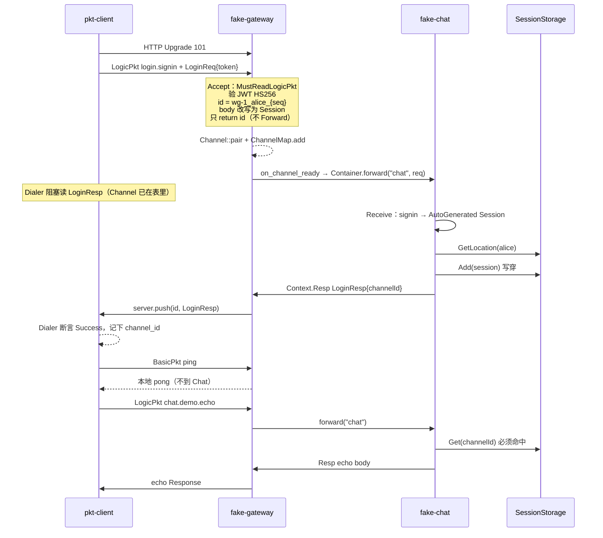
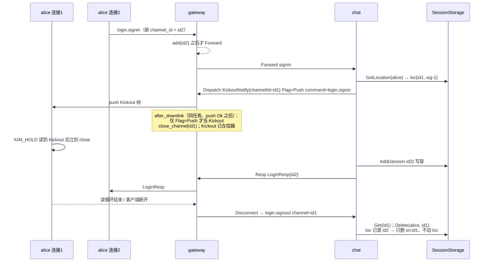
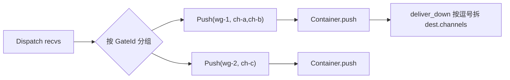

# 里程碑 2：链路层消息处理 + 登录与会话管理

面向：已经跑通 M1 通信层与 M2 业务包/容器 Demo、准备对照小册第 17–18 章往上长的工程师。  
本文是 **M3 已落地规格**。读本文时把「通信层/容器层已经有」和「本阶段登录」分开。字节与容器合同仍以 [protocol-container.md](protocol-container.md) 为准；握手与会话以本文为准。

| 字段 | 值 |
|---|---|
| 作者 | TBD |
| 日期 | 2026-08-27 |
| 状态 | Implemented |
| 对照小册 | 第 17 章《链路层》之消息处理链路 + 第 18 章 里程碑2️⃣：登录与会话管理 |
| 本仓库里程碑 | **M3**（对外仍叫「里程碑 2 / 体验节点：登录」，与小册编号对齐） |

---

## Overview

当前 `fake-gateway` 的 Accept 把第一帧 UTF-8 当 `channel_id`（`"alice"`），`fake-chat` 对任何 `chat.demo.echo` 原样回声，**没有会话、没有 JWT、没有互踢**。只补指令 Router 仍然只会得到 echo：Chat 不知道发送方是谁，断线也不清会话。

本阶段把第 17 章剩下的 **Router / Context / Dispatch / 按 channel 查会话** 当作第 18 章登录的前置，一次做完。目标是本机可跑：

1. 客户端第一帧必须是 `login.signin`（JWT HS256），网关验签、生成真正的 `channel_id`，**先 `ChannelMap.add` 再** `forward(SN_LOGIN)` 给 Chat（`SNLogin = "chat"`，与 Chat **同进程**）。不等待登录 Handler 返回。
2. Chat 用 Router 处理登录 / 登出 / echo；会话走 `SessionStorage`（默认 Memory，可选 Redis）。
3. 同一账号第二次登录：按 **channel_id** 给旧连接推 `KickoutNotify`，并在写完该帧后由网关关掉旧 Channel（`Agent` 仍然没有 `Close`）。
4. 断线由网关 `StateListener` 转发 `login.signout`；Delete **不得覆盖** 同账号更新的 Location。
5. `chat.demo.echo` 登录之后仍通；未登录或会话丢失回 `SessionNotFound`。坏 token 回 `Unauthorized` 且连接不进 `ChannelMap`。

通信层 echo 例子（`echo-*` / `ws-echo-*`）保持「第一帧是名字」，**不加 JWT**。

---

## Background & Motivation

### 已经落地、本阶段禁止重做 / 禁止打破

| 路径 | 合同 |
|---|---|
| `crates/kim-core` | `Conn` / `Frame` / `Channel::pair`（写信箱 + 写专员、读专员独占）/ `ChannelMap`（`RwLock` 只护字典，clone 信箱立刻放锁）/ `Acceptor` / `MessageListener` / `StateListener` / `Agent`（**只有 `id` + `push`，没有 Close**）/ `Server` / `Client` |
| `crates/kim-tcp` | 长度前缀帧；`TcpClient::read(&self)`；写侧仍 Mutex。网关↔Chat、App/TGateway |
| `crates/kim-ws` | HTTP Upgrade 之后的 RFC6455；`WsServer` 复用 Channel。本机 `ws://`，无 TLS |
| `crates/kim-protocol` | Magic + BasicPkt + LogicPkt（prost Header）。`service_name("chat.demo.echo")` → `"chat"`。Meta：`dest.server` / `dest.channels`。Status：**Success=0, InvalidPacket=1, CommandNotFound=2, ServiceUnavailable=3, SystemException=99** |
| `crates/kim-naming` | `Naming` + `StaticNaming`。无 Consul |
| `crates/kim-container` | `Arc<Container>` + `attach_server`，**不是**进程单例。Young/Adult、HashSelector、Forward/Push |
| `examples/echo-*`、`ws-echo-*` | 第一帧 identity 字符串。通信层回归，**本阶段零改业务** |
| `examples/fake-gateway` | `WsServer :8001`；Accept 第一帧 utf8 当 id；Receive：Basic ping 本地 pong，LogicPkt `forward(service_name)` |
| `examples/fake-chat` | `TcpServer :8002`；Accept `InnerHandshakeReq`；Receive 只认 `chat.demo.echo` |
| `examples/pkt-client` | `WsIdentityDialer` 发 `"alice"`，再 ping + echo |

`Channel::close` **已经存在**（`crates/kim-core/src/channel.rs`：往写信箱丢 `WriteOp::Close`），但只给 Channel 持有者用，没有暴露在 `Agent` 上。这是互踢落点的关键，见 §7.5。

### 痛点

1. **网关 Demo 的 channel_id = 用户名。** 同一账号无法区分两台设备/两次连接，互踢会「自己踢自己」（小册第 14、18、23 章反复强调）。
2. **Chat 不查会话。** 未登录也能 echo。小册要求：除 `login.signin` 外，`cache.Get(channelId)` 失败就 `SessionNotFound`。
3. **没有指令 Router。** `fake-chat` 用 `match command` 硬编码 echo。登录、登出、以后单聊会把 Handler 撑破。Router 是 HTTP 那种「command → HandlerFunc + Context」。
4. **Disconnect 只打日志。** 小册：SDK **不发**登出包；网关 `StateListener::disconnect` 转发 `login.signout`，逻辑服务 Delete。
5. **只做 Router、不做登录** 的「体验节点」不成立：Router 上挂的仍是 echo，人看不出链路层。

### 和小册的差异（已拍板，不要再争论）

- 双网关：Web → WS → WGateway；App → TCP → TGateway。本阶段仍 **本机明文**，**只做 WGateway 登录 Demo**（`pkt-client` 已是 WS）。不新做假 TGateway。
- Token **不**放 HTTP Upgrade URL/Query/Header。
- **不**在 `TcpServer` / `WsServer` 里写 `if command == login`。
- **不**引入进程级 Container 单例。
- **不**上 Consul。StaticNaming 继续。
- **不**做 1:1 / 群聊 / 离线 / Royal / Web TS SDK / no-copy / 缓冲 / 智能路由。
- `unsafe_code = deny`。库路径 `thiserror`、禁止 `unwrap`/`expect`。examples 可用 `anyhow`。
- 不跨 `.await` 握 `RwLock`/`Mutex`。

---

## Goals & Non-Goals

### Goals

1. **指令 Router**（第 17 章）：`HandlerFunc`、`Context`（Header / ReadBody / Session / Resp / Dispatch）、`Dispatcher.Push(gateway, channels, pkt)`、按 GateId 合包、跳过发送方自己的 `channel_id`。
2. **网关 Accept = 登录握手**（第 18 章）：第一帧必须是 LogicPkt `login.signin` + `LoginReq{token}`；HS256 验 JWT；非法 → 写 `Unauthorized` Binary（`write_frame` 完成即屏障；`WsConn::flush` 今日是 no-op）并返回 Err（连接不进表）。合法 → 生成 `channel_id`，body 改写成 `Session`，**只 return id**。`WsServer`/`TcpServer` 在 `ChannelMap.add` 之后调 `Acceptor::on_channel_ready`，这里才 `container.forward(SN_LOGIN, req)`。**不等待登录 Handler 返回。禁止在 `deliver_down` 里 sleep 重试。**
3. **Chat Receive**：`read_logic`；`login.signin` 合成 AutoGenerated Session；否则 `cache.Get(channel_id)`，没有 → `SessionNotFound`；然后 `router.serve(...)`。
4. **登录 Handler**：`GetLocation(account)`；旧 Location 存在则 `Dispatch(KickoutNotify{channel_id})`（比较的是 **channel_id**）；`Add` 写穿失败则登录失败；`Resp(LoginResp{channel_id})`。
5. **会话存储**：trait + Memory（默认 / **全部测试只构造 Memory，不读进程 `REDIS_URL`**）+ Redis（仅 Chat `main` 读 `REDIS_URL`，TTL 48h，key `login:sn:` / `login:loc:`）。Delete 在 **一把写锁 / Redis Lua** 下「删 sn；loc 仅当仍指向本 `channel_id` 才删」。
6. **登出**：网关 Disconnect → `login.signout`；Handler `Delete(account, channel_id)`。
7. **echo 回归**：登录后 `chat.demo.echo` 仍通；未登录 / 假 channel → `SessionNotFound`。
8. **本机体验**（见文末验收表）：三进程 + 互踢 + 坏 token，无需 Redis。`env -u REDIS_URL cargo test --workspace` 不依赖活 Redis / Consul；测试不读 `REDIS_URL`。

### Non-Goals（本阶段禁止）

- Consul / etcd / K8s。
- VPS、Cloudflare、WSS、TGateway TLS。
- 假 TGateway 进程（App 路径继续 `echo-server` / `echo-client`）。
- 1:1、群聊、离线、Royal CRUD、Web SDK。
- 把 JWT / `if login` 写进 `kim-tcp` / `kim-ws`。
- Token 进 Upgrade URL。
- axum WebSocket extractor。
- 进程级 `OnceLock<Container>`。
- 给 `Agent` 增加通用 `Close`。
- 改 `TcpClient` 写侧为 mpsc。
- 雪花 ID 服务（第 10 章）；channel_id 用网关进程内序列，见 KD-6。
- 改通信层 echo 例子的握手。
- 改已落地 Status 数值（Success=0 / InvalidPacket=1 / CommandNotFound=2 / ServiceUnavailable=3 / SystemException=99）。**只追加** 本阶段用到的 101/103/105/404；不加 `NoDestination`。

---

## Proposed Design

### 3.1 进程与电线（本机 Demo，端口不变）

```
pkt-client（Web）                 fake-gateway（WGateway）              fake-chat（Chat+Login）
examples/pkt-client              examples/fake-gateway                 examples/fake-chat
                                 WsServer :8001                        TcpServer :8002
                                 ChannelMap（人的连接）                  ChannelMap（网关连进来）
                                 Container deps=["chat"]               Container 无 deps
                                   └─ TcpClient × N Chat                 Router + SessionStorage
                                                                         Memory 默认 / Redis 可选

  ws://127.0.0.1:8001/                    内网 TCP 127.0.0.1:8002
  ① HTTP Upgrade 101                      InnerHandshakeReq（第一帧，已有）
  ② 第一帧 Binary = LogicPkt               之后只走 LogicPkt
       command=login.signin
       body=LoginReq{token}
  ③ 网关验 JWT，生成 channel_id，Accept 只 return id
     Channel::pair + ChannelMap.add
     然后 on_channel_ready → Forward("chat")（仍不等 LoginResp）
  ④ 客户端 Dialer 等 LoginResp（或 Unauthorized / Close / ServiceUnavailable）
  ⑤ 之后 Basic ping 本地；echo 走 Router
```

| 谁连谁 | 传输 | 握手（本阶段） |
|---|---|---|
| Web 客户端 → WGateway | WS | Upgrade 之后第一帧 **必须** 是 `login.signin`。**不再**发 `"alice"` |
| 网关 → Chat | TCP | 仍是 `InnerHandshakeReq { service_id }`（已有 `InnerTcpDialer`） |
| echo-client → echo-server | TCP | **不变**：第一帧名字 |
| ws-echo-client → ws-echo-server | WS | **不变**：第一帧名字 |

`crates/kim-container/tests/e2e_echo.rs` 自带 identity Handler，测的是 Forward/Push，**保持 identity**，作为容器回归。登录 e2e 另开文件。

### 3.2 新 crate 在仓库里的位置

```
im/
  crates/kim-core          小改：Conn::peer_addr 默认 None；Server::close_channel；Acceptor::on_channel_ready / on_accept_abandoned（conn.rs 默认 no-op）
  crates/kim-tcp           peer_addr（仅 unsplit TcpConn）；TcpServer::close_channel；handle_conn 按 §7.2
  crates/kim-ws            peer_addr 从 accept(peer) 穿进 WsConn；close_channel；handle_ws 按 §7.2；connect_ws 返回 newtype（不暴露私有 UpgradedIo）
  crates/kim-protocol      Status 追加（不含 NoDestination）；LoginReq/Resp、Session、KickoutNotify；token；command 常量；LogicPkt Clone
  crates/kim-naming        不动
  crates/kim-container     after_downlink hook（push Ok 之后，同任务）；deliver_down **不** sleep 重试；所有 ContainerOpts 字面量补字段
  crates/kim-router        新增。Router / Context / Dispatcher / Location / SessionStorage trait
  crates/kim-session       新增。Memory 默认；Redis 适配器 feature 默认关（附录 docker，不进根 README）
  examples/echo-*          不动
  examples/ws-echo-*       不动
  examples/fake-gateway    Accept=JWT 登录；Disconnect=signout；after_downlink 踢下线关连接
  examples/fake-chat       src/lib.rs（handler/login/echo）+ main.rs；tests/e2e_login.rs
  examples/pkt-client      LoginDialer：本地铸 JWT，等 LoginResp，再 ping + echo
```

**不**建 `kim-logic` / `kim-link`。登录 Handler 放 `examples/fake-chat`（小册也是 `services/server/handler`）。Router 抽 crate 是为了第 19 章单聊还能用，且单测不绑 example。JWT 放 `kim-protocol`（对齐小册 `wire/token`），**不**放 `kim-ws`。

### 3.3 总时序：登录成功



### 3.4 总时序：互踢 + 断线登出



---

### 4. `kim-protocol`：Status、消息、指令、JWT

#### 4.1 追加 Status（不改已有数值）

Go KIM `wire/pkt/common.pb.go`（commit `69995ca15cf6`，tag 同源 v1.2）数值与本仓库 M2 **不一致**。本仓库已经在用 `ServiceUnavailable=3`（`pkt-client` / `e2e_echo`）。**禁止重编号。** 小册 markdown 从未打印枚举数字；对照源码如下（**本阶段不引入未使用的值**）：

```
// github.com/klintcheng/kim @ 69995ca15cf6  wire/pkt/common.pb.go
Status_Success           = 0
Status_NoDestination     = 100  // 第 19 章才有生产者；M3 不写入 proto
Status_InvalidPacketBody = 101
Status_InvalidCommand    = 103
Status_Unauthorized      = 105
Status_SystemException   = 300  // 本仓库保持已落地 99，不改、不追加 300
Status_NotImplemented    = 301  // M3 不用
Status_SessionNotFound   = 404
```

```protobuf
enum Status {
  Success = 0;
  InvalidPacket = 1;          // 已有；坏 Magic 等
  CommandNotFound = 2;        // 已有；Router 找不到 command
  ServiceUnavailable = 3;     // 已有；没有 Adult
  SystemException = 99;       // 已有；不改成小册的 300

  InvalidPacketBody = 101;    // 登录 body 解不开
  InvalidCommand = 103;       // 第一帧是 LogicPkt 但 command ≠ login.signin
  Unauthorized = 105;         // JWT 非法 / 过期 / 空 account
  SessionNotFound = 404;      // 会话丢失，需重新登录
}
```

**不**追加 `NoDestination=100`（无生产者/消费者，留给第 19 章）。

| 场景 | Status | 谁写 |
|---|---|---|
| 登录成功 / echo 成功 | Success=0 | Chat Handler via Context.Resp |
| Router 无此 command | CommandNotFound=2 | Router 默认 handler |
| 无 Adult Chat | ServiceUnavailable=3 | **on_channel_ready** Forward 失败：Channel 已 add，先 `container.push(&id, resp)`（本进程 WsServer 的 channel_id；**不要** handler.`server` 字段）再 `close_channel` + remove |
| 存储失败等 | SystemException=99 | Login Handler |
| 第一帧是 LogicPkt 但不是 signin | InvalidCommand=103 | **网关 Accept**，`write_frame(Binary)` 完成再 return Err |
| 第一帧无 Magic / 非 Logic（如 utf8 `"alice"`） | 无 LogicPkt | Accept 返回 Handshake Err；`handle_ws` 写 WS Close。**不是** InvalidCommand |
| JWT 失败 / 空 account | Unauthorized=105 | **网关 Accept**，`write_frame(Binary)` 完成再 return Err |
| ReadBody 失败 | InvalidPacketBody=101 | Login Handler |
| 非 signin 且 cache miss | SessionNotFound=404 | Chat Receive，`resp_err` 必须带 `dest.channels`，不进 Router |

`CommandNotFound`（2）≠ `InvalidCommand`（103）。前者是「指令表没有」；后者是「握手 LogicPkt 不是登录包」。Identity 字符串没有 Header，不能 `NewFrom`。

#### 4.2 追加 message（`crates/kim-protocol/proto/pkt.proto`）

字段名与 Go 生成代码对齐（prost 默认 camelCase json，Rust 字段 snake_case）：

```protobuf
message LoginReq {
  string token = 1;
  string isp = 2;
  string zone = 3;
  repeated string tags = 4;
}

message LoginResp {
  string channelId = 1;
  string account = 2;
}

message KickoutNotify {
  string channelId = 1;
}

message Session {
  string channelId = 1;
  string gateId = 2;
  string account = 3;
  string zone = 4;
  string isp = 5;
  string remoteIP = 6;
  string device = 7;
  string app = 8;
  repeated string tags = 9;
}
```

本阶段客户端只填 `LoginReq.token`；网关改写 body 为 `Session`（account / channelId / gateId / app / remoteIP）。isp/zone/device/tags 留空。

#### 4.3 指令与服务名（`kim-protocol/src/wire.rs`）

来自小册 + `github.com/klintcheng/kim/wire/definitions.go`：

```rust
pub const SN_WGATEWAY: &str = "wgateway";
pub const SN_CHAT: &str = "chat";
/// 登录服务名。小册故意等于 "chat"，本阶段一个进程同时挂 login.* 与 chat.*。
pub const SN_LOGIN: &str = "chat";

pub const CMD_LOGIN_SIGN_IN: &str = "login.signin";
pub const CMD_LOGIN_SIGN_OUT: &str = "login.signout";
pub const CMD_DEMO_ECHO: &str = "chat.demo.echo"; // 已有
```

**登录上行禁止** `service_name("login.signin")` → `"login"`（Naming 里没有这个服务）。必须 `container.forward(SN_LOGIN, req)`，**且只允许在 `on_channel_ready`（`ChannelMap.add` 之后）调用，禁止写在 `accept()` 里**。Receive 里其它 LogicPkt 仍按 `pkt.service_name()` 转发——这就是以后把 login 拆成独立进程时只改 `SN_LOGIN` 常量和配置、不改 Router 的原因。

**Kickout 没有独立 command。** 小册 `Context.Dispatch` 用 `NewFrom(request.Header)`，登录请求的 command 仍是 `login.signin`，只改 `Flag=Push`、body=`KickoutNotify`。Web SDK（第 23 章）也是在 `case SignIn` 里解 KickoutNotify。本阶段 **照抄**，不要发明 `login.kickout`。

#### 4.4 LogicPkt 补方法（`logic.rs`）

Chat/网关/Router 都需要。对齐小册 `pkt.New` / `NewFrom` / `ReadBody` / `WriteBody`：

```rust
#[derive(Clone)] // Dispatch 合包、deliver_down hook 都要 clone；Header/Bytes 可 clone
pub struct LogicPkt { /* 已有 header + body */ }

impl LogicPkt {
    pub fn new_from(header: &Header) -> Self { /* 复制 header，body 空，body_length=0 */ }
    pub fn write_body(&mut self, msg: &impl prost::Message) {
        let buf = msg.encode_to_vec();
        self.header.body_length = buf.len() as u32;
        self.body = Bytes::from(buf);
    }
    pub fn read_body<T: prost::Message + Default>(&self) -> Result<T, ProtocolError> { /* decode */ }
}
```

库路径错误用 `ProtocolError`（可加 `Prost` 已有）。禁止 unwrap。**不要**打开 prost 的 serde feature（JWT claims 才用 serde）。

#### 4.5 JWT（`kim-protocol/src/token.rs`）

库：`jsonwebtoken`（HS256 一等公民，claims 用 serde）。不选 `jwt-simple`（API 更偏 HMAC 自己拼，生态较小）。

```rust
/// 仅 Demo。与小册 `token.DefaultSecret` 相同，便于对照。生产必须从环境变量覆盖。
pub const DEMO_DEFAULT_SECRET: &str = "jwt-1sNzdiSgnNuxyq2g7xml2JvLArU";

#[derive(Debug, Serialize, Deserialize)]
pub struct TokenClaims {
    #[serde(rename = "acc")]
    pub account: String,
    #[serde(rename = "app")]
    pub app: String,
    pub exp: i64, // unix seconds
}

pub fn generate(secret: &str, claims: &TokenClaims) -> Result<String, TokenError>;
pub fn parse(secret: &str, token: &str) -> Result<TokenClaims, TokenError>;
```

- 算法 **只允许 HS256**：`jsonwebtoken::Validation { algorithms: vec![HS256], validate_exp: true, .. }`。**拒绝 `alg=none` / RS256**（单测向量，不只「改一个字节」）。
- `app` 本阶段固定 `"kim"`（小册测试客户端如此）。
- `parse` 之后：`account` 为空、含 ASCII 控制字符（含 `\n` `/` `\0`）→ `TokenError::InvalidAccount`。网关映成 Unauthorized，不把脏字符串写进 channel_id / Redis key。
- `TokenError`：`thiserror`，区分过期 / 签名 / 格式 / 空账号。网关一律映成 `Unauthorized`，日志里打具体原因，**不打完整 token**。
- **密钥优先级**（env 只在非空时赢）：
  1. `KIM_JWT_SECRET` 已设 **且** `!trim().is_empty()` → 用它；
  2. 否则 config `jwt_secret` 非空 → 用它；
  3. 否则 `DEMO_DEFAULT_SECRET`，启动 `warn!(secret="demo-default", "do not use in production")`。
  空字符串的 env **不**覆盖文件；空文件字段落到 3。禁止另写一套「生产密钥」进源码。

`kim-protocol/Cargo.toml` 增加：`jsonwebtoken`、`serde`（workspace 提升）。**不要** `prost` serde feature。

单测：generate/parse 往返；改一个字节失败；过期失败；header `alg=none` 失败；`account=""` 失败。

---

### 5. `kim-router`：指令处理链路（第 17 章）

新 crate，**零** Redis / JWT / TCP 依赖。依赖：`kim-protocol`、`async-trait`、`thiserror`、`bytes`、`tracing`。

```
crates/kim-router/src/lib.rs
crates/kim-router/src/location.rs
crates/kim-router/src/storage.rs   // SessionStorage trait + SessionError
crates/kim-router/src/dispatcher.rs
crates/kim-router/src/context.rs
crates/kim-router/src/router.rs
```

#### 5.1 Location

```rust
#[derive(Clone, Debug, PartialEq, Eq)]
pub struct Location {
    pub channel_id: String,
    pub gate_id: String,
}

impl Location {
    /// 小册 endian.WriteShortBytes。字节布局（Redis loc value / Lua 必须按此解）：
    /// `| channel_len u16 LE | channel_id UTF-8 | gate_len u16 LE | gate_id UTF-8 |`
    pub fn encode(&self) -> Bytes;
    pub fn decode(buf: &[u8]) -> Result<Self, SessionError>;
}
```

Redis / Memory 的 loc 热路径都用这 2 个字段。Session protobuf 按 channel_id 存完整副本。

#### 5.2 SessionStorage

```rust
#[derive(Debug, thiserror::Error)]
pub enum SessionError {
    #[error("session not found")]
    NotFound,
    #[error("{0}")]
    Other(String),
}

#[async_trait]
pub trait SessionStorage: Send + Sync {
    async fn add(&self, session: &Session) -> Result<(), SessionError>;
    async fn delete(&self, account: &str, channel_id: &str) -> Result<(), SessionError>;
    async fn get(&self, channel_id: &str) -> Result<Session, SessionError>;
    async fn get_locations(&self, accounts: &[String]) -> Result<Vec<Location>, SessionError>;
    async fn get_location(&self, account: &str, device: &str) -> Result<Location, SessionError>;
}
```

`device` 本阶段调用方传 `""`（小册未做多设备）。`get_location` / `get_locations` 全空 → `NotFound`。

**Delete 语义（修正小册无条件 DEL loc；这不是 GET-then-DEL「CAS」）**：

Go KIM `storage/redis_impl.go`（`69995ca15cf6`）`Delete` 无条件 `DEL login:loc:{account}`，旧连接的 signout 会把新登录的 Location 删掉。本仓库 Memory 与 Redis **同一套语义**：

```
delete(account, channel_id):  // 必须原子：比较与删除之间不允许交错 Add
  1. 总是删 session key login:sn:{channel_id}
  2. 仅当 loc 里的 channel_id **仍等于** 本 channel_id 时才删 loc
     否则留下（新登录已经覆盖）
```

- **Memory**：`sessions` 与 `locations` 放在 **同一把** `std::sync::RwLock` 里，或两张 map 共用一把 `std::sync::Mutex`。`delete` **整函数**持写锁：删 sn → 读 loc → 匹配才删 loc → drop 锁。禁止 `tokio::sync::RwLock` 跨 `.await`（Memory 路径无 await）。禁止「先放锁再 DEL」。
- **Redis**：一条 Lua。loc value 是 `Location::encode()` 的二进制，**不是** UTF-8 channel_id；脚本必须解 u16 LE 长度再比 `ARGV[1]`。不要客户端 GET 再 DEL。

```lua
-- KEYS[1] = login:loc:{account}     （Location::encode 的 blob）
-- KEYS[2] = login:sn:{channel_id}
-- ARGV[1] = 正在 Delete 的 channel_id
-- 布局：u16le n | channel[n] | u16le m | gate[m]
local loc = redis.call('GET', KEYS[1])
redis.call('DEL', KEYS[2])          -- sn 总是删
if type(loc) ~= 'string' or #loc < 2 then
  return 0
end
local n = loc:byte(1) + loc:byte(2) * 256
if n < 0 or #loc < 2 + n then
  return 0
end
local ch = loc:sub(3, 2 + n)
if ch == ARGV[1] then
  redis.call('DEL', KEYS[1])
  return 1
end
return 0
```

语义单测仍以 Memory 为准（`Add(id1); Add(id2); Delete(account, id1)` 保留 id2）。Redis live `#[ignore]` 可后补。

单测（`kim-session`，**只** `MemorySessionStore::new()`，不读 `REDIS_URL`）：

```
Add(session id1); Add(session id2 同 account); Delete(account, id1)
→ GetLocation(account) == id2
→ Get(id1) == NotFound
→ Get(id2) 仍在
```

Add 必须 **写穿**：先 loc 再 session（小册顺序）；任一步失败返回 Err，调用方不得发 LoginResp Success。Redis 第二步失败时 Lua/事务尽力不留下半状态；非原子补偿只作为 Lua 不可用时的文档备注——实现必须走 Lua。

#### 5.3 Dispatcher

```rust
#[async_trait]
pub trait Dispatcher: Send + Sync {
    async fn push(
        &self,
        gateway: &str,
        channels: &[String],
        pkt: LogicPkt,
    ) -> Result<(), RouterError>;
}
```

Chat 侧实现（`examples/fake-chat`，**不要**放进 `kim-container`）：

```rust
#[derive(Debug, thiserror::Error)]
pub enum RouterError {
    #[error("dispatcher: {0}")]
    Dispatcher(String),
    #[error(transparent)]
    Session(#[from] SessionError),
    #[error(transparent)]
    Protocol(#[from] ProtocolError),
    #[error("{0}")]
    Other(String),
}

struct ContainerDispatcher(Arc<Container>);

#[async_trait]
impl Dispatcher for ContainerDispatcher {
    async fn push(&self, gateway: &str, channels: &[String], mut pkt: LogicPkt)
        -> Result<(), RouterError>
    {
        // 目标网关：Chat.ChannelMap 的 key，也是对端 deliver_down 校验的 dest.server。
        // 上行 Forward 填的是「发送方网关」；Dispatch 到另一台必须改写成 recv.gate_id。
        pkt.set_meta(META_DEST_SERVER, gateway);
        pkt.set_meta(META_DEST_CHANNELS, &channels.join(","));
        self.0.push(gateway, pkt).await.map_err(|e| RouterError::Dispatcher(e.to_string()))
    }
}
```

Handler **不准**直接摸 `Server` 或 `ChannelMap`。

`kim-router` 单测：请求 header `dest.server=gate-a`，Dispatch 到 `Location { gate_id: "gate-b", ... }` → fake Dispatcher 收到的包 `get_meta(dest.server)==Some("gate-b")`。Resp 同样走 `push(session.gate_id, ...)`，结果 dest.server 等于发送方自己的 gate——单网关 Demo 与互踢都正确。

#### 5.4 Context

不做 Go `sync.Pool`（对象池在 Rust 异步里收益小、还要小心跨 await 残留）。每次 `Serve` `Context { ... }` 栈上新建。

```rust
pub struct Context {
    request: LogicPkt,
    session: Session,
    dispatcher: Arc<dyn Dispatcher>,
    storage: Arc<dyn SessionStorage>,
}

impl Context {
    pub fn header(&self) -> &Header;
    pub fn session(&self) -> &Session;
    pub fn read_body<T: Message + Default>(&self) -> Result<T, ProtocolError>;

    pub async fn resp<B: Message>(&self, status: Status, body: Option<&B>) -> Result<(), RouterError>;
    pub async fn resp_bytes(&self, status: Status, body: Bytes) -> Result<(), RouterError>;
    pub async fn resp_with_error(&self, status: Status, err: &dyn std::error::Error) -> Result<(), RouterError>;
    pub async fn dispatch<B: Message>(&self, body: &B, recvs: &[Location]) -> Result<(), RouterError>;

    pub async fn add(&self, session: &Session) -> Result<(), SessionError>;
    pub async fn delete(&self, account: &str, channel_id: &str) -> Result<(), SessionError>;
    pub async fn get_location(&self, account: &str, device: &str) -> Result<Location, SessionError>;
}
```

`resp_bytes` 给 `chat.demo.echo`（body 是原始字节，不是 protobuf）。`resp_with_error`：`Flag=Response`，`status` 如参数，body 写 `ErrorResp { message }`（本阶段可只设 status、body 空 Bytes；不要把 Rust `Display` 泄漏给客户端当稳定 ABI）。Handler 必须 `if let Err(e) = ctx.resp(...).await { tracing::warn!(%e, "resp failed"); }`——`HandlerFn` 返回 `()`，`serve` 看不见这些失败。

**Resp / resp_bytes**（给发送方）：

```
packet = new_from(request.header)
packet.header.status = status as i32
packet.header.flag = Flag::Response as i32
resp: write_body(protobuf)；resp_bytes: packet.body = body; body_length = len
dispatcher.push(session.gate_id, &[session.channel_id], packet)
  // push 内会 set dest.server=gate_id、dest.channels=channel_id
```

**Dispatch**（推给别人，合包）：

```
if recvs.is_empty() { return Ok(()); }
packet = new_from(request.header)
packet.header.flag = Flag::Push as i32
packet.write_body(body)
group: HashMap<gate_id, Vec<channel_id>>
for recv in recvs {
    if recv.channel_id == self.session.channel_id { continue; } // 跳过自己
    group[recv.gate_id].push(recv.channel_id)
}
for (gw, ids) in group {
    dispatcher.push(&gw, &ids, packet.clone())?;
}
```

小册 Go 在 `for gateway` 里 `return err` 导致只推第一个网关——那是原书 bug。本仓库 **每个网关都 push**，任一失败记 warn，最后返回第一个 Err（本阶段互踢只有一个 recv，行为一致）。

合包图：



#### 5.5 Router

本阶段 **不做** 中间件 / `Next` / 责任链（小册有 `middlewares` + `index`，登录用不到）。结构就是一张 `HashMap<command, HandlerFn>`。第 19 章再加链。

```rust
pub type HandlerFn = Arc<
    dyn Fn(Context) -> Pin<Box<dyn Future<Output = ()> + Send>> + Send + Sync,
>;

pub struct Router {
    handlers: HashMap<String, HandlerFn>,
}

impl Router {
    pub fn new() -> Self;
    pub fn handle<F, Fut>(&mut self, command: impl Into<String>, f: F)
    where
        F: Fn(Context) -> Fut + Send + Sync + 'static,
        Fut: Future<Output = ()> + Send + 'static;
    pub async fn serve(
        &self,
        packet: LogicPkt,
        dispatcher: Arc<dyn Dispatcher>,
        cache: Arc<dyn SessionStorage>,
        session: Session,
    ) -> Result<(), RouterError>;
}
```

`serve`：找不到 command → `ctx.resp_bytes(CommandNotFound, Bytes::new()).await`，该次失败才让 `serve` 返回 `Err`。找到则 `f(ctx).await` 后 `Ok(())`。Handler 内 `resp`/`dispatch` 失败只 `warn`，不从 `serve` 冒泡（与小册 `log.Warn` 一致）。

单测（`kim-router`，Memory mock dispatcher）：

- echo handler：`resp_bytes` 的 sequence/command/channel_id 与请求相同，flag=Response。
- Dispatch 两个 Location 同一 GateId → `push` 一次，channels 逗号连接；`dest.server` = 该 GateId。
- Dispatch 到 `gate-b`、请求 meta 是 `gate-a` → 发出包 `dest.server=gate-b`。
- Dispatch 含自己的 channel_id → 被跳过。
- 未知 command → CommandNotFound。

---

### 6. `kim-session`：Memory + Redis

```
crates/kim-session/src/lib.rs
crates/kim-session/src/memory.rs
crates/kim-session/src/redis.rs      // #[cfg(feature = "redis")]
crates/kim-session/src/keys.rs       // login:sn: / login:loc:
```

```rust
pub const SESSION_TTL: Duration = Duration::from_secs(48 * 3600);

pub fn key_session(channel: &str) -> String { format!("login:sn:{channel}") }
pub fn key_location(account: &str, device: &str) -> String {
    if device.is_empty() { format!("login:loc:{account}") }
    else { format!("login:loc:{account}:{device}") }
}
```

#### 6.1 Memory（默认 Demo + 全部 `cargo test`）

```rust
pub struct MemorySessionStore {
    inner: std::sync::RwLock<Inner>, // 禁止 tokio::RwLock
}
struct Inner {
    sessions: HashMap<String, Session>,   // channel_id → Session
    locations: HashMap<String, Location>, // key_location(account, device) → Location
}

impl MemorySessionStore {
    pub fn new() -> Self { /* ... */ }
}
```

- 取数据：读锁，clone 出来，**立刻 drop**，再返回。禁止握锁 `.await`。
- `add` / `delete`：整段持 **一把写锁**（无 await）。`delete` 见 §5.2。
- `get_locations`：缺的 account 跳过；全缺 → `NotFound`。

#### 6.2 Redis（可选，booklet-faithful）

- 依赖：`redis` crate + tokio 异步，`ConnectionManager`。feature **`redis` 默认关**。
- `kim-session` 与 `examples/fake-chat` 都 **不要默认打开** `redis`。docker 路径：`cargo run -p fake-chat --features redis`。`cargo test --workspace` **不编译** redis 适配器也可（feature off）；若为了少两套 cfg 而编译 redis crate，仍 **禁止** 测试去连 daemon。
- 每个 `SET` 带 `EX` 48h。
- loc value：`Location::encode()`；sn value：`Session` protobuf。
- `Delete` = Lua（§5.2），不是 GET+DEL。
- 连接失败、超时 → `SessionError::Other`，登录失败（写穿）。
- `#[cfg(feature = "redis")]` 下 `#[ignore]` live 测试；CI 不跑。Lua 语义用 Memory 单测覆盖。

**文档位置（已拍板）：** 根 `README.md` 主路径是 Memory，三进程即可跑，**不**写 docker redis，也 **不**把 Redis 写成默认 Demo 依赖。`cargo test --workspace` 永远不需要 Redis。docker redis 只放 **本文附录**（或 `docs/` 附录），给想对照小册 `MONITOR` 的人：

```bash
docker run --rm -p 6379:6379 redis:7
REDIS_URL=redis://127.0.0.1:6379 cargo run -p fake-chat --features redis
```

#### 6.3 工厂

```rust
pub async fn open_session_store(redis_url: Option<&str>) -> Result<Arc<dyn SessionStorage>, SessionError>;
```

- **`None` / `Some("")` → Memory。**
- 非空 URL → Redis（需要 feature；否则 Err「rebuild with --features redis」）。非法 URL → Err，禁止静默 fallback 到 Memory。
- **测试永远** `MemorySessionStore::new()` 或 `open_session_store(None)`，**禁止** `std::env::var("REDIS_URL")`。
- Chat **`main`** 才读 `REDIS_URL` / config。文档写一句：`env -u REDIS_URL cargo test --workspace`。

---

### 7. 网关（`examples/fake-gateway`）

**仍然只存在于 example。** `WsServer` 不知道 JWT。

#### 7.1 channel_id

小册 `generateChannelID`（Go 源码，不是雪花）：

```text
{serviceID}_{account}_{seq}
例：wg-1_alice_1
```

```rust
struct ChannelSeq(AtomicU64); // 从 1 起
fn generate_channel_id(gateway_id: &str, account: &str) -> String {
    let n = self.seq.fetch_add(1, Ordering::Relaxed);
    format!("{gateway_id}_{account}_{n}")
}
```

唯一性：**单网关进程内**保证。进程重启后 seq 归 1，若旧会话 Redis 仍在 48h TTL 内，理论上可能撞号。本阶段默认 Memory、单进程 Demo，可接受。文档写明；多网关 / 重启后的全局唯一留到雪花（第 10 章）或以后。

`account` 来自 JWT；Accept 已拒绝空 / 控制字符。不要用 `"alice"` 当 channel_id。

#### 7.2 Accept + `on_channel_ready`（替代「第一帧 utf8 当 id」）

小册在 Accept 里 `Forward` 再 `return id`，而本仓库 `handle_ws` 是 `accept()` → `pair` → `channels.add`（`kim-ws/src/server.rs`）。若 Accept 内 Forward，Chat 的 LoginResp 可能在 `add` 之前到达 `deliver_down`，今日实现是 `let _ = srv.push` 吞掉 `ChannelNotFound`，Dialer 空等到 `DEFAULT_LOGIN_WAIT`。

**选定：消灭竞态，而不是在下行循环里 sleep。** `accept()` 需要未 split 的 `Conn` 读 JWT，但 **不必** 在 return 前 Forward。

`kim-core::Acceptor` 增加默认方法（写在 **`crates/kim-core/src/conn.rs`**，不是 `server.rs`）。echo / `DefaultAcceptor` / `e2e_echo` 只实现 `accept` 仍能编过：

```rust
#[async_trait]
pub trait Acceptor: Send + Sync {
    async fn accept(&self, conn: &mut dyn Conn, timeout: Duration) -> Result<String, Error>;
    /// ChannelMap.add 成功、且 MessageListener 已设置之后、read_loop 之前。默认 Ok。
    async fn on_channel_ready(&self, _channel_id: &str) -> Result<(), Error> {
        Ok(())
    }
    /// Accept 已 Ok，但这条连接不会进入 read_loop（id 重复 / 未设 MessageListener）。
    /// 默认空。网关用来 pending.remove，避免 Dialer 空等 LoginResp。
    async fn on_accept_abandoned(&self, _channel_id: &str) {}
}
```

`handle_ws` 与 `handle_conn`（`kim-ws/src/server.rs` / `kim-tcp/src/server.rs`）**整段替换**现有 `accept → contains → pair → add → messages 检查 → read_loop`。两边同一顺序。`close_channel` 在 add 之后才有 Channel：

```
id = match timeout(login_wait, acceptor.accept(&mut conn, login_wait)) {
    Ok(Ok(id)) => id,
    Ok(Err(err)) => { write Close; shutdown; return Err(err); }   // pending 未 insert
    Err(_) => { write Close "handshake timeout"; return HandshakeTimeout; }
}

if channels.contains(&id) {
    write Close "channelId is repeated"
    shutdown
    acceptor.on_accept_abandoned(&id).await    // 网关 pending.remove；echo 默认 no-op
    return Err(ChannelExists(id))
}

(reader, writer) = conn.into_split()
(channel, read_loop) = Channel::pair(id, ...)
channels.add(channel)

let Some(messages) = ctx.messages else {
    acceptor.on_accept_abandoned(&id).await    // 必须在 on_channel_ready 之前
    if let Some(ch) = channels.get(&id).await { ch.close().await; }
    channels.remove(&id).await
    return Err(other("MessageListener is not set"))
}

if let Err(err) = acceptor.on_channel_ready(&id).await {
    if let Some(ch) = channels.get(&id).await { ch.close().await; }
    channels.remove(&id).await
    return Err(err)
}

read_loop.run(messages)
channels.remove
states.disconnect
```

**禁止**先 `on_channel_ready` 再检查 MessageListener：否则 Chat 已 `Add` 会话，本地 Channel 立刻被拆掉。**禁止** MessageListener 缺失时直接 return 而不 `on_accept_abandoned`：`pending` 会泄漏，Dialer 等到 `DEFAULT_LOGIN_WAIT`。

网关 Handler（**只有** `container: Arc<Container>`，没有 `server` 字段；`Container.server` 是私有 `OnceLock`）：

```
Accept（conn 仍是整条，可 write_frame）：
  timeout 内 read_frame
  payload → read_logic
    失败（BadMagic / NotLogic / Incomplete，含 identity utf8 "alice"）
      → 不写 LogicPkt（没有 Header 可 NewFrom）
      → return Err(Handshake("expected login.signin"))
      → handle_ws 写 WS Close
  command != login.signin
    → NewFrom + Status=InvalidCommand
    → conn.write_frame(Binary, marshal).await   // 完成即发出；不要指望 flush
    → return Err(...)
  LoginReq = read_body；失败 → InvalidPacketBody Binary + return Err
  parse(jwt_secret, token)；失败或 account 非法
    → NewFrom + Status=Unauthorized
    → conn.write_frame(Binary, marshal).await
    → return Err(...)          // ChannelMap 不会 add；pending 未 insert
  id = generate_channel_id(...)
  pkt.header.channel_id = id
  pkt.write_body(Session { account, channel_id: id, gate_id, app, remote_ip })
  pending.insert(id, pkt)      // Mutex<HashMap>；不 Forward
  return Ok(id)

on_accept_abandoned(id):
  pending.remove(id)           // ChannelExists 或未设 MessageListener

on_channel_ready(id):
  pkt = pending.remove(id).ok_or(...)?
  container.forward(SN_LOGIN, pkt).await
    失败 → resp = NewFrom；Flag=Response；Status=ServiceUnavailable；同一 sequence
            container.push(&id, resp).await
              // 网关 Container 的 Server 是 WsServer，参数是客户端 channel_id
              // 走本进程 Server::push，不经 deliver_down，不必 dest.server
            return Err           // handle_* 随即 close_channel + remove
  Ok(())                       // 仍不等 LoginResp
```

`WsConn::flush` **今日是 `Ok(())` no-op**（`kim-ws/src/conn.rs`）。Accept 的屏障是 **`write_frame(...).await` 返回**。PR4 若给 WS 做真 flush 更好，但 LoginDialer **不得依赖 flush**：必须把 `OpCode::Close` 与 Binary Unauthorized / InvalidCommand / ServiceUnavailable 都当成握手终态（见 §9）。

**为什么仍不等待登录 Handler：** 小册客户端等 LoginResp；服务端不等 Chat 处理完。本设计只保证 **Forward 发生在 add 之后**，LoginResp 一定找得到 Channel。不在 `deliver_down` 里 5×5ms sleep（会堵住该网关全部 Chat→下行）。不把 Forward 改回 Accept 内。

`peer_addr`：只在 **未 split 的 Conn** 上有值。Accept 用它填 `Session.remote_ip`。`TcpReadHalf` / `WsReadHalf` 保持默认 `None`。WS：`listener.accept` 的 `peer` 今日在 `handle_http` 前丢掉，PR4 必须经 `HttpCtx` 传入 `WsConn { ws, peer: Some(peer.to_string()) }`。IPv4 `get_ip` 去掉最后 `:port`；没有 peer 则 remote_ip 空。

#### 7.3 Receive

与现在几乎一样：

- Basic ping → 本地 pong，return。
- Logic → `header.channel_id = agent.id()`（此时已是 `wg-1_alice_N`），`forward(service_name())`。
- Forward 失败 → Response + ServiceUnavailable（已有）。

不要在 Receive 里再验 JWT。不要 `if command == login`。

#### 7.4 Disconnect

```
info!(channel, "disconnect")
logout = LogicPkt::new(CMD_LOGIN_SIGN_OUT, 0, empty)
logout.header.channel_id = id
container.forward(SN_LOGIN, logout)
失败只 warn，仍 Ok(())  —— 通信层已经把连接拆了
```

SDK **不发** signout 包（小册原话）。

#### 7.5 互踢如何关掉旧 TCP/WS（Agent 不能 Close）

下行 Kickout 走的是 `Container.read_loop` → `deliver_down` → `Server::push`，**不经过** `MessageListener`。所以网关 Handler 的 `receive` 看不见 Kickout。

选定路径（窄、显式、不污染 Agent）：

1. `kim-core::Server` 增加：

```rust
async fn close_channel(&self, channel_id: &str) -> Result<(), Error>;
```

`TcpServer` / `WsServer`：`ChannelMap.get` clone，立刻放锁，`channel.close().await`。

`Channel::close` 先把 `closed=true` 再入队 `WriteOp::Close`；`send_binary` 见 closed 会拒。因此 **必须先 `push` Kickout 成功，再在同一任务调 `close_channel`**。这不是并发下的一般 FIFO 不变量，而是 hook 合同：

> `after_downlink` 在 `deliver_down` 里、**本次** `srv.push` 返回 `Ok` 之后、同一 task 调用。禁止 spawn 后再 close 抢在 push 完成前。

2. `ContainerOpts` 增加字段（**没有** Default 补丁；所有现存字面量必须改，见 PR4）：

```rust
pub after_downlink: Option<Arc<dyn DownlinkHook>>,

#[async_trait]
pub trait DownlinkHook: Send + Sync {
    async fn after_push(&self, channel_id: &str, pkt: &LogicPkt);
}
```

`deliver_down` 顺序（`pkt` 会被 `marshal` move，必须先 clone）：

```
校验 dest.server == 自己
channels = dest.channels
del 两个 meta
let hook_pkt = pkt.clone()           // LogicPkt: Clone
let bytes = marshal(&Packet::Logic(pkt))
for id in channels.split(',') {
    match srv.push(id, bytes.clone()).await {
        Ok(()) => if let Some(h) = &after_downlink { h.after_push(id, &hook_pkt).await; }
        Err(e) => warn              // 不 sleep、不重试
    }
}
```

3. 网关 hook（**必须先看 Flag**：LoginResp 与 Kickout 同 command `login.signin`，且 LoginResp.channelId 是 protobuf field 1，字节上能当 KickoutNotify 解出来）：

```
// 禁止在 Flag≠Push 时 decode body。
if pkt.header.flag != Flag::Push as i32 { return; }
if pkt.header.command != CMD_LOGIN_SIGN_IN { return; }
let Ok(notify) = KickoutNotify::decode(pkt.body) else { return; }
if notify.channel_id != channel_id { return; }
info!(channel, "kick close")
let _ = server.close_channel(channel_id).await;
```

负例单测（hook 或 e2e）：LoginResp（Flag=Response，command=signin，body 含 channelId）**不得** `close_channel`。

Chat / Login Handler **仍然不能**关连接。它们只 `Dispatch`。

客户端 `KIM_HOLD`：读到 Kickout → 断言 `notify.channel_id == 自己的登录 id` → **立刻 `client.close()`**，这样服务端读循环尽快结束，`disconnect` → signout 远小于 `read_wait` 60s。只靠网关写 WS Close、客户端不关 socket，signout 可能等到读超时。

**禁止**：给 `Agent` 加 `close`；在 `kim-tcp`/`kim-ws` 里认 Kickout；在 Container 里写死 `login.signin`。

#### 7.6 JWT 密钥配置

`examples/fake-gateway/config.toml`：

```toml
[self]
service_id = "wg-1"
service_name = "wgateway"
listen = "127.0.0.1:8001"
protocol = "ws"
# 空 = 落到 DEMO_DEFAULT_SECRET（demo-only）
jwt_secret = ""
```

密钥优先级见 §4.5：非空 `KIM_JWT_SECRET` > 非空文件字段 > Demo 常量。Chat 不验 JWT。

---

### 8. Chat（`examples/fake-chat`）

两阶段装配不变。Handler 换成「会话 + Router」。

#### 8.1 Receive（第 17 章逻辑服务）

```
pkt = read_logic(payload)  // 失败 warn return（Basic 不得出现）
info!(command, sequence, channel_id, "chat recv logic")

fn resp_err(container, pkt, status):
    // 与今日 fake-chat echo 相同：不走 Router，必须自己填下行 meta
    let gw = pkt.get_meta(META_DEST_SERVER).unwrap_or("").to_string()
    let ch = pkt.header.channel_id.clone()
    pkt.header.flag = Response
    pkt.header.status = status
    pkt.set_meta(META_DEST_SERVER, &gw)
    pkt.set_meta(META_DEST_CHANNELS, &ch)   // 缺这一行 deliver_down 拆空串，客户端收不到
    container.push(&gw, pkt)

let session = if pkt.header.command == CMD_LOGIN_SIGN_IN {
    let gate = pkt.get_meta(META_DEST_SERVER).unwrap_or("").to_string();
    Session {
        channel_id: pkt.header.channel_id.clone(),
        gate_id: gate,
        tags: vec!["AutoGenerated".into()],
        ..Default::default()
        // account 为空。DoSysLogin 禁止 Add 这个 wrapper。
    }
} else {
    match cache.get(&pkt.header.channel_id).await {
        Ok(s) => s,
        Err(SessionError::NotFound) => { resp_err(..., SessionNotFound); return; }
        Err(_) => { resp_err(..., SystemException); return; }
    }
}
router.serve(pkt, dispatcher, cache, session).await
```

`login.signout` **必须**走 cache.Get：Disconnect 转发时没有 body 里的 Session。Get 不到（重复 Disconnect、从未登录成功）→ SessionNotFound + `dest.channels`；可忽略。

#### 8.2 注册

```
let mut r = Router::new();
r.handle(CMD_LOGIN_SIGN_IN, login_handler.do_sys_login);
r.handle(CMD_LOGIN_SIGN_OUT, login_handler.do_sys_logout);
r.handle(CMD_DEMO_ECHO, echo_handler.do_echo);
```

`SNLogin="chat"` 所以这三条都在本进程。以后 `login.signin` 若改前缀 + 独立进程，Chat 进程不再注册 login.* 即可。

#### 8.3 DoSysLogin / DoSysLogout / DoEcho

`examples/fake-chat/src/login.rs`、`echo.rs`（example 内模块，不新 crate）：

**DoSysLogin**（小册原文逻辑 + 写穿）：

```
body: Session = ctx.read_body()?  else InvalidPacketBody
if body.account 空 → InvalidPacketBody；return
old = ctx.get_location(&body.account, "")
match old {
    Err(NotFound) => {}
    Err(e) => { resp_with_error(SystemException); return; }
    Ok(old) => {
        ctx.dispatch(&KickoutNotify { channel_id: old.channel_id }, &[old]).await
        // Dispatch 失败仍继续 Add：宁可重复在线通知失败，也不阻断新登录；warn
    }
}
ctx.add(&body).await  else SystemException
    // 必须 Add read_body 得到的 Session，禁止 ctx.add(ctx.session())
    // AutoGenerated wrapper 的 account 为空，写进去之后 GetLocation 全 miss
ctx.resp(Success, Some(&LoginResp {
    channel_id: body.channel_id.clone(),
    account: body.account.clone(),
}))
```

**Kickout 已发出但 Add 失败：** 旧连接已被通知下线，新登录返回 `SystemException`。结果是「踢了但没接上」（kicked without replacement）。可接受：客户端重登。记入风险表，不要在 Add 失败时试图「撤回 Kickout」。

互踢比较 **channel_id**。**禁止**按 account 关连接。

`examples/fake-chat/src/login.rs` 用 `#[cfg(test)]`：Memory + mock Dispatcher，两次 `DoSysLogin` 同 account → 恰好一次 Kickout `push`；第二次 Add 的 session 是 **body** 不是 AutoGenerated。

**DoSysLogout**：

```
ctx.delete(ctx.session().account, ctx.session().channel_id)
成功 → resp(Success, None)
失败 → SystemException
```

**DoEcho**（登录之后仍要通）：

```
// body 原样；Resp Success。无会话的包到不了这里。
ctx.resp(Success, /* raw body：Context.resp 对未 typed 的 echo 用「复制 request.body」*/)
```

echo handler：`ctx.resp_bytes(Success, ctx.request.body.clone())`（API 在 §5.4）。body 是 `b"hello pkt"`，不是 protobuf。

#### 8.4 配置

```toml
[self]
service_id = "chat-1"
service_name = "chat"
listen = "127.0.0.1:8002"
protocol = "tcp"
# 空 = Memory
redis_url = ""
```

仅 `main` 读 `REDIS_URL` 覆盖文件；测试不读。feature `redis` 默认关。

---

### 9. 客户端（`examples/pkt-client`）

**进化 pkt-client**，不另加 `login-client`。它本来就是 WGateway Demo 客户端。`WsIdentityDialer` 留在 `kim-ws`，给 `ws-echo-*` 和 `e2e_echo.rs` 用。

`kim-ws` 抽 Upgrade-only API。`UpgradedIo` 是 `client.rs` 里的 **私有** type alias，**不能**出现在公开签名。用 newtype：

```rust
/// HTTP Upgrade 完成后、尚未 split 的客户端连接。实现 Conn；不暴露 hyper::upgrade::Upgraded。
pub struct WsHandshakeConn { /* 私有 WsConn<TokioIo<Upgraded>> */ }
impl Conn for WsHandshakeConn { /* 转发 */ }
impl WsHandshakeConn {
    pub fn into_split(self) -> (WsReadHalf<...>, WsWriteHalf<...>); // 或内部给 WsClient 用
}

pub async fn connect_ws(url: &str) -> Result<WsHandshakeConn, Error>;
```

只做 Upgrade，**无业务包、无 JWT**。`WsIdentityDialer` 改为 `connect_ws` + `write_frame(Binary, id)`（与今日一样：不 flush）。pkt-client 的 `LoginDialer` 在 example 里：

```
conn = connect_ws(url)
token = generate(secret, TokenClaims { account: ctx.id, app: "kim", exp: now+1d })
pkt = LogicPkt::new(CMD_LOGIN_SIGN_IN, 1, ...)
pkt.write_body(&LoginReq { token, .. })
conn.write_frame(Binary, marshal(Logic(pkt))).await   // 不要依赖 flush
loop {
    frame = conn.read_frame()
    match frame.opcode {
        Close => return Err(Handshake("closed"))   // Unauthorized 可能只看到 Close
        Ping => 可选写 Pong；continue
        Pong => continue
        Binary | Text => break 读 payload
        _ => continue
    }
}
read(payload)：
  Logic Unauthorized / InvalidCommand / ServiceUnavailable → Err(Handshake(status))
  Logic Success + LoginResp.channel_id 非空且 ≠ "alice" → Ok(conn)
  其它 → Err
```

主流程（握手之后）：

1. 打日志 `logined channel_id=wg-1_alice_N`
2. Basic ping，断言 pong（网关本地）
3. `chat.demo.echo` sequence=2，断言 Success + 原 body
4. 退出码 0

环境变量（沿用「不用 clap、第二位置仍是 URL」）：

| 开关 | 作用 |
|---|---|
| （无） | 登录 + ping + echo |
| `KIM_PING_ONLY=1` | 登录后只 ping |
| `KIM_EXPECT_UNAVAILABLE=1` | 不起 Chat。断言握手失败：优先 LogicPkt `status==ServiceUnavailable`（on_channel_ready 在 add 之后 push）；若只收到 WS Close 也算握手失败。**不再**在登录成功后再发 echo 等 `ServiceUnavailable`。 |
| `KIM_BAD_TOKEN=1` | 发乱 token；断言 Binary `Unauthorized` **或** Close（flush 是 no-op，Close 可能抢在 Dialer 读到 Binary 前）。exit 0 |
| `KIM_HOLD=1` | 登录后读循环直到 KickoutNotify；断言 `channel_id`；**立刻 `close()`**；不要干等到 Ctrl-C（否则 signout 可能 60s） |
| `KIM_JWT_SECRET` | 与网关同一密钥（非空才覆盖） |

坏 token：`main` 在 `KIM_BAD_TOKEN=1` 时把 Handshake(Unauthorized|Closed) 当成功。

互踢手工：终端 A `KIM_HOLD=1 cargo run -p pkt-client -- alice`，终端 B 再开一个 alice。A 打印 Kickout（id 等于自己的登录 id）并 close 退出。

---

### 10. 通信层小改（不破两专员）

#### 10.1 `Conn::peer_addr`

```rust
pub trait Conn: Send {
    fn peer_addr(&self) -> Option<String> { None }
    // 其余不变
}
```

- `TcpConn::new`：`stream.peer_addr().ok().map(|a| a.to_string())`。
- `WsConn`：增加字段 `peer: Option<String>`。`WsServer::start` 的 `accepted = (stream, peer)` 必须传入 `HttpCtx` → `handle_ws` → `WsConn { ws, peer: Some(peer.to_string()) }`。今日 `peer` 只打日志/丢掉，PR4 文件列表含 `kim-ws/src/server.rs`。
- split 后的 Read/Write half **不**实现有意义的 peer（默认 None）。Accept 只跑在 unsplit conn 上。
- 网关 `get_ip`：IPv4 去掉最后 `:port`。没有 peer → `remote_ip=""`。

#### 10.2 `Server::close_channel` 与 `Acceptor::on_channel_ready`

见 §7.2 / §7.5。`shutdown` 语义不变。`Agent` 不加 close。

PR4 单测（kim-core 或 kim-tcp loopback）：往 Channel `push` 一帧 Binary，再 `close_channel`；mock/记录写侧顺序为 **Binary 然后 Close**（hook 同任务保证）。

#### 10.3 `Container::deliver_down`：**禁止** sleep 重试

竞态用 §7.2「先 add 再 Forward」消灭，不在 `read_loop` 里 5×5ms 卡住整条下行。`deliver_down` 只：clone pkt → marshal → `push` → 成功则 `after_downlink`。`ChannelNotFound` 仍然 warn 并丢（不应在登录路径出现）。

`e2e_echo.rs` 三个 `ContainerOpts { ... }` 必须补 `after_downlink: None`（与 fake-gateway、fake-chat 一共五处字面量）。

---

### 11. 它如何坐在现有 Channel 专员上

零复制 `Channel` / `ChannelMap` 结构。登录只换网关 Acceptor 读的第一帧内容。

```
客户端 LoginResp / Kickout / echo
        │
        ▼
ChannelMap.get(id) clone 信箱，放锁
        │
        ▼
mpsc FIFO：Kickout 帧 →（hook）Close  ← 同一写专员，顺序保证
        │
        ▼
写专员唯一 write_frame
```

| 动作 | 锁 / 队列 | 不要做什么 |
|---|---|---|
| Accept 生成 id、add | ChannelMap 写锁，临界区只 insert | 握表锁 await Forward；在 add 之前 Forward |
| 互踢 push + close | 信箱 FIFO | Agent::close；在 Chat 里关网关连接 |
| 查会话 | Memory RwLock / Redis 连接池 | 把 ChannelMap 当会话库 |
| JWT | Accept 里 CPU 验签 | 把 token 放 URL；在 WsServer 里验 |

---

## API / Interface Changes

### kim-core

```rust
pub trait Conn: Send {
    fn peer_addr(&self) -> Option<String> { None }
}

pub trait Acceptor: Send + Sync {
    async fn accept(&self, conn: &mut dyn Conn, timeout: Duration) -> Result<String, Error>;
    async fn on_channel_ready(&self, _channel_id: &str) -> Result<(), Error> { Ok(()) }
    async fn on_accept_abandoned(&self, _channel_id: &str) {}
}

pub trait Server: Send {
    async fn close_channel(&self, channel_id: &str) -> Result<(), Error>;
    // set_* / start / push / shutdown 不变
}

pub trait Agent: Send + Sync {
    fn id(&self) -> &str;
    async fn push(&self, payload: Bytes) -> Result<(), Error>;
    // 仍然没有 close
}
```

`Acceptor` 的默认方法写在 `crates/kim-core/src/conn.rs`。`TcpServer` **和** `WsServer` 必须在同一 PR 实现 `close_channel`，以及 `handle_conn` / `handle_ws` 里按 §7.2 调用 `on_accept_abandoned` / `on_channel_ready`，否则 workspace 编不过。

### kim-container

```rust
pub struct ContainerOpts {
    // 已有 naming/identity/dialer/deps/adult_delay/selector
    pub after_downlink: Option<Arc<dyn DownlinkHook>>,
}
```

`with_defaults` 补 `None`。Rust **不会**给结构体字面量填默认字段。必须同时改这五处（PR4 文件列表写死）：

- `examples/fake-gateway/src/main.rs`
- `examples/fake-chat/src/main.rs`
- `crates/kim-container/tests/e2e_echo.rs`（**三个** `ContainerOpts { ... }`）

### kim-ws

```rust
pub struct WsHandshakeConn { /* 私有 */ }
pub async fn connect_ws(url: &str) -> Result<WsHandshakeConn, Error>;
```

禁止把私有 `UpgradedIo` 写进 pub API。`WsIdentityDialer` 行为不变。

### 新公开 crate

见 §5、§6。workspace `Cargo.toml` members 增加 `kim-router`、`kim-session`。

---

## Data Model Changes

### 会话双索引

```
Location  热路径，account(+device) → {channel_id, gate_id}
Session   channel_id → 完整 protobuf Session
```

| 键 | 值 | TTL |
|---|---|---|
| `login:loc:{account}` | Location 短二进制（u16le 长度前缀 ×2） | 48h |
| `login:loc:{account}:{device}` | 同上（本阶段不写） | 48h |
| `login:sn:{channel_id}` | Session protobuf | 48h |

Memory 用两张 HashMap 模拟同一索引，无 TTL（进程退出即没）。单测不依赖 TTL。

### 迁移

无线上数据。无 migration。Redis 若被脏写，换 key 前缀即可（本阶段不换）。

### 写穿

`Add` 失败 ⇒ `DoSysLogin` 不得 `Success`。避免「客户端以为登录成功、echo 却 SessionNotFound」。

---

## Alternatives Considered

| 方案 | 结论 | 原因 |
|---|---|---|
| 只做 Router，登录当下一个体验节点 | **拒绝** | Router 上仍是 echo；用户已同意 17 是 18 的前置 |
| `SNLogin = "login"` 独立进程 | **拒绝（本阶段）** | 小册为了好测合成 `"chat"`。Router 按 command 注册，拆分只改常量+配置 |
| Router 放进 `kim-protocol` | **拒绝** | protocol 是字节合同，不该依赖 Dispatcher/Storage |
| 一个 `kim-link` 塞 Router+Session+JWT+Login | **拒绝** | JWT 属 wire；Redis 不该绑 Router 单测；Login Handler 属 example |
| `kim-logic` crate 放登录 Handler | **推迟** | 第 19 章再抽。本阶段 fake-chat 模块足够 |
| 仅 Memory，不做 Redis adapter | **拒绝** | 小册会话在 Redis；用 trait 双适配器，测试走 Memory |
| 仅 Redis | **拒绝** | `cargo test --workspace` 不能要求活 Redis；本机默认要能跑 |
| `jwt-simple` | **拒绝** | `jsonwebtoken` + HS256 + serde claims 更直 |
| 雪花 channel_id | **拒绝（本阶段）** | 小册 `generateChannelID` 是 `{gw}_{account}_{seq}`；雪花是第 10 章给消息主键用的 |
| Accept 内 Forward，deliver_down 5×5ms sleep | **拒绝** | 堵住整条下行且仍可能丢包。先 `add` 再 `on_channel_ready` Forward |
| Accept 等待 LoginResp（带超时） | **拒绝** | 不必等 Chat；add-then-forward 已消灭 ChannelNotFound 窗口 |
| Kickout 只通知、网关不关连接 | **部分** | 客户端必须关；网关再用 `close_channel` 保证「被踢方Disconnected」验收稳定 |
| `Agent::close` | **拒绝** | 任意 Handler 都能踢人；与现有 Agent 合同冲突 |
| Container 内写死 kick 命令 | **拒绝** | 容器层不认业务 command。hook 放 example |
| 发明 `login.kickout` command | **拒绝** | 小册 Dispatch 复用 `login.signin` + Flag=Push；SDK 按此解码 |
| 重编号 Status 对齐小册 300/105… | **拒绝改旧值** | 会破坏已落地 ServiceUnavailable=3。只追加 |
| pkt-client 保留 identity，另加 login-client | **拒绝** | 网关握手已经换掉，旧 pkt-client 会立刻失败。echo-* 才是 identity 回归 |
| 本阶段做 TGateway 登录 | **拒绝** | 不便宜；pkt-client 已是 WS。TCP 登录以后复用同一 Acceptor 逻辑即可 |
| Token 放 Upgrade 头 | **拒绝** | 已拍板；进反代日志 |
| 用 axum extractor | **拒绝** | 丢掉两专员 |

---

## Security & Privacy Considerations

| 威胁 | 处理 |
|---|---|
| JWT 密钥进仓库当生产密钥 | Demo 常量必须日志标明；`KIM_JWT_SECRET` 覆盖。文档禁止把 Demo 密钥当生产 |
| Token 出现在 URL / 反代 access log | 禁止。只在 Upgrade **之后** 的 Binary LogicPkt body |
| JWT payload 公开 | 只放 `acc` / `app` / `exp`。禁止邮箱、密码 |
| 算法混淆（none / RS256） | `Validation.algorithms = [HS256]`；单测 `alg=none` |
| 未登录 echo | cache.Get 失败 → SessionNotFound，连接仍在，客户端应重登 |
| 互踢自己 | 全程比 channel_id，不比 account |
| 旧 signout 删掉新 loc | Delete 一把写锁 / Redis Lua（§5.2），不是 GET-then-DEL |
| Redis 无 TTL 会话泄漏 | 每个 key EX 48h |
| 握手失败的连接占着表 | Accept return Err，`handle_ws` 不 add |
| 内网 Chat 无鉴权 | 已拍板（第 17 章节点连通）。本阶段不改 InnerHandshake |
| 本机绑 0.0.0.0 | examples 继续 `127.0.0.1` |

本阶段无多租户隔离（`app` 只记在 Session）。Royal 授权不在范围：客户端 **本地铸 JWT**（小册 unittest Dialer 同样）。

---

## Observability

日志（`info` / `warn`，字段名稳定，便于验收 grep）：

| 事件 | 建议字段 |
|---|---|
| 网关 Accept 成功 | `account`, `channel`（生成的 id）, `"accept login"` |
| JWT 失败 | `warn`, `"unauthorized"`（不要打完整 token） |
| 本地 ping | 已有 `"basic ping, local pong"` |
| Chat 收到逻辑包 | `"chat recv logic"`, `command`, `sequence`, `channel_id` |
| 登录 Handler | `"do login"`, `account`, `channel` |
| 发现旧 loc | `"kickout"`, `old_channel`, `new_channel` |
| Add 失败 | `error`, `"session add failed"` |
| 登出 | `"do logout"`, `account`, `channel` |
| Delete 跳过 loc | `debug`, `"keep location, newer channel"` |
| Disconnect | `"disconnect"`, `channel` |
| after_downlink close | `"kick close"`, `channel` |

指标（本阶段不接 Prometheus，预留名字即可）：

- `login_ok_total` / `login_unauthorized_total` / `kickout_total` / `session_not_found_total`

告警：无（本机 Demo）。Redis 连不上：Chat `start` 失败并退出（不要空跑 Memory 假装 Redis）。

---

## Rollout Plan

本阶段仍是本机学习仓库，无生产灰度。实现顺序 = 文末 PR Plan。

**feature flag：** 无运行时 flag。行为切换靠：

- **一次 cutover PR** 同时换 `fake-gateway` Accept、`fake-chat` 会话、`pkt-client` LoginDialer、README（见 PR5）。中间态不准合入 main。
- `REDIS_URL`（仅 Chat main）/ `KIM_JWT_SECRET`（非空才赢）。

**回滚：** 还原 `fake-gateway` Accept 与 `pkt-client` Dialer 即可；通信层 crate 的 `close_channel` / `peer_addr` 向后兼容。

**文档同步（同一轮落地）：**

| 文件 | 改什么 |
|---|---|
| `README.md` | 进度改为「登录 Demo」；跑法改为先 chat 再 gateway 再 `pkt-client -- alice`（**Memory，无 docker**）；说明 channel_id 不再是 `"alice"`。**不要**把 docker redis 写成必跑或并列一等步骤 |
| `docs/glossary.md` | 容器层改为 **有**；链路层改为 **本阶段**；补 JWT / Location / Session / Kickout / Router |
| `docs/architecture.md` | 「以后：Login」改为已经有登录插槽；crate 表加上 kim-router / kim-session |
| `docs/protocol-container.md` | 文首「不含登录」加一句「登录见 M3 设计」；§6.4 Accept 指向新行为（或拆一节「已被 M3 替换」） |
| `docs/README.md` | 阅读顺序加 M3 文档 |

---

## 风险

| 风险 | 严重度 | 为什么会发生 | 缓解 |
|---|---|---|---|
| LoginResp 早于 ChannelMap.add | 高 | 小册在 Accept 里 Forward | **先 add 再 Forward**；禁止下行 sleep |
| 旧 Disconnect signout 覆盖新 loc | 高 | 原版 Redis 无条件 DEL loc | 写锁 / Lua 比较 channel_id 再删 loc |
| Kickout 后 Add 失败 | 中 | 先 Dispatch 再写穿 | 接受「踢了没接上」；客户端重登。不撤回 Kickout |
| LoginResp 被当成 Kickout | 高 | 同 command、body field1 都是 channelId | hook **先**判断 Flag=Push；负例测试 |
| KIM_HOLD 不关 socket | 中 | 只靠服务端 Close，读循环最多 60s | HOLD 读到 Kickout 立刻 close |
| 测试误连 Redis | 中 | 进程里有 REDIS_URL | 测试只 `MemorySessionStore::new()` |
| 互踢自己 | 高 | 用 account 当 id / 客户端不比 channel_id | 生成唯一 id；Kickout body + 客户端 + hook 都比 channel_id |
| Agent 被加 Close | 中 | 图省事 | 只用 Server::close_channel；Agent 合同测试保持编译期无 close |
| 握锁跨 await | 中 | 异步 Redis 时拿着 Memory 锁 | Memory 只 clone；Redis 无本地大锁 |
| `service_name(login.signin)=login` 转发落空 | 高 | Accept 误用 service_name() | Accept 写死 `SN_LOGIN` |
| 改 echo 例子 | 低 | 想「统一握手」 | 明确 Non-Goal |
| Status 重编号 | 中 | 想 1:1 小册 | 只追加 101/103/105/404 |
| Kickout 帧被 Close 抢先 | 中 | 先 close 再 push | 同任务：push Ok 之后才 close_channel |
| 坏 token 连接仍进表 | 高 | Accept 先 return id 再验签 | 验签失败 return Err，handle_ws 不 add |
| 半截 cutover 合入 | 高 | 只改 gateway 或只改 chat | JWT Accept + 会话 Chat + LoginDialer 同一 PR |

---

## 体验节点 / 验收

关门条件：**登录**，不是聊天。

### 手工（必须先 Chat 再网关，StaticNaming 不重拨）

```bash
# 终端 1
RUST_LOG=info cargo run -p fake-chat

# 终端 2（等 Chat listen）
RUST_LOG=info cargo run -p fake-gateway

# 终端 3
RUST_LOG=info cargo run -p pkt-client -- alice
```

互踢：

```bash
# 终端 3
KIM_HOLD=1 RUST_LOG=info cargo run -p pkt-client -- alice
# 终端 4
RUST_LOG=info cargo run -p pkt-client -- alice
```

坏 token：

```bash
KIM_BAD_TOKEN=1 cargo run -p pkt-client -- alice
```

ping 仍不到 Chat：

```bash
KIM_PING_ONLY=1 cargo run -p pkt-client -- alice
```

### 验收表（对照 protocol-container.md §9.5）

| # | 断言 |
|---|---|
| 1 | `pkt-client -- alice` 退出码 0 |
| 2 | 客户端打印的 `channel_id` 形如 `wg-1_alice_<n>`，**不等于** `"alice"` |
| 3 | 客户端收到 BasicPkt pong（code=2）；fake-gateway 日志含 `basic ping` / `local pong` |
| 4 | 登录后 `chat.demo.echo` Response、`sequence` 一致、body 原样、`status==Success` |
| 5 | fake-chat 日志含 `do login` 与 `chat recv logic`（echo）；**不含** basic ping |
| 6 | 第二个 `pkt-client -- alice`：第一个 `KIM_HOLD=1` 收到 KickoutNotify，`channelId` 等于 **它自己的** 登录 id，然后 **立刻 close**。第二个登录 Success |
| 7 | 第一个 close 之后，fake-chat 在 **远小于 60s**（e2e 超时 2s）内打出 `do logout`；Location 仍指向第二个 channel（第二个仍能 echo） |
| 8 | `KIM_BAD_TOKEN=1`：Binary `Unauthorized` **或** WS Close；gateway 日志 `unauthorized`；连接未 add |
| 9a | `WsIdentityDialer` 连 fake-gateway（无 Magic）：握手失败，**无** LogicPkt；连接 Close |
| 9b | 第一帧是 LogicPkt 但 command ≠ `login.signin`：Binary `InvalidCommand=103` 然后 Close |
| 10 | 已登录通道上伪造「从未 Add 的 channel_id」或跳过 Add 的 echo：客户端收到 `SessionNotFound=404`（`dest.channels` 已设）。e2e 构造 |
| 11 | 只起 gateway、不起 chat：`KIM_EXPECT_UNAVAILABLE=1` 握手失败（LogicPkt `ServiceUnavailable` 或 Close）。**不是**登录成功后再 echo。网关进程仍在听 |
| 12 | `env -u REDIS_URL cargo test --workspace` 绿，不起 Redis / Consul；测试代码不读 `REDIS_URL` |
| 13 | `echo-client` / `ws-echo-client` 仍以名字握手，五条回声 |
| 14 | （附录手工，不进根 README）`--features redis` + `REDIS_URL` 行为与 Memory 相同；给对照小册 `MONITOR` 用 |
| 15 | LoginResp（Flag=Response）**不得**触发 `close_channel`（负例） |

进程内：`crates/kim-container/tests/e2e_echo.rs` **保持 identity**。登录 e2e **不**放进 `kim-container`（它 import 不了 example handler）。`examples/fake-chat` 增加 `src/lib.rs`（handler/login/echo）+ `src/main.rs`；`examples/fake-chat/tests/e2e_login.rs` 起 loopback WsGateway+Chat+LoginDialer，覆盖 #2 #4 #6 #7 #8 #9a #9b #11 #15。Kickout 单元测在 `src/login.rs` `#[cfg(test)]`。

---

## Open Questions

**已关闭。** 能按小册 + 已拍板默认选的都进了 Key Decisions，无未决议项。

| # | 原问题 | 决议 |
|---|---|---|
| 1 | Redis 是否进根 README 一等跑法 | **否。** 默认会话是 Memory；`cargo test` 永不需要 Redis。docker redis **只写文档附录**，给想对照小册 `MONITOR` 的人。不是默认 Demo 依赖。见 KD-4。 |
| 2 | Accept 是否等待 LoginResp / `deliver_down` 是否 sleep | 已关闭（KD-8）：先 `add` 再 `on_channel_ready` Forward。 |

---

## References

- 小册第 17 章 `books/分布式IM原理与实战: 从0到1打造即时通讯云/17.《链路层》之消息处理链路.md`
- 小册第 18 章 `books/分布式IM原理与实战: 从0到1打造即时通讯云/18.里程碑2️⃣：登录与会话管理.md`
- 小册第 14 章 command 格式 `服务名.指令`；第 23 章 SDK `SignIn = "login.signin"` 与 Kickout 必须比 channelId
- 已落地规格 [protocol-container.md](protocol-container.md)、[architecture.md](architecture.md)、[communication-layer.md](communication-layer.md)
- Go 对照：`github.com/klintcheng/kim @ 69995ca15cf6` `wire/definitions.go`（`SNLogin="chat"`、`CommandLoginSignIn="login.signin"`）、`wire/token/jwt.go`、`services/gateway/serv/handler.go`（`generateChannelID`）、`storage/redis_impl.go`、`wire/pkt/common.pb.go` Status 数值（见 §4.1）
- 源码落点：`crates/kim-core/src/channel.rs`（`Channel::close` / `ChannelAgent` 无 close）、`crates/kim-container/src/container.rs`（`forward` / `push` / `deliver_down`）、`examples/fake-gateway/src/main.rs`、`examples/fake-chat/src/main.rs`、`examples/pkt-client/src/main.rs`

---

## Key Decisions

1. **第 17 章 Router 与第 18 章登录同一里程碑，不单独做「只 Router」体验节点。**  
   只挂 echo 的 Router 看不出链路层。登录才是人能跑的关门条件。

2. **`SN_LOGIN = "chat"`，login 与 chat 一个进程。**  
   照抄小册，少一个进程。Router 按 command 注册；以后拆 login 服务只改常量 + Naming 配置。登录上行禁止 `service_name("login.signin")`；必须 `forward(SN_LOGIN)`，且只允许在 `on_channel_ready`（`ChannelMap.add` 之后）调用，**禁止写在 `accept()` 里**。

3. **新 crate：`kim-router` + `kim-session`；JWT 在 `kim-protocol::token`；Login Handler 留在 `examples/fake-chat`。**  
   protocol 不管存储；Router 单测不链 Redis；kim-ws/kim-tcp 继续零业务。不建 `kim-link` / 本阶段不建 `kim-logic`。

4. **SessionStorage = trait + Memory 默认 + Redis 可选（feature 默认关）。**  
   根 `README.md` **主路径是 Memory**（先 chat 再 gateway 再 pkt-client），**不**把 docker redis 写成必跑或并列一等步骤。docker redis **仅附录**，给对照小册 `MONITOR`。`cargo test` 永不需要 Redis；测试只 `MemorySessionStore::new()` / `open_session_store(None)`，不读进程 `REDIS_URL`。Chat `main` 才读。写穿：Add 失败登录失败。TTL 48h。

5. **JWT：`jsonwebtoken`、只允许 HS256、claims `{acc, app, exp}`，拒绝 `alg=none` 与空 account。**  
   密钥：非空 env > 非空文件 > `DEMO_DEFAULT_SECRET`（warn）。

6. **Status 只追加本阶段用到的小册原值，不改已落地 0/1/2/3/99。**  
   `InvalidPacketBody=101`、`InvalidCommand=103`、`Unauthorized=105`、`SessionNotFound=404`。不追加 `NoDestination=100`。对照 Go `common.pb.go @ 69995ca15cf6`。

7. **channel_id = `{gatewayId}_{account}_{seq}`（进程内 AtomicU64），不用雪花。**  
   与小册 `generateChannelID` 一致。JWT account 拒绝空 / 控制字符。

8. **Accept 只验 JWT 并 return `channel_id`；`ChannelMap.add` 之后 `on_channel_ready` 才 `forward(SN_LOGIN)`。仍不等待登录 Handler。**  
   客户端 Dialer 等 LoginResp。禁止 `deliver_down` sleep 重试。消灭「LoginResp 早于 add」。

9. **Kickout 的 command 仍是 `login.signin`、Flag=Push、body=`KickoutNotify`。**  
   hook **先**判断 Flag=Push，再 decode（LoginResp 同 command、field1 也是 channelId）。负例：LoginResp 不 close。

10. **关掉旧连接：`Server::close_channel` → 已有 `Channel::close`。`Agent` 不加 Close。**  
    `after_downlink` 在同任务 `push` Ok 之后调用。`KIM_HOLD` 读到 Kickout 必须立刻 close，signout 才及时。

11. **Delete Location：Memory 一把写锁；Redis Lua。禁止称 GET-then-DEL 为 CAS。**  
    单测 `Add(id1); Add(id2); Delete(account, id1)` 保留 id2。

12. **进化 `pkt-client` 为登录客户端；identity 只留在 echo 例子和 `e2e_echo.rs`。网关 JWT Accept、Chat 会话、LoginDialer、README 同一 cutover PR。**  
    不新做 login-client / 假 TGateway。`connect_ws` 返回 newtype，不暴露私有 `UpgradedIo`。LoginDialer 接受 Unauthorized Binary **或** Close。

13. **本阶段体验 = 登录，不是单聊。** echo 仅作为「登录之后会话在」的回归。

14. **通信层两专员、Container 非单例、StaticNaming、禁止 Upgrade 带 token、禁止 Server 内 `if login`：全部继承。**

---

## PR Plan

每个 PR 可单独 review、合入后 `cargo test --workspace` 绿（不要求 Redis）。未实现的 crate 不要提前加入 workspace members。**Demo 切握手的三个二进制必须同一 PR**，否则 README 三进程是死的。

### PR1 — 协议：Status、登录消息、command、JWT、LogicPkt Clone

- **标题：** `feat(kim-protocol): login messages, status codes, JWT HS256`
- **文件 / 组件：**  
  `crates/kim-protocol/proto/pkt.proto`  
  `crates/kim-protocol/src/{wire.rs,logic.rs,token.rs,lib.rs}`  
  `crates/kim-protocol/Cargo.toml`、workspace `jsonwebtoken` / `serde`（**不开** prost serde）
- **依赖：** 无
- **内容：** 追加 Status 101/103/105/404（**不**加 NoDestination、不改 0/1/2/3/99）；LoginReq/Resp/Session/KickoutNotify；`SN_LOGIN` / `CMD_LOGIN_*`；`#[derive(Clone)]` + `write_body` / `read_body` / `new_from`；`token::{generate,parse}`，Validation 仅 HS256。单测：往返、过期、改字节、`alg=none`、空 account。
- **验收：** `cargo test -p kim-protocol`。

### PR2 — `kim-router`：Context / Dispatch 合包 / Serve

- **标题：** `feat(kim-router): command router, Context, Dispatch coalesce`
- **文件 / 组件：** `crates/kim-router/**`、workspace members
- **依赖：** PR1
- **内容：** Location 编解码；`SessionStorage` trait；`RouterError`；`Dispatcher`；`Context.resp` / **`resp_bytes`** / `dispatch`（跳过自己、按 GateId 合包；**`push` 把 dest.server 写成目标 gateway**）。Router = 扁平 HashMap，无 Next。单测：合包、跳过自己、dest.server=gate-b、未知 command、resp_bytes。无 TCP / 无 Redis。
- **验收：** `cargo test -p kim-router`。

### PR3 — `kim-session`：Memory + 可选 Redis

- **标题：** `feat(kim-session): memory store and optional Redis adapter`
- **文件 / 组件：** `crates/kim-session/**`
- **依赖：** PR2（trait）
- **内容：** `MemorySessionStore::new()`：一把 `std::sync::RwLock`；`delete` 整段写锁。单测 **只** `new()` / `open_session_store(None)`，断言 `Add(id1); Add(id2); Delete(account, id1)` 保留 id2。Redis feature **默认关**：Lua Delete、SET EX 48h；live `#[ignore]`。文档：`env -u REDIS_URL cargo test --workspace`。**根 README 不写 docker redis**；docker 命令只进本设计附录。
- **验收：** `cargo test -p kim-session`（无 Redis daemon、不读 env）。

### PR4 — 通信层窄接口：`peer_addr`、`close_channel`、`on_channel_ready`、hook（无 sleep）

- **标题：** `feat(core): close_channel, on_channel_ready, downlink hook`
- **文件 / 组件：**  
  `crates/kim-core/src/conn.rs`（Acceptor 默认 `on_channel_ready` / `on_accept_abandoned`；**不**在 server.rs）  
  `crates/kim-core/src/server.rs`（`Server::close_channel`）  
  `crates/kim-tcp/src/{conn.rs,server.rs}`（`peer_addr`、`close_channel`、`handle_conn` 按 §7.2 整段）  
  `crates/kim-ws/src/{conn.rs,server.rs,client.rs,lib.rs}`（`peer` 穿进 `WsConn`；`WsHandshakeConn` + `connect_ws`；`close_channel`；`handle_ws` 按 §7.2 整段）  
  `crates/kim-container/src/{container.rs,lib.rs}`（`after_downlink`；deliver_down clone 再 marshal；**不**重试）  
  `crates/kim-container/src/container.rs` `with_defaults`  
  **必须改的字面量：**  
  `examples/fake-gateway/src/main.rs`  
  `examples/fake-chat/src/main.rs`  
  `crates/kim-container/tests/e2e_echo.rs`（×3 `ContainerOpts`）
- **依赖：** 可与 PR1–3 并行；必须在 cutover PR5 前合入
- **内容：** `Agent` **不加** close。FIFO 单测：push Binary 再 `close_channel`，写侧 Binary 然后 Close。echo / `e2e_echo` / `WsIdentityDialer` 仍绿。
- **验收：** `cargo test -p kim-core -p kim-tcp -p kim-ws -p kim-container`（含原 `e2e_echo.rs`）。

### PR5 — cutover：JWT 网关 + 会话 Chat + LoginDialer + e2e + 文档（不可拆）

- **标题：** `feat(demo): login handshake, session router, login-then-echo client`
- **文件 / 组件：**  
  `examples/fake-gateway/**`  
  `examples/fake-chat/src/{lib.rs,main.rs,login.rs,echo.rs}` + `examples/fake-chat/tests/e2e_login.rs`  
  `examples/fake-chat/src/login.rs` `#[cfg(test)]`（两次登录 → 一次 Kickout push）  
  `examples/pkt-client/**`  
  `README.md`、`docs/{glossary,architecture,protocol-container,README}.md`
- **依赖：** PR1–PR4
- **内容：** 同一 commit 切 Demo：Accept JWT + `pending`；**只在** `on_channel_ready` `forward(SN_LOGIN)`；`on_accept_abandoned` 清 pending；Forward 失败用 `container.push(&id, ServiceUnavailable)`（无 handler.`server`）；Disconnect signout；Kickout hook（Flag=Push）；Chat Router + 会话 + `resp_err` 带 dest.channels；`LoginDialer` 接受 Binary 或 Close；`KIM_HOLD` 踢后立刻 close；`KIM_BAD_TOKEN` / `KIM_EXPECT_UNAVAILABLE` 按新语义。e2e_login 覆盖验收 #2 #4 #6 #7 #8 #9a #9b #11 #15。echo 例子与 `e2e_echo.rs` 不动。
- **验收：** 本文验收表 #1–#13、#15；`env -u REDIS_URL cargo test --workspace`；`cargo run -p echo-client -- alice` 仍五条回声。根 README 三进程跑法 **只** Memory，**不**加 docker redis 步骤（附录另写）。

**禁止**把 PR5 再拆成「先合 gateway、再合 chat、再合 client」：`e2e_echo.rs` 抓不住 fake-* 断裂，README 三进程会在中间 commit 死亡。

PR 顺序：`PR1 → PR2 → PR3`；`PR4 ∥ PR1`；`PR5 ← PR1+PR2+PR3+PR4`。

Reviewer 看 PR1 只问「有没有改坏 ServiceUnavailable=3、alg=none 是否拒」；看 PR4 只问「Agent 有没有 Close、五处 ContainerOpts 是否都补了、e2e_echo 还在」；看 PR5 只问「alice 的 id 是不是 `wg-1_alice_*`、第二客户端会不会踢第一、identity 第一帧会不会误报 InvalidCommand」。

---

## 附录：可选 Redis（不进根 README）

默认 Demo 与全部测试走 Memory。若要对照小册 `MONITOR`：

```bash
docker run --rm -p 6379:6379 redis:7
REDIS_URL=redis://127.0.0.1:6379 cargo run -p fake-chat --features redis
```

非法 / 非空 `REDIS_URL` 且未开 feature 时 Chat `main` 直接失败，不会静默落到 Memory。
