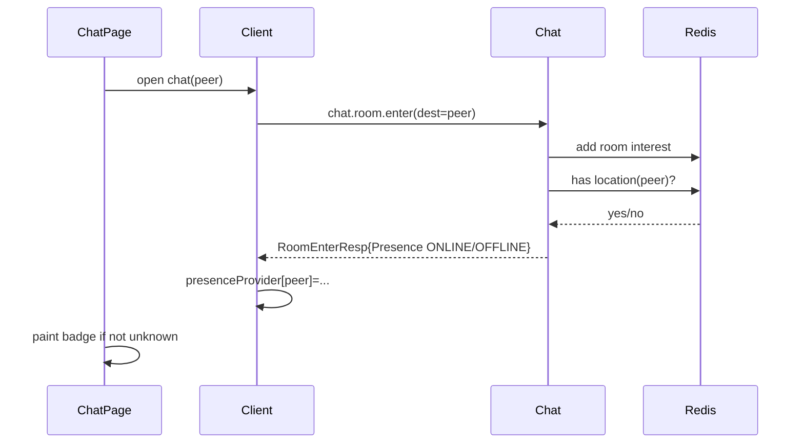
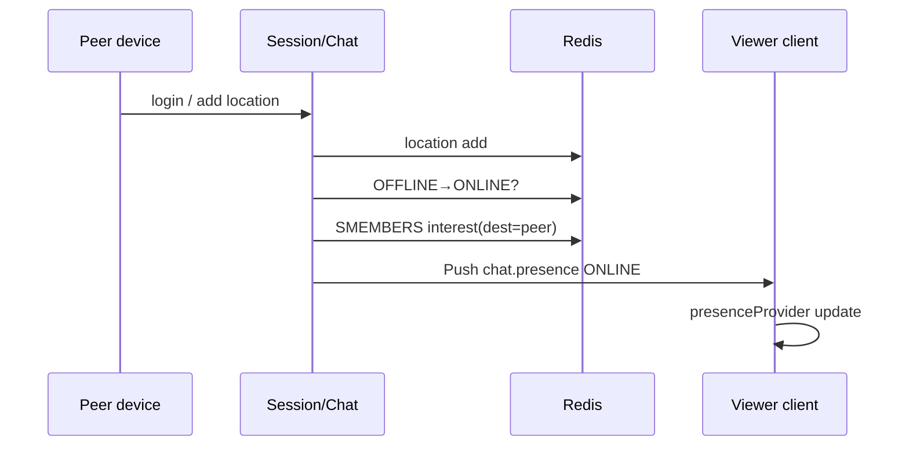
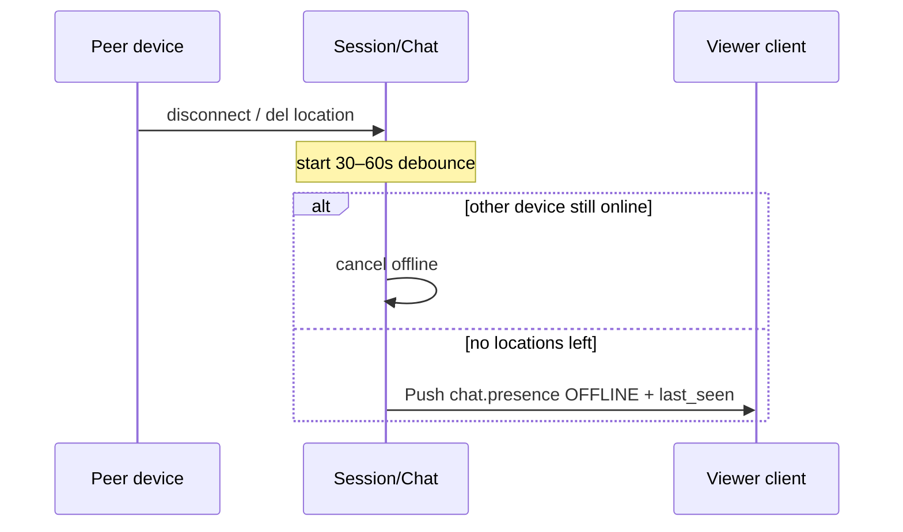

# Presence 与房间兴趣（进房 / 退房）方案

状态：**设计定稿（待实现）**  
日期：2026-09-06  
范围：好友在线状态（Presence）+ 会话级房间兴趣（Room Interest）  
不在范围：资料变更推送（见 `chat.user.updated` / PR #92）、隐身模式产品细节、群成员列表级 presence 广播

相关缺口：`docs/production-gaps.md` G-27（在线状态 / 正在输入 | 无）

---

## 1. 目标与非目标

### 1.1 目标

1. 好友能看到对方 **Presence**（v1：`ONLINE` / `OFFLINE`；协议用枚举预留 `BUSY` 等）。
2. **尽量实时**，但不在心跳上广播、不在全好友图上无节流扇出。
3. 客户端 **UI 与订阅解耦**：会话顶栏、首页 list 都 watch 同一份 `presenceProvider`；何时有数据由进房逻辑决定。
4. 用 **进房 / 退房** 表达「我正在看这个会话」，由 **server 决定** 向兴趣方推送 Presence、以及后续的「正在输入」等，而不是为每种能力单独 subscribe RPC。

### 1.2 非目标（本方案明确不做）

- Peer presence 与本地网关 `ConnStatus` 混用（顶栏绿点不得再绑 `session.status`）。
- `online: bool` 作为对外契约（扩展性差）。
- 全局 / 非好友可见的在线列表。
- 心跳触发的 presence 推送。
- v1 实现「忙碌 / 离开」产品策略（只预留枚举）。
- 用短轮询 `friend.list` 冒充 presence。

### 1.3 与资料推送的边界

| | 资料（昵称 / 头像） | Presence |
|---|---|---|
| 触发 | `chat.user.update` 成功 | 连接 location 增删（经 debounce） |
| Fanout | 在线好友 + 自己其它端 | **仅对已进该 peer 私聊房的观看者** |
| 频率 | 极低 | 中低（跟上下线，不下跟心跳） |
| 协议 | `chat.user.updated` + `UserProfile` 整包覆盖 | `chat.presence` + `PresenceStatus` 枚举 |
| 客户端 | 补丁 contacts / thread title | 写入 `presenceProvider` |

两者都是 Push，但 **兴趣集合不同**：资料按好友关系；Presence（及 typing）按房间兴趣。

---

## 2. 分层约定（务必遵守）

```
┌─────────────────────────────────────────┐
│ UI：Chat 顶栏 / Inbox list item         │
│     只 watch presenceProvider[account]  │
└─────────────────┬───────────────────────┘
                  │ 有值 → 画点；无值 → 不画（未知）
┌─────────────────▼───────────────────────┐
│ 数据：presenceProvider（account → 状态） │
│     来源：RoomEnter 快照 + Presence Push │
└─────────────────┬───────────────────────┘
                  │
┌─────────────────▼───────────────────────┐
│ 逻辑：进房 / 退房（何时 subscribe 有值）  │
│     v1：打开私聊会话 → enter            │
│         离开会话 → leave（可延迟）        │
└─────────────────┬───────────────────────┘
                  │
┌─────────────────▼───────────────────────┐
│ 服务端：room interest + presence 产出    │
└─────────────────────────────────────────┘
```

要点：

- **UI 是否展示绿点** ≠ **是否扩大订阅集**。List 与会话都绑同一 Provider；v1 仅进会话才 enter，则 list 上只有「曾经进过房且缓存仍在」的 peer 可能亮点——这是预期，不是 UI bug。
- 以后要 list 一进来就亮：只改逻辑层（例如对 inbox peers 批量 enter / watch），**不必改 UI 组件**。

---

## 3. 概念模型

### 3.1 Session Location（已有）

网关登录后把 `(app, account) → channel/gateway` 写入 Redis，用于消息投递。  
**Presence 的真相来源**：该 account 是否仍存在至少一个有效 location。

- 任一端有 location ⇒ 可视为 `ONLINE`（多端合并）。
- 全部 location 清除且过完下线 debounce ⇒ `OFFLINE`。

心跳 **只续期 location**，不产生 Presence Push。

### 3.2 Room Interest（新增）

「某条连接上的某个登录用户，正在观看某个会话 dest」。

- 粒度：`(viewer_account, viewer_channel_id, dest, kind)`
- **≠ 群成员 join**：临时兴趣，断连即清。
- v1 `kind = user`（私聊）；群聊可同协议扩展，但群 presence 策略另议（避免进群就看到全员在线风暴）。

### 3.3 Presence 状态

服务端 v1 只产出 `ONLINE` / `OFFLINE`。  
客户端按枚举渲染；`UNSPECIFIED` / 未知 / 未进房 ⇒ **不展示状态点**（不要假装 offline，以免误导）。

---

## 4. 协议设计

### 4.1 命令

| Command | 方向 | 说明 |
|---|---|---|
| `chat.room.enter` | C→S Request / Response | 进入会话兴趣；Response 带 Presence 快照 |
| `chat.room.leave` | C→S Request / Response | 离开会话兴趣（可空 body 成功） |
| `chat.presence` | S→C Push | Presence 变更（可批量） |

不单独提供 `presence.subscribe` / `unsubscribe`。

### 4.2 Protobuf（示意）

```protobuf
enum PresenceStatus {
  PRESENCE_UNSPECIFIED = 0;
  PRESENCE_OFFLINE = 1;
  PRESENCE_ONLINE = 2;
  PRESENCE_BUSY = 3;   // 预留，v1 不下发
  // 以后可加 AWAY 等，只追加枚举值
}

message Presence {
  string account = 1;
  PresenceStatus status = 2;
  int64 last_seen = 3;  // unix ms；OFFLINE 时可选填写
}

message RoomEnterReq {
  string dest = 1;  // peer account（私聊）或 group id
  int32 kind = 2;   // 0 = user, 1 = group（与 inbox kind 对齐）
}

message RoomEnterResp {
  repeated Presence presence = 1;  // 私聊通常 1 条：dest 的当前状态
}

message RoomLeaveReq {
  string dest = 1;
  int32 kind = 2;
}

message PresencePush {
  repeated Presence entries = 1;  // 批量，减少连推
}
```

约定：

- **禁止** 在对外契约里使用 `bool online`。
- Push 的 `header.command = chat.presence`，`flag = Push`，body = `PresencePush`。
- `last_seen`：仅在变为 `OFFLINE` 时建议带上；`ONLINE` 可置 0。

### 4.3 权限与校验（enter）

私聊 `kind=user`：

1. `dest` 非空且 ≠ self。
2. 双方为好友（或产品允许的陌生人会话策略；默认 **必须好友**）。
3. 未拉黑。
4. 幂等：同一 `(channel, dest, kind)` 重复 enter ⇒ 刷新 interest TTL + **再回一份快照**，不叠多条。

失败：沿用现有 Status（`Unauthorized` / `NotFound` / `Blocked` / `InvalidPacketBody`）。

---

## 5. 服务端设计

### 5.1 存储

建议 Redis（与 location 同集群，注意 key 前缀与 app 隔离）：

| Key | 含义 |
|---|---|
| 现有 location 键 | account → 在线通道 |
| `room:interest:{app}:{dest}:{kind}` → SET of `viewer_account` 或 `viewer_account#channel` | 谁在看这个会话 |
| `room:viewing:{app}:{account}:{channel}` → SET of `dest:kind` | 该连接上的兴趣，断连时 O(感兴趣数量) 清理 |
| `presence:debounce:{app}:{account}` | 下线延迟任务标记 |

具体编码可按现有 Redis 约定微调；原则是：**断连能按 channel 清光该连接的所有 room interest**。

### 5.2 进房 / 退房

**Enter**

1. 校验权限。
2. 写入双向 interest 索引。
3. 读 dest 的 location：有 ⇒ `ONLINE`，无 ⇒ `OFFLINE`（可附 last_seen 若已持久化）。
4. `RoomEnterResp.presence` 返回快照。
5. **不**因为 A enter 就通知 dest「有人在看你」（隐私）；除非以后单独做「正在查看」产品。

**Leave**

1. 从索引删除该 viewer 对本 dest 的 interest。
2. 不向任何人推 Presence（leave 只改 fanout 集合）。

**连接断开**

1. Gateway / session 销毁 hook：根据 `room:viewing:...` 删除所有 interest。
2. 同时走现有 location 删除 → 触发该用户的 presence 产出（见下）。

### 5.3 Presence 产出与 Fanout

```
location 增加（登录 / 新设备）
  → 合并状态若从 OFFLINE→ONLINE
  → 查「谁 enter 了 dest=该 account 的私聊房」
  → PresencePush(ONLINE) 仅发给这些 viewer 的在线 location

location 删除（断开）
  → 启动 debounce（建议 30–60s，可配置）
  → 到期后若仍无任何 location
      → OFFLINE + last_seen=now
      → 同样只推给 room interest viewers
  → 若 debounce 期间又上线 → 取消 OFFLINE，必要时补 ONLINE

心跳续期
  → 不推送
```

Fanout 伪代码：

```text
viewers = SMEMBERS room:interest:{app}:{account}:user
for v in viewers:
  locs = list_locations(v)
  dispatch_cmd("chat.presence", PresencePush{entries: [...]}, locs)
```

约束：

- 只推 **好友且当前进房** 的人（enter 时已校验好友；interest 里不应有非好友）。
- 可对同一 viewer 多端各推一次（与消息 push 一致）。
- 批量：短时间多次状态抖动时，debounce 合并为最终态再推。

### 5.4 与 Chat 服务的挂载点

- `chat.room.enter` / `leave`：Chat 控制面 handler（需 session）。
- Presence 产出：挂在 **location 写入/删除** 路径（session / gateway 与 Chat 的衔接点需在实现时选一处权威；推荐 session 层发内部事件，Chat 或独立 presence 模块消费，避免网关直接打好友图）。
- 复用 `Context::dispatch_cmd`（PR #92 已引入显式 Push command）。

### 5.5 进房退房频率

属 **中低频控制面**（跟页面切换，不跟心跳）。缓解：

- Leave 客户端可延迟 200–500ms，期间同 dest 再 enter 则取消 leave。
- Enter 幂等。
- 断连清理不依赖客户端一定 leave。

---

## 6. 客户端设计

### 6.1 状态

```dart
// 示意
enum PeerPresenceStatus { unknown, offline, online, busy }

class PresenceState {
  final Map<String, PeerPresenceStatus> byAccount;
  final Map<String, int?> lastSeenMs;
}

// presenceProvider：全局一份
```

映射：`UNSPECIFIED` / 未进房未下发 → `unknown`（UI 不画点）。

### 6.2 进房时机（v1）

| 时机 | 动作 |
|---|---|
| 打开私聊 `ChatPage` | `room.enter(dest)`；用 Resp 快照写入 provider |
| 收到 `chat.presence` | merge 进 provider |
| 离开 `ChatPage`（dispose / 路由 pop） | 延迟后 `room.leave` |
| 切换到另一私聊 | leave 旧 dest + enter 新 dest |
| 链路断开 | 本地可不清空缓存（或标 stale）；重连后若仍停留在会话页则重新 enter |
| 仅切后台 | v1 建议 **保持 interest**（少一次抖动）；若要省电可 leave，属产品开关 |

### 6.3 UI

- **会话顶栏头像角标**：`watch(presenceProvider)[peer]`；`online` 绿点；`busy` 预留色；`unknown` 不显示。  
  **删除** 当前把 `session.status`（本机网关）画在对方头像上的行为。
- **首页会话 list**：同样 watch；无数据则无点。
- 本机离线 banner 继续用 `ConnStatus` / connectivity，与 peer presence 分离。

### 6.4 Web

与 Mobile 对称：`onpresence` / room enter-leave；同一套语义。

---

## 7. 端到端时序

### 7.1 打开会话



### 7.2 对端上线



### 7.3 对端断线（debounce）



---

## 8. 后续扩展（同一房间兴趣）

| 能力 | 如何挂载 |
|---|---|
| 正在输入 | 客户端在房内发 `chat.typing`；server 只推给对该 dest 有 interest 的人；带短 TTL，不落库 |
| 已读 / 输入框草稿同步 | 可选同 interest fanout |
| Inbox list 绿点 | 逻辑层对 inbox peers 批量 enter 或增加轻量 `chat.room.watch`；UI 不动 |
| 忙碌 | 用户设置写入 presence 覆盖「有 location ⇒ ONLINE」的默认合成规则 |
| 群聊 | enter group 后推「群内正在输入」容易；群成员在线列表需单独限流与隐私策略 |

---

## 9. 实现分期

### P1a — 协议与房间兴趣骨架

1. proto + `CMD_ROOM_ENTER` / `LEAVE` / `PRESENCE`
2. Redis interest 索引 + 断连清理
3. enter 返回快照（可先只读 location，暂不推变更）
4. 客户端 enter/leave + `presenceProvider` + 顶栏改绑 peer（去掉本机 ConnStatus 绿点）

### P1b — Presence 推送

1. location 增删 → 经 debounce 产出 Presence
2. 按 interest fanout `chat.presence`
3. e2e：A enter B；B 上/下线；A 收到枚举状态
4. list item 接同一 provider（无数据则无点）

### P1c — 打磨

1. leave 延迟合并、重连后自动 re-enter
2. last_seen 展示（可选）
3. 指标：enter QPS、presence push QPS、debounce 取消率

### 明确后置

- Typing、BUSY 产品、群成员在线墙、隐身

---

## 10. 测试要点

1. **权限**：非好友 enter 失败。
2. **幂等**：重复 enter 只一份 interest + 新快照。
3. **Fanout 范围**：未 enter 的好友收不到 presence；enter 后能收到。
4. **Leave / 断连**：leave 或断连后不再收到；再 enter 恢复。
5. **Debounce**：断线 5s 内重连不出现 OFFLINE 闪烁。
6. **心跳**：续期不产生 Push。
7. **多端**：B 两台在线，只关一台，A 仍见 ONLINE。
8. **UI**：本机断网时 offline banner 出现，但不得把本机 `ConnStatus` 画成对方绿点。
9. **与资料推送共存**：改昵称仍走 `chat.user.updated`；不影响 presence。

---

## 11. 决策摘要（已对齐）

| 项 | 决策 |
|---|---|
| 订阅模型 | 进房 / 退房，非独立 presence.subscribe |
| 状态字段 | PB `PresenceStatus` 枚举，不用 bool |
| UI | list + 会话共用 `presenceProvider` |
| v1 何时有数据 | 打开私聊 enter 之后 |
| 下线 | 30–60s debounce |
| 心跳 | 不推 presence |
| 资料变更 | 独立通道，已实现于 profile-push |
| Typing 等 | 复用 room interest，本阶段不实现 |

---

## 12. 文档维护

实现落地后：

1. 在 `production-gaps.md` G-27 标注进度或关闭条件。
2. 本文件状态改为「已落地」并链到协议/代码路径。
3. 与 `reliable-delivery.md` / session location 文档交叉引用，避免两处各写一套真相源。
